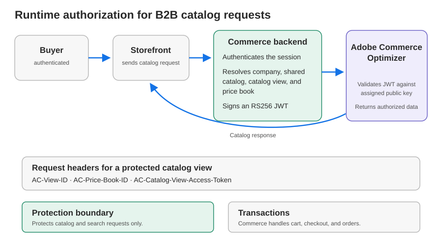

# B2B共有カタログ予測

[!DNL Adobe Commerce Optimizer Connector for B2B] プロジェクト [!DNL Adobe Commerce]の共有カタログと会社の割り当てが、保護された[!DNL Adobe Commerce Optimizer] カタログビューに追加されました。

## ベースの同期とB2B予測

ベース [!DNL Adobe Commerce Optimizer Connector]は、カタログと価格設定フィードを同期し、ストア ビューをカタログ ソースに、web サイトを価格表に、顧客グループを価格表にマッピングします。

[!DNL Adobe Commerce Optimizer Connector for B2B]は、各カスタム共有カタログの品揃えと価格を保護されたビューにプロジェクトします。 Adobe Commerceは、購入者の会社の割り当てを使用してビューを選択します。 制限付きアクセスキーは、署名済み要求を検証しますが、カタログアクセスを決定しません。 Adobe Commerceは、コネクタで管理されたカタログ、価格設定、B2B投影データの記録システムです。 [!DNL Adobe Commerce Optimizer]設定で製品の検出とレコメンデーションを管理します。

## データマッピング

B2B プロジェクトでは、カタログの同期内容と価格設定を、カタログの品揃えと企業割り当てのコンテキストの共有と組み合わせています。

![図マッピング [!DNL Adobe Commerce]のストアビュー、価格設定、共有カタログ、および会社の割り当てを[!DNL Adobe Commerce Optimizer]](./assets/b2b-catalog-projection-mapping.svg){width="800"}の予測プライベートカタログビューに割り当てます

| [!DNL Adobe Commerce] データ | 結果[!DNL Adobe Commerce Optimizer] | 目的 |
| --- | --- | --- |
| ストアビューと商品データを活用 | カタログソース | ローカライズされた商品コンテンツを提供。 |
| web サイトと顧客グループの価格設定 | 価格表 | 適用される価格を指定しますが、アクセスを許可しません |
| カスタム共有カタログの選定 | ポリシー | カタログ ビューを共有カタログの品揃えにフィルタリングします。 |
| カスタム共有カタログと有効なストアビュー | プライベートカタログビュー | 該当するカタログソース、ポリシー、価格表を含む組み合わせごとに、1つの保護されたビューを作成します。 |
| 共有カタログへの会社割り当て | 解決した購入者のコンテキスト | 認証済みのバックエンドが、購入者の会社に関連付けられているカタログビューを解決できます。 |
| 保護されたビューに割り当てられた制限付きアクセス キー | カタログ保護 | 保護されたカタログビューへのリクエストを許可しますが、価格は選択しません。 |

各プライベートカタログビューは、1つの価格表のみを参照できます。 同じweb サイトと顧客グループの価格のコンテキストを持つストアビューは、ローカライズされた様々なカタログソースを使用しながら、価格表を共有できます。 コネクターは、共有カタログごとに価格表を作成しません。

デフォルトの共有カタログは、B2B プライベートカタログビューとして表示されません。

## ランタイム認証

バイヤーがログインすると、Commerceのバックエンドがセッションを認証し、バイヤーの会社割り当てとストアビューを使用して、適切なカタログビューと価格表を解決します。

ストアフロントは、各Merchandising API リクエストでカタログビューID、価格表ID、および署名済みトークンを送信します。 [!DNL Adobe Commerce Optimizer]は、カタログ ビューに割り当てられた制限付きアクセス キーに対して、JWTのRS256署名を検証します。 トークンとキーが有効で期限切れでない場合にのみ、カタログデータを返します。

ストアフロントとCommerce バックエンドから[!DNL Adobe Commerce Optimizer]{width="700"}への買い物客からのB2B カタログリクエストに対する実行時の承認フロー

プライベートカタログのリクエストの場合は、次のヘッダーを送信します。

| ヘッダー | 目的 |
| --- | --- |
| `AC-View-ID` | カタログ ビューを識別します。 |
| `AC-Price-Book-ID` | 使用する価格表を識別します。 |
| `AC-Catalog-View-Access-Token` | 保護されたカタログビューへのアクセスを許可する署名済みJWTを運びます。 |

完全なリクエストとトークンの要件については、[&#x200B; マーチャンダイジング API認証](https://developer.adobe.com/commerce/services/optimizer/merchandising-services/using-the-api#authentication)および[&#x200B; プライベートカタログビューへのアクセスの確認](/help/optimizer/setup/private-catalog-view.md#verify-access-is-enforced)を参照してください。

## 保護境界

カタログ保護では、カタログおよび検索リクエストのみを保護します。 買い物かご、チェックアウト、注文処理は保護されません。 Adobe Commerceまたは接続されたトランザクションシステムで購入資格を適用します。

## 投影の設定と監視

B2B コネクタは、プライベート カタログ ビュー、ポリシー、価格表の参照、およびアクセス制限キー設定を[!DNL Adobe Commerce]からプロジェクトします。 コネクタで管理される投影オブジェクトを手動で作成する必要はありません。 セットアップ手順については、[B2B コネクタの基本を学ぶ](get-started-b2b-shared-catalogs.md)を参照してください。

予測されたカタログ ビューを監視し、設定ドリフトを調整するには、[&#x200B; カタログ ビューの同期の監視](catalog-view-sync-status.md)を参照してください。 割り当てられたキーを管理するには、[B2B共有カタログの制限付きアクセスキーの管理](restricted-access-keys.md)を参照してください。
