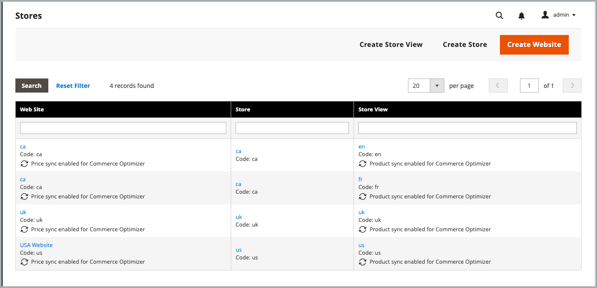

# 基本を学ぶ

Commerce Optimizer コネクタをインストールして設定し、Adobe Commerce カタログデータを [!DNL Adobe Commerce Optimizer] と同期してから、データ同期ステータスを監視してストアフロントが最新であることを確認します。

## 統合を使用するための要件

* Adobe Commerce 2.4.7 以降

   * PHP 8.2、8.3、または 8.4
   * Composer 2.x

* プロビジョニングされたサンドボックスインスタンスを使用した [!DNL Adobe Commerce Optimizer] ライセンス。

* [repo.magento.com](https://repo.magento.com) にアクセスし、Composer を使用してCommerce コネクタ メタパッケージをダウンロードします。

* [Adobe Commerce Optimizer サンドボックスインスタンス &#x200B;](https://experienceleague.adobe.com/en/docs/commerce-learn/tutorials/adobe-commerce-optimizer/create-first-instance) への管理者アクセス。

統合を設定するAdobe Commerce ユーザーには、次が必要です。

* Adobe Commerce Admin への管理者アクセス。

* [Adobe Commerce アプリケーションサーバーへのコマンドラインアクセス &#x200B;](https://experienceleague.adobe.com/en/docs/commerce-on-cloud/user-guide/project/user-access)。

* [&#x200B; プロジェクトがプロビジョニングされている &#x200B;](https://experienceleague.adobe.com/en/docs/core-services/interface/administration/organizations?)IMS 組織 [!DNL Adobe Commerce Optimizer] への開発者アクセス。

>[!BEGINSHADEBOX]

## 前提条件

次の拡張機能のいずれかがインストールされている場合は、Commerce Optimizer Connector をインストールする前にアンインストールします。

* Adobe Commerce Live Search （`magento/live-search`）
* Adobe Commerceの製品に関する推奨事項（`magento/product-recommendations`）
* Adobe Commerce カタログサービス （`magento/catalog-service`、`magento/catalog-service-installer`）
* データ管理ダッシュボード（`magento-catalog-sync-admin`）

これらの拡張機能に関連付けられたデータは、Commerce データベース内で引き続き使用できます。 ただし、コネクタが有効な場合は、[!DNL Adobe Commerce Optimizer] に書き出されません。 これらの拡張機能で提供される検索機能とマーチャンダイジング機能をコネクタを有効にした後で実装するには、[[!DNL Adobe Commerce Optimizer]  管理 UI](https://experienceleague.adobe.com/en/docs/commerce/optimizer/overview#quick-tour) から設定します。

>[!ENDSHADEBOX]

## 設定手順

以下の手順に従って、コネクタを有効にし、CommerceからAdobe Commerce Optimizer インスタンスへのデータの同期を開始します。

1. **[Composer を使用してCommerce Optimizer インスタンスを](#install-the-commerce-connector-package)** に接続する [!DNL Adobe Commerce Optimizer]Commerce Connector パッケージをインストールします。

1. 管理者で **[データの書き出しの設定を確認してカスタマイズ](#customize-commerce-data-export-configuration)** します。

1. **[CommerceとCommerce Optimizer間の接続を確立するために必要な API 資格情報を取得](#get-required-values-for-configuring-the-commerce-optimizer-connection)** します。

1. **[統合を有効  [!DNL Adobe Commerce Optimizer]  します](#enable-the-adobe-commerce-optimizer-integration)**。

1. **[データ同期が機能していることを確認](#verify-that-the-data-sync-is-working)**。


## Commerce Optimizer コネクタパッケージのインストール

Adobe Commerce Optimizer コネクタは、[!DNL Adobe Commerce Optimizer] のアクティブ ライセンスを持つすべてのCommerce マーチャントが利用できる Composer メタパッケージとして提供されます。

### インストール手順

1. Composer を使用して `adobe-commerce/commerce-data-export-aco-adapter` モジュールを追加します。

   ```shell
   composer require adobe-commerce/commerce-data-export-aco-adapter
   ```

1. 変更内容をAdobe Commerceのステージング環境にデプロイします。

デプロイメントが完了したら、Commerceの管理者メニューから「Commerce Optimizer」オプションを使用できます。 「**[!UICONTROL Commerce Optimizer]**」をクリックして、Commerce管理者から直接Commerce Optimizer インスタンスを開きます。

>[!NOTE]
>
>拡張機能のインストール手順について詳しくは、次のガイドを参照してください。
>
>[&#x200B; クラウドインフラストラクチャー上のAdobe Commerceに拡張機能をインストール &#x200B;](https://experienceleague.adobe.com/en/docs/commerce-on-cloud/user-guide/configure-store/extensions)
>
>[Adobe Commerceへの拡張機能のオンプレミスでのインストール &#x200B;](https://experienceleague.adobe.com/en/docs/commerce-operations/installation-guide/tutorials/extensions)

### 必要な接続の詳細を取得

Adobe Developer Consoleから、[!DNL Adobe Commerce Optimizer] Ingestion サービスに対して有効な開発者プロジェクトを作成し、OAuth サーバー間資格情報を生成します。 手順について詳しくは、『 [&#x200B; マーチャンダイジング開発者ガイド &#x200B;](https://developer.adobe.com/commerce/services/optimizer/data-ingestion/authentication/#obtain-ims-credentials) の *IMS 資格情報の取得* を参照してください。

>[!TIP]
>
>Data Ingestion API で設定された Developer プロジェクトが、Commerce Optimizer インスタンスと同じ IMS 組織にすでに存在する場合は、既存の OAuth サーバー間資格情報を再利用できます。

資格情報ページから次の値を保存します。

* **組織 ID** （`org_id`）
* **クライアント ID** （`client_id`）
* **クライアント秘密鍵** （`client_secret`）

### インスタンス [!DNL Adobe Commerce Optimizer] 詳細を取得

[!DNL Adobe Commerce Optimizer] インスタンスからインスタンス ID （テナント ID とも呼ばれます）を保存します。 インスタンスへのアクセスに使用される URL で確認できます。 例えば、`https://experience.adobe.com/#/@<project-id>/in:TToyu73daQRn66KAYaq8YZ/commerce-optimizer-studio/home` では、インスタンス ID は `TToyu73daQRn66KAYaq8YZ` です。

## Commerce データの書き出し設定のカスタマイズ

デフォルトでは、すべてのCommerce スコープ（web サイトおよびストアビュー）でカタログデータ同期が有効になっています。 書き出し設定をカスタマイズして、ビジネスニーズに基づいて特定の範囲のデータのみを同期できます。 例えば、複数のストアビューがあり、そのうち 1 つのビューのデータのみを書き出す場合、他のストアビューのエクスポーターを無効にできます。

>[!IMPORTANT]
>
>書き出し設定を変更すると、完全なインデックス再作成がトリガーされます。カタログのサイズによっては、この再作成に時間がかかる可能性があります。 パフォーマンスへの影響を最小限に抑えるために、トラフィックが少ない時間帯にこれらの変更を計画します。

### 範囲別のデータのエクスポート

次の表に、各スコープレベルで書き出されるデータを示します。

| 範囲 | 書き出されたデータ | 備考 |
| ------- | --------------- | ------- |
| Web サイト | 価格と価格台帳 | 価格の各セットは、命名規則 [&#x200B; を使用して &#x200B;](../optimizer/setup/pricebooks.md) 価格台帳 `website::customergroupcode` として書き出されます。 Web サイトのすべての顧客グループが含まれます。 |
| ストア表示 | 製品と製品属性 | 各ストア表示では、[!DNL Adobe Commerce Optimizer] に個別のカタログソースが作成されます。 |

### 動作を有効または無効にする

| アクション | 結果 |
| -------- | -------- |
| ストア表示の無効化 | カタログのソースは [!DNL Adobe Commerce Optimizer] のままですが、すべてのデータが削除されます。 |
| ストア表示を無効にしてから再度有効にする | 同じカタログソースに、完全なデータ再同期が再入力されます。 |

### 書き出し設定の更新

コネクタパッケージをインストールすると、管理者のストアグリッドにCommerce Optimizerの書き出し設定が表示されるようになりました。

{width="600" zoomable="yes"}

**Web サイトまたはストア表示の設定を変更するには：**

1. Commerce Admin で、**[!UICONTROL Stores]** / [!UICONTROL Settings] / **[!UICONTROL All Stores]** に移動します。

1. 設定する web サイト表示またはストア表示を選択します。

1. **[!DNL Adobe Commerce Optimizer]エクスポーター設定で** チェックボックスを使用して、必要に応じてデータ同期を有効または無効にします。

   {width="500" zoomable="yes"}

1. 変更を保存します。

## [!DNL Adobe Commerce Optimizer] 統合の有効化

>[!IMPORTANT]
>
>データ同期処理は、設定コマンドを実行するとすぐに開始されます。 デフォルトでは、すべてのCommerce スコープ（web サイトおよびストアビュー）でカタログデータ同期が有効になっています。 カタログのサイズによっては、データ同期プロセスに数分から数時間かかる場合があります。

前の手順で収集した API 資格情報とインスタンスの詳細を使用して、Commerce インスタンスと [!DNL Adobe Commerce Optimizer] インスタンスの統合を設定できるようになりました。

1. Commerce Admin で「**[!UICONTROL Adobe Commerce Optimizer]**」を選択すると、手順を示す設定ページが表示されます。

   設定ペ ![[!DNL Adobe Commerce Optimizer] ジ &#x200B;](/help/aco-connector/assets/aco-connector-admin-installation.png){width="500" zoomable="yes"}

1. コマンドラインから [SSH を使用して &#x200B;](https://experienceleague.adobe.com/en/docs/commerce-on-cloud/user-guide/develop/secure-connections) Commerce ステージング環境に接続します。

1. 次のCommerce CLI コマンドを実行して統合を設定し、プレースホルダーの値をCommerce Optimizer プロジェクトの値に置き換えます。

```terminal
bin/magento aco:config:init --org_id=your-org --tenant_id=your-tenant --client_id=your-client-id --client_secret=your-secret
```

1. Commerce管理者に戻り、「[!UICONTROL Adobe Commerce Optimizer]」オプションを選択して、接続を確認します。

   このオプションをクリックすると、[!DNL Adobe Commerce Optimizer] UI が新しいタブで開きます。

## データ同期が機能していることを確認します

統合を有効にすると、データ同期が自動的に開始されます。 カタログのサイズによっては、最初の同期に数分から数時間かかる場合があります。

1. **Commerce Admin で同期ステータスを確認します。**

   **[!UICONTROL System]**/[!UICONTROL Data Transfer]/**[!UICONTROL Data Feed Sync Status]** に移動します。

   {width="500" zoomable="yes"}

   同期の実行時に、フィードデータに正常に送信されたレコードが表示されます。 フィードを選択して、詳細の表示や同期の問題のトラブルシューティングを行います。

1. **Commerce Optimizerに到着したデータを確認：**

   [!DNL Adobe Commerce Optimizer] メニューから「**[!UICONTROL Data Sync]**」を選択します。

   {width="500" zoomable="yes"}

   期待される製品、価格および属性が表示されることを確認します。

>[!TIP]
>
>データ同期で問題が発生した場合は、「[SaaS データの書き出し &#x200B;](/help/data-export/troubleshooting-logging.md) ドキュメントの *トラブルシューティング* の節を参照してください。

## 次の手順

1. **[カタログビューとポリシ  [!DNL Adobe Commerce Optimizer]  の設定](#configure-adobe-commerce-optimizer-stores)**

   [!DNL Adobe Commerce Optimizer] Guide のカタログ ビューとポリシーを作成します。 価格台帳は、Adobe Commerce顧客グループから自動的に作成されます。

1. **[Edge Delivery ServicesにCommerce ストアフロントを設定する](#set-up-a-commerce-storefront-on-edge-delivery-services)**

   [&#x200B; ストアフロント設定ドキュメント &#x200B;](https://experienceleague.adobe.com/developer/commerce/storefront/setup/) に従って、ストアフロントを [!DNL Adobe Commerce Optimizer] インスタンスに接続し、パーソナライズされたコマースエクスペリエンスの配信を開始します。


