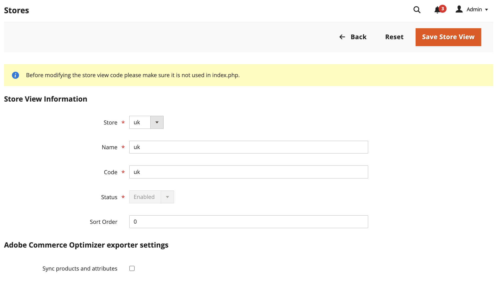

# 基本を学ぶ

[!DNL Adobe Commerce Optimizer Connector]をインストールして設定し、[!DNL Adobe Commerce] カタログデータを[!DNL Adobe Commerce Optimizer]と同期してから、データ同期ステータスを監視して、ストアフロントが最新であることを確認します。

{{aco-integration-environment-alignment}}

## 統合の使用要件 {#requirements-to-use-the-integration}

* [!DNL Adobe Commerce] 2.4.7+

   * PHP 8.2、8.3、または8.4
   * Composer 2.x

* プロビジョニングされたサンドボックスインスタンスを使用する[!DNL Commerce Optimizer] ライセンス。

* Composerを使用してコネクタメタパッケージをダウンロードするための[認証キー](https://experienceleague.adobe.com/en/docs/commerce-operations/installation-guide/prerequisites/authentication-keys)。

* [[!DNL Commerce Optimizer]  サンドボックスインスタンス ](../optimizer/get-started.md)への管理者アクセス。

統合を構成する[!DNL Adobe Commerce] ユーザーには、次の要件が必要です。

* Commerce管理者への管理者アクセス。

* [ アプリケーションサーバー [!DNL Adobe Commerce] へのコマンドラインアクセス ](https://experienceleague.adobe.com/en/docs/commerce-on-cloud/user-guide/project/user-access)。

* [!DNL Commerce Optimizer] プロジェクトがプロビジョニングされている[IMS組織](https://experienceleague.adobe.com/en/docs/core-services/interface/administration/organizations?)への開発者アクセス。

>[!BEGINSHADEBOX]

## 競合する拡張機能の削除 {#remove-conflicting-extensions}

次のいずれかの拡張機能がインストールされている場合は、[!DNL Adobe Commerce Optimizer Connector]をインストールする前にアンインストールしてください。

* [!DNL Adobe Commerce Live Search] (`magento/live-search`)
* [!DNL Adobe Commerce Product Recommendations] (`magento/product-recommendations`)
* [!DNL Adobe Commerce Catalog Service] (`magento/catalog-service`, `magento/catalog-service-installer`)
* **[!UICONTROL Data Management Dashboard]** (`magento-catalog-sync-admin`)

これらの拡張機能に関連付けられたデータは、引き続きCommerce データベースで使用できます。 ただし、コネクタが有効になっている場合は、[!DNL Commerce Optimizer]に書き出されません。 コネクタを有効にした後、これらの拡張機能によって提供される検索およびマーチャンダイジング機能を実装するには、[[!DNL Commerce Optimizer] 管理UI](https://experienceleague.adobe.com/en/docs/commerce/optimizer/overview#quick-tour)からそれらを設定します。

>[!IMPORTANT]
>
>コネクタを有効にする前にこれらの拡張機能が削除されない場合、接続済みサービスで拡張機能とコネクタが認証する方法の競合により、同じデータがコネクタと既存の拡張機能の両方から書き出されるため、設定画面が壊れ、[!DNL Commerce Optimizer]にデータが重複し、ログに401または403のエラーが発生する可能性があります。

>[!ENDSHADEBOX]

## 設定手順 {#configuration-steps}

次の手順に従って、[!DNL Adobe Commerce Optimizer Connector]を有効にし、[!DNL Adobe Commerce]から[!DNL Commerce Optimizer] インスタンスへのデータの同期を開始します。

1. **[Composerを使用して [!DNL Adobe Commerce Optimizer Connector]  パッケージ](#install-the-adobe-commerce-optimizer-connector-package)**&#x200B;をインストールし、[!DNL Adobe Commerce] インスタンスを[!DNL Commerce Optimizer]に接続します。

1. **[管理者からCommerce スコープの書き出し設定](#customize-the-commerce-scopes-export-configuration)**&#x200B;をカスタマイズします。

1. **[ [!DNL Commerce Optimizer] 統合](#enable-the-adobe-commerce-optimizer-integration)**&#x200B;を有効にします。

1. **[データ同期が機能していることを確認します](#verify-that-the-data-sync-is-working)**。

## [!DNL Adobe Commerce Optimizer Connector] パッケージのインストール {#install-the-adobe-commerce-optimizer-connector-package}

[!DNL Adobe Commerce Optimizer Connector]は、[!DNL Commerce Optimizer]のアクティブなライセンスを持つすべてのCommerce マーチャントが利用できるComposer メタパッケージとして配信されます。

### インストール手順

1. Composerを使用して`adobe-commerce/commerce-data-export-aco-adapter` モジュールを追加します。

   ```shell
   composer require adobe-commerce/commerce-data-export-aco-adapter
   ```

1. [!DNL Adobe Commerce] ステージング環境に変更をデプロイします。

   デプロイメントが完了すると、[!DNL Commerce Optimizer] オプションがCommerce管理メニューから使用できるようになります。 「**[!UICONTROL Commerce Optimizer]**」を選択して、Commerce管理者から直接[!DNL Commerce Optimizer] インスタンスを開きます。

>[!NOTE]
>
>拡張機能のインストール手順について詳しくは、次のガイドを参照してください。
>
>[ クラウドインフラストラクチャ ](https://experienceleague.adobe.com/en/docs/commerce-on-cloud/user-guide/configure-store/extensions)の [!DNL Adobe Commerce] に拡張機能をインストールする
>
>[ オンプレミス ](https://experienceleague.adobe.com/en/docs/commerce-operations/installation-guide/tutorials/extensions)に拡張機能をインストールする [!DNL Adobe Commerce] 

## Commerce スコープ書き出し設定のカスタマイズ {#customize-the-commerce-scopes-export-configuration}

デフォルトでは、すべてのCommerce スコープ（web サイト、カスタマーグループ、ストアビュー）でカタログデータの同期が有効になっています。 ビジネスニーズに基づいて、特定の範囲のデータのみを同期するように書き出し設定をカスタマイズできます。 例えば、同じ言語を共有する複数のストアビューがある場合、ストアビューの1つだけのデータを書き出し、[!DNL Commerce Optimizer]の複数のカタログビューの[ カタログソース ](../optimizer/setup/catalog-sources.md)として使用することを選択できます。

>[!IMPORTANT]
>
>書き出し設定を変更すると、カタログのサイズに応じて大幅な時間がかかる場合がある、完全なインデックス再作成がトリガーされます。 Adobeでは、統合を有効にして最初のデータ同期を開始する前に、Commerce スコープを[!DNL Commerce Optimizer]に同期するように設定することをお勧めします。

次の表に、各範囲レベルで書き出されるデータを示します。

| 範囲 | 書き出されたデータ | メモ |
| ----- | ------------- | ----- |
| web サイトと顧客グループ | 価格と価格表 | 各価格セットは、命名規則`&lt;website&gt;::&lt;SHA1 of customer group ID&gt;`を使用して[価格表](../optimizer/setup/pricebooks.md)として書き出されます。 Web サイトのすべての顧客グループが含まれます。 |
| ストアビュー | 製品と製品属性 | 各ストアビューは、[!DNL Commerce Optimizer]に個別の[ カタログソース ](../optimizer/setup/catalog-sources.md)を作成します。 |

{width="600" zoomable="yes"}

### 範囲の書き出し設定を変更するには

1. Commerce Adminで、**[!UICONTROL Stores]** > **[!UICONTROL Settings]** > **[!UICONTROL All Stores]**&#x200B;に移動します。

1. 設定するweb サイトまたはストアビューを選択します。

1. **[!DNL Commerce Optimizer]エクスポーター設定**&#x200B;で、チェックボックスを使用して、必要に応じてデータ同期を有効または無効にします。

   {width="500" zoomable="yes"}

1. 変更を保存します。

### ビヘイビアーを有効または無効にする

| アクション | 結果 |
| -------- | -------- |
| ストアビューを無効にする | **同期を無効にすると、ストアフロントからカタログデータが削除されます。** カタログ ソースは[!DNL Commerce Optimizer]に残りますが、次回のcron実行時にすべての同期データが削除されます。 |
| ストアビューを無効にして再度有効にする | 同じカタログソースに、完全なデータ再同期が再入力されます。 |

## [!DNL Commerce Optimizer]統合を有効にする {#enable-the-adobe-commerce-optimizer-integration}

統合を有効にし、`aco:config:init` CLI コマンドを実行してデータ同期を開始します。 このコマンドは、次の手順を完了します。

1. コマンドライン引数として指定された資格情報を使用して、IMS アクセストークンを取得します。
1. `https://ccm.api.commerce.adobe.com/api/v1/tenants/{tenantId}/owner/{orgId}`のCommerce Cloud Manager （CCM） サービスを呼び出して、テナントを検証し、取り込みURLと[!DNL Commerce Optimizer] Studio URLを抽出します。
1. すべての設定（クライアントシークレットが暗号化）を`core_config_data`に保存します。
1. すべての[!DNL Commerce Optimizer] フィードのインデクサーを無効にすることで、最初の完全同期をスケジュールします。

>[!IMPORTANT]
>
>データ同期処理は、設定が完了するとすぐにバックグラウンドで開始されます。 カタログのサイズによっては、データ同期プロセスに数分から数時間かかる場合があります。

### 必要な接続の詳細を取得

[Adobe Developer Console](https://developer.adobe.com/console)から、[!DNL Commerce Optimizer]取り込みサービスに対して有効な新しいプロジェクトを作成し、OAuth サーバー間の資格情報を生成します。 詳細な手順については、*マーチャンダイジング開発者ガイド*&#x200B;の[IMS資格情報の取得](https://developer.adobe.com/commerce/services/optimizer/data-ingestion/authentication/#obtain-ims-credentials)を参照してください。

資格情報ページから次の値を保存します。

* **組織ID** （`org_id`）
* **クライアント ID** （`client_id`）
* **クライアント秘密鍵** （`client_secret`）

{width="500" zoomable="yes"}

### [!DNL Commerce Optimizer] インスタンスの詳細を取得

_テナント ID_&#x200B;を、[!DNL Commerce Optimizer] インスタンス [[!DNL Instance details]  ページ ](../optimizer/get-started.md#manage-instances)の&#x200B;_[!DNL Instance Id]_フィールドまたはインスタンスへのアクセスに使用したURLから取得します。 例：`https://experience.adobe.com/#/@&lt;your organization&gt;/in:&lt;tenant ID&gt;/commerce-optimizer-studio/home`。

1. Commerce管理者から「**[!UICONTROL Adobe Commerce Optimizer]**」を選択し、手順を含む設定ページを表示します。

   ![[!DNL Commerce Optimizer]設定ページ ](./assets/aco-connector-admin-installation.png){width="500" zoomable="yes"}

1. コマンドラインから、[SSH](https://experienceleague.adobe.com/en/docs/commerce-on-cloud/user-guide/develop/secure-connections)を使用して[!DNL Adobe Commerce] ステージング環境に接続します。

1. 次の[!DNL Adobe Commerce] CLI コマンドを実行して統合を設定し、プレースホルダー値を[!DNL Commerce Optimizer] プロジェクトの値に置き換えます。

   ```shell
   bin/magento aco:config:init --org_id=your-org --tenant_id=your-tenant --client_id=your-client-id --client_secret=your-secret
   ```

1. Commerce管理者に戻り、[!UICONTROL Adobe Commerce Optimizer] オプションを選択して、接続を確認します。

   オプションを選択すると、新しいタブで[!DNL Commerce Optimizer] UIが開きます。

## データ同期が機能していることを確認します {#verify-that-the-data-sync-is-working}

{{$include /help/_includes/aco-connector/verify-optimizer-data-sync.md}}

## 次のステップ

1. **カタログ ビューとポリシー[!DNL Commerce Optimizer]を設定**

   [!DNL Commerce Optimizer] UIでカタログ ビューとポリシーを作成します。 価格表は、[!DNL Adobe Commerce]個の顧客グループから自動的に作成されます。 手順については、*[!DNL Commerce Optimizer]ユーザーガイド*&#x200B;の[ カタログビュー](../optimizer/setup/catalog-view.md)および[ ポリシー](../optimizer/setup/policies.md)のドキュメントを参照してください。

1. **[!DNL Edge Delivery Services]**&#x200B;にCommerce ストアフロントを設定

   [ ストアフロント設定ドキュメント ](https://experienceleague.adobe.com/developer/commerce/storefront/setup/){target="_blank"}に従って、ストアフロントを[!DNL Commerce Optimizer] インスタンスに接続し、パーソナライズされたコマースエクスペリエンスの提供を開始します。
