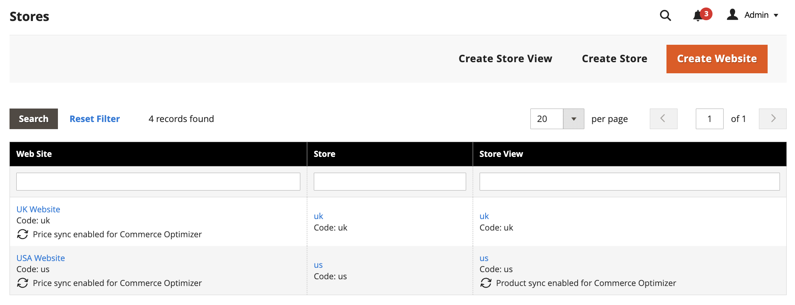

# 基本を学ぶ

[!DNL Adobe Commerce Optimizer Connector]をインストールして設定し、[!DNL Adobe Commerce] カタログデータを[!DNL Adobe Commerce Optimizer]と同期してから、データ同期ステータスを監視して、ストアフロントが最新であることを確認します。

{{aco-integration-environment-alignment}}

>[!NOTE]
>
>このトピックでは、[!DNL Adobe Commerce Optimizer Connector]について説明します。 [!DNL Adobe Commerce]個のB2B共有カタログを使用する場合は、[手順 [!DNL Adobe Commerce Optimizer Connector for B2B]](get-started-b2b-shared-catalogs.md)に従ってください。 B2B コネクタは、ベースカタログデータ同期を拡張して、カスタム共有カタログの同期をサポートします。

## 統合の使用要件 {#requirements-to-use-the-integration}

* [Adobe Commerce](https://business.adobe.com/jp/products/magento/magento-commerce.html) 2.4.7以降。 要件の詳細については、[必要システム構成](https://experienceleague.adobe.com/ja/docs/commerce-operations/installation-guide/system-requirements)を参照してください。

* プロビジョニングされたサンドボックスインスタンスを使用する[!DNL Commerce Optimizer] ライセンス。

* Composerを使用してコネクタメタパッケージをダウンロードするための[認証キー](https://experienceleague.adobe.com/ja/docs/commerce-operations/installation-guide/prerequisites/authentication-keys)。

* [[!DNL Commerce Optimizer]  サンドボックスインスタンス &#x200B;](../optimizer/get-started.md)への管理者アクセス。

統合を構成する[!DNL Adobe Commerce] ユーザーには、次の要件が必要です。

* Commerce管理者への管理者アクセス。

* [&#x200B; アプリケーションサーバー [!DNL Adobe Commerce] へのコマンドラインアクセス &#x200B;](https://experienceleague.adobe.com/ja/docs/commerce-on-cloud/user-guide/project/user-access)。

* [!DNL Commerce Optimizer] プロジェクトがプロビジョニングされている[IMS組織](https://experienceleague.adobe.com/ja/docs/core-services/interface/administration/organizations?)への開発者アクセス。

>[!BEGINSHADEBOX]

## 競合する拡張機能の削除

{{$include /help/_includes/aco-connector/remove-conflicting-extensions.md}}

>[!ENDSHADEBOX]

## 設定手順 {#configuration-steps}

[!DNL Adobe Commerce Optimizer Connector]を有効にし、[!DNL Adobe Commerce]から[!DNL Commerce Optimizer] インスタンスへのデータの同期を開始するには、次の手順に従います。

1. **[Composerを使用して [!DNL Adobe Commerce Optimizer Connector]  パッケージ](#install-the-adobe-commerce-optimizer-connector-package)**&#x200B;をインストールし、[!DNL Adobe Commerce] インスタンスを[!DNL Commerce Optimizer]に接続します。

1. **[管理者からCommerce スコープの書き出し設定](#customize-the-commerce-scopes-export-configuration)**&#x200B;をカスタマイズします。

1. **[&#x200B; [!DNL Commerce Optimizer] 統合](#enable-the-adobe-commerce-optimizer-integration)**&#x200B;を有効にします。

1. **[データ同期が機能していることを確認します](#verify-that-the-data-sync-is-working)**。

## [!DNL Adobe Commerce Optimizer Connector] パッケージのインストール {#install-the-adobe-commerce-optimizer-connector-package}

[!DNL Adobe Commerce Optimizer Connector]は、[!DNL Commerce Optimizer]のアクティブなライセンスを持つすべてのCommerce マーチャントが利用できるComposer メタパッケージとして配信されます。

### インストール手順

1. Composerを使用して`adobe-commerce/commerce-data-export-aco-adapter` モジュールを追加します。

   ```shell
   composer require adobe-commerce/commerce-data-export-aco-adapter
   ```

1. [!DNL Adobe Commerce] ステージング環境に変更をデプロイします。

   デプロイメントが完了すると、[!DNL Commerce Optimizer] オプションがCommerce管理メニューから使用できるようになります。 「**[!UICONTROL Commerce Optimizer]**」を選択して、Commerce管理者から直接[!DNL Commerce Optimizer] インスタンスを開きます。

{{install-extension-links}}

## Commerce スコープ書き出し設定のカスタマイズ {#customize-the-commerce-scopes-export-configuration}

デフォルトでは、すべてのCommerce スコープ（web サイト、カスタマーグループ、ストアビュー）でカタログデータの同期が有効になっています。 ビジネスニーズに基づいて、特定の範囲のデータのみを同期するように書き出し設定をカスタマイズできます。 例えば、複数のストアビューが同じ言語を共有する場合、1つのストアビューのデータを書き出し、[!DNL Commerce Optimizer]の複数のカタログビューの[&#x200B; カタログソース &#x200B;](../optimizer/setup/catalog-sources.md)として使用できます。

>[!IMPORTANT]
>
>書き出し設定を変更すると、カタログのサイズに応じて大幅な時間がかかる場合がある、完全なインデックス再作成がトリガーされます。 Adobeでは、統合を有効にして最初のデータ同期を開始する前に、Commerce スコープを[!DNL Commerce Optimizer]に同期するように設定することをお勧めします。

次の表に、各範囲レベルで書き出されるデータを示します。

| 範囲 | 書き出されたデータ | メモ |
| ----- | ------------- | ----- |
| web サイトと顧客グループ | 価格と価格表 | 各価格セットは、命名規則`&lt;website&gt;::&lt;SHA1 of customer group ID&gt;`を使用して[価格表](../optimizer/setup/pricebooks.md)として書き出されます。 Web サイトのすべての顧客グループが含まれます。 |
| ストアビュー | 製品と製品属性 | 各ストアビューは、[!DNL Commerce Optimizer]に個別の[&#x200B; カタログソース &#x200B;](../optimizer/setup/catalog-sources.md)を作成します。 |

{width="600" zoomable="yes"}

### 範囲の書き出し設定を変更するには

1. Commerce Adminで、**[!UICONTROL Stores]** > **[!UICONTROL Settings]** > **[!UICONTROL All Stores]**&#x200B;に移動します。

1. 設定するweb サイトまたはストアビューを選択します。

1. **[!DNL Commerce Optimizer]エクスポーター設定**&#x200B;で、チェックボックスを使用して、必要に応じてデータ同期を有効または無効にします。

   {width="500" zoomable="yes"}

1. 変更を保存します。

### ビヘイビアーを有効または無効にする

| アクション | 結果 |
| -------- | -------- |
| ストアビューを無効にする | **同期を無効にすると、ストアフロントからカタログデータが削除されます。** カタログ ソースは[!DNL Commerce Optimizer]に残りますが、次回のcron実行時にすべての同期データが削除されます。 |
| ストアビューを無効にして再度有効にする | 同じカタログソースに、完全なデータ再同期が再入力されます。 |

## [!DNL Commerce Optimizer]統合を有効にする {#enable-the-adobe-commerce-optimizer-integration}

統合を有効にし、`aco:config:init` CLI コマンドを実行してデータ同期を開始します。 このコマンドは、次の手順を完了します。

1. コマンドライン引数として指定された資格情報を使用して、IMS アクセストークンを取得します。
1. `https://ccm.api.commerce.adobe.com/api/v1/tenants/{tenantId}/owner/{orgId}`のCommerce Cloud Manager （CCM） サービスを呼び出して、テナントを検証し、取り込みURLと[!DNL Commerce Optimizer] Studio URLを抽出します。
1. すべての設定（クライアントシークレットが暗号化）を`core_config_data`に保存します。
1. すべての[!DNL Commerce Optimizer] フィードのインデクサーを無効にすることで、最初の完全同期をスケジュールします。


{{aco-data-sync-processing-note}}

## 必要な接続の詳細を取得

{{$include /help/_includes/aco-connector/connection-details.md}}

### [!DNL Commerce Optimizer] インスタンスの詳細を取得

{{$include /help/_includes/aco-connector/configure-connection.md}}

## データ同期が機能していることを確認します {#verify-that-the-data-sync-is-working}

{{$include /help/_includes/aco-connector/verify-optimizer-data-sync.md}}

## 次のステップ

1. **カタログ ビューとポリシー[!DNL Commerce Optimizer]を設定**

   [!DNL Commerce Optimizer] UIでカタログ ビューとポリシーを作成します。 価格表は、[!DNL Adobe Commerce]個の顧客グループから自動的に作成されます。 手順については、*[!DNL Commerce Optimizer]ユーザーガイド*&#x200B;の[&#x200B; カタログビュー](../optimizer/setup/catalog-view.md)および[&#x200B; ポリシー](../optimizer/setup/policies.md)のドキュメントを参照してください。 カタログビューへのアクセスを制限するには、[&#x200B; プライベートカタログビュー](../optimizer/setup/private-catalog-view.md)を参照してください。

1. **[!DNL Edge Delivery Services]**&#x200B;にCommerce ストアフロントを設定

   ストアフロントを[!DNL Commerce Optimizer] インスタンスに接続し、パーソナライズされたコマースエクスペリエンスの提供を開始するには、[&#x200B; ストアフロント設定ドキュメント &#x200B;](https://experienceleague.adobe.com/en/tools/commerce-storefront/setup/){target="_blank"}に従います。
