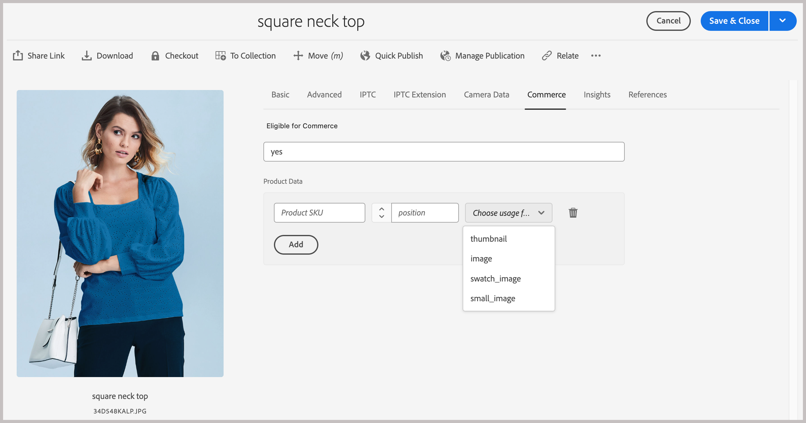
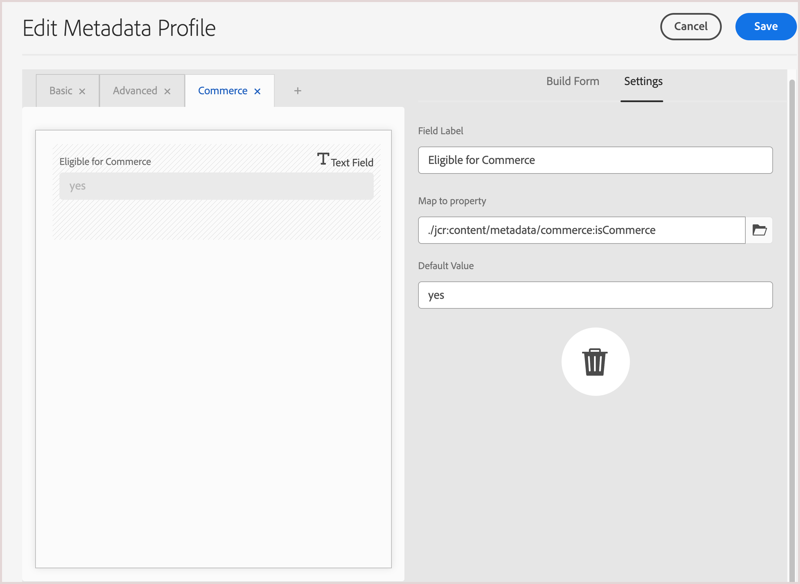

# Commerce メタデータをサポートするようにAEM Assets プロジェクトを設定する

AEM AssetsをCommerceのデジタルアセット管理システム （DAM）として使用する場合、`assets-commerce` パッケージをインストールすると、AEM オーサリング環境からCommerce製品の画像とビデオを管理できます。

AEM オーサリング環境からAEM Assets アセットを管理するために必要なパッケージコードとメタデータを使用してCommerce プロジェクトを設定するには、次の手順を実行します。

1. [`assets-commerce` パッケージの内容について説明します](#aem-commerce-assets-commerce-package-contents)

1. [Commerce メタデータをサポートするようにAEM Assets プロジェクトを設定するには、インストール手順を実行します](#step-1-install-the-assets-commerce-package)

## AEM Commerce assets-commerce パッケージの内容

Adobeは、Experience Manager Assets as a Cloud Service環境設定にCommerce名前空間およびメタデータスキーマリソースを追加するためのAEM Commerce パッケージコード `assets-commerce`を提供します。

このパッケージコードは、次のリソースをAEM Assets オーサリング環境に追加します。

* Commerce関連のプロパティを識別するための[ カスタム名前空間](https://github.com/ankumalh/assets-commerce/blob/main/ui.config/jcr_root/apps/commerce/config/org.apache.sling.jcr.repoinit.RepositoryInitializer~commerce-namespaces.cfg.json)、`Commerce`。

   * Adobe Commerce プロジェクトに関連付けられたCommerce アセットにタグ付けするためのラベル `Eligible for Commerce`を持つカスタムメタデータタイプ `commerce:isCommerce`。

   * カスタムメタデータタイプ `commerce:skus`と、対応するUI コンポーネントを使用して&#x200B;**[!UICONTROL Product Data]** プロパティを追加します。 商品データには、Commerce アセットを商品SKUに関連付けるためのメタデータプロパティが含まれています。

     {width="600" zoomable="yes"}

   * Commerceでのアセットのビジュアライゼーション方法を示すカスタムメタデータタイプ `commerce:roles`と`commerce:positions`属性。

   * 代替テキストマルチフィールド （_[!UICONTROL Alt texts]_） メタデータ。エディターは、Commerce ストアビューコードでキー付きの代替テキストを入力できます。 これは、カタログ内での製品画像の割り当てやスコープ設定は変更されません。 AEM Assets メタデータの[代替テキスト ](#localized-alt-text-in-aem-assets-metadata)を参照してください。

* Commerce アセットのタグ付け用の`Eligible for Commerce`および`Product Data` フィールドを含むCommerce タブを持つメタデータスキーマフォーム。 このフォームには、AEM Assets UIから`roles`および`position` フィールドを表示または非表示にするオプションも用意されています。

  {width="600" zoomable="yes"}

* 最初のアセットの同期をサポートするために、[ サンプルにタグ付けして承認されたCommerce アセット ](https://github.com/ankumalh/assets-commerce/blob/main/ui.content/src/main/content/jcr_root/content/dam/wknd/en/activities/hiking/equipment_6.jpg/.content.xml) `equipment_6.jpg`が含まれています。 AEM AssetsからAdobe Commerceに同期できるのは、承認済みのCommerce アセットのみです。

>[!NOTE]
>
> **AEM Commerce パッケージコード**&#x200B;について詳しくは、GitHubの[readme](https://github.com/ankumalh/assets-commerce) ページを参照してください。

## AEM Assets メタデータの代替テキスト

_[!UICONTROL Alt texts]_マルチフィールドは、対象となる画像を編集するときに、**[!UICONTROL Commerce]**タブのAEM Assets アセットメタデータエディターで使用できます。

>[!IMPORTANT]
>
> ストアごとのビューの動作は、代替テキストにのみ適用されます。 AEM Assetsとの連携では、Adobe Commerceのストアビューごとに異なる商品画像が同期されません。 AEMの製品画像は、このリリース以前と同じギャラリー割り当て動作で引き続きCommerceに同期されます。

マルチフィールドには、Commerce ストアビューごとに1行が含まれます。 各行には2つの入力があります。

* **[!UICONTROL Store View Code]** — ストアビュー識別子（`default`または`en_US`など）。

* **[!UICONTROL Alt Text]** – そのストアビューの代替テキスト（255文字に制限）。

追加のストアビュー用に行を追加するには、**[!UICONTROL Add]**&#x200B;を選択します。 行を削除するには、その行の&#x200B;**[!UICONTROL Delete]** アイコンを選択して削除します。

{width="600" zoomable="yes"}

保存すると、クライアント側の検証により、任意の行に空の&#x200B;_[!UICONTROL Store View Code]_がある場合、または2つの行で同じストアビューコードが使用されている場合は、送信がブロックされます（大文字と小文字は区別されません）。

代替テキストエントリは、次の2つのインデックス整列`String[]` プロパティとしてJCR アセットメタデータに保持されます。

* `commerce:altTextStoreViews`：各行のビューコードを格納します。
* `commerce:altTextValues`: `commerce:altTextStoreViews`の各エントリと同じインデックスにあるalt テキストに一致します。

これらのアセットがAdobe Commerceに同期すると、一致するストアビューコードのストアごとのビュー代替テキストが商品メディアギャラリーに書き込まれます。 基になる画像マッピングは変更されません。

## 前提条件

`assets-commerce` パッケージコードをAEM Assets as a Cloud Service AEM環境にデプロイするには、次のリソースと権限が必要です。

* プログラムおよびデプロイメント マネージャーの役割を持つ[AEM Assets Cloud Manager プログラムおよび環境](https://experienceleague.adobe.com/en/docs/experience-manager-cloud-service/content/onboarding/journey/cloud-manager#access-sysadmin-bo)へのアクセス。

* [ ローカル ローカル開発環境](https://experienceleague.adobe.com/en/docs/experience-manager-learn/cloud-service/local-development-environment-set-up/overview)と、AEM開発プロセスに関する知識。

* [AEM プロジェクト構造](https://experienceleague.adobe.com/ja/docs/experience-manager-cloud-service/content/implementing/developing/aem-project-content-package-structure)と、Cloud Managerを使用してカスタムコンテンツパッケージをデプロイする方法について説明します。

* Commerce インスタンスの&#x200B;**IMS組織ID**。 Commerce インスタンスとAEM Assets オーサリング環境の両方が同じIMS組織にある必要があります。

* OpenAPI機能を使用して[Dynamic Mediaを有効にするには](https://experienceleague.adobe.com/en/docs/experience-manager-cloud-service/content/assets/dynamicmedia/dynamic-media-open-apis/dynamic-media-open-apis-overview#enable-dynamic-media-open-apis):

>[!BEGINTABS]

>[!TAB 製品ビジュアル ]

OpenAPI機能を備えた[!BADGE SaaSのみ]{type=Positive url="https://experienceleague.adobe.com/en/docs/commerce/user-guides/product-solutions" tooltip="Adobe Commerce as a Cloud ServiceおよびAdobe Commerce Optimizer プロジェクト（Adobeが管理するSaaS インフラストラクチャ）にのみ適用されます。"}のDynamic Mediaは、AEM Assetsを活用した商品ビジュアルのセルフサービスです。

1. Cloud Managerに移動します。

1. 目的の環境を選択します。

1. OpenAPI機能を使用して&#x200B;**Dynamic Mediaを有効にする**。

   OpenAPI機能を備えた&#x200B;**Dynamic Media** ボタンがアクティブでない場合は、サポートチケットを開きます。

>[!TAB AEM Assets]

[!BADGE PaaSのみ]{type=Informative tooltip="Cloud プロジェクト上のAdobe Commerce（Adobeで管理されるPaaS インフラストラクチャ）にのみ適用されます。"} AEM as a Cloud Serviceで、次の情報を記載したAdobe サポートチケットを送信します。

* タイトル：Dynamic Media OpenAPIを有効にして、Adobe CommerceとAEM Assetsを完全に統合する

   * サポートチケットの内容：

      * **[!UICONTROL AEM Program ID]**
      * **[!UICONTROL Adobe Commerce URL]**
      * **[!UICONTROL AEM Environment ID]**
      * **[!UICONTROL IMS Org ID]**

サポートチケットを送信すると、AdobeはCloud Services環境でOpenAPI機能を備えたDynamic Mediaを有効にし、IMS クライアント IDなどの詳細を共有して、統合を進めることができます。

>[!ENDTABS]

## 手順1:assets-commerce パッケージのインストール

1. AEM Cloud Managerに移動し、プログラムを選択し、Adobe Commerceと統合する実稼動環境とステージング環境を[作成します](https://experienceleague.adobe.com/en/docs/experience-manager-cloud-service/content/onboarding/journey/create-environments#creating-environments)。

1. [選択したプログラムのAdobe管理Git リポジトリ ](https://experienceleague.adobe.com/en/docs/experience-manager-cloud-service/content/sites/administering/site-creation/quick-site/retrieve-access#repo-access)を複製します。

   {width="600" zoomable="yes"}

   Cloud Manager **パイプライン**&#x200B;で、**[!UICONTROL Access Repo Info]**&#x200B;を選択して&#x200B;**[!UICONTROL Repository Info]**&#x200B;を開きます。 **[!UICONTROL URL]**&#x200B;または&#x200B;**[!UICONTROL Git command line]**&#x200B;の値をコピーし、必要に応じてアクセス パスワードを生成してから、Git クライアントとローカルにクローンを作成します。

1. GitHubから、[AEM Assets Commerce リポジトリ ](https://github.com/ankumalh/assets-commerce)からパッケージコードをダウンロードします。

1. [ ローカルのAEM開発環境](https://experienceleague.adobe.com/en/docs/experience-manager-learn/cloud-service/local-development-environment-set-up/overview)から、ダウンロードしたコードを既存のAdobe管理リポジトリに手動でコピーします。

1. プロジェクトのすべての`filter.xml`および`pom.xml` ファイルで、&lt;my-app>のすべての出現箇所をアプリ名に置き換えます。

   >[!NOTE]
   >
   > または、カスタムコードを&#x200B;**Maven** パッケージとしてAEM Assets プロジェクト設定にインストールすることもできます。

1. 変更を確定し、ローカル開発ブランチをCloud Manager Git リポジトリにプッシュします。

1. [ デプロイメントパイプライン ](https://experienceleague.adobe.com/en/docs/experience-manager-cloud-service/content/sites/administering/site-creation/quick-site/pipeline-setup#create-front-end-pipeline)を設定するか、パイプラインが選択した環境に変更をデプロイできることを確認します。

   {width="600" zoomable="yes"}

   パイプラインが存在する場合、アクションメニュー（**...**）を開きます **[!UICONTROL Run]**、**[!UICONTROL Edit]**、**[!UICONTROL View/Edit variables]**&#x200B;またはその他のアクションへ – 上記のリンクされたCloud Manager パイプラインのドキュメントを参照してください。

1. AEM Cloud Managerから、[ パイプラインを使用してコードをデプロイし、AEM環境を更新します](https://experienceleague.adobe.com/en/docs/experience-manager-cloud-service/content/implementing/using-cloud-manager/deploy-code#deploying-code-with-cloud-manager)。

1. 任意のアセットに移動し、そのプロパティを編集して変更を検証します。

   * デフォルトのメタデータスキーマには、「**Commerce**」タブが含まれています。

   * 製品SKUと`Eligible for Commerce` フィールドが表示されます。

### 「Commerce」タブがプロパティに表示されない

「**Commerce**」タブがプロパティに表示されない場合は、メタデータスキーマエディターで次の手順を手動で実行する必要があります。

1. メタデータスキーマエディターに移動します。

1. **編集**&#x200B;を選択して、デフォルトのメタデータスキーマフォームを変更します。

1. 「**Commerce**」タブを作成し、選択します。

1. **Product** コンポーネントを&#x200B;**Commerce** タブにドラッグ&amp;ドロップし、プロパティ `commerce:skus`にマッピングします。

1. **役割を表示**&#x200B;および&#x200B;**順序を表示**&#x200B;のチェックボックスを選択します。

1. **checkbox** コンポーネントを&#x200B;**Commerce** タブにドラッグ&amp;ドロップし、プロパティ `commerce:isCommerce`にマッピングします。 オプションとして&#x200B;**Yes**&#x200B;と&#x200B;**No**&#x200B;を定義します。

その他の問題が発生した場合は、[ サポートチケット ](https://experienceleague.adobe.com/docs/commerce-knowledge-base/kb/help-center-guide/magento-help-center-user-guide.html#submit-ticket)を作成するか、AEM Assets Integrationの営業担当者にお問い合わせください。

## 手順2：オプション。 メタデータプロファイルの設定

AEM Assets オーサー環境で、メタデータプロファイルを作成して、Commerce アセットメタデータのデフォルト値を設定します。 次に、新しいプロファイルをAEM Asset フォルダーに適用して、これらのデフォルトを自動的に使用します。 この設定により、手作業を削減してアセット処理が合理化されます。

メタデータプロファイルを設定する場合、次のコンポーネントのみを設定する必要があります。

* 「Commerce」タブを追加します。 このタブでは、テンプレートによって追加されたCommerce固有の設定を有効にします。

* 「`Eligible for Commerce`」フィールドを「Commerce」タブに追加します。

製品データ UI コンポーネントは、テンプレートに基づいて自動的に追加されます。

### メタデータプロファイルの定義

1. Adobe Experience Manager オーサー環境にログインします。

1. Adobe Experience Manager ワークスペースから、「Adobe Experience Manager」アイコンをクリックして、AEM Assetsのコンテンツ管理ワークスペースを作成します。

   {width="600" zoomable="yes"}

1. ハンマーアイコンを選択して、管理者ツールを開きます。

   {width="600" zoomable="yes"}

1. **[!UICONTROL Metadata Profiles]**&#x200B;をクリックして、プロファイル設定ページを開きます。

1. Commerce統合用のメタデータプロファイル **[!UICONTROL Create]**。

   {width="600" zoomable="yes"}

1. Commerce メタデータのタブを追加します。

   1. 左側で、**[!UICONTROL Settings]**&#x200B;をクリックします。

   1. タブ セクションの&#x200B;**[!UICONTROL +]**&#x200B;をクリックし、**[!UICONTROL Tab Name]**、`Commerce`を指定します。

1. フォームに`Eligible for Commerce` フィールドを追加します。

   {width="600" zoomable="yes"}

   * **[!UICONTROL Build form]**&#x200B;をクリックします。

   * `Single Line text` フィールドをフォームにドラッグします。

   * **[!UICONTROL Field Label]**&#x200B;をクリックして、ラベルの`Eligible for Commerce` テキストを追加します。

   * 「設定」タブで、「**フィールドラベル**」にラベルテキストを追加します。

   * プレースホルダーテキストを`yes`に設定します。

   * **[!UICONTROL Map to Property]** フィールドに、次の値をコピーして貼り付けます

     ```terminal
     ./jcr:content/metadata/commerce:isCommerce
     ```

1. オプション。 承認済みのCommerce アセットをAEM Assets環境にアップロードするときに自動的に同期させるには、`Basic` タブの&#x200B;_[!UICONTROL Review Status]_フィールドのデフォルト値を`approved`に設定します。

1. アップデートを保存します。

### メタデータプロファイルをCommerce assets ソースフォルダーに適用する

1. **[!UICONTROL Metadata Profiles]** ページから、Commerce統合プロファイルを選択します。

1. アクションメニューから、**[!UICONTROL Apply Metadata Profiles to Folders]**&#x200B;を選択します。

1. Commerce アセットを含むフォルダーを選択します。

   Commerce フォルダーが存在しない場合は作成します。

1. **[!UICONTROL Apply]**&#x200B;を選択します。

## 次のステップ

* [!BADGE PaaSのみ]{type=Informative tooltip="Cloud プロジェクト上のAdobe Commerce（Adobeで管理されるPaaS インフラストラクチャ）にのみ適用されます。"} [Adobe Commerce パッケージをインストール ](configure-commerce.md)。

* [!BADGE SaaSのみ]{type=Positive url="https://experienceleague.adobe.com/en/docs/commerce/user-guides/product-solutions" tooltip="Adobe Commerce as a Cloud ServiceおよびAdobe Commerce Optimizer プロジェクト（Adobeが管理するSaaS インフラストラクチャ）にのみ適用されます。"} [管理者](setup-synchronization.md)から統合を設定します。
