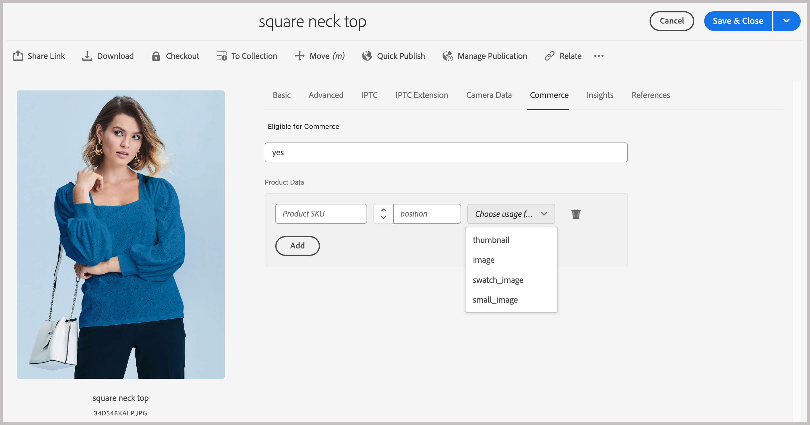
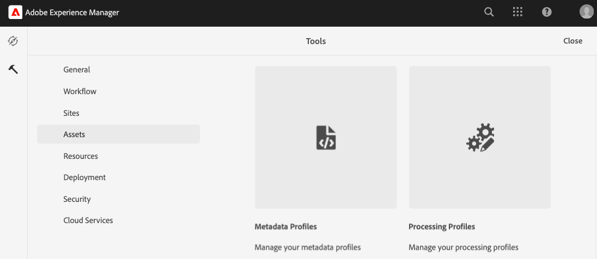

# Commerce メタデータをサポートするようにAEM Assets プロジェクトを設定します

AEM AssetsをAEMの Digital Asset Management System （DAM）として使用する場合、`assets-commerce` パッケージをインストールすると、Commerce オーサリング環境からCommerce製品の画像とビデオを管理できます。

AEM オーサリング環境でAEM Assets アセットを管理するために必要なパッケージコードとメタデータをCommerce プロジェクトに設定するには、次の手順を実行します。

1. [について説明します &#x200B;](#aem-commerce-assets-commerce-package-contents)

1. [Commerce メタデータをサポートするようにAEM Assets プロジェクトを設定するには、インストール手順を実行します](#step-1-install-the-assets-commerce-package)

## AEM Commerce assets-commerce パッケージコンテンツ

Adobeは、AEM Commerce環境設定にCommerce名前空間およびメタデータスキーマリソースを追加するためのExperience Manager Assets as a Cloud Service パッケージコード `assets-commerce` ードを提供します。

このパッケージコードは、次のリソースをAEM Assets オーサリング環境に追加します。

* Commerce関連のプロパティを識別するた [&#x200B; の &#x200B;](https://github.com/ankumalh/assets-commerce/blob/main/ui.config/jcr_root/apps/commerce/config/org.apache.sling.jcr.repoinit.RepositoryInitializer~commerce-namespaces.cfg.json) カスタム名前空間 `Commerce`。

   * Adobe Commerce プロジェクトに関連付けられたCommerce アセットにタグ付けするた `commerce:isCommerce` のラベルが付いたカスタムメタデータタイプ `Eligible for Commerce`。

   * カスタムメタデータタイプ `commerce:skus` と、**[!UICONTROL Product Data]** スタムプロパティを追加するための対応する UI コンポーネント。 商品データには、Commerce アセットを商品 SKU に関連付けるためのメタデータプロパティが含まれています。

     {width="600" zoomable="yes"}

   * Commerceでのアセットのビジュアライゼーション方法を示すカスタムメタデータタイプ `commerce:roles` および `commerce:positions` の属性。

* Commerce アセットにタグ付けするための `Eligible for Commerce` フィールドと `Product Data` フィールドを含む、Commerce タブを持つメタデータスキーマフォーム このフォームには、AEM Assets UI の `roles` フィールドと `position` フィールドを表示または非表示にするオプションも用意されています。

  {width="600" zoomable="yes"}

* 最初のアセットの同期をサポートするための [&#x200B; タグ付けされた承認済みCommerce アセット &#x200B;](https://github.com/ankumalh/assets-commerce/blob/main/ui.content/src/main/content/jcr_root/content/dam/wknd/en/activities/hiking/equipment_6.jpg/.content.xml) サンプル `equipment_6.jpg`。 AEM AssetsからAdobe Commerceに同期できるのは、承認済みのCommerce アセットのみです。

>[!NOTE]
>
> [2&rbrace;AEM Commerce パッケージコード &#x200B;](https://github.com/ankumalh/assets-commerce) について詳しくは、&lbrace;readme **ページを参照してください。**

## 前提条件

`assets-commerce` パッケージコードをAEM Assets as a Cloud Service AEM環境にデプロイするには、次のリソースと権限が必要です。

* プログラムおよびデプロイメントマネージャーの役割を使用して [AEM Assets Cloud Manager プログラムおよび環境にアクセス &#x200B;](https://experienceleague.adobe.com/en/docs/experience-manager-cloud-service/content/onboarding/journey/cloud-manager#access-sysadmin-bo) します。

* [&#x200B; ローカル AEMローカル開発環境 &#x200B;](https://experienceleague.adobe.com/en/docs/experience-manager-learn/cloud-service/local-development-environment-set-up/overview) およびAEM開発プロセスに精通していること。

* [AEM プロジェクト構造 &#x200B;](https://experienceleague.adobe.com/ja/docs/experience-manager-cloud-service/content/implementing/developing/aem-project-content-package-structure) およびCloud Managerを使用してカスタムコンテンツパッケージをデプロイする方法を理解します。

* Commerce インスタンスの **IMS 組織 ID**。 Commerce インスタンスとAEM Assets オーサリング環境は、両方とも同じ IMS 組織内にある必要があります。

* [OpenAPI 機能を備えた Dynamic Media](https://experienceleague.adobe.com/en/docs/experience-manager-cloud-service/content/assets/dynamicmedia/dynamic-media-open-apis/dynamic-media-open-apis-overview#enable-dynamic-media-open-apis) を有効にするには：

>[!BEGINTABS]

>[!TAB  製品ビジュアル ]

[!BADGE SaaS のみ &#x200B;]{type=Positive url="https://experienceleague.adobe.com/en/docs/commerce/user-guides/product-solutions" tooltip="Adobe Commerce as a Cloud ServiceおよびAdobe Commerce Optimizer プロジェクトにのみ適用されます（Adobeで管理される SaaS インフラストラクチャ）。"}OpenAPI 機能を備えた Dynamic Media は、AEM Assetsを活用した Product Visuals のセルフサービスです。

1. Cloud Managerに移動します。

1. 目的の環境を選択します。

1. **OpenAPI 機能を使用した Dynamic Media** を有効にします。

   **Dynamic Media with OpenAPI capabilities** ボタンがアクティブでない場合は、サポートチケットを開きます。

>[!TAB AEM Assets]

[!BADGE PaaS のみ &#x200B;]{type=Informative tooltip="クラウドプロジェクト上のAdobe Commerceにのみ適用されます（Adobeが管理する PaaS インフラストラクチャ）。"} AEM as a Cloud Serviceで、次の情報を記載してAdobe サポートチケットを送信します。

* タイトル：Adobe CommerceとAEM Assetsを完全に統合するために Dynamic Media OpenAPI を有効にする

   * サポートチケットの内容：

      * **[!UICONTROL AEM Program ID]**
      * **[!UICONTROL Adobe Commerce URL]**
      * **[!UICONTROL AEM Environment ID]**
      * **[!UICONTROL IMS Org ID]**

サポートチケットを送信すると、Adobeが Cloud Services 環境で OpenAPI 機能を備えた Dynamic Media を有効にし、IMS クライアント ID などの詳細を共有して、統合を進めます。

>[!ENDTABS]

## 手順 1:assets-commerce パッケージのインストール

1. AEM Cloud Managerに移動してプログラムを選択し、Adobe Commerceと統合する [&#x200B; 実稼動環境とステージング環境の作成 &#x200B;](https://experienceleague.adobe.com/en/docs/experience-manager-cloud-service/content/onboarding/journey/create-environments#creating-environments) を実行します。

1. [&#x200B; デプロイメントパイプライン &#x200B;](https://experienceleague.adobe.com/en/docs/experience-manager-cloud-service/content/sites/administering/site-creation/quick-site/pipeline-setup#create-front-end-pipeline) を設定するか、パイプラインが選択した環境に変更をデプロイできることを確認します。

1. 選択したプログラムの [Adobeの管理 Git リポジトリを複製 &#x200B;](https://experienceleague.adobe.com/en/docs/experience-manager-cloud-service/content/sites/administering/site-creation/quick-site/retrieve-access#repo-access) します。

1. GitHub で、[AEM Assets Commerce リポジトリ &#x200B;](https://github.com/ankumalh/assets-commerce) からパッケージコードをダウンロードします。

1. [&#x200B; ローカル AEM開発環境 &#x200B;](https://experienceleague.adobe.com/en/docs/experience-manager-learn/cloud-service/local-development-environment-set-up/overview) から、ダウンロードしたコードを既存のAdobeが管理するリポジトリに手動でコピーします。

1. プロジェクトのすべての `filter.xml` と `pom.xml files` で、`<my-app>` をアプリ名にすべて置き換えます。

>[!NOTE]
>
> または、カスタムコードを **Maven** パッケージとしてAEM Assets プロジェクト設定にインストールできます。

1. 変更をコミットし、ローカル開発ブランチをCloud Manager Git リポジトリにプッシュします。

1. AEM Cloud Managerから [&#x200B; パイプラインを使用してコードをデプロイして、AEM環境を更新します &#x200B;](https://experienceleague.dobe.com/en/docs/experience-manager-cloud-service/content/implementing/using-cloud-manager/deploy-code#deploying-code-with-cloud-manager)。

1. 任意のアセットに移動してプロパティを編集し、変更を確認します。

   * デフォルトのメタデータスキーマには「**Commerce**」タブが含まれています。

   * 製品 SKU と `Eligible for Commerce` のフィールドが表示されています。

### 「Commerce」タブがプロパティに表示されない

プロパティに「**Commerce**」タブが表示されない場合は、メタデータスキーマエディターでタブを手動で作成する必要があります。

1. メタデータスキーマエディターに移動します。

1. **編集** をクリックして、デフォルトのメタデータスキーマフォームを変更します。

1. 「**Commerce**」タブを作成し、選択します。

1. **Product** コンポーネントを **Commerce** タブにドラッグ&amp;ドロップし、プロパティ `commerce:skus` にマッピングします。

1. **役割を表示** および **順序を表示** のチェックボックスを選択します。

1. **checkbox** コンポーネントを **Commerce** タブにドラッグ&amp;ドロップし、プロパティ `commerce:isCommerce` にマッピングします。 **はい** と **いいえ** をオプションとして定義します。

その他の問題が発生した場合は、[&#x200B; サポートチケット &#x200B;](https://experienceleague.adobe.com/docs/commerce-knowledge-base/kb/help-center-guide/magento-help-center-user-guide.html#submit-ticket) を作成するか、AEM Assets Integration の営業担当者にお問い合わせください。

## 手順 2：オプション。 メタデータプロファイルの設定

AEM Assets オーサー環境で、メタデータプロファイルを作成して、Commerce アセットメタデータのデフォルト値を設定します。 次に、新しいプロファイルをAEM Asset フォルダーに適用すると、これらのデフォルトが自動的に使用されます。 この設定により、手動の手順が減ることでアセット処理が合理化されます。

メタデータプロファイルを設定する場合、次のコンポーネントを設定するだけで済みます。

* 「Commerce」タブを追加します。 このタブでは、テンプレートによって追加されたCommerce固有の設定を有効にします。

* 「`Eligible for Commerce`」フィールドを「Commerce」タブに追加します。

テンプレートに基づいて、製品データ UI コンポーネントが自動的に追加されます。

### メタデータプロファイルの定義

1. Adobe Experience Manager オーサー環境にログインします。

1. Adobe Experience Manager Workspace から、Adobe Experience Manager アイコンをクリックして、AEM Assetsのオーサーコンテンツ管理ワークスペースに移動します。

   {width="600" zoomable="yes"}

1. ハンマーアイコンを選択して、管理者ツールを開きます。

   {width="600" zoomable="yes"}

1. 「**[!UICONTROL Metadata Profiles]**」をクリックして、プロファイル設定ページを開きます。

1. Commerce統合用のメタデータプロファイルを **[!UICONTROL Create]** 定します。

   {width="600" zoomable="yes"}

1. Commerce メタデータ用のタブを追加します。

   1. 左側で、「**[!UICONTROL Settings]**」をクリックします。

   1. タブ セクションの [**[!UICONTROL +]**] をクリックし、**[!UICONTROL Tab Name]**、`Commerce` を指定します。

1. `Eligible for Commerce` フィールドをフォームに追加します。

   {width="600" zoomable="yes"}

   * 「**[!UICONTROL Build form]**」をクリックします。

   * 「`Single Line text`」フィールドをフォームにドラッグします。

   * 「」をクリックして、ラベルの `Eligible for Commerce` のテキストを追加 **[!UICONTROL Field Label]** ます。

   * 「設定」タブで、ラベルテキストを **フィールドラベル** に追加します。

   * プレースホルダーテキストを `yes` に設定します。

   * **[!UICONTROL Map to Property]** フィールドで、次の値をコピーして貼り付けます

     ```terminal
     ./jcr:content/metadata/commerce:isCommerce
     ```

1. オプション。 承認済みのCommerce アセットをAEM Assets環境にアップロードする際に自動的に同期させるには、「_[!UICONTROL Review Status]_」タブの「`Basic`」フィールドのデフォルト値を `approved` に設定します。

1. 更新を保存します。

### メタデータプロファイルをCommerce assets ソースフォルダーに適用します。

1. [!UICONTROL &#x200B; Metadata Profiles] ページで、「Commerce統合」プロファイルを選択します。

1. アクションメニューから「**[!UICONTROL Apply Metadata Profiles to Folders]**」を選択します。

1. Commerce アセットを含むフォルダーを選択します。

   Commerce フォルダーが存在しない場合は作成します。

1. 「**[!UICONTROL Apply]**」をクリックします。

## 次の手順

* [!BADGE PaaS のみ &#x200B;]{type=Informative tooltip="クラウドプロジェクト上のAdobe Commerceにのみ適用されます（Adobeが管理する PaaS インフラストラクチャ）。"}Adobe Commerce パッケージ [&#x200B; インストール &#x200B;](configure-commerce.md)。

* [!BADGE SaaS のみ &#x200B;]{type=Positive url="https://experienceleague.adobe.com/en/docs/commerce/user-guides/product-solutions" tooltip="Adobe Commerce as a Cloud ServiceおよびAdobe Commerce Optimizer プロジェクトにのみ適用されます（Adobeで管理される SaaS インフラストラクチャ）。"}[Commerce Admin から統合を設定します &#x200B;](setup-synchronization.md)。
