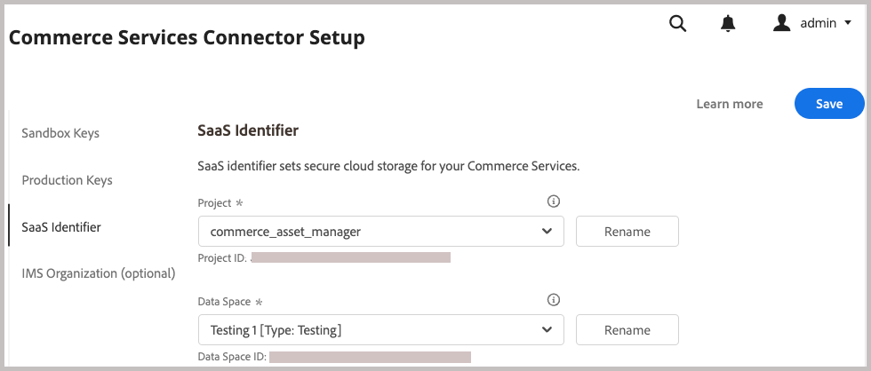
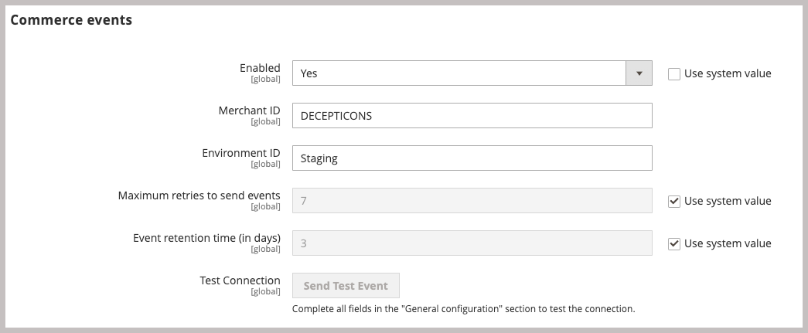
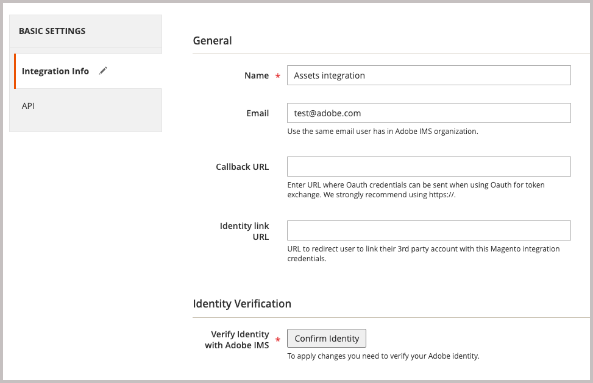
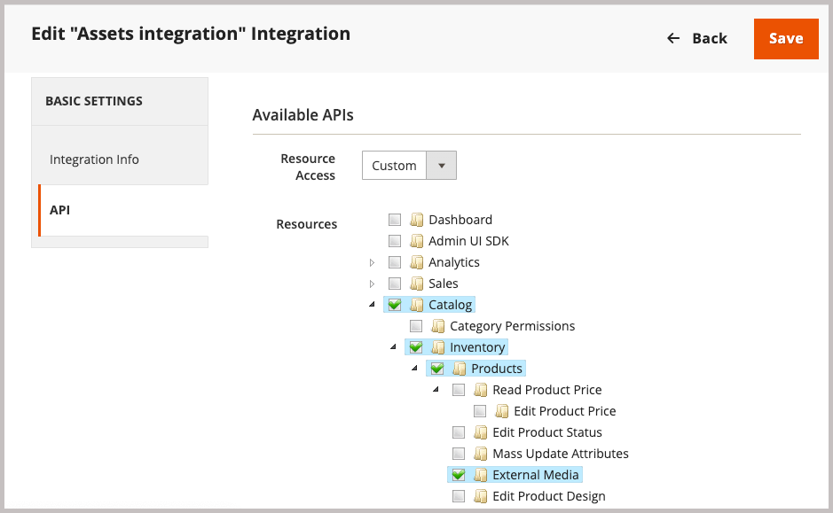
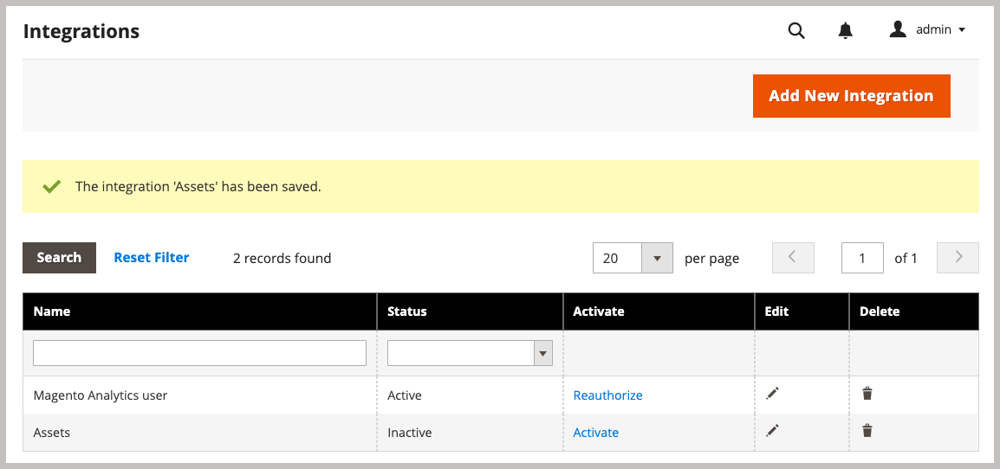
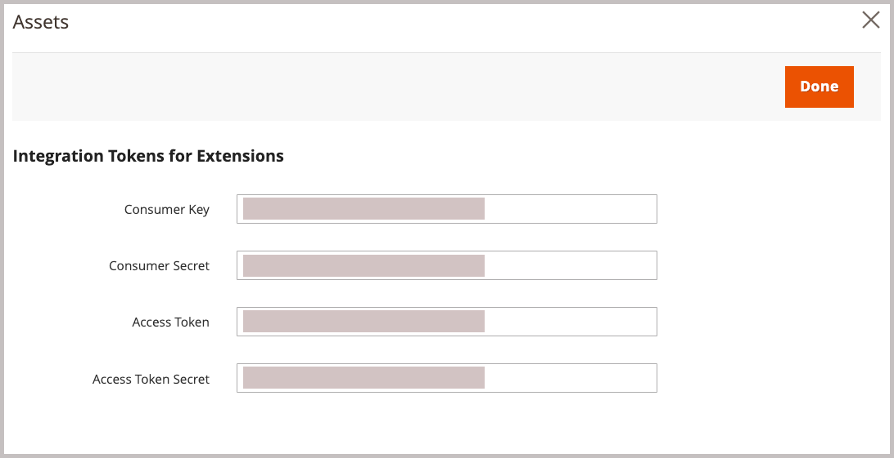

# Adobe Commerce パッケージのインストール

Commerceとの連携により、Adobe CommerceとAdobe Experience Manager Assets（AEM Assets）の間でアセットを同期できるようになります。 この拡張機能は、両方のプラットフォームで製品画像、ビデオ、その他のメディアアセットを管理するための一連のツールとサービスを提供します。

この拡張機能をCommerce環境に追加するには、`aem-assets-integration` PHP拡張機能をインストールします。 また、Commerce用のAdobe I/O Eventsを有効にし、Adobe CommerceとAdobe Experience Manager Assets間のコミュニケーションとワークフローに必要な資格情報を生成する必要もあります。

**アクセス要件**

AEM AssetsとのCommerce統合を有効にするには、次の役割と権限が必要です。

- [Commerce cloud project administrator](https://experienceleague.adobe.com/en/docs/commerce-cloud-service/user-guide/project/user-access) – 必要な拡張機能をインストールし、管理者またはコマンドラインからCommerce アプリケーションサーバーを設定します。

   - 拡張機能をインストールするには、[repo.magento.com](https://repo.magento.com/admin/dashboard)にアクセスしてください。

     キーの生成と必要な権限の取得については、[認証キーの取得](https://experienceleague.adobe.com/en/docs/commerce-operations/installation-guide/prerequisites/authentication-keys)を参照してください。 クラウドインストールについては、[Commerce on Cloud Infrastructure Guide](https://experienceleague.adobe.com/en/docs/commerce-cloud-service/user-guide/develop/authentication-keys)を参照してください

- [Commerce管理者](https://experienceleague.adobe.com/en/docs/commerce-admin/start/guide-overview) - ストア設定を更新し、Commerce ユーザーアカウントを管理します。

>[!TIP]
>
> Adobe Commerceでは、[Adobe IMS認証](https://experienceleague.adobe.com/en/docs/commerce-admin/start/admin/ims/adobe-ims-config)を使用するように設定できます。

## インストールと設定のワークフロー

Adobe Commerce パッケージをインストールし、次のタスクを実行してCommerce環境を準備します。

1. [Commerce向けAEM Assets統合の拡張機能（`aem-assets-integration`） ](#install-the-aem-assets-integration-extension)をインストールします。

1. [Commerce サービス コネクタ ](#configure-the-commerce-services-connector)を設定して、Adobe Commerce インスタンスと、Adobe CommerceとAEM Assets間でデータを転送できるサービスを接続します。

1. [Commerce用Adobe I/O Eventsの設定](#configure-adobe-io-events-for-commerce)

1. [API アクセス用の認証情報を取得する](#get-authentication-credentials-for-api-access)

## AEM Assets Integration拡張機能のインストール

AEM Assets Integration拡張機能（`aem-assets-integration`）の最新バージョンを、Adobe Commerce 2.4.5以降のAdobe Commerce インスタンスにインストールします。 拡張機能は、[repo.magento.com](https://repo.magento.com/admin/dashboard) リポジトリからコンポーザーのメタパッケージとして配信されます。

>[!BEGINTABS]

>[!TAB  クラウド インフラストラクチャ ]

Commerce Cloud インスタンスに[!DNL AEM Assets Integration]拡張機能をインストールするには、この方法を使用します。

1. ローカルワークステーションで、Adobe Commerce on cloud infrastructure プロジェクトのプロジェクトディレクトリに移動します。

   >[!NOTE]
   >
   >Commerce プロジェクト環境のローカル管理について詳しくは、_Adobe Commerce on Cloud Infrastructure ユーザーガイド_&#x200B;の「[CLIを使用した分岐の管理](https://experienceleague.adobe.com/en/docs/commerce-cloud-service/user-guide/develop/cli-branches)」を参照してください。

1. Adobe Commerce Cloud CLIを使用して更新する環境ブランチを確認します。

   ```shell
   magento-cloud environment:checkout <environment-id>
   ```

1. AEM Assets Integration for Commerce拡張機能を追加します。

   ```shell
   composer require "magento/aem-assets-integration" "<version-tbd>" --no-update
   ```

1. パッケージの依存関係を更新します。

   ```shell
   composer update "magento/aem-assets-integration"
   ```

1. `composer.json`および`composer.lock` ファイルのコード変更をコミットしてプッシュします。

1. `composer.json`および`composer.lock` ファイルのコード変更を追加、コミット、クラウド環境にプッシュします。

   ```shell
   git add -A
   git commit -m "Install AEM Assets Integration extension for Adobe Commerce"
   git push origin <branch-name>
   ```

   更新をプッシュすると、[Commerce クラウド デプロイメント プロセス ](https://experienceleague.adobe.com/en/docs/commerce-cloud-service/user-guide/develop/deploy/process)が開始され、変更が適用されます。 [ デプロイ ログ ](https://experienceleague.adobe.com/en/docs/commerce-cloud-service/user-guide/develop/test/log-locations#deploy-log)のデプロイメント ステータスを確認します。

>[!TAB  オンプレミス ]

オンプレミス インスタンスの[!DNL AEM Assets Integration]拡張機能をインストールするには、この方法を使用します。

1. Composerを使用して、AEM Assets Integration for Commerce拡張機能をプロジェクトに追加します。

   ```shell
   composer require "magento/aem-assets-integration" --no-update
   ```

1. 依存関係を更新し、拡張機能をインストールします。

   ```shell
   composer update  "magento/aem-assets-integration"
   ```

1. Adobe Commerceのアップグレード：

   ```shell
   bin/magento setup:upgrade
   ```

1. キャッシュをクリアします。

   ```shell
   bin/magento cache:clean
   ```

>[!TIP]
>
> 実稼動環境にデプロイする場合は、時間を節約するためにコンパイル済みコードをクリアしないようにしてください。 変更を加える前に、必ずシステムをバックアップしてください。

>[!ENDTABS]

## Commerce Services Connectorの設定

>[!NOTE]
>
> Commerce Services Connectorのセットアップは、[Adobe Commerce SaaS サービス ](https://experienceleague.adobe.com/en/docs/commerce/user-guides/integration-services/saas#availableservices)を使用するために必要な1回限りのプロセスです。 別のサービス用にコネクタを既に設定している場合は、**[!UICONTROL Systems]** > [!UICONTROL Services] > **[!UICONTROL Commerce Services Connector]**&#x200B;を選択して、Commerce管理者から既存の設定を表示できます。

Adobe Commerce インスタンスと、AEM Assets統合を有効にするサービスとの間でデータを転送するには、管理者（**[!UICONTROL System]** > [!UICONTROL Services] > **[!UICONTROL Commerce Services Connector]**）からCommerce Services Connectorを設定します。

AEM Assets統合用の{width="600" zoomable="yes"}

設定で次の値を指定します

- 認証用の実稼動およびサンドボックス API キー
- セキュアクラウドストレージのデータスペース名（SaaS識別子）
- COMMERCEおよびAEM Assets環境がプロビジョニングされるIMS組織ID

詳細な手順については、[Commerce Services Connector](../../landing/saas.md#organizationid) ドキュメントの[Commerce Services Connector設定ビデオ ](https://experienceleague.adobe.com/en/docs/commerce-learn/tutorials/admin/adobe-commerce-services/configure-adobe-commerce-services-connector#configuration-faqs)を参照してください。

設定を保存すると、システムは環境用のSaaS プロジェクトとデータベース IDを生成します。 これらの値は、Adobe CommerceとAEM Assets間のアセットの同期を有効にするために必要です。

## Commerce用Adobe I/O Eventsの設定

AEM Assets統合では、Adobe I/O Events サービスを使用して、Commerce インスタンスとExperience Cloud間でカスタムイベントデータを送信します。 イベントデータは、AEM Assets統合のワークフローを調整するために使用されます。

Adobe I/O Eventsを設定する前に、Commerce プロジェクトのRabbitMQおよびcron ジョブ設定を確認します。

- RabbitMQが有効になっており、イベントをリッスンしていることを確認します。
   - [Adobe Commerce オンプレミス用RabbitMQ セットアップ](https://experienceleague.adobe.com/en/docs/commerce-cloud-service/user-guide/configure/service/rabbitmq)
   - [Adobe Commerce クラウドインフラストラクチャ用RabbitMQ セットアップ](https://experienceleague.adobe.com/en/docs/commerce-cloud-service/user-guide/configure/service/rabbitmq)
   - [cron ジョブが有効になっていることを確認します](https://developer.adobe.com/commerce/extensibility/events/configure-commerce/#check-cron-and-message-queue-configuration)。 AEM Assets統合のコミュニケーションとワークフローには、Cron ジョブが必要です。

>[!NOTE]
>
> Commerce バージョン 2.4.5のプロジェクトの場合、[Adobe I/O モジュールをインストールする必要があります](https://developer.adobe.com/commerce/extensibility/events/installation/#install-adobe-io-modules-on-commerce)。 Commerce バージョン 2.4.6以降では、これらのモジュールは自動的に読み込まれます。 CommerceのAEM Assets統合の場合は、モジュールのみをインストールする必要があります。 App Builderの設定は必要ありません。


### Commerce イベントフレームワークの有効化

Commerce管理者からイベントフレームワークを有効にします。

>[!NOTE]
>
>App Builderの設定は、カスタムマッチング戦略を使用してCommerceとAEM Assets間でアセットを同期する場合にのみ必要です。

1. 管理者から、**[!UICONTROL Stores]** > [!UICONTROL Settings] > **[!UICONTROL Configuration]** > **[!UICONTROL Adobe Services]** > **Adobe I/O Events**&#x200B;に移動します。

1. **[!UICONTROL Commerce events]**&#x200B;を展開します。

1. **[!UICONTROL Enabled]**&#x200B;を`Yes`に設定します。

   {width="600" zoomable="yes"}

1. **[!UICONTROL Merchant ID]**&#x200B;に加盟店の会社名を入力し、**[!UICONTROL Environment ID]** フィールドに環境名を入力します。 これらの値を設定する場合は、英数字とアンダースコアのみを使用します。

>[!BEGINSHADEBOX]

**ブロック要求に対するカスタム VCLの設定**

カスタム VCL スニペットを使用して未知の着信要求をブロックする場合は、AEM Assets Integration for Commerce サービスからの着信接続を許可するために、HTTP ヘッダー`X-Ims-Org-Idheader`を含める必要がある場合があります。

>[!TIP]
>
> Fastly CDN モジュールを使用して、ブロックするIP アドレスのリストを含むEdge ACLを作成できます。

次のカスタム VCL スニペットコード（JSON形式）は、`X-Ims-Org-Id` リクエストヘッダーを持つ例を示しています。

```json
{
  "name": "blockbyuseragent",
  "dynamic": "0",
  "type": "recv",
  "priority": "5",
  "content": "if ( req.http.X-ims-org ~ \"<YOUR-IMS-ORG>\" ) {error 405 \"Not allowed\";}"
}
```

この例に基づいてスニペットを作成する前に、値を確認して、変更を加える必要があるかどうかを判断します。

- `name`: VCL スニペットの名前。 この例では、名前`blockbyuseragent`を使用しています。

- `dynamic`: スニペットのバージョンを設定します。 この例では、`0`を使用しています。 データモデルの詳細については、[Fastly VCL スニペット ](https://www.fastly.com/documentation/reference/api/vcl-services/snippet/)を参照してください。

- `type`：生成されたVCL コード内のスニペットの場所を決定するVCL スニペットのタイプを指定します。 この例では、`recv`を使用しています。 スニペットの種類のリストについては、[Fastly VCL スニペットのリファレンス ](https://www.fastly.com/documentation/reference/api/#api-section-snippet)を参照してください。

- `priority`: VCL スニペットが実行されるタイミングを決定します。 この例では、優先度`5`を使用して即座に実行し、管理者リクエストが許可されたIP アドレスから送信されているかどうかを確認します。

- `content`：実行するVCL コードのスニペット。クライアント IP アドレスを確認します。 IPがEdge ACL内にある場合、web サイト全体に`405 Not allowed` エラーが発生してアクセスがブロックされます。 他のすべてのクライアント IP アドレスにアクセスが許可されます。

VCL スニペットを使用して着信リクエストをブロックする方法について詳しくは、_Commerce on Cloud Infrastructure ガイド_&#x200B;の「[ リクエストをブロックするためのカスタム VCL](https://experienceleague.adobe.com/en/docs/commerce-cloud-service/user-guide/cdn/custom-vcl-snippets/fastly-vcl-blocking)」を参照してください。

>[!ENDSHADEBOX]

## API アクセス用の認証情報を取得する

Commerce用AEM Assets統合では、Commerce インスタンスへのAPI アクセスを許可するために、OAuth認証資格情報が必要です。 これらの資格情報は、AEM Assets統合を使用してアセットを管理する際にAPI リクエストを認証するために必要です。

Commerce インスタンスに統合を追加してアクティブ化することで、資格情報を生成します。

### Commerce環境への統合の追加

1. 管理者から、**システム**/拡張機能/**統合**&#x200B;に移動し、**新しい統合を追加**&#x200B;をクリックします。

1. 統合の情報を入力します。

   **一般** セクションで、統合&#x200B;**名**&#x200B;と&#x200B;**電子メール**&#x200B;のみを指定します。 CommerceとExperience Manager AssetsがデプロイされているAdobe IMSにアクセスできる組織アカウントの電子メールを使用します。

   {width="600" zoomable="yes"}

1. 「**IDを確認**」をクリックして、IDを確認します。

   Adobe IDを使用してExperience Cloudに認証することにより、IDが確認されます。

1. API リソースを設定します。

   1. 左側のパネルで、**[!UICONTROL API]**&#x200B;をクリックします。

   1. 外部メディア リソース **[!UICONTROL Catalog > Inventory > Products > External Media]**&#x200B;を選択します。

      {width="600" zoomable="yes"}

1. **[!UICONTROL Save]**&#x200B;をクリックします。

### OAuth資格情報の生成

統合ページで、Assets統合用の&#x200B;**Activate**&#x200B;をクリックしてOAuth認証情報を生成します。 Commerce プロジェクトをAssets ルールエンジンサービスに登録し、Adobe CommerceとAEM Assets間でアセットを管理するためにAPI リクエストを送信するには、これらの資格情報が必要です。

1. 統合ページで、**[!UICONTROL Activate]**&#x200B;をクリックして資格情報を生成します。

   {width="600" zoomable="yes"}

1. APIを使用する場合は、コンシューマキーとアクセストークンの資格情報を保存して、API クライアントで認証を設定します。

   {width="600" zoomable="yes"}

1. **[!UICONTROL Done]**&#x200B;をクリックします。

>[!NOTE]
>
>Adobe Commerce APIを使用して、認証情報を生成することもできます。 このプロセスとAdobe DeveloperのOAuth ベース認証の詳細については、Adobe Commerce ドキュメントの[OAuth ベース認証](https://developer.adobe.com/commerce/webapi/get-started/authentication/gs-authentication-oauth/)を参照してください。

## 次のステップ

- [Commerce管理者からの統合の設定](setup-synchronization.md)
