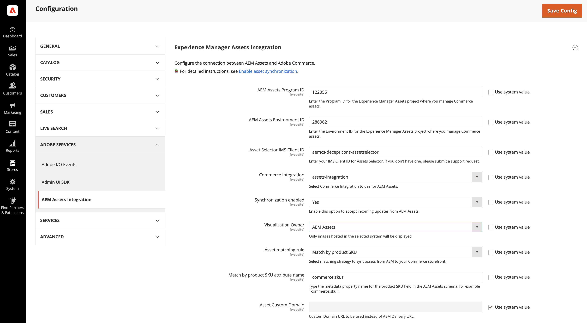
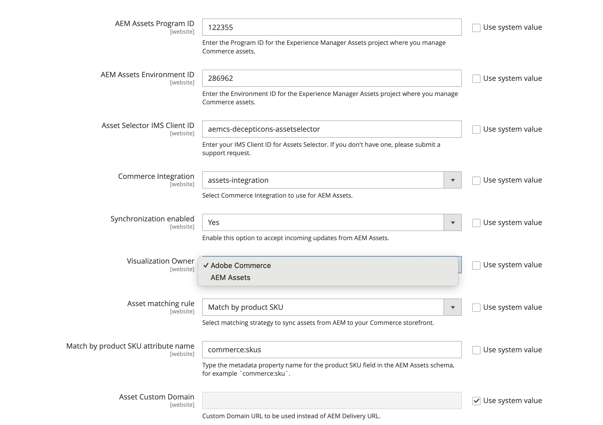

# 統合の設定

CommerceをAEM Assets インスタンスに接続し、アセットの同期に一致する方法を選択して、統合を設定します。

AEM Assets プロジェクトを特定したら、Adobe CommerceとAEM Assets間でアセットを同期するための一致するルールを選択します。

* **[!UICONTROL Match by product SKU]** - アセットが正しい商品に関連付けられていることを確認するために、アセットメタデータのSKUと[Commerce商品SKU](https://experienceleague.adobe.com/en/docs/commerce-operations/implementation-playbook/glossary#sku)を一致させるデフォルトのルール。

* **[!UICONTROL Custom match]** – より複雑なシナリオまたはカスタム一致ロジックを必要とする特定のビジネス要件の一致ルール。 カスタムマッチングを実装するには、Adobe Developer App Builderでカスタムコードを開発して、アセットと商品のマッチング方法を定義する必要があります。 詳細については、近日公開予定です…

初期設定では、デフォルトの&#x200B;*製品SKU*&#x200B;による一致ルールを使用します。

## 要件定義

AEM Assets統合を設定する前に、次の手順を完了していることを確認します。

* [AEM Assets プロジェクトの設定](configure-aem.md)

* [!BADGE PaaSのみ]{type=Informative tooltip="Cloud プロジェクト上のAdobe Commerce（Adobeで管理されるPaaS インフラストラクチャ）にのみ適用されます。"} [Adobe Commerce パッケージ &#x200B;](configure-commerce.md)をインストールして拡張機能を追加し、拡張機能を使用するために必要な資格情報と接続を生成します。

* [&#x200B; ユーザー権限とIMS](permissions.md) - アセットセレクターおよび自動入力された設定フィールド（プログラム ID、環境ID、ドメインマッピング）に必要です。

## 接続の設定

1. Commerce管理者から、AEM Assets統合設定を開きます。

   1. **[!UICONTROL Store]** / 設定/ **[!UICONTROL ADOBE SERVICES]** / **[!UICONTROL AEM Assets Integration]**&#x200B;に移動します。

      {width="600" zoomable="yes"}

>[!INFO]
>
> AEM Assets統合では、グローバル（デフォルト）スコープでの設定のみがサポートされます。 Web サイトレベルの設定はサポートされていません。 Web サイトレベルで統合を設定しようとすると、システムはweb サイトレベルの設定を無視し、代わりにグローバル設定値を使用します。

1. [!BADGE PaaSのみ]{type=Informative tooltip="Cloud プロジェクト上のAdobe Commerce（Adobeで管理されるPaaS インフラストラクチャ）にのみ適用されます。"} 「**[!UICONTROL Asset Selector IMS Client ID]**」を入力します。

   このIDは、プログラム IDおよび環境ID フィールドのアセットセレクターおよび自動入力機能を有効にするために必要です。 このIDを取得するには、[&#x200B; ユーザー権限とIMS](permissions.md)を参照してください。 アセットセレクターについて詳しくは、[&#x200B; アセットの手動選択](../synchronize/asset-selector-integration.md)を参照してください。

1. ドロップダウンメニューからAEM Assets環境&#x200B;**[!UICONTROL Program ID]**&#x200B;と&#x200B;**[!UICONTROL Environment ID]**&#x200B;を選択します。

   ドロップダウンは、ユーザーのIMS セッションに基づいて自動入力されます。 この機能を使用するには、適切な[&#x200B; ユーザー権限とIMS](permissions.md#user-permissions-and-ims)を持っていることを確認してください。

   ドロップダウンが使用できない場合は、AEM Cloud Manager URLからIDを手動で入力できます：`https://author-p[Program ID]-e[EnvironmentID].adobeaemcloud.com/`

   *[!UICONTROL Use system value]*&#x200B;から選択範囲を削除して、設定値を編集します。

1. [!BADGE PaaSのみ]{type=Informative tooltip="Cloud プロジェクト上のAdobe Commerce（Adobeで管理されるPaaS インフラストラクチャ）にのみ適用されます。"} Commerceとアセットマッチングサービス間のリクエストを認証する[[!UICONTROL Commerce integration]](configure-commerce.md#add-the-integration-to-the-commerce-environment)を選択します。

1. **[!UICONTROL Synchronization enabled]**&#x200B;を`Yes`に設定して、CommerceがAEM Assetsからの受信アップデートを受け入れるようにします。

   統合を有効にすると、アセットの一致条件を指定するための追加の設定オプションが使用できるようになります。

1. **[!UICONTROL Asset matching rule]** ドロップダウンから、アセット同期用のアセット一致ルールのいずれかを選択します。

   * **[!UICONTROL Match by SKU]** デフォルトの自動一致[の](../synchronize/default-match.md)を選択します。
   * **[!UICONTROL Custom match]** カスタム自動一致[の](../synchronize/custom-match.md)を選択します（[Adobe Developer App Builder](https://experienceleague.adobe.com/en/docs/commerce-learn/tutorials/adobe-developer-app-builder/introduction-to-app-builder)が必要です）。

1. [&#x200B; フィールド &#x200B;](configure-aem.md#define-the-metadata-profile)に、Commerce製品SKU用に定義された&#x200B;**[!UICONTROL Match by product SKU attribute name]** AEM Assets メタデータフィールド名`commerce:skus`をデフォルトで追加します。

1. **[!UICONTROL Save Config]**&#x200B;を選択して更新を適用し、アセットの同期を開始します。

   設定の更新により、最初の同期プロセスがトリガーされ、CommerceはAEM Assetsからの受信アップデートを受け入れることができます。 同期に必要な時間は、アセットの量と特定の設定によって異なります。 統合では、自動化されたプロセスを活用して、同期に必要な時間を最小限に抑えます。

### Synchronization SLA

統合では、次の同期パフォーマンスレベルが保証されます。

* `< 5 minutes for 99% of updates`

* `< 30 minutes for 99.9% of updates`

これにより、製品ページに常に最新の画像が表示され、ストアフロントコンテンツが正確で視覚的に魅力的なものになります。

### ビジュアライゼーション所有者の設定

**ビジュアライゼーション所有者**&#x200B;の設定により、統合で製品イメージを提供するシステムが決まります。

* Adobe Commerce - Commerceでホストされている画像を使用します。

* AEM Assets - AEMから同期された画像を使用します。

管理者はその所有者の利用可能な画像を表示し、残りの画像はグレー表示され、**非表示** ラベルが付いて表示されます。

画像の表示動作について詳しくは、[画像の詳細を設定](https://experienceleague.adobe.com/en/docs/commerce-admin/catalog/products/digital-assets/product-image#set-image-details){target=_blank} トピックを参照してください。

>[!TIP]
>
> CommerceからAEM Assetsへの移行中に、**Visualization Owner**&#x200B;をCommerceに設定して、画像リンクの破損を防ぎます。 すべての製品がAEM Assetsと正常に同期されたら、AEM Assets オーナーに切り替えて移行を完了します。 これにより、プロセス全体で画像の可用性を継続的に確保できます。

1. **[!UICONTROL Store]** / 設定/ **[!UICONTROL ADOBE SERVICES]** / **[!UICONTROL AEM Assets Integration]**&#x200B;に移動します。

   {width="400" zoomable="yes"}

1. 画像を表示するには、**ビジュアライゼーション所有者** ソースを選択します。

1. **[!UICONTROL Save Config]**&#x200B;をクリックして更新を適用し、アセットの同期を開始します。

### オプション。 カスタムドメイン URLの設定

AEM Assets as a Cloud Service プロジェクトに[&#x200B; カスタムドメイン名](https://experienceleague.adobe.com/ja/docs/experience-manager-cloud-service/content/implementing/using-cloud-manager/custom-domain-names/add-custom-domain-name){target=_blank}が設定されている場合は、Commerce用のAEM Assets統合で使用できるように、Commerce ストア設定にドメイン名を追加する必要があります。

1. **[!UICONTROL Store]** / 設定/ **[!UICONTROL ADOBE SERVICES]** / **[!UICONTROL AEM Assets Integration]**&#x200B;に移動します。

   {width="700" zoomable="yes"}

1. **カスタムドメイン URL**&#x200B;を&#x200B;**[!UICONTROL Asset Custom Domain]** フィールドに追加します。

1. **[!UICONTROL Save Config]**&#x200B;をクリックして更新を適用し、アセットの同期を開始します。

## 次のステップ

* **Commerce Storefrontの設定**- Edge Delivery Servicesを搭載したCommerce StorefrontでAEM Assetsを使用するには、[Adobe Commerce Storefront ドキュメント &#x200B;](https://experienceleague.adobe.com/developer/commerce/storefront/setup/configuration/aem-assets-configuration/)の&#x200B;*AEM Assets統合* トピックで説明されているストアフロントの設定を完了します。

* Adobe CommerceとAEM Assets統合の間で[一致するルール &#x200B;](../synchronize/default-match.md)を設定します。

* [Commerce アセットの管理](../manage-assets.md)。
