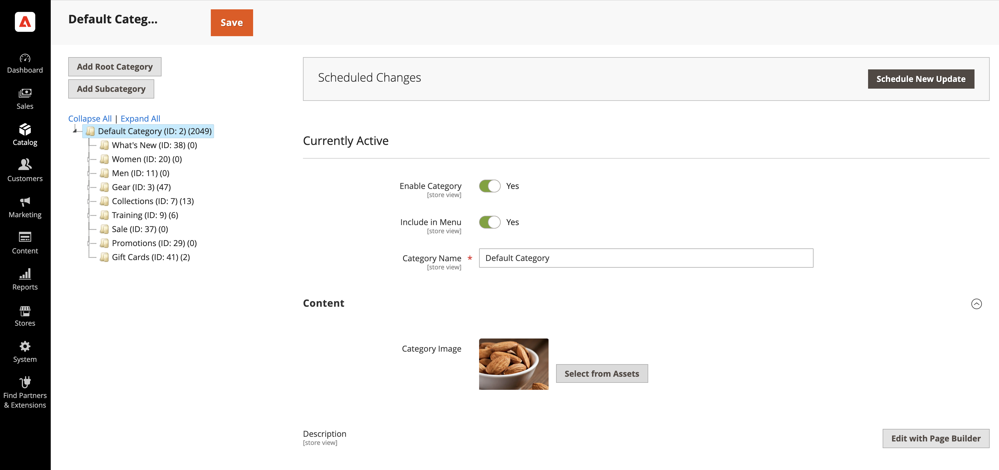

# Commerce メディアアセットの管理

<!--In ACAP-844, this topic was linked to from the Commerce Admin products images and videos when the Assets integration is enabled. If the URL to the topic changes, be sure to add a redirect.-->

CommerceのAEM Assets統合が有効になると、次のメディアタイプを管理できます。

* 製品画像
* コンテンツ画像
* 製品ビデオ
* カテゴリ画像

**製品画像を更新していますか？**

製品画像は、一致するルールを介してリンクされます。

* AEM Assetsで商品アセットを追加または更新する方法（メタデータ、SKU リンク、承認）については、[&#x200B; デフォルトの自動一致](synchronize/default-match.md)を参照してください。
* カテゴリ画像またはページビルダーのコンテンツについては、[&#x200B; アセットの手動選択](synchronize/asset-selector-integration.md)を参照してください。

## 製品画像

統合が有効になっている場合、画像管理はデジタルアセット管理システム（DAM）内で一元化されます。 Adobe Commerceは、主要なエンゲージメントチャネルとして機能し、承認済みの高品質な画像のみがストアフロントをまたいで使用されるようにします。 これにより、ブランドの一貫性を強化し、手作業を最小限に抑え、コンテンツの更新を効率化できます。これにより、Adobe Commerce内で画像を手動でアップロードおよび管理する必要がなくなります。

### Adobe Commerceで商品画像を見る

事前設定済みのマッチングルールに基づいて、製品画像がAEM Assetsから自動的に取得されます。

1. _管理者_ サイドバーで、**[!UICONTROL Catalog]** > **[!UICONTROL Products]**&#x200B;に移動します。

1. 製品を選ぶ。

1. **画像とビデオ** セクションを開きます。

   {width="600" zoomable="yes"}

   >[!NOTE]
   >
   > 画像の管理がDAMに一元化されているため、統合が有効であることを示すメッセージが&#x200B;**読み取り専用** セクションになります。

   商品アセット（画像をSKUにリンク）を設定するには、AEM Assets オーサーインスタンスを開き、メインビューから「**Assets**」をクリックします。 メタデータ設定手順については、[&#x200B; デフォルトの自動一致](synchronize/default-match.md)を参照してください。

### AEM Assetsでの商品画像の管理

商品関連の画像を管理するには、すべての変更を&#x200B;**AEM Assets**&#x200B;で直接行う必要があります。 このプロセスは完全に自動化されているため、変更を手動で行うことなく、Adobe Commerceに同期できます。

AEM Assetsでアセットを製品にリンクする方法（メタデータの設定と承認を含む）については、次のトピックを参照してください。

* [デフォルトの自動一致](synchronize/default-match.md)
* [&#x200B; カスタム自動一致](synchronize/custom-match.md)。

### 同期SLA

同期のタイミングについて詳しくは、[SLAの同期](get-started/setup-synchronization.md#synchronization-sla)のトピックを参照してください。

## コンテンツ画像

Adobe Commerceでは、Adobe Experience Manager（AEM）ツールセットを使用していないマーチャント向けに、Page Builderを&#x200B;**コンテンツ管理システム（CMS）**&#x200B;として提供しています。 コンテンツ制作を強化するために、統合では[AEM Asset Selector](synchronize/asset-selector-integration.md)を活用しています。これにより、マーケターは&#x200B;**DAM**&#x200B;から直接、画像にシームレスにアクセスして埋め込むことができます。 これにより、コンテンツ制作では承認済みの高品質な画像のみが使用されるため、Adobe Commerceで冗長なストレージを使用する必要がなくなります。

### ページビルダーでのAEM Asset Selectorの使用

[!BADGE PaaSのみ]{type=Informative tooltip="Cloud プロジェクト上のAdobe Commerce（Adobeで管理されるPaaS インフラストラクチャ）にのみ適用されます。"}画像の埋め込みに&#x200B;**AEM Asset Selector**&#x200B;を使用するには、ユーザーに必要な[権限とIMS認証](get-started/permissions.md)が付与されていることを確認してください。

1. **ページビルダー**&#x200B;を使用して`content enrichment`をサポートしている&#x200B;**Adobe Commerce管理者**&#x200B;の任意のセクションに移動します。

1. [&#x200B; ページビルダー](https://developer.adobe.com/commerce/frontend-core/page-builder/){target=_blank}を開きます。

   **AEM Asset**&#x200B;という新しいメディアタイプが使用可能になります。

1. AEM Asset メディアタイプをコンテンツブロックにドラッグ&amp;ドロップします。

1. プロンプトが表示されたら、DAMにアクセスするための資格情報を入力します。

1. DAMから画像を選択し、コンテンツに直接挿入します。

選択した画像への関連付けは、**Dynamic Media**&#x200B;を指すダイレクト URLとしてAdobe Commerceに保存され、次のことを確実に行います。

* 画像ファイルは、Adobe Commerceに保存する必要はありません。

* マーケターは、DAMで承認されたアセットのみと連携して作業できます。

* コンテンツは、あらゆる顧客接点をまたいで、一貫性のある最新の状態に保たれます。

>[!TIP]
>
> [DA.live （ドキュメントオーサリング） &#x200B;](https://experienceleague.adobe.com/developer/commerce/storefront/merchants/storefront-builder/?lang=ja#dalive-document-authoring){target=_blank}には、データを強化するためのアセットセレクターも用意されています。

## 製品ビデオ

Adobe Commerceは、デジタルアセットの重要なエンゲージメントチャネルとしての役割を果たします。 AEM Assetsとの連携が有効になると、動画管理は&#x200B;**DAM**&#x200B;内で一元化され、コマースのストアフロント全体で一貫性とコンプライアンスを確保し、配信を最適化できます。

### 製品ビデオの管理

1. _管理者_ サイドバーで、**[!UICONTROL Catalog]** > **[!UICONTROL Products]**&#x200B;に移動します。

1. 製品を選ぶ。

1. **画像とビデオ** セクションを開きます。

   {width="600" zoomable="yes"}

   >[!NOTE]
   >
   > ビデオがAEM Assetsで制御されているため、統合が有効になっており、このセクションが&#x200B;**読み取り専用**&#x200B;であることを示すメッセージが表示されます。

### AEM Assetsでのビデオの関連付け

1. AEM Assetsで、商品に関連付けるビデオに移動します。

1. Adobe Commerceの1つ以上の商品にビデオをリンクします。

1. 統合により、関連付けが自動的に同期され、Dynamic Media ビデオプレーヤーがストアフロントに直接表示されます。 これにより、マーチャントはビデオ再生設定を管理する必要がなくなります。

### API ファーストのビデオのみサポート

現在、統合ではAPI経由でビデオをサポートしており、パートナーはプログラムでビデオを取得できます。

>[!WARNING]
>
> デフォルトでは、ビデオは既存のAdobe Commerce ストアフロントソリューションにまだ統合されていません。

この統合により、AEM AssetsとDynamic Mediaを活用して、シームレスな配信を実現し、商品ビデオを大規模かつ最適化された方法で簡単に管理できるようになります。

### 同期SLA

同期のタイミングについて詳しくは、[SLAの同期](get-started/setup-synchronization.md#synchronization-sla)のトピックを参照してください。

## カテゴリ画像

Adobe Commerceを活用すると、画像を商品カテゴリーに関連付けて、視覚的に魅力的なストアフロントを構築することができます。 AEM Assetsとの統合では、AEM Asset Selectorを活用します。これにより、マーケターは&#x200B;**デジタルアセット管理システム（DAM）**&#x200B;から直接アセットをシームレスに選択できます。 これにより、承認済みの画像のみを使用し、Adobe Commerceに保存する必要がなくなり、あらゆるエンゲージメントチャネルをまたいで一貫性と効率性を維持できます。

### AEM Asset Selectorをカテゴリ画像に使用する

[AEM Asset Selector](synchronize/asset-selector-integration.md)を設定し、ユーザーに必要な[権限とIMS認証](get-started/permissions.md)を付与したら、それを使用してアセットをカタログカテゴリのコンテンツに追加できます。

1. _管理者_ サイドバーで、**[!UICONTROL Catalog]** > **[!UICONTROL Categories]**&#x200B;に移動します。

1. 更新するカテゴリを選択します。

1. **[!UICONTROL Content]** セクションのを展開します。

1. **[!UICONTROL Content]** セクションで、カテゴリに関連付けられている&#x200B;*画像フィールド*&#x200B;を見つけます。

   {width="600" zoomable="yes"}

1. 「**[!UICONTROL Select from Assets]**」をクリックして、カテゴリ画像を変更します。

   {width="600" zoomable="yes"}

1. AEM アセットセレクターから画像を選択します。

   {width="600" zoomable="yes"}

1. **[!UICONTROL Save]**&#x200B;をクリックして続行します。

   カテゴリの作成について詳しくは、**Commerce カタログ管理ガイド**&#x200B;の「[&#x200B; カテゴリの内容](https://experienceleague.adobe.com/ja/docs/commerce-admin/catalog/categories/create/category-create#step-3-complete-the-category-content)を完了する」を参照してください。

## アセットの更新

AEM Assetsでアセットを更新および承認すると、自動一致を使用して更新がAdobe Commerceに自動的に送信されます。 このプロセスは、アセットの承認時にトリガーされます。 最終的な変更とメタデータの更新がすべて含まれていることを確認するには、承認する前にアセットを再処理する必要があります。

メタデータを介してアセットを製品にリンクするCommerce側のワークフローについては、[&#x200B; デフォルトの自動一致](synchronize/default-match.md)のトピックを参照してください。

AEM Assetsの手順については、次のドキュメントを参照してください。

* [デジタルアセットの再処理](https://experienceleague.adobe.com/ja/docs/experience-manager-cloud-service/content/assets/manage/reprocessing)

* [アセットの承認](https://experienceleague.adobe.com/ja/docs/experience-manager-cloud-service/content/assets/dynamicmedia/dynamic-media-open-apis/approve-assets)
