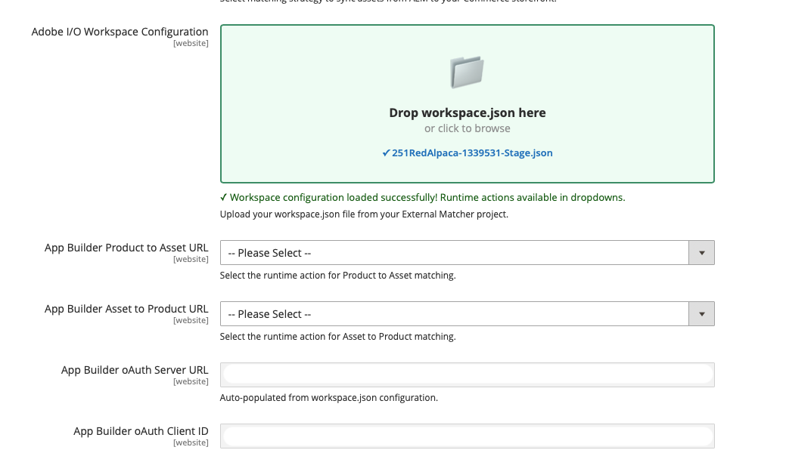

# カスタム自動一致

デフォルトの自動一致の戦略（**OOTB自動一致**）が特定のビジネス要件に一致しない場合は、「カスタム一致」オプションを選択します。 このオプションでは、[Adobe Developer App Builder](https://experienceleague.adobe.com/en/docs/commerce-learn/tutorials/adobe-developer-app-builder/introduction-to-app-builder)を使用して、複雑なマッチングロジックを処理するカスタムマッチャーアプリケーションや、メタデータをAEM Assetsに入力できないサードパーティシステムからのアセットを開発できます。

## カスタム自動マッチングの設定

1. Commerce管理者から、**[!UICONTROL Store]** / 設定/ **[!UICONTROL ADOBE SERVICES]** / **[!UICONTROL AEM Assets Integration]**&#x200B;に移動します。

1. 一致するルールとして&#x200B;**[!UICONTROL Custom Matcher]**&#x200B;を選択します。

1. この一致するルールを選択すると、管理者は、カスタムマッチングロジックに必要な&#x200B;**エンドポイント**&#x200B;と&#x200B;**認証パラメーター**&#x200B;を設定するための追加フィールドを表示します。

### workspace.json

**[!UICONTROL Adobe I/O Workspace Configuration]** フィールドでは、App Builder `workspace.json`設定ファイルを読み込むことで、カスタムマッチャーを効率的に設定できます。

`workspace.json` ファイルは、[Adobe Developer Console](https://developer.adobe.com/console)からダウンロードできます。 このファイルには、App Builder ワークスペースのすべての資格情報と設定の詳細が含まれています。

+++例`workspace.json`

```json
{
  "project": {
    "id": "project_id",
    "name": "project_name",
    "title": "title_name",
    "org": {
      "id": "id",
      "name": "Organization_name",
      "ims_org_id": "ims_id"
    },
    "workspace": {
      "id": "workspace_id",
      "name": "workspace_name_id",
      "title": "workspace_title_id",
      "action_url": "https://action_url.net",
      "app_url": "https://app_url.net",
      "details": {
        "credentials": [
          {
            "id": "credential_id",
            "name": "credential_name_id",
            "integration_type": "oauth_server_to_server",
            "oauth_server_to_server": {
              "client_id": "client_id",
              "client_secrets": ["secret"],
              "technical_account_email": "xx@technical_account_email.com",
              "technical_account_id": "technical_account_id",
              "scopes": [
                "AdobeID",
                "openid",
                "read_organizations",
                "additional_info.projectedProductContext",
                "additional_info.roles",
                "adobeio_api",
                "read_client_secret",
                "manage_client_secrets"
              ]
            }
          }
        ],
        "services": [
          {
            "code": "AdobeIOManagementAPISDK",
            "name": "I/O Management API"
          }
        ],
        "runtime": {
          "namespaces": [
            {
              "name": "namespace_name",
              "auth": "example_auth"
            }
          ]
        },
        "events": {
          "registrations": []
        },
        "mesh": {}
      }
    }
  }
}
```

+++

1. App Builder プロジェクトから`workspace.json` ファイルを&#x200B;**[!UICONTROL Adobe I/O Workspace Configuration]** フィールドにドラッグ&amp;ドロップします。 または、をクリックしてファイルを参照し、選択することもできます。

{width="600" zoomable="yes"}

1. システムは自動的に：

   * JSON構造を検証します
   * OAuth資格情報を抽出して入力します
   * ワークスペースで使用可能なランタイムアクションを取得します
   * **[!UICONTROL Product to Asset URL]**&#x200B;および&#x200B;**[!UICONTROL Asset to Product URL]** フィールドのドロップダウンオプションを入力します

1. 各フローのドロップダウンメニューから適切なランタイムアクションを選択します。

1. **[!UICONTROL Save Config]**&#x200B;をクリックします。

## カスタムマッチャーAPI エンドポイント

[App Builder](https://experienceleague.adobe.com/en/docs/commerce-learn/tutorials/adobe-developer-app-builder/introduction-to-app-builder){target=_blank}を使用してカスタムマッチャーアプリケーションを構築する場合、アプリケーションは次のエンドポイントを公開する必要があります。

* **App Builder アセットから商品URL** エンドポイント
* **App Builder製品からアセット URL** エンドポイント

### App Builderアセットから商品URLへのエンドポイント

このエンドポイントは、特定のアセットに関連付けられているSKUのリストを取得します。

#### 使用例

```javascript
const { Core } = require('@adobe/aio-sdk')

async function main(params) {

    // Build your own matching logic here to return the products that map to the assetId
    // var productMatches = [];
    // params.assetId
    // params.eventData.assetMetadata['commerce:isCommerce']
    // params.eventData.assetMetadata['commerce:skus'][i]
    // params.eventData.assetMetadata['commerce:roles']
    // params.eventData.assetMetadata['commerce:positions'][i]
    // ...
    // End of your matching logic

    // Set skip to true if the mapping hasn't changed
    const skipSync = false;

    return {
        statusCode: 200,
        body: {
            asset_id: params.assetId,
            product_matches: [
                {
                    product_sku: "<YOUR-SKU-HERE>",
                    asset_roles: ["thumbnail", "image", "swatch_image", "small_image"],
                    asset_position: 1
                }
            ],
            skip: skipSync
        }
    };
}

exports.main = main;
```

**リクエスト**

```text
POST https://your-app-builder-url/api/v1/web/app-builder-external-rule/asset-to-product
```

| パラメーター | データタイプ | 説明 |
| --- | --- | --- |
| `assetId` | 文字列 | 更新されたアセット IDを表します。 |
| `eventData` | オブジェクト | アセットに関連付けられたイベントペイロード（たとえば、マッチャーが`eventData.assetMetadata`から読み取るアセットメタデータ）。 |

**応答**

```json
{
  "asset_id": "{ASSET_ID}",
  "product_matches": [
    {
      "product_sku": "{PRODUCT_SKU_1}",
      "asset_roles": ["thumbnail", "image"]
    },
    {
      "product_sku": "{PRODUCT_SKU_2}",
      "asset_roles": ["thumbnail"]
    }
  ],
  "skip": false
}
```

| パラメーター | データタイプ | 説明 |
| --- | --- | --- |
| `asset_id` | 文字列 | 一致するアセット ID。 |
| `product_matches` | 配列 | アセットに関連付けられている製品のリスト。 |
| `skip` | ブーリアン | （オプション） `true`の場合、ルールエンジンはこのアセットの同期をスキップします（製品マッピングの更新はありません）。 `false`または省略すると、通常の処理が実行されます。 [同期処理をスキップ ](#skip-sync-processing)を参照してください。 |

### App Builderの商品からアセットへのURL エンドポイント

このエンドポイントは、特定のSKUに関連付けられているアセットのリストを取得します。

#### 使用例

```javascript
const { Core } = require('@adobe/aio-sdk')

async function main(params) {
    // return asset matches for a product
    // Build your own matching logic here to return the assets that map to the productSku
    // var assetMatches = [];
    // params.productSku
    // ...
    // End of your matching logic

    // Set skip to true if the mapping hasn't changed
    const skipSync = false;

    return {
        statusCode: 200,
        body: {
            product_sku: params.productSku,
            asset_matches: [
                {
                    asset_id: "<YOUR-ASSET-ID-HERE>", // urn:aaid:aem:1aa1d5i2-17h8-40a7-a228-e3ur588deee1
                    asset_roles: ["thumbnail", "image", "swatch_image", "small_image"],
                    asset_format: "image", // can be "image" or "video"
                    asset_position: 1
                }
            ],
            skip: skipSync
        }
    };
}

exports.main = main;
```

**リクエスト**

```text
POST https://your-app-builder-url/api/v1/web/app-builder-external-rule/product-to-asset
```

| パラメーター | データタイプ | 説明 |
| --- | --- | --- |
| `productSku` | 文字列 | 更新された製品SKUを表します。 |
| `eventData` | オブジェクト | 製品に関連付けられたイベントペイロード（たとえば、マッチャーが受信イベントから使用するフィールド）。 |

**応答**

```json
{
  "product_sku": "{PRODUCT_SKU}",
  "asset_matches": [
    {
      "asset_id": "{ASSET_ID_1}",
      "asset_roles": ["thumbnail", "image"],
      "asset_position": 1,
      "asset_format": "image"
    },
    {
      "asset_id": "{ASSET_ID_2}",
      "asset_roles": ["thumbnail"],
      "asset_position": 2,
      "asset_format": "image"
    }
  ],
  "skip": false
}
```

| パラメーター | データタイプ | 説明 |
| --- | --- | --- |
| `product_sku` | 文字列 | 製品SKUが一致しています。 |
| `asset_matches` | 配列 | 製品に関連付けられているアセットのリスト。 |
| `skip` | ブーリアン | （オプション） `true`の場合、ルールエンジンはこの製品の同期をスキップします（アセットマッピングの更新はありません）。 `false`または省略すると、通常の処理が実行されます。 [同期処理をスキップ ](#skip-sync-processing)を参照してください。 |

`asset_matches` パラメーターには、次の属性が含まれています。

| 属性 | データタイプ | 説明 |
| --- | --- | --- |
| `asset_id` | 文字列 | アセット ID。 |
| `asset_roles` | 配列 | アセットの役割： [、](https://experienceleague.adobe.com/en/docs/commerce-admin/catalog/products/digital-assets/product-image#image-roles)、`thumbnail`、`image`など、サポートされている`small_image`Commerce アセットの役割`swatch_image`を使用します。 |
| `asset_format` | 文字列 | アセットの形式です。 指定できる値は`image`と`video`です。 |
| `asset_position` | 数値 | 製品ギャラリー内のアセットの位置。 |

## 同期処理をスキップ

`skip` パラメーターを使用すると、カスタムマッチャーで特定のアセットまたは製品の同期処理をバイパスできます。

App Builder アプリケーションが応答で`"skip": true`を返す場合、ルールエンジンは、そのアセットまたは商品に対するAPI リクエストをCommerceに送信または削除しません。 この最適化により、不要なAPI呼び出しが減り、パフォーマンスが向上します。
