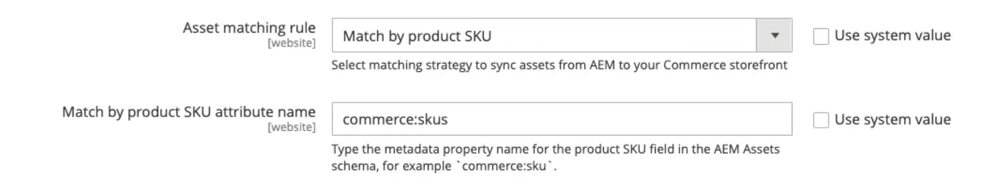
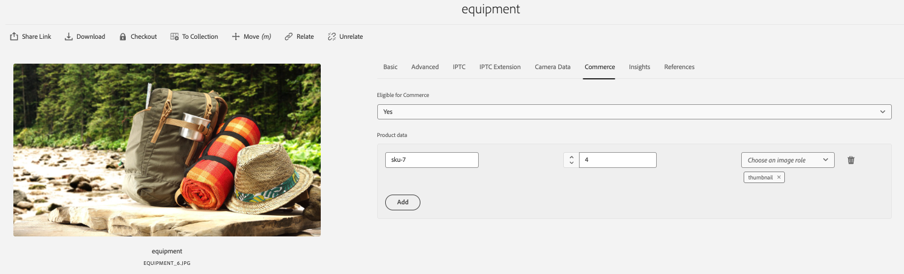
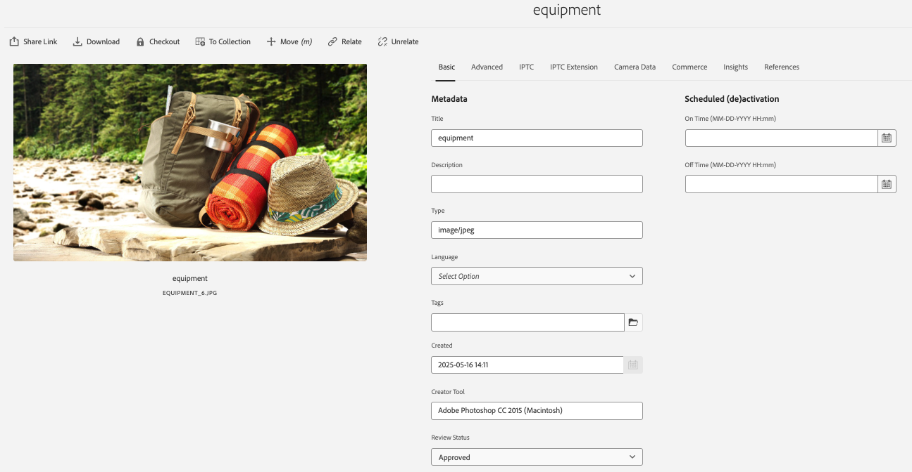

# デフォルトの自動一致

CommerceのAEM Assets統合では、**AEM Assets** メタデータ設定に基づいて、デフォルトの自動一致メカニズム（**[!UICONTROL Match by product SKU]**）が提供されます。 このルールにより、**Adobe Commerce**&#x200B;と&#x200B;**AEM Assets**&#x200B;の間でシームレスに同期が可能になり、アセットが正しいマーチャンダイジングエンティティに自動的にリンクされるようになります。

## 自動マッチングメカニズムの設定

1. Commerce管理者から、**[!UICONTROL Store]** / 設定/ **[!UICONTROL ADOBE SERVICES]** / **[!UICONTROL AEM Assets Integration]**&#x200B;に移動します。

1. 一致するルールとして&#x200B;**[!UICONTROL Match by SKU]**&#x200B;を指定します。

   {width="600" zoomable="yes"}

1. AEM Assetsでアセット識別に使用するメタデータフィールド名を入力します。

   >[!NOTE]
   >
   > 標準オンボーディングプロセスに従った場合、この値は`commerce:skus`に設定する必要があります。

## 自動マッチングメカニズムの仕組み

Commerce Adminで&#x200B;**[!UICONTROL Match by product SKU]**&#x200B;一致ルールが設定されている場合、Commerce アセットファイルは、各ファイルに設定されたアセットメタデータに基づいて、AEM AssetsからCommerce プロジェクトに自動的に同期されます。 メタデータは、**AEM Assets author**&#x200B;環境の「**Commerce**」タブから設定します。

1. AEM Assets オーサーインスタンスを開きます（URLは、Adobe Commerceと同じIMS組織内のプロジェクトにプロビジョニングされます）。

1. メインのナビゲーション画面から、**Assets**&#x200B;をクリックして、デジタルアセット管理（DAM）インターフェイスにアクセスします。

1. AEM Assetsで、`Eligible for Commerce` フィールドを`Yes`に設定して、画像メタデータを更新し、Adobe Commerceの関連付けを追加します。

   {width="600" zoomable="yes"}

1. アセットを関連付けられた製品SKUにリンクするメタデータ （[!UICONTROL SKU]、[!UICONTROL position]、および[!UICONTROL role]）を設定します。

   >[!NOTE]
   >
   > 1つのアセットが複数の製品に使用されている場合は、関連付けられた各SKUのメタデータを設定します。

1. 「`Basic`」タブで、_[!UICONTROL Review Status]_フィールドのデフォルト値を`approved`に設定します。

   {width="600" zoomable="yes"}

このアプローチにより、デジタルアセットがAdobe Commerceで適切にリンクされ、表示されるようになります。 また、マーチャンダイジング担当者やマーケターは、Adobe AEM Assets内で直接、役割やアセットのポジショニングを管理できるようになり、あらゆるエンゲージメントチャネルにおける画像の選択と順序付けの一貫性のある一元化されたメカニズムを提供します。
