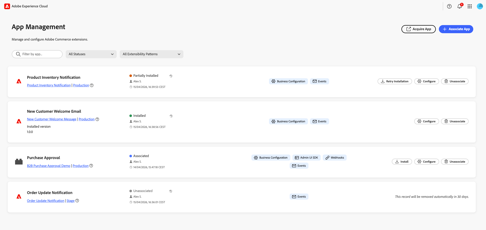

# [!DNL App Management] の概要

Adobe Commerceの[!DNL App Management]は、コマース環境全体でアプリケーションを検出、インストール、設定、操作する方法を簡素化します。 運用上の摩擦を軽減しながら、企業が拡張性を安全かつ効率的に導入できるようにする統合フレームワークを提供します。

{width="500" zoomable="yes"}

**アプリマネージャー**&#x200B;の場合、[!DNL App Management]は、インストールされているすべてのアプリケーションを一元的に表示し、ガバナンス、ライフサイクル管理、運用監視を容易にします。 ビジネスオペレーターやテクニカルオペレーターは、インストールフローの簡素化、設定手順の自動化、アプリのステータスや権限の明確な可視化により、深いエンジニアの関与を必要とせずに、自信を持って統合を管理することができます。

**App Developers**&#x200B;の場合、[!DNL App Management]は、宣言型アプリマニフェストを使用してアプリケーションをパッケージ化および配布するための標準化された方法を導入します。 開発者は、設定、イベントのサブスクリプション、権限、インストール後のステップを一元的に定義でき、マーチャント環境内でアプリケーションが自動的にインストールと設定を行うことができます。 これにより、統合の手間が軽減され、デプロイメントの信頼性が向上し、開発者はインストールの複雑さを管理するのではなく、ビジネス価値を提供することに注力できるようになります。

これらの機能を組み合わせることで、拡張性の高い拡張性モデルを構築でき、マーチャントは新機能をより迅速に導入でき、開発者には予測可能で合理化されたアプリケーションライフサイクルを提供できるようになります。

## [!DNL App Management]が提供するもの

* **すべてのアプリに対して1か所**。 **[!UICONTROL Apps]** > **[!UICONTROL App Management]**&#x200B;からアプリを関連付け、設定、管理します。 [同じビューからアプリを検索、フィルタリング、取得](manage-app.md)します。
* ビジネスに一致する&#x200B;**設定**。 複数の地域またはマルチブランドの設定のために、web サイト、ストア、ストアビューごとに異なる設定を適用します。
* **自動ストア同期**。 Commerceのweb サイト、ストアビュー、ストアビューは、アプリを関連付けるときに読み込まれます。
* **ネイティブ管理エクスペリエンス**。 Commerceから離れることなく、Adobe Exchangeのアプリやカスタムデプロイメントで作業できます。

## 誰が[!DNL App Management]を使用しますか？

| 役割 | ユースケース |
|------|----------|
| **アプリ マネージャー** | Commerce インスタンス全体でアプリを関連付け、設定を設定し、アプリを管理します。 |
| **Commerce管理者** | 組織全体でアプリの設定と権限を管理できます。 |
| **テクニカルアーキテクト** | アプリがマルチストアまたはマルチリージョンのデプロイメント用に正しく設定されていることを確認します。 |

## 自分ができること

* **アプリを関連付ける**。 プロジェクトとワークスペースを選択して、App Builder アプリケーションをCommerce インスタンスにリンクします。
* **設定を構成**。 自動生成フォームでアプリの設定を調整し、必要に応じてストアや地域ごとに値を上書きできます。
* **スコープの管理**。 ストア階層をアプリと同期させ、適切なレベルで設定を適用します。
* **アプリの関連付けを解除**。 統合の廃止またはテスト設定のクリーンアップ時にアプリを削除します。

## 次のステップ

* [&#x200B; インストール &#x200B;](install.md)。 前提条件が満たされていることを確認し、[!DNL App Management]にアクセスします。
* [&#x200B; アプリを管理](manage-app.md)。 アプリの関連付け、設定、関連付けを解除します。

## 開発者向け

Adobe Commerce用のApp Builder アプリケーションを構築する場合は、設定スキーマ、ランタイムアクション、開発者セットアップについて、[Commerce拡張機能 [!DNL App Management]](https://developer.adobe.com/commerce/extensibility/app-management/){target="_blank"}のドキュメントを参照してください。
