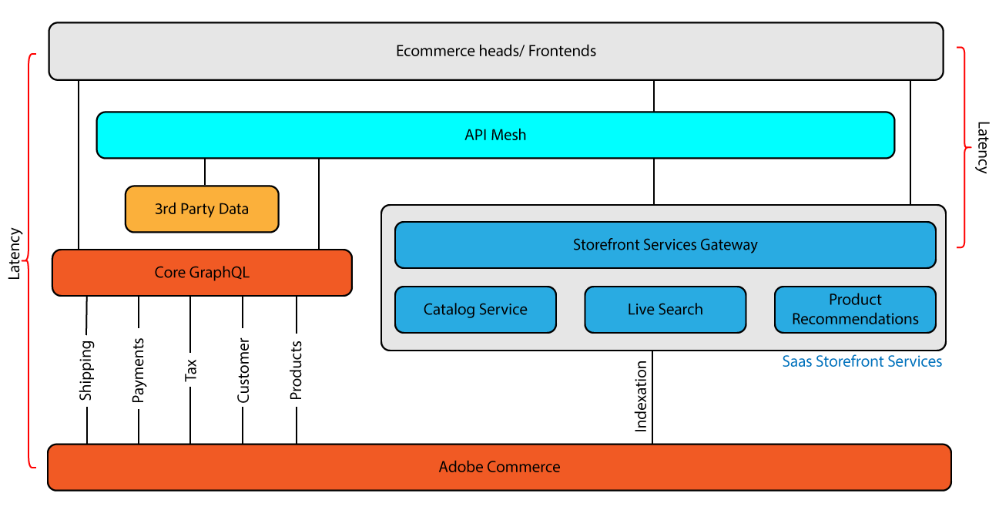

# [!DNL Catalog Service and API Mesh]

Adobe Developer App Builder向け[API Mesh](https://developer.adobe.com/graphql-mesh-gateway/gateway/overview/)を使用すると、開発者はAdobe I/O Runtimeを使用して、プライベートまたはサードパーティのAPIやその他のインターフェイスをAdobe製品と統合できます。



カタログサービスでAPI Meshを使用するには、API Meshをインスタンスに接続し、カタログサービスに接続するための設定を提供するAPI Mesh ソース [CommerceCatalogServiceGraph](https://github.com/adobe/api-mesh-sources/blob/main/connectors/)を追加する必要があります。

## API Meshを接続して設定します。

1. Adobe Commerce インスタンスにAPI Meshを接続するには、_API Mesh開発者ガイド_&#x200B;の[Create a Mesh](https://developer.adobe.com/graphql-mesh-gateway/gateway/create-mesh/)の手順に従います。

   API Meshを初めて使用する場合は、メッシュを作成する前に、[はじめにプロセス &#x200B;](https://developer.adobe.com/graphql-mesh-gateway/mesh/basic/)を完了してください。

1. 次の形式を使用して、プロジェクトのカタログサービス API キーを含む`variables.json`などのJSON ファイルを作成します。

   ```json
   {
       "CATALOG_SERVICE_API_KEY":"your_api_key"
   }
   ```

1. [Adobe I/O拡張可能CLI](https://developer.adobe.com/graphql-mesh-gateway/mesh/basic/#install-the-aio-cli)を使用して、メッシュに`CommerceCatalogServiceGraph` ソースを追加します。

   ```bash
   aio api-mesh source install "CommerceCatalogServiceGraph" -f variables.json
   ```

   `-f variables.json` オプションは、設定の更新に必要なカタログサービス API キー値を提供します。

このコマンドを実行した後、カタログサービスはAPI メッシュを通じて実行される必要があります。 更新したメッシュの設定を表示するには、`aio api-mesh get` コマンドを使用します。

## API メッシュの例

API Meshを使用すると、ユーザーは外部データソースを使用して、Adobe Commerce インスタンスを強化できます。 また、既存のCommerce データを設定して、新しい機能を有効にするためにも使用できます。

### 階層の価格の有効化

この例では、API Meshを使用して、Adobe Commerceでティア価格を有効にします。
`name`、`endpoint`、`x-api-key`の値を置き換えます。

```json
{
  "meshConfig": {
    "sources": [
      {
        "name": "<Commerce Instance Name>",
        "handler": {
          "graphql": {
            "endpoint": "<Adobe Commerce GraphQL endpoint>"
          }
        },
        "transforms": [
            {
                "prefix": {
                    "includeRootOperations": true,
                    "value": "Core_"
                }
            }
        ]
      },
      {
        "name": "CommerceCatalogServiceGraph",
        "handler": {
          "graphql": {
            "endpoint": "https://commerce.adobe.io/catalog-service/graphql/",
            "operationHeaders": {
              "Magento-Store-View-Code": "{context.headers['magento-store-view-code']}",
              "Magento-Website-Code": "{context.headers['magento-website-code']}",
              "Magento-Store-Code": "{context.headers['magento-store-code']}",
              "Magento-Environment-Id": "{context.headers['magento-environment-id']}",
              "Magento-Customer-Group": "{context.headers['magento-customer-group']}"
            },
            "schemaHeaders": {
              "x-api-key": "<YOUR API-KEY>"
            }
          }
        }
      }
    ],
    "additionalTypeDefs": "extend interface ProductView {\n  price_tiers: [Core_TierPrice]\n}\n extend type SimpleProductView {\n  price_tiers: [Core_TierPrice]\n}\n extend type ComplexProductView {\n  price_tiers: [Core_TierPrice]\n}\n",
    "additionalResolvers": [
        {  
            "targetTypeName": "ProductView",
            "targetFieldName": "price_tiers",
            "sourceName": "MagentoStageCore",
            "sourceTypeName": "Query",
            "sourceFieldName": "Core_products",
            "requiredSelectionSet": "{\n    items {\n  sku\n    price_tiers {\n        quantity,\n        final_price {\n          value\n          currency\n        }\n      }\n    }\n  }",
            "sourceArgs": {
                "filter.sku.eq": "{root.sku}"
            },
            "result": "items[0].price_tiers"
        },
        {  
            "targetTypeName": "SimpleProductView",
            "targetFieldName": "price_tiers",
            "sourceName": "MagentoStageCore",
            "sourceTypeName": "Query",
            "sourceFieldName": "Core_products",
            "requiredSelectionSet": "{\n    items {\n  sku\n    price_tiers {\n        quantity,\n        final_price {\n          value\n          currency\n        }\n      }\n    }\n  }",
            "sourceArgs": {
                "filter.sku.eq": "{root.sku}"
            },
            "result": "items[0].price_tiers"
        },
        {  
            "targetTypeName": "ComplexProductView",
            "targetFieldName": "price_tiers",
            "sourceName": "MagentoStageCore",
            "sourceTypeName": "Query",
            "sourceFieldName": "Core_products",
            "requiredSelectionSet": "{\n    items {\n  sku\n    price_tiers {\n        quantity,\n        final_price {\n          value\n          currency\n        }\n      }\n    }\n  }",
            "sourceArgs": {
                "filter.sku.eq": "{root.sku}"
            },
            "result": "items[0].price_tiers"
        }
    ]
   }
}
```

設定が完了したら、メッシュに対して階層価格のクエリを実行します。

```graphql
query {
  products(skus: ["24-MB04"]) {
    sku
    description
    price_tiers {
        quantity
        final_price {
          value
          currency
        }
      }
    ... on SimpleProductView {
      id
       
      price {
        final {
          amount {
            value
          }
        }
      }
    }
  }
}
```

### エンティティ IDを取得

このメッシュは、ProductView インターフェイスに`entityId`を追加します。 `name`、`endpoint`、`x-api-key`の値を置き換えます。

```json
{
    "meshConfig": {
      "sources": [
        {
          "name": "<Commerce Instance Name>",
          "handler": {
            "graphql": {
              "endpoint": "<Adobe Commerce GraphQL endpoint>"
            }
          },
          "transforms": [
              {
                  "prefix": {
                      "includeRootOperations": true,
                        "value": "Core_"
                  }
              }
          ]
        },
        {
          "name": "CommerceCatalogServiceGraph",
          "handler": {
            "graphql": {
              "endpoint": "https://catalog-service.adobe.io/graphql",
              "operationHeaders": {
                "Magento-Store-View-Code": "{context.headers['magento-store-view-code']}",
                "Magento-Website-Code": "{context.headers['magento-website-code']}",
                "Magento-Store-Code": "{context.headers['magento-store-code']}",
                "Magento-Environment-Id": "{context.headers['magento-environment-id']}",
                "x-api-key": "<YOUR_CATALOG_SERVICE_API_KEY>",
                "Magento-Customer-Group": "{context.headers['magento-customer-group']}"
              },
              "schemaHeaders": {
                "x-api-key": "<YOUR_CATALOG_SERVICE_API_KEY>"
              }
            }
          }
        }
      ],
      "additionalTypeDefs": "extend interface ProductView {\n  entityId: String\n}\n extend type SimpleProductView {\n  entityId: String\n}\n extend type ComplexProductView {\n  entityId: String\n}\n",
      "additionalResolvers": [
        {  
            "targetTypeName": "ComplexProductView",
            "targetFieldName": "entityId",
            "sourceName": "MagentoCore",
            "sourceTypeName": "Query",
            "sourceFieldName": "Core_products",
            "requiredSelectionSet": "{ sku\n }",
            "sourceSelectionSet": "{\n    items {\n  sku\n uid\n  }\n    }",
            "sourceArgs": {
                "filter.sku.eq": "{root.sku}"
            },
            "result": "items[0].uid",
            "resultType": "String"
          },
          {
            "targetTypeName": "SimpleProductView",
            "targetFieldName": "entityId",
            "sourceName": "MagentoCore",
            "sourceTypeName": "Query",
            "sourceFieldName": "Core_products",
            "requiredSelectionSet": "{ sku\n }",
            "sourceSelectionSet": "{\n items {\n  sku\n uid\n }}",
            "sourceArgs": {
                "filter.sku.eq": "{root.sku}"
            },
            "result": "items[0].uid",
            "resultType": "String"
          }
      ]
    }
  }
```

`entityId`に対するクエリを実行できるようになりました：

```graphql
query {
  products(skus: ["MH07"]){
    sku
    name
    id
    entityId
  }
}
```
