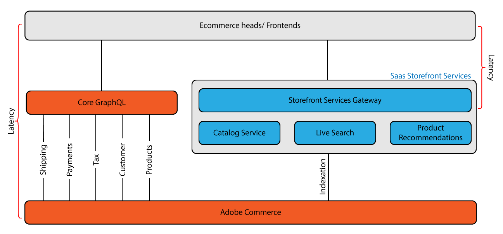

# Adobe Commerce用[!DNL Catalog Service]

Adobe Commerce拡張機能の[!DNL Catalog Service]は、専用のGraphQL APIを通じて、最適化された読み取り専用のカタログデータを提供することで、ストアフロントの読み込み時間を短縮します。 このサービスは、製品関連のページエクスペリエンスを強化するために設計されており、その結果、ページの読み込み速度とコンバージョン率が向上します。

[!DNL Catalog Service]が提供する豊富なビューモデルデータには、製品の詳細、属性、在庫、価格が含まれており、次のような製品関連のストアフロント体験を素早くレンダリングできます。

- 製品詳細ページ
- 製品リストとカテゴリーページ
- 検索結果ページ
- 製品カルーセル
- 製品比較ページ
- カート、注文、ウィッシュリストページなど、商品データをレンダリングするその他のページ

## 主な特長と機能

- **ページの読み込み速度**：主要なGraphQL システムと比較して、カタログデータの検索を最大10倍高速化するために最適化されたクエリ
- **コンバージョン率の向上**：読み込み時間の短縮により、ユーザーエクスペリエンスが向上しました
- **製品タイプの簡素化**：単純な製品タイプと複雑な製品タイプに基づく統合スキーマは、開発者の複雑さを軽減します
- **価格精度の向上**: 16桁の値と4桁の小数点以下桁をサポート
- **分離されたアーキテクチャ**: カタログデータ用に個別のGraphQL システムを使用することで、Commerceのコア業務に影響を与えることなく、高いパフォーマンスを実現できます
- **リアルタイムデータ同期**: カタログサービスは、SaaS Data Export拡張機能を通じてAdobe Commerce アプリケーションと同期が維持され、クエリが最新のカタログデータを返すように保たれます
- **Data Management Dashboard**: Adobe Commerce管理インターフェイスからデータ同期処理を監視および管理します
- **API Mesh統合**: [API Mesh for Adobe Developer App Builder](https://developer.adobe.com/graphql-mesh-gateway/)とオプションで統合し、Adobe Commerce GraphQL システムを他の内部およびサードパーティのAPIと組み合わせて、Catalog Service GraphQL スキーマを拡張し、カスタムデータまたは機能を追加します

## アーキテクチャの概要

>[!NOTE]
>
>Adobe Commerce OptimizerまたはAdobe Commerce Optimizer Connectorでコンポーザブルカタログを使用してカタログを実装する場合は、[Adobe Commerce Optimizer ガイド &#x200B;](../optimizer/overview.md#architecture)およびマーチャンダイジングサービス開発者ガイドを参照してください。

[!DNL Catalog Service]では、[GraphQL](https://graphql.org/)を使用して、商品、商品属性、在庫、価格などのカタログデータをリクエストおよび受け取ります。 GraphQLは、フロントエンドクライアントが、Adobe Commerceなどのバックエンドで定義されたアプリケーションプログラミングインターフェイス（API）と通信するために使用するクエリ言語です。 GraphQLは軽量で、システムインテグレーターが各応答の内容と順序を指定できるため、一般的な通信方法です。

Adobe Commerceには、異なる目的に対応する2つのGraphQL システムが用意されています。

### Core GraphQL System

- **目的**：すべてのCommerce操作のフル機能API
- **機能**：製品、顧客、買い物かご、チェックアウトなどのクエリ（読み取り）と変異（書き込み）
- **制限**：製品クエリが速度に最適化されていません
- **使用例**：一般的なCommerceの操作と書き込み操作

### カタログサービスGraphQLシステム

- **目的**：高性能な製品カタログクエリのみ
- **機能**：商品、属性、在庫、価格の読み取り専用クエリ
- **Advantage**：製品データのコアシステムよりも大幅に高速
- **ユースケース**：スピードが重要なストアフロント製品エクスペリエンス

カタログサービスで使用可能なデータは、SaaS データ書き出し拡張機能によって配信されます。 この拡張機能は、Commerce アプリケーションと接続されたCommerce サービス間でデータを同期し、サービス GraphQL API エンドポイントへのクエリが最新のカタログデータを返すようにします。 SaaS データ書き出し操作の管理とトラブルシューティングについて詳しくは、[SaaS データ書き出しガイド &#x200B;](../data-export/overview.md)を参照してください。

[!DNL Catalog Service]のお客様は[SaaS価格インデクサー](../price-index/price-indexing.md)を使用できます。これにより、価格の更新と同期時間を短縮できます。

## アーキテクチャの詳細

次の図は、コア GraphQL システムとカタログサービス GraphQL システムのアーキテクチャの違いを示し、それらが連携してストアフロントのパフォーマンスを最適化する方法を示しています。

### システムの仕組み

**コア GraphQL システム （従来のアプローチ）:**
プログレッシブ web アプリ（PWA）は、リクエストをCommerce アプリケーションに直接送信し、各リクエストを複数のサブシステムを通じて処理してからレスポンスを返します。 このマルチステップのラウンドトリップは、ページの読み込み時間を遅くし、コンバージョン率が低下する可能性があります。

**カタログサービス（最適化されたアプローチ）:**
カタログサービスは、商品の詳細、属性、バリエーション、価格、カテゴリーなどを含む専用の最適化されたデータベースにアクセスするストアフロントサービスゲートウェイとして機能します。 このサービスは、自動化されたインデックス作成を通じてAdobe Commerceとの同期を維持し、従来のリクエストと応答のサイクルをバイパスして、待ち時間を大幅に短縮します。

コアシステムとサービスGraphQLシステムが直接通信することはありません。 各システムには異なるURLからアクセスでき、呼び出しには異なるヘッダー情報が必要です。 この2つのGraphQLシステムは、一緒に使用するように設計されています。 [!DNL Catalog Service] GraphQL システムは、製品のストアフロント体験をより迅速に行うために、コアシステムを強化します。

オプションで[API Mesh for Adobe Developer App Builder](https://developer.adobe.com/graphql-mesh-gateway/)を実装して、2つのAdobe Commerce GraphQL システムをプライベート APIとサードパーティ APIおよびその他のソフトウェアインターフェイスとAdobe Developerを使用して統合できます。 各エンドポイントにルーティングされた呼び出しに、ヘッダーに正しい認証情報が含まれていることを確認するようにメッシュを設定できます。

## 建築の詳細

次の節では、2つのGraphQL システムの違いについて説明します。

### スキーマ管理

カタログサービスはサービスとして機能するため、インテグレーターはCommerceの基本バージョンについて心配する必要はありません。 クエリの構文は、すべてのバージョンで同じです。 さらに、スキーマはすべてのマーチャントで一貫しています。 この一貫性により、ベストプラクティスを容易に確立し、ストアフロントウィジェットの再利用を大幅に促進できます。

### 商品タイプの簡素化

このスキーマは、製品タイプの多様性を2つのユースケースに減らします。

- **シンプルな商品** - カタログサービスは、Adobe Commerceのシンプル、バーチャル、ダウンロード可能、およびギフトカードの商品タイプを`simpleProductViews`にマッピングします。 このタイプには次のものが含まれます。
   - 単一の、固定された価格および量
   - 通常価格（割引前）と最終価格（割引後）
   - 色、サイズ、その他の特性など、製品属性のサポート

- **複雑な製品** - カタログサービスは、Adobe Commerceの設定可能、バンドル、グループ化された製品タイプを`complexProductViews`にマッピングします。 複雑な製品とは、複数のシンプルな製品のコレクションで、構成したりバンドルしたりすることができます。
   - 各コンポーネントのシンプルな製品は独自の価格を持つことができます。
   - 買い物客は、個々のコンポーネント製品の数量を指定できます。
   - 商品オプション（サイズ、色、素材など）は統一され、商品タイプに関係なく同じように機能します。 各オプションの選択は、独自の属性と価格を持つ特定のシンプルな製品を指します。 最終的な商品は、買い物客が必要なオプションをすべて選択するまで未定義のままです。

#### 製品ビューの属性

シンプルな商品も複雑な商品も、ストアフロントに表示できる顧客定義の属性を備えています。 これらの属性は[ProductViewAttributes](https://developer.adobe.com/commerce/webapi/graphql/schema/catalog-service/queries/products/#productviewattribute-type)として返されます。 Adobe Commerceでは、商品の作成時に使用可能な属性が定義されます。 Adobe Commerceのバックエンドから属性を追加することも、プログラムで追加することもできます。 [SaaS データ書き出しフィード データの拡張とカスタマイズ &#x200B;](../data-export/extensibility-and-customizations.md)を参照してください。

>[!TIP]
>
>Commerce バックエンドにデータタイプを追加する代わりに、[API Meshとカタログサービス &#x200B;](mesh.md)を使用して、カタログサービス GraphQL スキーマを拡張してデータを追加したり、既存のカタログデータを設定して新しい機能を有効にしたりできます。

### 価格

シンプルな商品は、価格を持つベース販売ユニットを表します。 [!DNL Catalog Service]は、割引前の通常価格と、割引後の最終価格を計算します。 価格の計算には、固定製品税を含めることができます。 パーソナライズされたプロモーションを除外しています。

複雑な商品には決まった価格はありません。 代わりに、カタログサービスは、リンクされたシンプルな価格を返します。 例えば、初期段階では、設定可能な商品のあらゆるバリエーションに同じ価格を割り当てることができます。 また、特定のサイズや色が人気がない場合は、それらのバリエーションの価格を引き下げることができます。 したがって、最初の複雑な（設定可能な）製品の価格は、標準的なバリアントと人気のないバリアントの両方の価格を反映している価格帯を示しています。 買い物客が利用可能なすべてのオプションの値を選択すると、ストアフロントに単一の価格が表示されます。

カタログサービスは、大きな値（最大16桁）と高い小数点精度（最大4桁）で価格をサポートすることで、正確な価格の更新と計算を保証します。

>[!NOTE]
>
> [!DNL Catalog Service]をご利用のお客様は、[SaaS価格インデクサー](../price-index/price-indexing.md)を使用して、web サイトでの迅速な価格変更と同期時間を活用できます。

## 導入

導入プロセスには、次のことが含まれます。

1. [!BADGE PaaSのみ]{type=Informative url="https://experienceleague.adobe.com/en/docs/commerce/user-guides/product-solutions" tooltip="Adobe Commerce on Cloud プロジェクト（Adobeで管理されるPaaS インフラストラクチャ）とオンプレミス プロジェクトにのみ適用されます。"} **[カタログサービスのインストールと設定](installation.md)** – カタログサービス拡張機能をインストールして設定し、[!DNL Commerce Services Connector]を使用してSaaS接続を設定します。
2. **ストアフロントコードを更新**: Catalog Service GraphQL クエリをフロントエンドに統合します。
3. **ルートクエリ**：すべてのカタログサービスクエリは、GraphQL ゲートウェイ（オンボーディング中に提供されるURL）を経由します
4. **データ同期の監視とトラブルシューティング**：パフォーマンスの向上を確認し、結果を監視します
