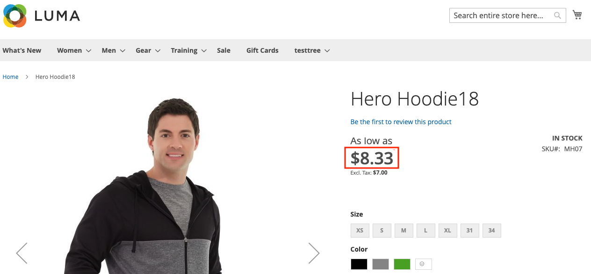

# Adobe Developer App BuilderのAPI Meshによる税金価格の表示

[API Mesh](https://developer.adobe.com/graphql-mesh-gateway/gateway/overview/)を使用すると、開発者はAdobe I/O Runtimeを使用して、プライベートまたはサードパーティのAPIやその他のインターフェイスをAdobe製品と統合できます。

このトピックでは、API Meshを使用して、製品の詳細ページに製品価格を表示し、税金を表示します。

## 税率の設定

商品詳細ページに表示するには、税金を設定する必要があります。

1. [税率を設定](https://experienceleague.adobe.com/docs/commerce-admin/stores-sales/site-store/taxes/tax-rules.html)。
1. 税金を有効にして[&#x200B; カタログに表示](https://experienceleague.adobe.com/docs/commerce-admin/stores-sales/site-store/taxes/display-settings.html#step-1%3A-configure-catalog-prices-display-settings)し、`Including and Excluding Tax`または`Including Tax`のいずれかに設定します。

カタログサービスが機能していることを確認するには、製品詳細ページを確認します。



## API メッシュの設定

まだ完了していない場合は、API Mesh with Catalog Serviceをインスタンスに接続します。 API Mesh開発者ガイドの「[はじめに](https://developer.adobe.com/graphql-mesh-gateway/gateway/getting-started/)」トピックの詳細な手順を参照してください。

`mesh.json` ファイルで、`name`、`endpoint`、`x-api-key`の値を置き換えます。

```json
{
    "meshConfig": {
      "sources": [
        {
          "name": "<NAME OF MESH>",
          "handler": {
            "graphql": {
              "endpoint": "<COMMERCE INSTANCE GQL ENDPOINT URL>"
            }
          },
          "transforms": [
              {
                  "prefix": {
                      "includeRootOperations": true,
                        "value": "Core_"
                  }
              }
          ]
        },
        {
          "name": "CommerceCatalogServiceGraph",
          "handler": {
            "graphql": {
              "endpoint": "https://catalog-service-sandbox.adobe.io/graphql/",
              "operationHeaders": {
                "Magento-Store-View-Code": "{context.headers['magento-store-view-code']}",
                "Magento-Website-Code": "{context.headers['magento-website-code']}",
                "Magento-Store-Code": "{context.headers['magento-store-code']}",
                "Magento-Environment-Id": "{context.headers['magento-environment-id']}",
                "x-api-key": "API_KEY",
                "Magento-Customer-Group": "{context.headers['magento-customer-group']}"
              },
              "schemaHeaders": {
                "x-api-key": "<YOUR API_KEY>"
              }
            }
          }
        }
      ],
      "additionalTypeDefs": "extend type ComplexProductView {\n  priceWithTaxes: Core_PriceRange\n}\n extend type SimpleProductView {\n  priceWithTaxes: Core_PriceRange\n}\n",
      "additionalResolvers": [
            {  
              "targetTypeName": "ComplexProductView",
              "targetFieldName": "priceWithTaxes",
              "sourceName": "MagentoQACore",
              "sourceTypeName": "Query",
              "sourceFieldName": "Core_products",
              "requiredSelectionSet": "{\n items {\n sku, \n price_range {\n minimum_price {\n final_price {\n value\n currency\n }\n }\n }\n }\n }",
                "sourceArgs": {
                    "filter.sku.eq": "{root.sku}"
                },
                "result": "items[0].price_range"
            },
            {  
              "targetTypeName": "SimpleProductView",
              "targetFieldName": "priceWithTaxes",
              "sourceName": "MagentoQACore",
              "sourceTypeName": "Query",
              "sourceFieldName": "Core_products",
              "requiredSelectionSet": "{\n items {\n sku, \n price_range {\n minimum_price {\n final_price {\n value\n currency\n }\n }\n }\n }\n }",
                "sourceArgs": {
                    "filter.sku.eq": "{root.sku}"
                },
                "result": "items[0].price_range"
            }
        ]
     }
  }
```

この`mesh.json`設定ファイル：

* Commerce コアアプリケーションを変換し、クエリまたは型の前に「Core_」を付ける必要があります。 これにより、カタログサービスとの名前の競合を回避できます。
* `ComplexProductView`型と`SimpleProductView`型を`priceWithTaxes`という新しいフィールドで拡張します。
* 新しいフィールドにカスタムリゾルバーを追加します。

[create コマンド &#x200B;](https://developer.adobe.com/graphql-mesh-gateway/gateway/create-mesh/#create-a-mesh-1)でメッシュを`mesh.json` ファイルで作成します。

### GraphQL クエリ

GraphQLを使用して新しい`priceWithTaxes` データを取得できます。

クエリの例：

```graphql
query {
    products(skus:[MH07]) {
        __typename
        id
        sku
        name
        description
        shortDescription
        addToCartAllowed
        url
        ... on ComplexProductView {
            priceWithTaxes {
              minimum_price {
                final_price {
                  value
                }
              }
              maximum_price {
                final_price {
                  value
                }
              }
            }
            priceRange {
                maximum {
                    final {
                        amount {
                            value
                            currency
                        }
                    }
                    regular {
                        amount {
                            value
                            currency
                        }
                    }
                    roles
                }
                minimum {
                    final {
                        amount {
                            value
                            currency
                        }
                    }
                    regular {
                        amount {
                            value
                            currency
                        }
                    }
                    roles
                }
            }
        }
    }
}
```

クエリ応答：

```json
{
  "data": {
    "products": [
      {
        "__typename": "ComplexProductView",
        "id": "VFVnd053AFpHVm1ZWFZzZEEAWkRWa09Ua3hNVFl0WTJJd015MDBaRGMwTFRnME16a3RNak01TVRVNE9ESTBOemd4AGJXRnBibDkzWldKemFYUmxYM04wYjNKbABZbUZ6WlEAVFVGSE1EQTFPRFEyTVRjeA",
        "sku": "MH07",
        "name": "Hero Hoodie13",
        "description": "<p>Gray and black color blocking sets you apart as the Hero Hoodie keeps you warm on the bus, campus or cold mean streets. Slanted outsize front pockets keep your style real . . . convenient.</p>\r\n<p>* Full-zip gray and black hoodie.<br />* Ribbed hem.<br />* Standard fit.<br />* Drawcord hood cinch.<br />* Water-resistant coating.</p>",
        "shortDescription": "",
        "addToCartAllowed": true,
        "url": "http://commerce_url/hero-hoodie.html",
        "priceWithTaxes": {
          "minimum_price": {
            "final_price": {
              "value": 8.330001
            }
          },
          "maximum_price": {
            "final_price": {
              "value": 13355.524701
            }
          }
        },
        "priceRange": {
          "maximum": {
            "final": {
              "amount": {
                "value": 39.02,
                "currency": "USD"
              }
            },
            "regular": {
              "amount": {
                "value": 54,
                "currency": "USD"
              }
            },
            "roles": [
              "visible"
            ]
          },
          "minimum": {
            "final": {
              "amount": {
                "value": 39.02,
                "currency": "USD"
              }
            },
            "regular": {
              "amount": {
                "value": 54,
                "currency": "USD"
              }
            },
            "roles": [
              "visible"
            ]
          }
        }
      }
    ]
  },
  "extensions": {}
}
```
