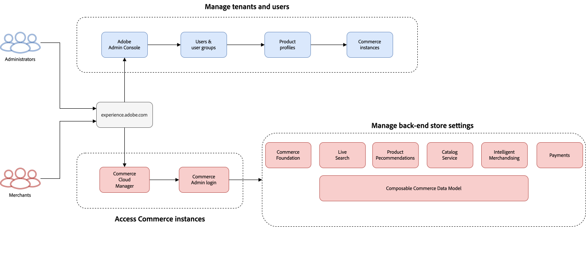
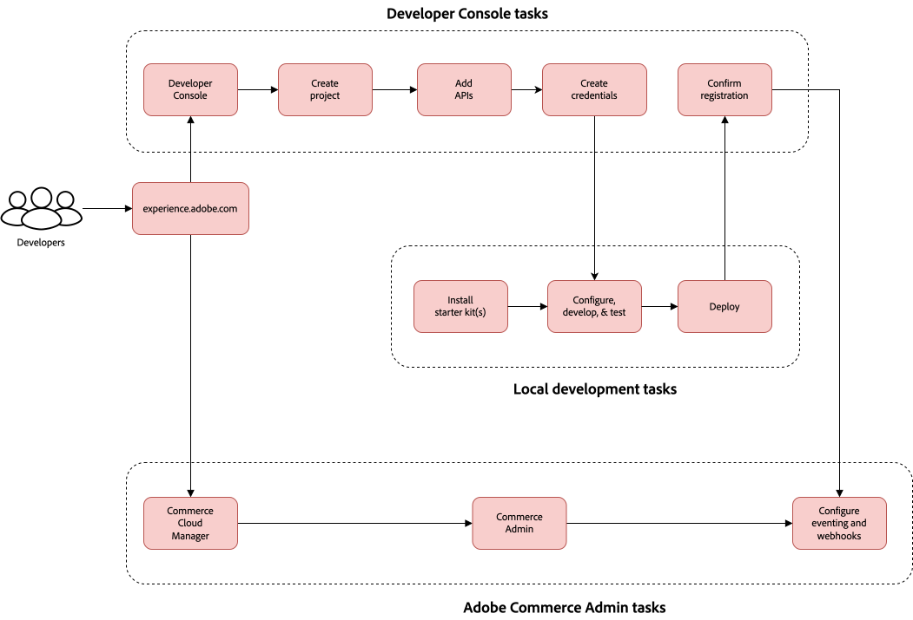
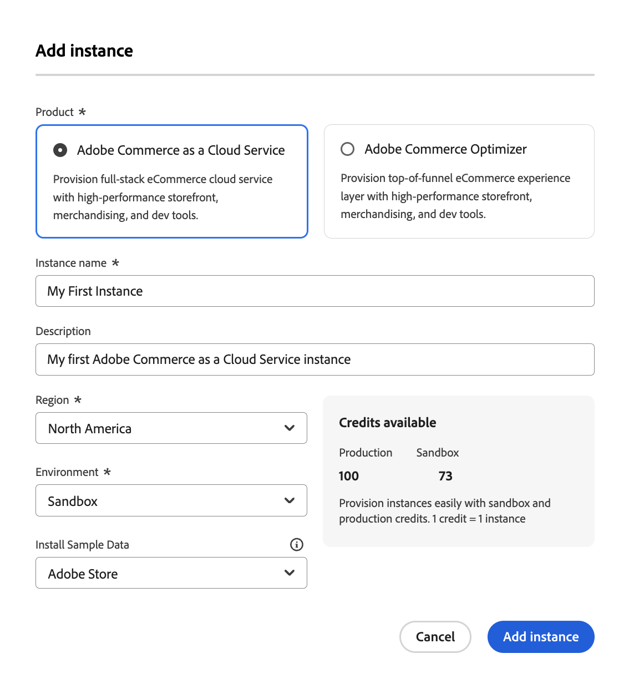

# Adobe Experience Managerの導入方法

[!DNL Adobe Commerce as a Cloud Service]は、ほとんどの設定を標準で提供します。 いくつかの基本的な設定プロセスを完了すると、ストアをすぐに立ち上げて実行できます。 このガイドでは、インスタンスの作成と操作について説明し、組織を成功に導くための設定に役立ちます。 これにより、チームは[!DNL Adobe Commerce as a Cloud Service]と開始に必要なツールに適切にアクセスできるようになります。

[!DNL Adobe Commerce as a Cloud Service]は、デジタルコマース体験を提供するための柔軟性、拡張性、効率性を提供するクラウドネイティブのコマースプラットフォームです。 このSaaS製品は、フルマネージド型のバージョン不要のプラットフォームで、手作業なしでシームレスなアップグレードエクスペリエンスを提供します。

## 主要コンポーネント

[!DNL Adobe Commerce as a Cloud Service]は次のコンポーネントで構成されています：

* **[[!DNL Adobe Experience Cloud]](https://experience.adobe.com/)** - [!DNL Adobe Commerce]experience.adobe.com[のすべての](https://experience.adobe.com/)製品への中心的なエントリポイント
   * [!UICONTROL **クイックアクセス**]&#x200B;の下の&#x200B;[!UICONTROL **Commerce**]&#x200B;をクリックして、Commerce Cloud Managerを開きます
* **[[!DNL Commerce Cloud Manager]](https://experience.adobe.com/#/commerce/cloud-service)** - インスタンスの作成と管理、API URLへのアクセス、Commerce管理者
* **[[!DNL Adobe Admin Console]](https://adminconsole.adobe.com/)** - ユーザーと役割の管理
* **Commerce管理者** – 製品、注文、お客様、およびストアの設定を管理します
* **[Storefront powered by [!DNL Edge Delivery Services]](./storefront.md)** - マーチャントと開発者に優れたスピード、SEO、ユーザーエクスペリエンスを提供する、構成可能な高性能システムを使用して、顧客向けのストアフロントを作成し、カスタマイズします
* **[[!DNL Adobe Developer App Builder]](https://developer.adobe.com/app-builder/)** - [!DNL App Builder]と[統合スターターキット &#x200B;](https://developer.adobe.com/commerce/extensibility/starter-kit/integration/)および[[!DNL API Mesh]](https://developer.adobe.com/graphql-mesh-gateway/)などの他の拡張性ツールを使用してカスタム統合を構築します

## 設定と管理

[!DNL Adobe Commerce as a Cloud Service]設定プロセスの一環として、システム管理者、マーチャント、開発者は、組織のアクセスとリソースを設定します。これには、クラウドリソースのプロビジョニングや、責任に基づく適切な役割へのユーザーの割り当てが含まれます。

### 設定と管理のワークフロー

共同作業グループとして、Commerce インスタンスを起動して実行するには、システム管理者、マーチャント、開発者が次の重要な手順に従う必要があります。

1. **すべてのユーザー**: [&#x200B; インスタンスを作成](#create-an-instance)
1. **システム管理者**: [&#x200B; ユーザーを追加して役割を割り当て](user-management.md#add-users)
1. **マーチャント**: [Commerce Admin](#access-an-instance)にアクセスし、[&#x200B; カタログを読み込む](#import-your-catalog)
1. **開発者**: [&#x200B; ストアフロントを設定](storefront.md)し、[開発者プラットフォーム &#x200B;](overview.md#developer-platform)を探索します

#### AEM Assetsと製品ビジュアルのワークフロー

[!DNL Adobe Experience Manager Assets]または[!DNL Product Visuals powered by AEM Assets]を[!DNL Adobe Commerce as a Cloud Service]と統合するには、次の手順が必要です。

1. **システム管理者**: [製品プロファイル  [!DNL AEM Assets] および [!DNL Product Visuals] にユーザーを追加](user-management.md#add-a-user-to-aem-assets-or-product-visuals)
1. **開発者**: [統合 [!DNL AEM Assets] および [!DNL Product Visuals]](../aem-assets-integration/overview.md)
1. **マーチャント**: [お客様の [!DNL AEM Assets] および [!DNL Product Visuals]](./user-management.md#access-the-experience-manager-interface)にアクセス

### 役割ベースの設定と管理タスク

以下のタブを選択して、対応する役割の高レベルのワークフローグラフィックを表示します。

>[!BEGINTABS]

>[!TAB  システム管理者とマーチャントのワークフロー]

この図では、システム管理者とマーチャントが[!DNL Adobe Commerce as a Cloud Service] インスタンスにアクセスして管理する方法の概要を示します。 管理者ワークフローについて詳しくは、[Adobe Admin Console ガイド &#x200B;](https://helpx.adobe.com/jp/enterprise/admin-guide.html)を参照してください。

Adobe Commerce as a Cloud Serviceの{zoomable="yes"}

>[!TAB 開発者ワークフロー]

この図では、App Builderを使用して開発者が[!DNL Adobe Commerce as a Cloud Service]の統合を作成する方法の概要を示します。 詳しくは、[API ドキュメント &#x200B;](https://developer.adobe.com/commerce/webapi/rest/)を参照してください。

{zoomable="yes"}

>[!ENDTABS]

役割を選択して、設定プロセスを開始するためのリソースを見つけます。

>[!BEGINTABS]

>[!TAB  システム管理者]

システム管理者は、組織の設定とユーザーアクセスの管理を担当します。

| タスク | 説明 | リソース |
|------|-------------|----------|
| プラットフォームについて | Adobe Commerce as a Cloud Serviceのアーキテクチャと利点 | [概要](overview.md) |
| 機能を比較 | Cloud Serviceと他のAdobe Commerce製品の違いを理解する | [機能の比較](feature-comparison.md) |
| インスタンスの作成 | サンドボックス環境と実稼動環境のプロビジョニング | [&#x200B; インスタンスを作成](#create-an-instance) |
| ユーザー管理の設定 | ユーザーの追加、役割の割り当て、権限の管理 | [&#x200B; ユーザー管理](user-management.md) |
| [!DNL AEM Assets]と[!DNL Product Visuals]を設定します（オプション） | ユーザーの追加、役割の割り当て、権限の管理 | [&#x200B; ユーザー管理](user-management.md#add-a-user-to-aem-assets-or-product-visuals) |

>[!TAB  マーチャント ]

販売者は商品、注文、ストアフロントコンテンツを管理することに重点を置きます。

| タスク | 説明 | リソース |
|------|-------------|----------|
| インスタンスへのアクセス | Commerce Adminにログインして、ストアを管理します | [&#x200B; インスタンスへのアクセス &#x200B;](#access-an-instance) |
| ユースケースを見る | 実用的なビジネスシナリオとワークフローを学ぶ | [&#x200B; ユースケース &#x200B;](./use-cases.md) |
| カタログの読み込み | 商品データをプラットフォームにインポートする方法について説明します | [&#x200B; カタログを読み込む](#import-your-catalog) |
| [!DNL AEM Assets]および[!DNL Product Visuals]へのアクセス （オプション） | Experience Managerにアクセスして、[!DNL AEM Assets]および[!DNL Product Visuals]の使用を開始する | [Experience Manager インターフェイスにアクセス &#x200B;](./user-management.md#access-the-experience-manager-interface) |

>[!TAB 開発者]

開発者は、カスタム統合を構築してプラットフォーム機能を拡張する方法を知る必要があります。

| タスク | 説明 | リソース |
|------|-------------|----------|
| アーキテクチャについて | プラットフォームの拡張性とAPIについてご確認ください | [概要 – 開発者プラットフォーム &#x200B;](overview.md#developer-platform) |
| 開発環境の設定 | 開発とテスト用のサンドボックスインスタンスの作成 | [&#x200B; インスタンスを作成](#create-an-instance) |
| ストアフロントを構築する | Commerce Storefrontのセットアップとカスタマイズ方法について説明します | [&#x200B; ストアフロントの設定](./storefront.md) |
| ストアフロントの設定 | ストアフロントの立ち上げ方法について詳しく見る | [&#x200B; ストアフロントの設定](./storefront.md) |
| 統合オプションを見る | App Builder、API Mesh、およびアクセスできるその他の拡張性ツールについて説明します | [概要 – 開発者プラットフォーム &#x200B;](overview.md#developer-platform) |
| [!DNL AEM Assets]と[!DNL Product Visuals]の統合（オプション） | [!DNL AEM Assets]と[!DNL Product Visuals]を[!DNL Adobe Commerce]と統合する方法について説明します | [AEM Assetsとの連携](../aem-assets-integration/overview.md) |

>[!ENDTABS]

### 次のステップ

ロール固有の設定タスクを完了した後：

* **システム管理者**: [共有責任](shared-responsibility.md)のガイドラインを確認します
* **マーチャント**：一般的なビジネス シナリオの[&#x200B; ユースケース &#x200B;](use-cases.md)を探る
* **Developers**: [Adobe Commerce開発者向けドキュメント &#x200B;](https://developer.adobe.com/commerce/docs)をご覧ください

## Adobe Commerce as a Cloud Serviceの基本

以下の節では、Commerce インスタンスを起動して実行するために必要な基本的なプロセスについて説明します。

### インスタンスの作成

>[!NOTE]
>
>インスタンスを作成する前に、組織の製品管理者またはシステム管理者が[!DNL Adobe Commerce as a Cloud Service]製品のユーザーとしてあなたを追加する必要があります。 詳しくは、[&#x200B; ユーザーと管理者の追加](./user-management.md#add-users)を参照してください。

[!DNL Adobe Commerce as a Cloud Service]件のインスタンスでクレジットベースのシステムが使用されています。 複数のインスタンスを作成できますが、各インスタンスには使用可能なクレジットが必要です。 最初に使用するクレジットの数は、サブスクリプションによって異なります。

1. [[!DNL Adobe Experience Cloud]](https://experience.adobe.com/) アカウントにログインします。

1. [!UICONTROL Quick access]で、[!UICONTROL **Commerce**]&#x200B;をクリックして[!UICONTROL Commerce Cloud Manager]を開きます。

   [!UICONTROL Commerce Cloud Manager]には、Adobe IMS組織で使用可能な[!DNL Adobe Commerce as a Cloud Service] インスタンスのリストが表示されます。

1. 画面の右上隅にある「[!UICONTROL **インスタンスを追加**]」をクリックします。

   {width="50%" align="center" zoomable="yes"}

1. [!UICONTROL **Commerce as a Cloud Service**]&#x200B;を選択します。

1. インスタンスの&#x200B;**名前**&#x200B;と&#x200B;**説明**&#x200B;を入力します。

1. インスタンスの&#x200B;[!UICONTROL **環境タイプ**]&#x200B;を選択します。 次のオプションから選択できます。

   * [!UICONTROL **サンドボックス**] - デザインおよびテストのみを目的としています。 サンドボックス環境を使用して、[!DNL Adobe Commerce as a Cloud Service] ジャーニーを開始する必要があります。

   >[!NOTE]
   >
   > サンドボックスインスタンスは、設計およびテストのみを目的としています。 サンドボックス環境では、本番データを使用しないでください。
   >
   >サンドボックスインスタンスは北米リージョンに限定されます。

   * [!UICONTROL **実稼動**] - ライブストアと顧客向けサイトの場合。

   >[!NOTE]
   >
   >Adobe Commerce as a Cloud Serviceのインフラストラクチャは、世界中で利用できます。 お住まいの地域の本番環境について詳しくは、カスタマーサービス担当者にお問い合わせください。

1. インスタンスをホストするリージョンを選択します。

   >[!NOTE]
   >
   >インスタンスを作成すると、リージョンを変更できなくなります。

1. 「[!UICONTROL **インスタンスを追加**]」をクリックします。

>[!NOTE]
>
>既存のインスタンスをコピーまたは削除することはできません。

{{aem-assets-instance-mapping}}

### インスタンスへのアクセス

インスタンスを作成したら、[!UICONTROL Commerce Cloud Manager]からアクセスできます。

1. [Adobe Experience Cloud](https://experience.adobe.com/) アカウントにログインします。

1. [!UICONTROL Quick access]で、[!UICONTROL **Commerce**]&#x200B;をクリックして[!UICONTROL Commerce Cloud Manager]を開きます。

   [!UICONTROL Commerce Cloud Manager]には、Adobe IMS組織で使用可能なインスタンスのリストが表示されます。

1. インスタンスの[!UICONTROL Commerce Admin]を開くには、インスタンス名をクリックします。

>[!TIP]
>
>REST エンドポイントとGraphQL エンドポイントおよび管理者URLなど、インスタンスに関する情報を表示するには、インスタンス名の横にある情報アイコンをクリックします。

管理者とエンドポイントのベース URLは、地域と環境によって異なり、次のパターンを使用します。

* 管理者
   * 北米の実稼動管理者：`https://na1.admin.commerce.adobe.com`
   * 北米サンドボックス管理者：`https://na1-sandbox.admin.commerce.adobe.com`
   * ヨーロッパ実稼動管理者：`https://eu1.admin.commerce.adobe.com`
* RESTとGraphQL
   * 北米の本番GraphQL: `https://na1.api.commerce.adobe.com`
   * 北米サンドボックス GraphQL: `https://na1-sandbox.api.commerce.adobe.com`
   * Europe production GraphQL: `https://eu1.api.commerce.adobe.com`

### カタログをインポートします

デフォルトでは、[!DNL Adobe Commerce as a Cloud Service] インスタンスには製品データは含まれません。 独自のカタログを読み込む前に、テストおよび学習目的でインスタンスを作成する際に、サンプル製品データを含めるオプションがあります。

カタログを[!DNL Adobe Commerce as a Cloud Service]に読み込む方法は2つあります。

* [**Commerce Admin**](https://experienceleague.adobe.com/ja/docs/commerce-admin/systems/data-transfer/import/data-import) - カタログ データを数回クリックするだけで読み込むことができる、使いやすいインターフェイスです。
* [**Import JSON API**](https://developer.adobe.com/commerce/webapi/rest/modules/import/#import-json-api) - プログラムでカタログデータをインポートできるREST APIです。

### ストアフロントの設定

インスタンスを作成したので、[を利用して](storefront.md) ストアフロントを設定[!DNL Edge Delivery Services]する準備が整いました。

## 関連資料

* [リリースノート](release-notes.md)
* [移行ガイド](migration/overview.md)
* [Commerce Storefront ドキュメント &#x200B;](https://experienceleague.adobe.com/developer/commerce/storefront/?lang=ja)
