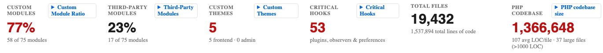
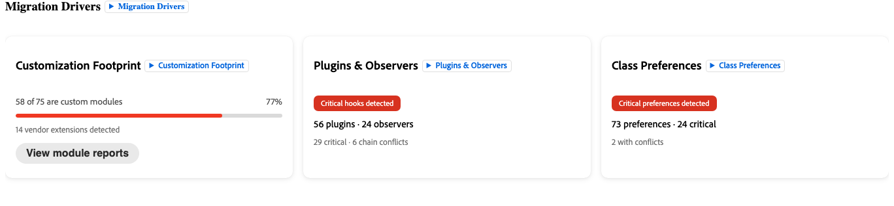
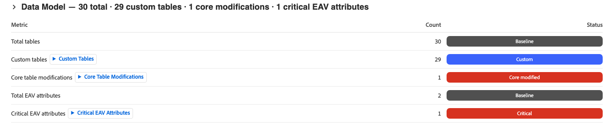

# 移行評価

>[!IMPORTANT]
>
> 移行評価は、[!DNL Adobe Commerce on Cloud Infrastructure]または[!DNL Adobe Commerce on-premises] プロジェクトを[!DNL Adobe Commerce as a Cloud Service]に移行する場合にのみ使用できます。

Commerceの移行評価は、既存のAdobe Commerceの導入を自動的に分析するものです。 Adobeのツールは、Commerceのコードベースをスキャンし、構築、カスタマイズ、変更されたあらゆる要素を一覧表示する構造化レポートを生成します。 次に、コードベースに対して行われたカスタマイズが、[!DNL Adobe Commerce as a Cloud Service]への移行にどのような影響を与えるかを示します。

レポートは、任意のブラウザーで開くことができるHTML ファイルとして配信されます。 本番環境へのアクセスは必要ありません。ただし、最初にプロジェクトコードベースを共有する必要があります。

**評価で提供される：**

- ストア内の各カスタムモジュールを、タイプ別および影響レベル別に整理した包括的なインベントリ
- リスク予測指標から計算された移行の複雑さの評価（高、Medium、低）
- 移行計画が必要なバックエンドとストアフロントの領域で、最も効果の高いビューを優先的に表示
- AdobeのAI開発ツールの直接入力として使用できる各カスタムモジュールの説明

## 移行評価レポートについて

レポートは、**[!UICONTROL Summary]**、**[!UICONTROL Module Reports]**、**[!UICONTROL Report Reliability]**&#x200B;の3つのタブに分かれています。

>[!NOTE]
>
>レポートのすべてのセクションがあらゆるストアに適用されるわけではありません。 この評価は、可能なあらゆるカスタマイズの種類や複雑さの要因を包括的に考慮するように設計されていますが、ストアにはここに記載されているセクションのサブセットしかありません。

## 「概要」タブ

「**[!UICONTROL Summary]**」タブには、次の領域に整理された主要シグナルの概要が表示されます。

- 移行の複雑さ
- ファイル形式の分類
- 最も効果の高いモジュール
- 移行ドライバー
- カスタマイズの分類

### 移行の複雑さ

「移行の複雑さ」セクションには、ストア全体の評価の評価が含まれます。 スコアの計算方法を説明し、主なリスク要因を明らかにします。

**移行の複雑さと複雑さのスコア**

重み付けスコア、主なリスク要因、および主要指標を示す{width="600" zoomable="yes"}

複雑さスコアは、各入力を移行するのが難しいかどうかによって重み付けします。 スコアは、固定しきい値を使用して移行の複雑さの評価にマップされます。

| 評価 | スコア範囲 | 一般的な移行アプローチ |
| --- | --- | --- |
| 低 | 150以下 | 標準的な移行 – 支払いプロバイダーの調整による直接移行と、並行したワークストリームとしてのデータ移行。 |
| Medium | 151-375 | モジュールの移行：セグメントに移行し、効果の高いカスタムモジュールをトリアージ |
| 高 | 上375 | 段階的な移行：12～24か月間続く可能性が高い |

**カスタムモジュール比率**

{width="600" zoomable="yes"}

特に実装用に構築されたモジュールの割合。 比率が高いほど、より多くのカスタムコードを監査および移行する必要があります。 お客様のカスタムモジュールの平均比率は約62%です。

>[!TIP]
>
>カスタムモジュール比は、複雑さの信号ではなく、範囲の信号です。 80%のカスタムモジュールが隔離され、リスクの低いストアは、40%のリスクが高いカスタムモジュールを持つストアよりも移行が簡単です。 複雑さスコアとチェーン競合の数を使用して、難易度を評価します。 カスタムモジュール比率を使用して、ボリュームを推定します。

**ファイルタイプの分類**

{width="600" zoomable="yes"}

コードベース内のファイルの数をタイプ別に整理したリスト。

**最も効果の高いモジュール**

{width="600" zoomable="yes"}

移行に最も配慮が必要なストア内の特定のモジュールの厳選されたリスト。 こうしたモジュールは、多くの場合、チェックアウト、決済、注文管理などを扱うモジュールです。 影響の大きいモジュールごとに、独自の移行計画が必要です。 このリストは、テクニカルチームと話をするための最適な出発点となります。

### ストアフロントの複雑さ

カスタムテーマ名前空間、合計ブロック数、レイアウト XML ファイル、コアハンドルの上書き、実用的なシグナルを示す{width="600" zoomable="yes"}

「ストアフロントの複雑さ」セクションでは、ストアのフロントエンドのプレゼンテーション層を移行するために必要な労力を表示します。 このワークストリームは、バックエンドのコード移行とは異なるワークストリームであり、フロントエンド開発者が対応し、通常は個別のプランニング会話が必要です。

>[!NOTE]
>
>ストアのバックエンドの複雑さは低く、ストアフロントの複雑さは高くなります。 移行作業をスコープ化する前に、必ず両方のセクションを確認してください。

- カスタムテーマ – ストアのカスタムテーマの名前空間（BrandName_Themeなど）。 カスタムテーマが存在する場合、[!DNL Adobe Commerce as a Cloud Service]には完全なテーマの再構築が必要です。 カスタムテーマ名前空間を持つ評価されたすべてのストアでは、専用のフロントエンド移行ワークストリームを計画する必要があります。

- 合計ブロック – ストア内のブロックとテンプレート （.phtml） ファイルの数。 ブロックは主要なサーバーサイドのレンダリングアーティファクトで、それぞれ個別の移行タスクを表します。

| ブロック数 | 残存作業時間 |
| --- | --- |
| 100未満 | ベースライン – 標準労力 |
| 100-300 | Medium – 構造化されたフロントエンドウェーブを計画する |
| 300以上 | 高 – 専用のワークストリームとして優先する |

### 移行ドライバー

{width="600" zoomable="yes"}

「移行ドライバー」セクションには、複雑さの評価の主な要因が表示されます。

| ドライバー | 定義 |
| --- | --- |
| Customization Footprint | 実装の合計数に対するカスタムコードの全体的な量 |
| プラグインとオブザーバー | 実行時にコアプラットフォームの動作を傍受するコード |
| クラス設定 | コアクラスを完全に置き換える脆弱なカスタマイズパターン。アップグレード時にサイレントに壊れる |
| データモデル | カスタムおよび変更されたデータベース構造 |
| 連携 | ストアに接続された外部システム |

各ドライバーは、High、Medium、またはLowの労力で表示されます。 スコーピングとプランニングの際は、最初に最も評価の高いドライバーに対応しましょう。

### データモデル

カスタムテーブル、コアテーブルの変更、重要なEAV属性の数を示す{width="600" zoomable="yes"}

「データモデル」セクションには、カスタムテーブルの数、コアデータベーステーブル [!DNL Adobe Commerce]への変更、およびクリティカルエンティティ属性値（EAV）属性が表示されます。

コアテーブルの変更は、特定のプラットフォームスキーマバージョンに依存し、複雑さスコアの式に大きな影響を与えるため、移行が最も困難なカテゴリです。

>[!TIP]
>
>レポートに15以上のコアテーブルの変更が記載されている場合は、バックエンドモジュールの移行をスコープ化する前に、専用のデータ移行ワークストリームを計画します。

## カスタマイズの分類

{width="600" zoomable="yes"}

「カスタマイズの分類」セクションには、ストア内のカスタマイズのあらゆるカテゴリをまたいで詳細な指標が表示されます。

>[!NOTE]
>
>すべてのサブセクションが各レポートに表示されるわけではなく、コードベースで検出されたカテゴリのみが表示されます。
>
>フロントエンドのプレゼンテーション層に影響を与えるサブセクションは、バックエンドのコードの移行とは異なるワークストリームであり、通常は別々のプランニングの会話が必要です。
>
>ストアのバックエンドの複雑さは低く、フロントエンドの複雑さは高くなります。 移行作業をスコープ化する前に、バックエンドとストアフロント関連の両方のサブセクションを必ず確認してください。

### レイアウト XML

Layout XML ファイルの数とその合計操作数。 Layout XMLは、表示されるブロック、表示されるコンテナ、下にあるページタイプなど、すべてのページの構造を定義します。

操作が多いファイル数が多い場合は、ページ構造を大幅にカスタマイズする必要があり、その場合は再構築する必要があります。

### コアハンドルの上書き

レイアウト XMLがコア [!DNL Adobe Commerce] ページハンドルを上書きする場所の数（例：`checkout_cart_index`または`catalog_product_view`）。 コアハンドルのオーバーライドは、プラットフォームレベルでページ構造を変更し、明示的な再構築を必要とするため、最もリスクの高いレイアウト信号です。

| 上書き数 | 残存作業時間 |
| --- | --- |
| 0 | コアレイアウトの上書きなし |
| 1-3 | ランタイムリスク – 各オーバーライドには、明示的なレイアウト再構築が必要です |
| 4つ以上 | 重要 – 専用のレイアウト移行スプリントの計画 |

### ブロック

ストア内のブロックとテンプレート （`.phtml`） ファイルの数。 ブロックは、主要なサーバーサイドのレンダリングアーティファクトです。 各ブロックは、個別の移行タスクを表します。

| ブロック数 | 残存作業時間 |
| --- | --- |
| 100未満 | ベースライン – 標準労力 |
| 100-300 | Medium – 構造化されたフロントエンドウェーブを計画する |
| 300以上 | 高 – 専用のワークストリームとして優先する |

### 高リスクのブロック

チェックアウトレンダリング、カート表示、類似のフロントエンドサーフェスなど、主要なレンダリングパスに触れるブロックを提供します。 リスクの高いブロックの場合は、スケジュールを設定する前に個別の移行評価が必要です。

### テーマとメールテンプレート

ストアのカスタムテーマの名前空間（例：`BrandName_Theme`）。 カスタムテーマの存在は、完全なテーマの再構築が必要であることを意味します。 カスタムテーマ名前空間を持つ評価されたすべてのストアでは、専用のフロントエンド移行ワークストリームを計画する必要があります。

### テンプレートの上書き（コア変更）

上書きされたコア [!DNL Adobe Commerce] `.phtml` テンプレートの数。 各コアテンプレートの上書きは、そのテンプレートの特定のバージョンに対する依存関係を作成します。 テンプレートを変更するプラットフォームの更新により、上書きがサイレントに解除されます。

### ドロップインの移行が必要

[!DNL Adobe Commerce as a Cloud Service]は、チェックアウト、買い物かご、商品詳細など、ストアフロントサーフェスにモジュール式のドロップインコンポーネントアーキテクチャを使用しています。 これらのサーフェスに対するカスタマイズは、ドロップインコンポーネントとして再構築する必要があります。 これらのカスタマイズでは、カスタムチェックアウトステップの追加、カート表示ロジックの変更、製品詳細ページの拡張など、幅広い機能に対応します。

[!UICONTROL Drop-in migration required] フィールドは、ドロップインの再構築が必要なストアフロント領域を示します。

>[!IMPORTANT]
>
>**チェックアウト**&#x200B;がドロップイン移行要件としてリストされている場合は、専用のチェックアウトドロップインワークストリームを計画します。 このタスクは、最も複雑でビジネスに不可欠なストアフロントの移行タスクです。

## 「モジュールレポート」タブ

{width="600" zoomable="yes"}

「**[!UICONTROL Module Reports]**」タブには、ストア内のすべてのカスタムモジュールの専用エントリが含まれています。 この情報をテクニカルチームと共有します。

モジュールごとに、次のレポートが表示されます。

| フィールド名 | 定義 |
| --- | --- |
| 機能 | カスタムモジュールの目的とビジネス機能の説明 |
| 影響レベル | モジュールがタッチするコマース動作に基づく&#x200B;**High**、**Medium**、または&#x200B;**Low**&#x200B;の影響 |
| フック数 | このモジュールがコア プラットフォームの動作を傍受する場所の数を示すwebhookの数 |
| 移行の推奨 | **再構築**、**リファクタリング**、**ネイティブ機能で**&#x200B;を置き換えるか、**削除**&#x200B;します |
| 依存関係 | このモジュールが操作する他のモジュール。移行シーケンスに情報を提供できます |

**ワークフロー**

1. 最初に&#x200B;**影響の大きい**&#x200B;個のモジュールにフィルタリングします。 移行に要する労力とコストを最も多く削減できます。
1. カスタムモジュールごとに、次の質問に対する回答を決定します。
   - このモジュールはまだ積極的に使用されていますか？
   - モジュールをネイティブ [!DNL Adobe Commerce as a Cloud Service]機能に置き換えることはできますか？
   - モジュールを再構築する必要がある場合、その代わりにどのような機能が必要ですか？
1. 廃止または置き換え可能なカスタムモジュールを特定します。 コードを記述する前に、移行の範囲を削減します。
1. 各カスタムモジュールの説明を、**再構築**&#x200B;移行の推奨事項と共にコピーします。 これらの説明は、AdobeのAI デベロッパーツールに直接与えることができます。詳しくは、[Commerce拡張性のAI デベロッパーツール ](#ai-developer-tools-for-commerce-extensibility)を参照してください。

## 参考：主な用語

| 条件 | 定義 |
| --- | --- |
| **モジュール** | カスタマイズされた自己完結型の機能パッケージ。 ストアには、20個のモジュールから数百個のモジュールまで、どこにでも格納できます。 |
| **プラグイン （インターセプター）** | Commerce関数をインターセプトし、実行前、実行中、実行後にその動作を変更するコード。 |
| **オブザーバー** | 特定のプラットフォームイベントをリッスンし、そのイベントが発生したときにカスタムロジックを実行するコード。 |
| **環境設定（クラスの上書き）** | コアのCommerceクラスを完全に置き換える脆弱なカスタマイズタイプ。プラットフォームがそのクラスをアップグレードすると、サイレントに壊れます。 |
| **チェーンの競合** | 2つ以上のプラグインが同じ機能をインターセプトし、1つが次のプラグインに制御を渡すことができない場合。 これにより、エラーメッセージを表示せずに、機能がサイレントに動作しなくなる可能性があります。 |
| **コアテーブルの変更** | Commerceの組み込みデータベーステーブルに対する構造的な変更。これにより、特定のプラットフォームスキーマバージョンに対して不可逆的な依存関係が生じます。 計算式の中で最も重い値を持ちます。 |
| **エンティティ属性値（EAV）** | 製品または顧客に追加された柔軟なカスタムフィールド（カスタム「保証期間」フィールドなど）。 EAV数が多いと、データ移行の複雑さが増します。 |
| **フック密度** | モジュールあたりのプラグインとオブザーバーの平均数。 密度が高いほど、コアプラットフォームにカスタマイズをより緊密に組み込むことができます。 |
| **ドロップイン** | [!DNL Adobe Commerce's]個のストアフロントコンポーネントに対するモジュール式のアプローチ（チェックアウト、カート、商品詳細ページを含む）。 [!DNL Adobe Commerce on Cloud Infrastructure]または[!DNL Adobe Commerce on Premises]でのカスタムチェックアウト動作は、通常、[!DNL Adobe Commerce as a Cloud Service]でのドロップインの再構築が必要です。 |
| **App Builder** | Adobeのプロセス外の拡張性プラットフォームと、プロセス内のPHP拡張機能に代わるカスタム機能を構築する推奨される方法。 |
| **レイアウト XML** | 各ページに表示されるブロックを定義する設定ファイル。 [!DNL Adobe Commerce as a Cloud Service's] ページ構造用にカスタムレイアウト XMLを再設計する必要があります。 |
| **コアハンドルの上書き** | コア Commerce ページ構造をグローバルに変更するレイアウト XMLのカスタマイズ。 これらは、移行に対して最もリスクの高いレイアウトパターンです。 |

## COMMERCEの拡張性に対応するAI開発ツール

AdobeのAI デベロッパーツールのプロンプトとして、**[!UICONTROL Module Reports]** タブのモジュール説明を使用できます。 このツールは、[!DNL Adobe Commerce as a Cloud Service]と互換性のある代替拡張機能の構築とデプロイに役立ちます。

### ツールの機能

Adobeの[Commerce拡張機能向けAI開発ツール ](https://developer.adobe.com/commerce/extensibility/developer-agent/)には、主にふたつの機能が含まれています。

- [!DNL Adobe Commerce] [!DNL App Builder] MCP サーバー – AI コーディング アシスタントを[!DNL Adobe Commerce]のドキュメント、API、およびApp Builder開発パターンに直接接続するモデル コンテキスト プロトコル （MCP）統合。 開発者は何を構築したいのかを記述でき、MCP サーバーはCommerce対応のコード生成、アーキテクチャガイダンス、デプロイメントオートメーションをIDE内で提供します。
- エージェントのスキル - REST API、チェックアウト拡張機能、ストアフロントコンポーネント、イベント駆動型の統合など、Adobe Commerceの一般的な拡張性パターンをカバーする事前定義済みのAI スキル。 スキルは、[!DNL Adobe Commerce as a Cloud Service]および[!DNL App Builder]に固有のアーキテクチャ、実装、テスト、デプロイメントの手順を通じてAIを導きます。

#### AI ツールのインストール

詳しい手順と特定のIDE設定については、[AI開発者ツールのインストール ](https://developer.adobe.com/commerce/extensibility/developer-agent/coding-tools)を参照してください。

**前提条件：** Node.js 22.x、npm 9.0.0以降、Adobe I/O CLI

Install コマンドを実行します。

```bash
aio commerce extensibility tools-setup
```

### 評価レポートからのプロンプトの作成

この評価により、開発の設計図が得られますが、AI ツールにより、完全な移行計画が確定する前に、すぐにチームは構築を開始することができます。

1. 「**[!UICONTROL Module Reports]**」タブを開き、**再構築**&#x200B;の推奨事項が記載されたインパクトの大きいモジュールを見つけます。
1. モジュールの説明を読みます。例：

```shell-session
Manages custom shipping rate calculations based on customer account tier and order    weight thresholds.
```

1. GitHub Copilot、Cursor、ClaudeなどのIDEを開き、Commerce拡張機能MCP サーバーを有効にします。
1. モジュールの説明を使用して、AI エージェントにプロンプトを表示します。
1. スキャフォールドされた[!DNL App Builder] アプリケーションを確認し、エージェントで繰り返し実行して、実装を調整します。

## 次のステップ

1. 「**[!UICONTROL Summary]**」タブを開きます。 移行の複雑さと最も影響の大きいモジュールを確認し、「カスタマイズの分類」サブセクションを確認します。 ストアにカスタムテーマ、高リスクのブロック、チェックアウトドロップインがリストされている場合は、バックエンドの移行と並行して、フロントエンドのワークストリームを計画します。
1. 技術チームまたは開発パートナーと&#x200B;**[!UICONTROL Module Reports]** タブを共有します。 アクティブに使用されなくなったカスタムモジュールや、[!DNL Adobe Commerce as a Cloud Service]機能に置き換えられる可能性があるカスタムモジュールにフラグを付けるように依頼します。
1. カスタマイズの作成を開始します。 モジュールの説明をAI ツール入力として使用して、互換性のある拡張機能の基礎モードを開始します。
1. Adobe アカウントチームとのウォークスルー電話を予約する。 Adobeで調査結果を確認し、特定のモジュールやストアフロントシグナルに関する質問に回答します。また、複雑なプロファイルのために移行アプローチをマッピングするのにも役立ちます。

## リソース

- [!DNL Adobe Commerce as a Cloud Service]
   - [概要](../overview.md)
   - [移行について](./overview.md)
   - [評価拡張機能のチュートリアル](../tutorials/ratings-extension.md)
   - [配送方法のチュートリアル](../tutorials/shipping-method-extension.md)
- 拡張機能
   - [概要](https://developer.adobe.com/commerce/extensibility/)
   - [AI開発者向けツール](https://developer.adobe.com/commerce/extensibility/developer-agent/)
      - [ベストプラクティス](https://developer.adobe.com/commerce/extensibility/developer-agent/best-practices)
      - [設定](https://developer.adobe.com/commerce/extensibility/developer-agent/coding-tools)
      - [スキルとプロンプト](https://developer.adobe.com/commerce/extensibility/developer-agent/skills-and-prompts)
      - [ユースケース](https://developer.adobe.com/commerce/extensibility/developer-agent/use-cases)
   - [App Builderの概要](https://developer.adobe.com/app-builder/docs/intro_and_overview/)
   - [App Builder for Adobe Commerce](https://experienceleague.adobe.com/en/docs/commerce-learn/tutorials/extensibility/adobe-developer-app-builder/introduction-to-app-builder)
   - スターターキット
      - [バックエンド統合スターターキット](https://developer.adobe.com/commerce/extensibility/starter-kit/integration/)
      - [チェックアウトスターターキット](https://developer.adobe.com/commerce/extensibility/starter-kit/checkout/)
- ストアフロント開発
   - [概要](https://experienceleague.adobe.com/developer/commerce/storefront/)
   - [ストアフロント AI スキル](https://experienceleague.adobe.com/developer/commerce/storefront/boilerplate/ai-agent-skills/)

>[!TIP]
>
>既存のインスタンスの移行評価をリクエストするには、ソリューションアカウントマネージャーにお問い合わせください。
