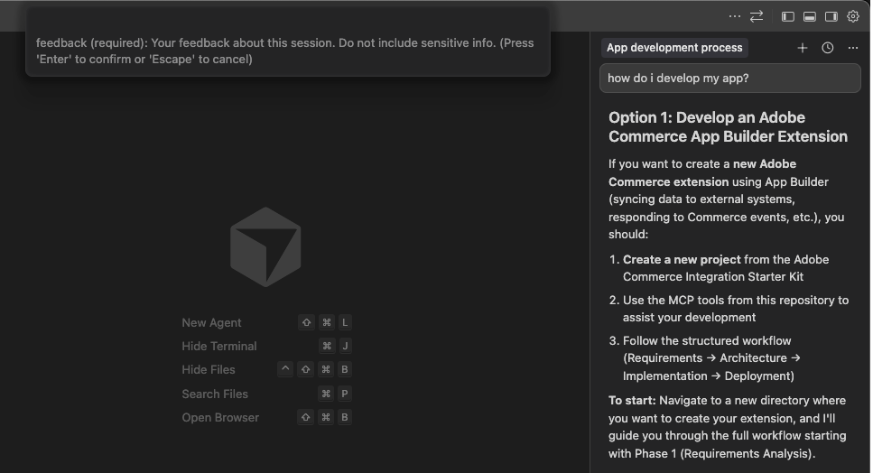
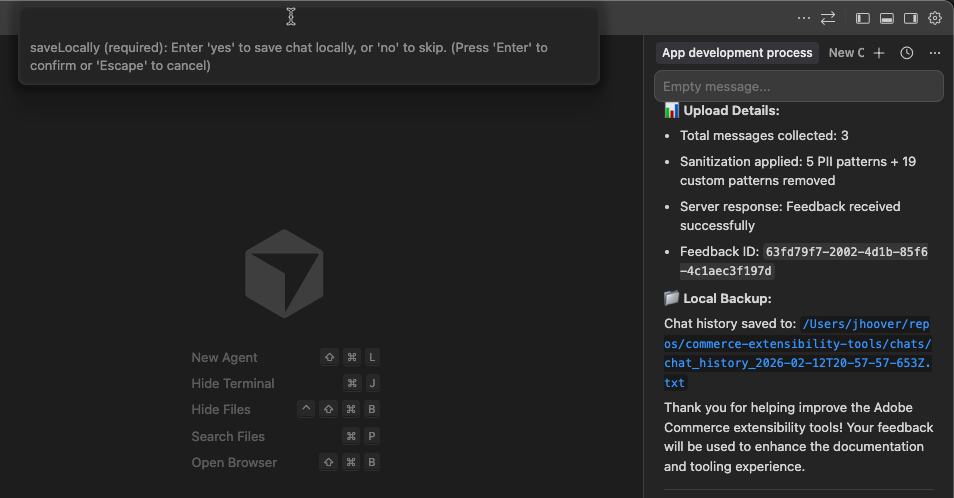

# ADOBE COMMERCE App BuilderのAI コーディング開発者向けツール

[!DNL Adobe Commerce as a Cloud Service]に移行する場合、AI コーディングツールを使用して、既存の[!DNL Adobe Commerce]個のPHP拡張機能を[!DNL Adobe Developer App Builder]個のアプリケーションに変換できます。 これらのツールを使用して、新しい[!DNL App Builder] アプリケーションを作成することもできます。

AI コーディングツールには、次のような利点があります。

* **拡張開発ワークフロー**：統合されたAdobe Commerce開発ツール。
* **AIを活用した支援**: コンテキストに応じたコード生成とデバッグ。
* **Commerce固有の機能**: Adobe Commerce App Builder開発向けの専用ツール。
* **自動化されたワークフロー**：開発およびデプロイメントのプロセスを合理化しました。

AI コーディングツールをインストールすると、次の機能にアクセスできます。

* スキル – アプリケーション開発のガイドと情報を提供するために設計された、Adobe CommerceおよびApp Builder固有のスキルセットです。
* 開発者MCP サーバー
* App Builder MCP Server

## 最新バージョンへの更新

AI コーディング開発者ツールを[&#x200B; インストールした後](#installation)、次のコマンドを実行して最新バージョンに更新できます。

```bash
aio commerce extensibility tools-setup
```

これにより、ツールが最新バージョンに更新されます。

## 前提条件

* [&#x200B; エージェントのスキル &#x200B;](https://agentskills.io/home#adoption)をサポートするすべてのコーディングエージェント （例：）

   * [カーソル](https://cursor.com/download)
   * [クロード・コード](https://www.claude.com/product/claude-code)
   * [GitHub Copilot](https://github.com/features/copilot)
   * [ウィンドサーフ](https://windsurf.com)
   * [Gemini CLI](https://github.com/google-gemini/gemini-cli)
   * [OpenAI Codex](https://openai.com/index/introducing-codex/)
   * [Cline](https://cline.bot)

* [Node.js](https://nodejs.org/en/download): LTS バージョン
* パッケージマネージャー：[npm](https://docs.npmjs.com/downloading-and-installing-node-js-and-npm)または[yarn](https://classic.yarnpkg.com/lang/en/docs/install/#mac-stable)
* [Git](https://github.com/git-guides/install-git): リポジトリの複製とバージョン管理

## インストール

1. 最新の[Adobe I/O CLI](https://github.com/adobe/aio-cli)をグローバルにインストールします。

   ```bash
   npm install -g @adobe/aio-cli
   ```

1. 次のプラグインをインストールします。

   * [ADOBE I/O CLI COMMERCE](https://github.com/adobe-commerce/aio-cli-plugin-commerce)
   * [Adobe I/O CLI Runtime](https://github.com/adobe/aio-cli-plugin-runtime)
   * [APP BUILDER CLI](https://github.com/adobe/aio-cli-plugin-app-dev)

   ```bash
   aio plugins:install https://github.com/adobe-commerce/aio-cli-plugin-commerce @adobe/aio-cli-plugin-app-dev @adobe/aio-cli-plugin-runtime
   ```

1. 次のいずれかを複製します。

   * Commerce [統合スターターキット &#x200B;](https://developer.adobe.com/commerce/extensibility/starter-kit/integration/create-integration) - バックオフィス統合を構築します。

     ```bash
     git clone git@github.com:adobe/commerce-integration-starter-kit.git
     ```

   * 支払い、送料、税金など、チェックアウト体験を構築または拡張するためのCommerce [&#x200B; チェックアウトスターターキット &#x200B;](https://developer.adobe.com/commerce/extensibility/starter-kit/checkout/)。

     ```bash
     git clone git@github.com:adobe/commerce-checkout-starter-kit.git
     ```

1. スターターキットのディレクトリに移動します。

   ```bash
   cd commerce-integration-starter-kit
   ```

1. インタラクティブなsetup コマンドを実行して、Commerce AI拡張機能ツールをインストールします。

   ```bash
   aio commerce extensibility tools-setup
   ```

   設定プロセスでは、設定オプションの入力を求められます。 プロンプトに従ってインストールを完了します。 ツールは、選択したディレクトリにインストールされます。

   * プロジェクトに使用するスターターキットを選択します。

     ```shell-session
     ? Which starter kit would you like to use?
     ❯ Integration starter kit
        Checkout starter kit
     ```

   * 任意のコーディングエージェントを選択します。 40を超えるコーディングエージェントがサポートされていますが、希望するエージェントが表示されない場合は、`Other` オプションを使用して、任意のコーディングエージェントのスキルをインストールできます。 スキルの設定方法については、コーディングエージェントのドキュメントを参照してください。

     ```shell-session
     ? Which coding agent would you like to install skills for?
     ❯ Cursor
        Claude Code
        GithubCopilot
        Windsurf
        Gemini CLI
        OpenAI Codex
        Cline
        ...
     ```

   * インストーラーは、NPMまたはYarnがインストールされているかどうかを検出し、適切な選択を自動的に行います。 ただし、インストールしていない場合は、パッケージマネージャーを選択するように求めるメッセージが表示されます。Adobeでは、次の一貫性を保つために`npm`を使用することをお勧めします。

     ```shell-session
     ? Which package manager would you like to use?
     ❯ npm
        yarn
     ```

1. コーディングツールを正常にインストールすると、インストールプロセスで次の設定が行われます。

   * Adobe Commerce開発向けMCP サーバー統合
   * 強化された開発エクスペリエンス用の[&#x200B; エージェントスキル &#x200B;](#skills)
   * Commerce専用の開発ツールとワークフロー

   スキルとMCP ツールがインストールされました。 スキルとMCP ツールが表示されない場合は、コーディングエージェントを再起動します。

>[!NOTE]
>
>プロジェクトをデプロイする前に、次の設定タスクを完了する必要があります。
>
>* Adobe I/O CLIを使用して[Adobe Developer Console](https://developer.adobe.com/console)にログインします。
>* App Builder プロジェクトを作成します（[&#x200B; プロジェクト設定](https://developer.adobe.com/commerce/extensibility/events/project-setup)を参照）。
>* `.env` ファイルで環境変数を設定します。
>
>これらの設定手順を手動で完了することも、AI コーディングツールを活用してプロセスを導くこともできます。 設定手順の詳細については、[統合の作成](https://developer.adobe.com/commerce/extensibility/starter-kit/integration/create-integration/)を参照してください。

## インストール後の設定

### Adobe I/O CLIにログインします

[!DNL Adobe I/O CLI]をインストールしたら、MCP サーバーを使用するときはいつでもログインする必要があります。

```bash
aio auth login
```

ログインしていることを確認するには、次のコマンドを実行します。

```bash
aio where
```

問題が発生した場合は、ログアウトして再度ログインしてみてください。

```bash
aio auth logout
aio auth login
```

>[!NOTE]
>
>MCP サーバーの一部の機能はログインせずに動作しますが、RAG （Retrieval-Augmented Generation）サービスは動作しません。 RAG サービスでは、AI コーディングエージェントにAdobe Commerceのドキュメントセット全体にリアルタイムでアクセスできるため、現在のCommerceの開発慣行、API、アーキテクチャパターンにもとづいて質問に回答し、コードを生成することができます。

### カーソル

1. カーソル IDEを再起動して、新しいMCP ツールと設定を読み込みます。

1. スキルが`.cursor/skills/` フォルダーの下にあることを確認して、インストールを確認します。

1. MCP サーバーを有効にします。

   * 「**Cmd+Shift+P**」（macOS）または「**Ctrl+Shift+P**」（WindowsおよびLinux）を使用してCursor MCP Settingsを開きます。
   * タイプ **表示：MCP設定を開く**
   * リストから&#x200B;**commerce-extensibility MCP Server**&#x200B;を探します
   * サーバー&#x200B;**ON**&#x200B;を切り替えて、コーディングツールを有効にします

1. サーバーステータスを確認する – Commerce拡張性MCP Serverは次のように表示されます。

   ```shell-session
   Status: Connected/Active
   Server: commerce-extensibility
   Configuration: Automatically configured via .cursor/mcp.json
   ```

1. 次のプロンプトを使用して、エージェントがMCP サーバーを使用しているかどうかを確認します。 そうでない場合は、使用可能なMCP ツールを使用するようにエージェントに明示的に依頼します。

   ```shell-session
   What are the differences between Adobe Commerce PaaS and Adobe Commerce as a Cloud Service when configuring a webhook that activates an App Builder runtime action?
   ```

### コパイロット

1. Visual Studio Codeを再起動して、新しいMCP ツールと設定を読み込みます。

1. `copilot-instructions.md` ファイルが`.github` フォルダーに存在することを確認して、インストールを確認します。

1. MCP サーバーを有効にします。

   * 左側のサイドバーのアクティビティバーにある&#x200B;**Extensions** アイコンをクリックするか、**Cmd+Shift+X** （macOs）または&#x200B;**Ctrl+Shift+X** （WindowsおよびLinux）を使用して、拡張機能パネルを開きます。
   * 「[!UICONTROL **MCP SERVERS - INSTALLED**]」をクリックします。
   * [!UICONTROL **commerce-extensibility MCP Server**]&#x200B;の横にある歯車アイコンをクリックし、サーバーが停止している場合は&#x200B;[!UICONTROL **Start Server**]&#x200B;を選択します。
   * 歯車アイコンをもう一度クリックし、[!UICONTROL **出力を表示**]&#x200B;を選択します。

1. サーバーのステータスを確認します。 `MCP:commerce-extensibility`出力は次の値と一致する必要があります。

   ```shell-session
   2025-11-13 12:58:50.652 [info] Starting server commerce-extensibility
   2025-11-13 12:58:50.652 [info] Connection state: Starting
   2025-11-13 12:58:50.652 [info] Starting server from LocalProcess extension host
   2025-11-13 12:58:50.657 [info] Connection state: Starting
   2025-11-13 12:58:50.657 [info] Connection state: Running
   
   (...)
   
   2025-11-13 12:58:50.753 [info] Discovered 10 tools
   ```

1. 次のプロンプトを使用して、エージェントがMCP サーバーを使用しているかどうかを確認します。 そうでない場合は、使用可能なMCP ツールを使用するようにエージェントに明示的に依頼します。

   ```shell-session
   What are the differences between Adobe Commerce PaaS and SaaS when configuring a webhook that activates an App Builder runtime action?
   ```

## サンプルプロンプト

次のサンプルプロンプトでは、統合スターターキットを使用して、注文が行われたときに通知を送信するアプリケーションを作成します。

```shell-session
Implement an Adobe Commerce SaaS application that will send an ERP notification when a customer places an order. The ERP notification must be sent as a POST HTTP call to <ERP URL> with the following details in the request JSON body:

Order ID -> orderID
Order Total -> total
Customer Email ID -> emailID
Payment Type -> pType
```

次のサンプルプロンプトでは、チェックアウトスターターキットを使用して、カスタム配送方法を提供するアプリケーションを作成します。

```shell-session
Implement an Adobe Commerce SaaS application that provides custom shipping methods.
The extension should:
1. Return shipping options based on the destination postal code
2. If postal code is in California, add an "Express California" option for $15
3. If postal code is outside US, add an "International Standard" option for $25
4. The carrier code should be "MYSHIP"
```


## プロンプトコマンド

プロンプトに加えて、`/search-commerce-docs` コマンドを使用して、担当者との会話でドキュメントを検索できます。 例：

```shell-session
/search-commerce-docs "How do I subscribe to Commerce events?"
```

## スキル

コーディングエージェントとチャットすると、スキルは自動的に呼び出されますが、次のコマンドを使用して手動で呼び出すこともできます。

* `/architect` - [!DNL App Builder]と選択したスターターキットを使用して、Adobe Commerce拡張機能のアーキテクチャを設計します。 統合の計画、イベントの選択、データフローの設計、アーキテクチャに関する意思決定などで使用できます。
* `/developer` - [!DNL App Builder] パターンとファイル構造に従うAdobe Commerce拡張機能を実装します。 コードの生成、設定ファイルの更新、またはランタイムアクションの実装時に使用します。
* `/devops-engineer` - [!DNL App Builder]個の拡張機能をデプロイして操作します。 アプリケーションのデプロイ、環境の設定、デプロイメントの問題のトラブルシューティング、CI/CDの設定、オンボーディングエラーの解決に使用します。
* `/product-manager` - Adobe Commerce拡張機能の要件を収集および文書化します。 新しいプロジェクトの開始、承認基準の定義、ビジネス目標の明確化、`REQUIREMENTS.md`件のドキュメントの作成に使用します。
* `/technical-writer` - [!DNL App Builder] アプリケーションの包括的なドキュメントを作成します。 `README.md`、ユーザーガイド、API ドキュメント、変更点、またはドキュメントの完全性を確保する場合に使用します。
* `/tester` - [!DNL App Builder] アプリケーションの包括的なテストを作成します。 ユニットテストの記述、統合テスト、セキュリティの検証、コード品質とカバレッジの確保に使用します。
* `/tutor` （実験的） - [!DNL Adobe Commerce]のアプリケーション開発の概念を、明確な説明と例を用いて教えます。 [!DNL App Builder]を学習する場合、イベントを理解する場合、または開発パターンに関するガイダンスを必要とする場合に使用します。

## ベストプラクティス

Adobeでは、AI コーディングツールを使用する場合、次のベストプラクティスに従うことをお勧めします。

### プランモード

コーディングエージェントとチャットする場合は、**プラン** モードを選択して、プロジェクトの詳細な実装計画を作成する必要があります。

**プラン** モードの選択方法は、使用しているエージェントによって異なります。 手順については、担当者のドキュメントを参照してください。 例：

* [カーソル](https://cursor.com/docs/agent/modes)
* [クロード・コード](https://code.claude.com/docs/en/common-workflows#when-to-use-plan-mode)
* [Gemini CLI](https://geminicli.com/docs/cli/plan-mode/)

### チェックリスト

開発セッションを開始する前に：

* `REQUIREMENTS.md`を確認
* MCP ツールが機能していることを確認する
* 現在のフェーズと目標の見直し
* サンプルコードまたは足場プロジェクトから開始

開発中：

* 4段階の[&#x200B; プロトコル &#x200B;](#protocol)を信頼する
* 複雑な開発の実装計画を依頼する
* 利用可能な場合はMCP ツールを使用する
* 実装後に各機能をテストし
* 最初にローカルでテストし、次にデプロイして再度テストします
* テストサポートにコーディングツールを活用する
* 複雑で複雑な質問
* 段階的にデプロイして開発を迅速化

新しいチャットを開始する場合：

* セッションの適切な引き継ぎを提供
* `@`でキーファイルを参照します
* セッションの明確な目標の設定
* フェーズに応じた境界の使用

### ワークフロー

AI コーディングツールを使用して開発する場合は、サンプルコードまたは基礎プロジェクトから始めます。 このアプローチにより、AI開発ワークフローを最適化しながら、ゼロから始めるのではなく、強固な基盤の上に構築することができます。

これにより、確立されたディレクトリ構造と規則を維持しながら、Adobeのテンプレートを活用し、実績のあるパターンとアーキテクチャに基づいて構築することも可能です。

開始するには、次のリソースを参照してください。

* [統合スターターキット](https://developer.adobe.com/commerce/extensibility/starter-kit/integration/create-integration)
* [チェックアウトスターターキット](https://developer.adobe.com/commerce/extensibility/starter-kit/checkout/)
* [Adobe Commerce starter kit テンプレート](https://github.com/adobe/adobe-commerce-samples/tree/main/starter-kit)
* [Adobe I/O Events スターターテンプレート](https://experienceleague.adobe.com/en/docs/commerce-learn/tutorials/adobe-developer-app-builder/io-events/getting-started-io-events)
* [App Builder サンプルアプリケーション](https://developer.adobe.com/app-builder/docs/resources/sample_apps)

#### なぜこれらのリソースを使うべきか

* **実証済みのパターン**: スターターキットは、Adobeのベストプラクティスとアーキテクチャに関する意思決定を体現しています
* **開発を高速化**：定型文と設定に費やす時間を削減します
* **一貫性**: アプリケーションが確立された規則に従っていることを確認します
* **メンテナンス性**：標準パターンに従うと、メンテナンスと更新が簡単になります
* **ドキュメント**：スターターキットには、例とドキュメントが付属しています
* **コミュニティサポート**：標準的なアプローチを使用する場合は、ヘルプを簡単に入手できます
* **AIのコンテキスト効率**：使い慣れたパターンや構造を使用して作業を行うことで、詳細な説明の必要性を減らし、コード生成の精度を向上させます
* **トークンの使用量の削減**：すべてをゼロから生成するのではなく、既存のパターンを参照することで、より効率的な会話とコンテキストの要約が減少します

### プロトコル

次の4段階のプロトコルは、インストールされたスキルによって自動的に適用されます。 アプリケーションを開発する場合、ツールは自動的にこのプロトコルに従う必要があります。

* フェーズ 1：要件分析と明確化
   * 質問を明確にするときは、完全な答えを提供してください。
* フェーズ 2：建築プランニングとユーザーの承認
   * 計画を提示したら、承認する前に慎重に確認します。
* フェーズ 3: コードの生成と実装
* フェーズ 4：文書化と検証

### 複雑な開発の実装計画を依頼する

複数のランタイムアクション、タッチポイント、または統合を含む複雑な開発の場合は、AI ツールに詳細な実装計画を作成することを明示的に依頼します。 複数のコンポーネントを含む[&#x200B; フェーズ 2](#protocol)の上位レベルの計画が表示された場合は、詳細な実行計画を求めて、管理可能なタスクに分割します。

```shell-session
Create a detailed implementation plan for this complex development.
```

Adobe Commerceの複雑なアプリケーションには、次のようなものがあります。

* 複数のランタイムアクション
* 複数の顧客接点をまたいだイベント設定
* 外部システムとの統合
* 状態管理の要件
* 複数のコンポーネントをまたいだテスト

### MCP ツールの使用

>[!NOTE]
>
>MCP ツールを使用する前に、Adobe I/O CLI[&#128279;](#log-in-to-the-adobe-io-cli)に ログインしていることを確認してください。

このツールはデフォルトではMCP ツールですが、特定の状況では代わりにCLI コマンドを使用できます。 MCP ツールの使用状況を確認するには、プロンプトで明示的にリクエストします。

使用されているCLI コマンドが表示され、代わりにMCP ツールを使用する場合は、次のプロンプトを使用します。

```shell-session
Use only MCP tools and not CLI commands
```

* MCP ツール：aio-app-deploy、aio-app-dev、aio-dev-invoke
* CLI コマンド：aio app deploy、aio app dev

CLI コマンドは、次のシナリオで使用できます。

* 複雑な導入シナリオ
* 特定の問題のデバッグ
* MCP ツールに制限がある場合
* MCP統合のメリットがない1回限りの運用

### 開発

AI ツールによって生み出された不必要な複雑さに疑問を抱く。

単純な読み取り専用エンドポイントに対して不要なファイル（`validator.js`、`transformer.js`、`sender.js`）が追加された場合は、次のプロンプトを使用します。

```shell-session
Why do we need these files for a simple read-only endpoint?
Perform a root cause analysis before adding complexity
Verify if simpler solutions exist
```

### テスト

テスト時には、次のベストプラクティスを使用します。

#### 実装後に各機能をテストし

実装計画で機能の開発を完了したら、すぐにテストします。 早期テストは、複合的な問題を防ぎ、デバッグを容易にします。

* すべての機能が完了するまで待ってはいけません
* 問題を早期に発見するために、段階的にテストする
* 次の機能に移行する前に、機能を検証する

#### 最初にローカルでテスト

常に`aio-app-dev` ツールを使用してローカルでテストします。 これにより、迅速なフィードバックが可能になり、反復サイクルの高速化、デバッグの簡素化、デプロイメントのオーバーヘッドがなくなります。

1. ローカル開発サーバーを起動：

   ```bash
   aio-app-dev
   ```

1. アクションをローカルでテストします。

   ```bash
   aio-dev-invoke action-name --parameters '{"test": "data"}'
   ```

#### デプロイして、もう一度テストする

ローカルテストが成功したら、ランタイム環境でデプロイしてテストします。 ランタイム環境では、ローカル開発とは異なる動作を行うことができます。

1. ランタイムにデプロイ：

   ```bash
   aio-app-deploy
   ```

1. デプロイ済みアクションのテスト

1. Web ブラウザーまたはダイレクト HTTP リクエストを使用する

1. デバッグ用のアクティベーションログを確認する

#### テストサポートにコーディングツールを活用する

テストに関するサポートを依頼する。 これらのツールは、デバッグ、ログ分析、特定のランタイムアクションに適したテストデータの作成に役立ちます。

**実行時アクションのテスト**:

```shell-session
Help me test the customer-created runtime action running locally
```

**デバッグエラー**:

```shell-session
Why did the subscription-updated runtime action activation fail?
```

**ログを確認**:

```shell-session
Help me check the logs for the last stock-monitoring runtime action invocation
```

**テストペイロードを作成**:

```shell-session
Generate test data for this Commerce event
```

```shell-session
Create a test payload for the customer_save_after event
```

**ランタイムエンドポイントを検索**:

```shell-session
What's the URL for this deployed action?
```

**認証を処理**:

```shell-session
How do I authenticate with this external API?
```

**トラブルシューティング**:

```shell-session
Help me debug why this action is returning 500 errors
```

### デバッグ

問題が発生したときに停止して評価します。 問題が発生した場合：

* 停止して評価 – 壊れた状態で続けないでください
* ログの確認 – アクティベーションログを使用して問題を特定します
* 簡素化 – 複雑さを取り除いて問題を分離
* 段階的にテストする – 一度に1つの問題を修正します
* 検証 – 続行する前に各修正をテストします

### 展開

デプロイ時には、次のベストプラクティスを使用します。

#### 段階的にデプロイ

変更されたアクションのみをデプロイして、開発をスピードアップします。 これにより、既存の機能に欠陥が発生するリスクを低減し、変更に対してすばやくフィードバックできます。

* MCP ツールを使用して特定のアクションを展開する

  ```bash
  aio-app-deploy --actions action-name
  ```

* ローカルでのテスト後に個々のアクションをデプロイする
* 段階的にデプロイし、開発中に完全なアプリケーションのデプロイを避ける

#### ランタイムのクリーンアップ

大規模な変更後は、ツールを活用して孤立したアクションをクリーンアップします。 AI ツールにクリーンアッププロセスを体系的に処理させます。 AI アシスタントは、孤立した行動を効率的に特定し、その状況を検証して、手作業なしに安全に削除することができます。

```shell-session
Help me identify and clean up orphaned runtime actions
```

AI ツールに対して、デプロイされたアクションのリストと未使用のアクションの特定を依頼する

```shell-session
List all deployed actions and identify which ones are no longer needed
```

AI ツールに、孤立したアクションを適切なコマンドを使用して削除させる

```shell-session
Remove the orphaned actions that are no longer part of the current implementation
```

### 監視

アプリケーションを監視する際には、次のベストプラクティスを使用します。

#### コンテキスト品質指標の確認

* **良好なコンテキスト**: AIは最近の決定を記憶し、正しいファイルを参照します
* **不適切なコンテキスト**:AIが以前に提供された情報を要求し、解決された問題を繰り返します

#### 開発ベロシティの追跡

* **高速**：明確な進行状況、最小限の明確化が必要
* **低速**：繰り返し説明、AIの混乱、進行の遅さ

#### コスト効率の測定

トークン使用パターンの追跡：

* **効率的**：トークンの使用率が低く、コンテキストの要約が少ない
* **非効率的**：トークンの使用率が高い、複数の要約、繰り返し作業

## 避けるべきこと

AI コーディングツールを使用する際には、次のアンチパターンを回避してください。

* **明確化フェーズをスキップしない** – 実装する前に、必ずフェーズ 1が完了していることを確認してください。
* **各機能の後にテストをスキップしない** – 段階的にテストします。すべてが完了するまで待ってはいけません。
* **根本原因分析なしで複雑さを追加しないでください** – 不要なファイルの追加について質問し、適切な調査を依頼します。
* **実際のデータテストを行わないと成功を宣言しない** – 常にエッジケースだけでなく、実際のデータを使用してテストを行います。
* **実行時のクリーンアップを忘れないでください** – 大きな変更の後は、常に孤立したアクションをクリーンアップします。

## フィードバックの提供

AI コーディング ツールに関するフィードバックを提供することに関心のある開発者は、`/feedback` コマンドを使用できます。

このコマンドを使用すると、テキストフィードバックを提供し、ログをAdobeに送信できます。 送信したログは、個人情報や個人情報を削除するために消毒されます。

>[!TIP]
>
>ユーザーエクスペリエンスは、使用しているIDEによって少し異なります。 次のプロセスでは、カーソルでのエクスペリエンスについて説明します。

1. エージェントで、`/feedback`と入力し、`commerce-extensibility/feedback` コマンドを選択します。

1. IDEの上部に表示される「**フィードバック**」フィールドにツールのフィードバックを入力し、**Enter** キーを押します。

   {width="600" zoomable="yes"}

1. 「**ローカルに保存**」フィールドに「`yes`」または「`no`」を入力し、**Enter**」を押して、ログのローカルコピーを保存するかどうかを指定します。

   {width="600" zoomable="yes"}

   **はい**&#x200B;を選択した場合は、フィードバックを送信した後、`chats` フォルダー内のログを確認できます。

1. エージェントのチャット入力フィールドに`commerce-extensibility/feedback` コマンドが表示されます。 **Enter**&#x200B;を押すか、**Send**&#x200B;をクリックして、Adobeにフィードバックを送信します。

>[!NOTE]
>
>`/feedback` コマンドが表示されない場合は、[最新バージョン &#x200B;](#updating-to-the-latest-version)に更新する必要がある可能性があります。
