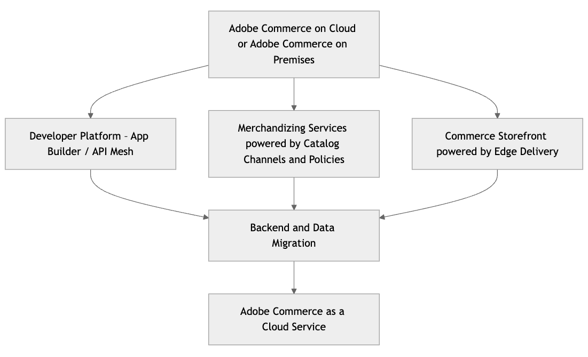
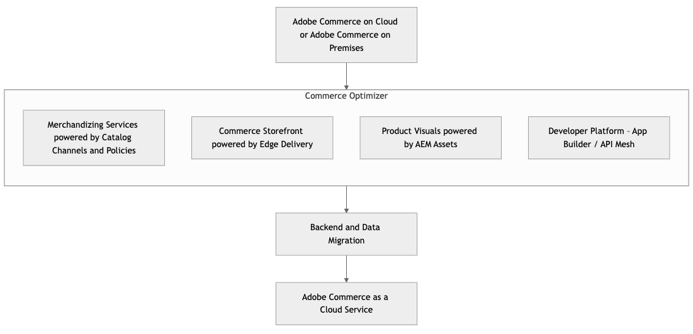

# [!DNL Adobe Commerce as a Cloud Service]に移行

[!DNL Adobe Commerce as a Cloud Service]では、既存のAdobe Commerce PaaSの実装から新しいAdobe Commerce as a Cloud Service（SaaS）の提供に移行する開発者向けの包括的なガイドを提供しています。 Adobe Commerce as a Cloud Serviceは、フルマネージド型のバージョン不要のSaaS モデルへの大幅な移行を表し、パフォーマンスの向上、拡張性、運用の簡素化、より広範な[!DNL Adobe Experience Cloud]との緊密な統合を実現します。

>[!NOTE]
>
>移行ツールについて詳しくは、[一括データ移行ツール ](./bulk-data.md)を参照してください。

## 移行の概要 – PaaSとSaaSの比較

**主な違い**

* [!BADGE PaaSのみ]{type=Informative url="https://experienceleague.adobe.com/en/docs/commerce/user-guides/product-solutions" tooltip="Adobe Commerce on Cloud プロジェクト（Adobeで管理されるPaaS インフラストラクチャ）とオンプレミス プロジェクトにのみ適用されます。"} **PaaS （現在）**：マーチャントは、Adobeのホスト環境でアプリケーションコード、アップグレード、パッチ適用、インフラストラクチャ設定を管理します。 サービス（MySQL、Elasticsearchなど）の[共有責任モデル ](https://experienceleague.adobe.com/en/docs/commerce-operations/security-and-compliance/shared-responsibility)。
* [!BADGE SaaSのみ]{type=Positive url="https://experienceleague.adobe.com/en/docs/commerce/user-guides/product-solutions" tooltip="Adobe Commerce as a Cloud ServiceおよびAdobe Commerce Optimizer プロジェクト（Adobeが管理するSaaS インフラストラクチャ）にのみ適用されます。"} **SaaS （新規 – [!DNL Adobe Commerce as a Cloud Service]）**: Adobeは、コアアプリケーション、インフラストラクチャ、およびアップデートを完全に管理します。 開発者は、拡張性ポイント（API、App Builder、UI SDK）によるカスタマイズに重点を置きます。 コアアプリケーションコードはロックされています。

**アーキテクチャへの影響**

* **バージョンのないプラットフォーム**：継続的な更新は、コアのメジャーバージョンのアップグレードが不要であることを意味します。
* **マイクロサービスとAPI ファースト**：拡張性と統合に対するAPIへの依存度を高めます。
* **デフォルトのヘッドレス（オプション）**：分離型ストアフロントの強力なサポート（Edge Delivery Servicesを搭載したCommerce ストアフロントなど）。
* **Edge Delivery Services**: フロントエンドのパフォーマンスとデプロイメントに影響します。

**新しいツールと概念**

* Adobe Developer App Builder](https://developer.adobe.com/graphql-mesh-gateway)の[Adobe Developer App Builder](https://developer.adobe.com/app-builder/)および[API メッシュ
* [Commerce Optimizer](../../optimizer/overview.md)
* [Edge 配信サービス](https://experienceleague.adobe.com/developer/commerce/storefront/)
* [Commerce Cloud Manager](../getting-started.md#create-an-instance)を使用したセルフサービス プロビジョニング

## 移行パス

[!DNL Adobe Commerce as a Cloud Service]は、タイムライン、ストアフロント、およびカスタマイズに応じて、複数の移行パスをサポートしています。

完全移行の代わりに、[!DNL Adobe Commerce as a Cloud Service]は段階的な移行をサポートし、Commerce Optimizerまたは増分アプローチを使用します。

* **増分移行**：このアプローチでは、データ、カスタマイズ、統合を段階的に移行します。 このアプローチは、複雑なカスタマイズとデータを自分のペースで[!DNL Adobe Commerce as a Cloud Service]に段階的に移行したいカスタマイズが多い大規模なマーチャントに最適です。

{width="600" zoomable="yes"}

* **Commerce Optimizer** – このアプローチでは、Commerce Optimizerを移行段階として使用して、複雑なカスタマイズとデータを自分のペースで[!DNL Adobe Commerce as a Cloud Service]に移行することで、反復的に移行できます。 Commerce Optimizerでは、カタログビューとポリシー、Edge Deliveryを活用したCommerce Storefront、および[!DNL Product Visuals powered by AEM Assets]を活用したマーチャンダイジングサービスにアクセスできます。

{width="600" zoomable="yes"}

* **完全移行**：このアプローチでは、すべてのデータ、カスタマイズ、および統合を一度に移行します。 このアプローチは、カスタマイズが少なく、[!DNL Adobe Commerce as a Cloud Service]にすばやく移行したい小規模なマーチャントに最適です。

次の表に、様々なストアフロントと設定の移行プロセスの概要を示します。

|                    | LUMA ストアフロント | PWA ストアフロント | Edge Deliveryを活用したCommerce Storefront | ヘッドレス |
|--------------------|----------------------------------------|----------------------------------------|------------------------------------------------------|----------------------------------------|
| データの移行 | 必須 | 必須 | 必須 | 必須 |
| ストアフロント | Edge Deliveryを活用したCommerce Storefrontへの移行 | Edge Deliveryを活用したCommerce Storefrontへの移行または管理 | 影響なし | 影響なし |
| API メッシュ | 新しいメッシュを構築 | 新しいメッシュを構築するか、既存のメッシュを再構成する | 新しいメッシュを構築するか、既存のメッシュを再構成する | 新しいメッシュを構築するか、既存のメッシュを再構成する |
| 連携 | 統合スターターキットの活用 | 統合スターターキットの活用 | 統合スターターキットの活用 | 統合スターターキットの活用 |
| カスタマイズ | App BuilderとAPI Meshへの移行 | App BuilderとAPI Meshへの移行 | App BuilderとAPI Meshへの移行 | App BuilderとAPI Meshへの移行 |
| Assets Management | OOTBを使用する場合は移行が必要 | OOTBを使用する場合は移行が必要 | OOTBを使用する場合は移行が必要 | OOTBを使用する場合は移行が必要 |
| 拡張機能 | App Builderへの移行 | App Builderへの移行 | App Builderへの移行 | App Builderへの移行 |

表に示されているように、各移行の緩和策は次のもので構成されます。

* **データ移行** – 提供された[移行ツール ](./bulk-data.md)を使用して、既存のインスタンスから[!DNL Adobe Commerce as a Cloud Service]にデータを移行します。
* **Storefront** - Edge Deliveryによって提供される既存のCommerce ストアフロントとヘッドレスストアフロントは緩和を必要としませんが、Luma ストアフロントでは、Edge Deliveryによって提供されるCommerce ストアフロントに移行する必要があります。 PWA Studio ストアフロントは、Edge Deliveryを搭載したCommerce ストアフロントに移行することも、現在の状態で維持することもできます。 Adobeは、ストアフロントの移行を支援するアクセラレータを提供します。
* **[API メッシュ ](https://developer.adobe.com/graphql-mesh-gateway)** – 新しいメッシュを作成するか、既存のメッシュを変更します。 Adobeでは、このプロセスを支援するために、事前に設定されたメッシュを提供します。
* **統合** – すべての統合では、[統合スターターキット ](https://developer.adobe.com/commerce/extensibility/starter-kit/integration/)または[[!DNL Adobe Commerce as a Cloud Service] REST API](https://developer.adobe.com/commerce/webapi/reference/rest/saas/)のいずれかを活用する必要があります。
* **カスタマイズ** – すべてのカスタマイズはApp BuilderとAPI Meshに移行する必要があります。
* **Assets Management** – すべてのアセット管理には移行が必要です。 既に[!DNL AEM Assets]を使用している場合、移行する必要はありません。
* **拡張機能**：処理中の拡張機能はすべて、処理外の拡張機能として再作成する必要があります。 2025年末までに、Adobeは最も人気のある拡張機能にアクセスし、ビルド時間を最小限に抑えます。

## 移行フェーズ

次のフェーズでは、[!DNL Adobe Commerce as a Cloud Service]への移行に必要な手順と考慮事項について説明します。

### 移行前の評価と計画

この段階は、リスクを最小限に抑え、明確な移行パスを確立して、問題が発生する前に特定するために非常に重要です。

**現在の環境の検出と監査**

**コードベース分析：**

* カスタムモジュール、テーマ、オーバーライドの決定：
* コアコードの変更を分析し、移行の一環としてリファクタリングが必要な箇所を決定します。
* サードパーティの拡張機能を評価し、[!DNL Adobe Commerce as a Cloud Service]との互換性を判断します。 SaaS対応の代替品はありますか？それとも、カスタム API統合やApp Builderアプリケーションを作成する必要がありますか？
* 移行されない非推奨のコードまたは機能を特定します。

**データ監査：**

* データベースのサイズと複雑さを評価する。
* 未使用のデータやテーブルを識別してクリーンアップします。
* 既存のデータのインポート/エクスポートプロセスの見直し：

**統合のレビュー：**

* Adobe Adobe Commerceと統合されているすべての外部システム（ERP、CRM、PIM、支払いゲートウェイ、配送プロバイダー、OMSなど）をリストアップしましょう。
* 統合方法（API、カスタムスクリプト、その他の方法）を評価します。
* [!DNL Adobe Commerce as a Cloud Service]のAPI ファースト アプローチとApp Builderとの互換性を評価します。

**パフォーマンス ベンチマーク：**

* 現在のLighthouse スコア、ページ読み込み時間、主要業績評価指標（KPI）を文書化し、移行後の改善を測定するためのベースラインを提供します。

**セキュリティ設定の確認：**

* WAFのカスタムルール、IP許可リスト、その他のセキュリティ構成を検証します。

**移行範囲と戦略の定義：**

* **段階的な移行と一括移行：**&#x200B;各アプローチの長所と短所を評価します。
* **コアビジネスプロセスを特定：**&#x200B;次のように、最初に移行する必要がある機能を優先します。
   * 複雑な価格設定ルール
   * 注文が正式に配置または処理される前に適用されるカスタムビジネスルール
   * 複雑な税計算
   * 住所の検証
   * 注文の実行後にトリガーされるカスタムロジック
* **ヘッドレスとモノリシックなストアフロント：**&#x200B;新しいストアフロントの開発または既存のストアフロントの適応の決定点。
* **統合戦略：**&#x200B;既存の統合をリプラットフォームする方法（API Mesh、App Builder、ダイレクト API）を決定します。
* **データ移行戦略：**&#x200B;完全な履歴データ、部分的なデータ、または移行されたデータを使用せずに移行するかどうかを決定します。

**チームの準備状況とトレーニング：**

* [!DNL Adobe Commerce as a Cloud Service]の概念、開発ワークフロー、新しいツールについて理解します。
* Adobe App Builder、Edge Delivery Services、[!DNL Adobe Commerce as a Cloud Service]のデプロイメントパイプラインを使用して、実践的なトレーニングを受けることができます。

**環境の設定とプロビジョニング：**

* Commerce Cloud Managerを使用して[!DNL Adobe Commerce as a Cloud Service] サンドボックスと開発環境をプロビジョニングします。

### 増分移行フェーズ

**戦略的リファクタリングと外部化**

このフェーズは、移行のコアで構成され、コードベースを[!DNL Adobe Commerce as a Cloud Service] クラウドネイティブのパラダイムに適応させることに重点を置いています。 これには、新しいAdobe サービスの戦略的な導入と、Commerceのコアプラットフォームからのカスタムロジックの移行が含まれます。

#### &#x200B;1. 「プロセス中」のカスタマイズと拡張機能をApp Builderに移行する

これは、[!DNL Adobe Commerce as a Cloud Service]のアーキテクチャ哲学の中心となる、「ロックされたコア」を達成し、ソリューションの将来性を確保するための重要な段階です。

* **複雑なロジックをApp Builderに外部化**: PaaS コードベース内の既存のカスタムモジュールとサードパーティの拡張機能を分析します。 複雑なビジネスロジック、オーダーメイドの統合、またはコアのCommerce データモデルの直接のプロセス内での操作を必要としないマイクロサービスの場合は、Adobe Developer App Builder内のサーバーレスアプリケーションとしてリファクタリングおよびリプラットフォームします。
* **API Mesh**&#x200B;を活用：複数のバックエンドシステム（PaaS Commerce バックエンド、ERP、CRM、カスタム App Builder マイクロサービスなど）からのデータを必要とするシナリオの場合は、App Builder内にAPI Mesh レイヤーを実装します。 これにより、異なるAPIを、新しいストアフロントやその他のサービスで利用される、パフォーマンスの高い単一のGraphQLエンドポイントに統合し、複雑なデータ取得を簡素化できます。
* **イベント駆動型アーキテクチャ**: Adobe I/O Eventsを利用して、PaaS インスタンスで発生するイベント（製品の更新、お客様の登録、注文ステータスの変更など）またはその他の接続されたシステムに基づいてApp Builderのアクションをトリガーします。 これにより、非同期コミュニケーションが促進され、緊密な連携が軽減され、システムの回復力が向上します。

**メリット**：このステップでは、詳細なカスタマイズに関連する技術的負債を大幅に削減し、Commerce インスタンスの[!DNL Adobe Commerce as a Cloud Service]への移行を大幅に高速化し、カスタムロジックの拡張性と独立したデプロイメント性を向上させ、拡張機能の開発サイクルを高速化します。

#### &#x200B;2. SaaS ベースのAdobe Commerceマーチャンダイジングサービスを導入し、カタログデータを統合する

これは、カタログデータ管理に関して2つのオプションを備えた重要な最初の統合ポイントです。

>[!BEGINTABS]

>[!TAB  オプション 1 – 既存のカタログ SaaS サービス ]

**PaaS バックエンドと統合された既存のカタログ SaaS サービスを活用**

このオプションは移行手順として機能し、PaaS バックエンドが[ カタログサービス ](../../catalog-service/guide-overview.md)、[ ライブ検索](../../live-search/overview.md)、[商品レコメンデーション ](../../product-recommendations/overview.md)のデータをAdobe Commerce SaaS サービスの既存のインスタンスに入力する既存の統合上に構築されます。

* **カタログデータの同期**: Adobe Commerce PaaS インスタンスが既存のAdobe Commerce Catalog SaaS サービスに商品データとカタログデータを引き続き同期することを確認します。 これは通常、PaaS インスタンス内の確立されたコネクタまたはモジュールに依存します。 カタログ SaaS サービスは、引き続き検索およびマーチャンダイジング機能の信頼できるソースであり、PaaS バックエンドからデータを取得します。
* **最適化のためのAPI Mesh**:（Edge Delivery Services上の）ヘッドレスストアフロントおよびその他のサービスは、カタログ SaaS サービスからデータを直接使用できますが、Adobeでは、（App Builder内で） API Meshを使用することを強くお勧めします。 API Meshは、カタログ SaaS サービスのAPIを、PaaS バックエンドの他の必要なAPI （トランザクションデータベースからのリアルタイムの在庫チェックや、カタログ SaaS サービスに完全にレプリケートされていないカスタム製品属性など）と統合して、パフォーマンスの高い単一のGraphQL エンドポイントにすることができます。 これにより、キャッシュ、認証、応答の一元変換も可能になります。
* **ライブサーチと商品レコメンデーションを統合**: ライブサーチと商品レコメンデーションのSaaS サービスを設定して、既存のAdobe Commerce Catalog SaaS サービスから[ カタログデータを直接取り込みます](https://experienceleague.adobe.com/en/docs/commerce/live-search/install#configure-the-data)。これは、PaaS バックエンドによって入力されます。

**メリット**：これにより、既存および運用中のカタログ SaaS サービスとそのPaaS バックエンドとの統合パイプラインを活用することで、ヘッドレスストアフロントと高度なSaaS マーチャンダイジング機能を迅速に実現できます。 ただし、プライマリカタログデータソースのPaaS バックエンドへの依存は保持され、新しいコンポーザブルカタログデータモデルに固有のマルチソース集計機能は提供されません。 このオプションは、より包括的なコンポーザブルアーキテクチャに向けた有効な足がかりとなります。

>[!TAB  オプション 2 - コンポーザブルカタログデータモデル ]

**新しいコンポーザブルカタログデータモデル（CCDM）の導入**

Adobe Adobe Commerce Optimizerなら、戦略的かつ将来を見据えた方法で、さまざまなオーディエンスに対応できます。 CCDMは、マルチソースデータの集約と動的なマーチャンダイジングのために設計された、柔軟性、拡張性、統合されたカタログサービスを提供します。

* **データの取り込みと統合**
   * まず、既存のAdobe Commerce PaaS インスタンス（および/または他のPIM/ERP システム）から新しいコンポーザブルカタログデータモデル（CCDM）に商品データとカタログデータを取り込みます。
   * 既存の製品属性をCCDMの柔軟なスキーマにマッピングできます。 取り込む際に、重要な商品データを優先する。
   * 継続的に同期するための強固なデータパイプラインを構築する。 これには次が含まれます。
      * **イベント駆動型** （App Builder経由）: PaaS インスタンスのAdobe I/O Eventsを利用して、一般公開またはカスタムのAdobe App Builder アプリケーションをトリガーします。 これらのアプリケーションは、APIを介してデータの変更（作成、更新、削除）をCCDMに変換およびプッシュします。
      * **バッチ取り込み**：大規模な初回読み込みや定期的な一括更新の場合は、Adobe Experience Platform（AEP）取り込みサービスによってCCDMに処理されるステージング領域への安全なファイル転送（CSVやJSONなど）を使用します。
      * **直接API統合** （App Builder オーケストレーションを使用）：より複雑なシナリオでは、App Builderはオーケストレーションレイヤーとして機能し、PaaS バックエンドに直接API呼び出しを行い、データを変換してCCDMにプッシュします。
* **カタログビューとポリシー定義**：カタログビュー（ストアビュー、地域、B2B/B2C セグメントなどの一意のカタログプレゼンテーション用の論理グループ）を設定し、CCDM内でポリシー（製品プレゼンテーション、フィルタリング、マーチャンダイジング用のルールセット）を定義します。 これにより、カタログビューごとに、商品の品揃えや表示ロジックを動的に制御できます。
* **ライブサーチと商品レコメンデーションの統合**: カタログデータがCCDMに存在したら、AdobeのSaaS ベースのライブサーチと商品レコメンデーションサービスを統合します。 これらは、Adobe AIのAIとマシンラーニングモデルを活用して、優れた検索関連性とパーソナライズされたレコメンデーションを実現し、CCDMから直接データを取得します。

**利点**: カタログ管理と発見をCCDMと関連するSaaS サービスに抽象化することで、パフォーマンスの向上、AI主導のマーチャンダイジング機能の獲得、従来のバックエンドからの読み取り操作の大幅なオフロード、funnelの上部エクスペリエンスの堅牢な「ピルオフ」を実現します。

>[!ENDTABS]

#### &#x200B;3. Edge Delivery Servicesでストアフロントを構築する

マーチャンダイジングデータパイプラインを確立し、外部化することで、高性能なフロントエンドを構築することに重点を移します。

* **初期設定**: Edge Delivery ServicesのAdobe Commerce Storefront ボイラープレートを使用してプロジェクトを設定します。 これにより、最新のweb テクノロジーを基盤としたヘッドレスフロントエンドを構築できます。
* **カタログサービスとAPI メッシュに接続**:Commerce ストアフロントは、主にGraphQL APIを通じてデータを使用します。
   * **オプション 1**：製品情報とマーチャンダイジングルールの既存のカタログ SaaS サービス（API メッシュ経由）から。
   * **オプション 2**：製品情報とマーチャンダイジングルールのCCDMから。
   * API Meshから、従来のバックエンド（PaaS インスタンス）またはカスタムApp Builderサービス（例：リアルタイム在庫、カスタム商品属性、ロイヤルティポイント表示）からオーケストレーションされたデータを取得できます。
* **コンテンツの移行（AEM サービス）**：既存の静的コンテンツ（例：「会社概要」ページ、ブログ投稿、マーケティングバナー）をAEM サービスに移行し、Commerce ストアフロントを強化します。 AEMのコンテンツオーサリング機能を活用して、アセットをEdge Delivery Services向けに最適化します。
* **コア UI コンポーネントの開発**: Edge Delivery Services ドロップインコンポーネントとカスタム React/Vue コンポーネントを使用して、製品詳細ページ（PDP）、製品リストページ（PLP）、一般的なコンテンツページ用の重要なユーザーインターフェイスコンポーネントを構築します。 コアコマースフローを優先する：
* **既存のカート/チェックアウトとの統合**：当初、Edge Delivery Services ストアフロントは、既存のAdobe Commerce PaaS （または他のサードパーティプラットフォーム）へのカート管理とチェックアウトの引き継ぎを調整します。 これには通常、次が含まれます。
   * **リダイレクト**: ユーザーをレガシープラットフォームのネイティブカートおよびチェックアウト URLにリダイレクトし、必要なセッションおよびカート識別子を渡します。
   * **ダイレクト API インタラクション** （App Builder オーケストレーションを使用）: Edge Delivery Services内で、PaaS バックエンドのカートおよびチェックアウト APIと直接対話するカスタムカートおよびチェックアウト UI コンポーネントを構築します。 多くの場合、App Builderをフロントエンド向けバックエンド（BFF）として使用し、複数のバックエンドサービス（PaaS カート、支払いゲートウェイ、配送計算機など）への通話を調整します。

**利点**：高速で、SEO最適化済みの、柔軟性の高いストアフロント体験を提供します。 この段階は、優れた顧客体験に直接貢献し、将来のフロントエンドイノベーションの土台となります。

#### &#x200B;4. データの移行（段階的なプロセス）

データの移行は、リファクタリングとストアフロントの開発を同時に実行し、データの一貫性と整合性を確保する、重要で多面的なプロセスです。

* **既存のデータのクリーニングと最適化**：大規模な移行の前に、既存のPaaS データベースで包括的なデータクレンジング、重複排除、検証を実行します。 この積極的なステップは、レガシーデータの問題の転送を最小限に抑え、新しい環境でデータの品質を確保するために非常に重要です。

**データの一括移行**

一括データ移行では、Adobe Commerce PaaS インスタンスから完全なデータダンプを取得し、データセット全体を変換して、Adobe Commerce as a Cloud Serviceに一度にインポートします。 この方法は通常、データの初期母集団に使用されます。

* **ツールの可用性**：ファーストパーティ Commerceの一括データ移行のお客様用の専用[一括データ移行ツール ](./bulk-data.md)は、2026年第1四半期にリクエストで利用できるようになります。 お客様が事前に一括データ移行のサポートを必要とする場合は、Adobeがリクエストによりデータ転送を促進します。

* **プロセス**:
   * **完全なデータ書き出し**:Adobe Commerce PaaS インスタンスから完全なデータセットを抽出します（例：製品、カテゴリ、顧客アカウント、過去の注文データ、静的ブロック、ページコンテンツ）。
   * **データ変換**：抽出したデータを、採用時のコンポーザブルカタログデータモデル（CCDM）など、新しいAdobe Commerce as a Cloud Service コンポーネントのスキーマ要件やその他の関連Adobe サービスやデータベースと整合させるために、必要な変換を適用します。 これには、カスタムスクリプトや専用のデータマッピングツールが含まれます。
   * **初期インポート**：変換された完全なデータセットをAdobe Commerce as a Cloud Serviceのそれぞれのコンポーネントにインポートします。 製品およびカテゴリーデータの場合、選択したカタログサービス（CCDMまたは既存のカタログ SaaS）が入力されます。 顧客データと注文データの場合、トランザクションバックエンドまたは関連サービスが入力されます。
   * **検証**：読み込んだデータを厳密に検証して、すべての新しいシステムで完全性、正確性、一貫性を確保します。

**反復的なデータ移行**

反復的なデータ移行では、ソース PaaS インスタンスから新しいCloud Service コンポーネントへの増分変更と差分の同期に重点を置き、カットオーバーまでのデータの鮮度を確保します。

* **ツールの可用性**：反復的なデータ移行のために特別に設計されたツールは、2026年に利用できるようになります。

* **プロセス**:
   * **差分の識別**：前回の同期以降、PaaS環境上の重要なデータセットの変更（作成、更新、削除）を識別するメカニズムを確立します。 これには、変化データキャプチャ（CDC）、タイムスタンプ比較、イベントベースのトリガーなどが含まれます。
   * **継続的な同期**: PaaS環境から新しいCloud Service コンポーネント（CCDMやトランザクションバックエンドなど）への継続的な増分データ同期のための堅牢なメカニズムを実装します。 これは、データの鮮度を維持し、切断中のダウンタイムを最小限に抑えるために非常に重要です。
   * **イベントの活用**：可能な場合はAdobe I/O Eventsを活用して、PaaS インスタンスから新しいサービスへのリアルタイムまたはほぼリアルタイムの更新のためにApp Builder アクションをトリガーします。 例えば、PaaSの製品アップデートでは、対応するCCDMのエントリを更新するイベントをトリガーできます。
   * **API ドリブン型アップデート**: イベント ドリブン型ではないデータの場合は、（App Builderまたはその他の統合プラットフォームを介して）スケジュール済みのAPI呼び出しを使用して、PaaSから変更内容を取り込み、新しいシステムにプッシュします。
   * **エラー処理と監視**：すべての反復的なデータパイプラインに対して、堅牢なエラー処理、ログ記録、監視を実装して、プロセス全体でデータの整合性が維持されるようにします。

### 移行後の運用と継続的な運用

**DNS カットオーバーと運用開始：**

* ダウンタイムを最小限に抑えて、DNS カットオーバーを慎重に計画します。
* ローンチ後すぐに、サイトの健全性とパフォーマンスを監視できます。

**起動後の操作：**

**PaaS環境を廃止しています：**

* 検証期間後、古いPaaS インスタンスとデータを安全にアーカイブまたは削除します。

**進行中の開発ワークフロー：**

* 大規模なアップグレードではなく、継続的に小規模なデプロイメントを行う[!DNL Adobe Commerce as a Cloud Service]のバージョンのない性質を受け入れましょう。
* 環境とデプロイメントの管理にCloud Managerを活用する。
* App Builderを活用して、コアに影響を与えることなく機能を拡張します。

**監視、パフォーマンスおよびセキュリティ：**

* サイトのパフォーマンス、エラー、セキュリティログを継続的に監視します。
* Adobeの組み込みのセキュリティ機能を活用し、ベストプラクティスに従う。

**トレーニングとドキュメント：**

* [!DNL Adobe Commerce as a Cloud Service] プラットフォームとワークフローで、新しい開発者とビジネス ユーザーをトレーニングします。
* カスタム統合とプロセス用の最新の社内ドキュメントを維持します。
