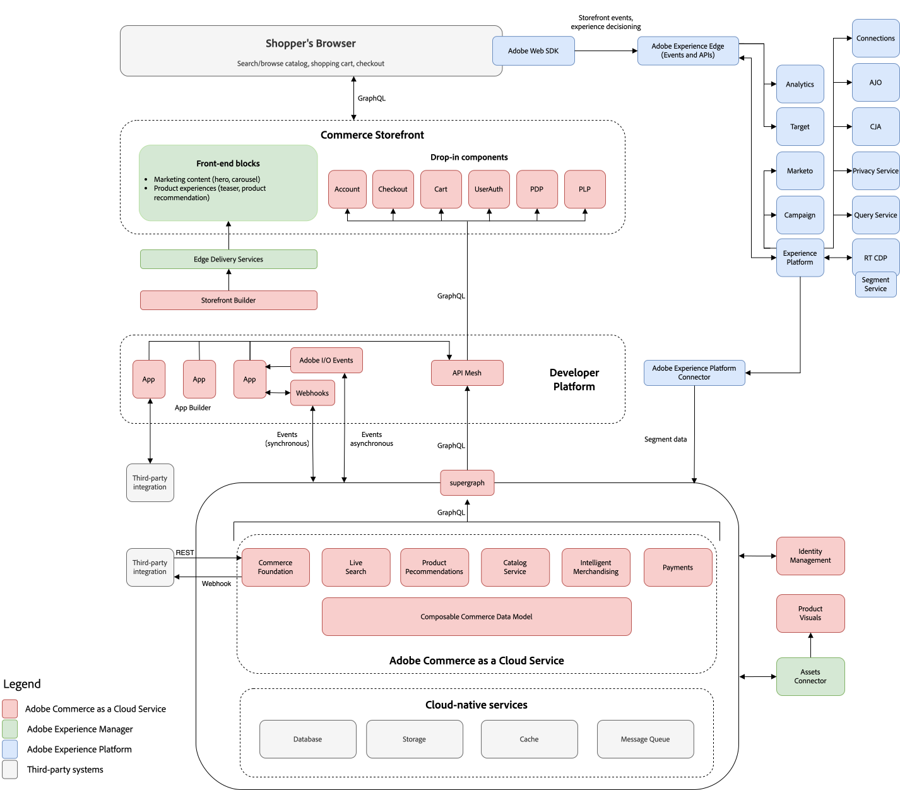

# [!DNL Adobe Commerce as a Cloud Service] の概要

[!DNL Adobe Commerce as a Cloud Service]は、企業がイノベーションを加速しながらデジタル業務を提供し、迅速に拡大できるようにすることで、柔軟性、拡張性、効率性を提供します。 Adobeのクラウドネイティブなインフラストラクチャは、トラフィック、注文、カタログ管理に対するピーク時の需要に対応するために、リソースを自動的に調整します。

次の表は、[!DNL Adobe Commerce as a Cloud Service]を強化する製品を示しています。

<table style="table-layout:auto">
  <tr>
    <td align="left">
       <strong>Commerce ストアフロント </strong>
    </td>
    <td align="left">
      買い物客が商品を閲覧して購入する顧客向けインターフェイス
    </td>
  </tr>
  <tr>
    <td align="left">
       <strong> マーチャンダイジングサービス </strong>
    </td>
    <td align="left">
      商品のカタログ、価格設定、在庫を管理するバックエンドサービス
    </td>
  </tr>
  <tr>
    <td align="left">
       <strong>製品ビジュアル </strong>
    </td>
    <td align="left">
      製品画像とメディア向けのデジタルアセット管理
    </td>
  </tr>
  <tr>
    <td align="left">
       <strong>開発者プラットフォーム </strong>
    </td>
    <td align="left">
      カスタム機能を構築するためのコア開発ツールとAPI
    </td>
  </tr>
</table>

## デザイン

[!DNL Adobe Commerce as a Cloud Service] アーキテクチャの概要については、次のビデオを参照してください。 アーキテクチャを示す図は、ビデオの下に示されています。

>[!VIDEO](https://video.tv.adobe.com/v/3443232?learn=on)

この図は、[!DNL Adobe Commerce as a Cloud Service]とすべてのAdobe Experience Cloud ソリューション間のデータ フローを示しています。

[!DNL Adobe Commerce as a Cloud Service]と[!DNL Adobe Experience Cloud] ソリューションとの統合を示す{zoomable="yes"}

## Commerce ストアフロント

[!DNL Edge Delivery Services]によって強化されたAdobeの[[!DNL Commerce Storefront]](https://experienceleague.adobe.com/developer/commerce/storefront)を使用して、シンプルなドキュメントベースのオーサリングまたは[!DNL Storefront Builder]によるビジュアル編集で、リッチなエクスペリエンスを数分で作成できます。

[!DNL Commerce Storefront]は、GraphQL API レイヤーを介してすべてのマーチャンダイジングサービスとデータを提供する分離型アーキテクチャを備えた完全ヘッドレスです。 このアーキテクチャにより、Commerce Foundationから独立してフロントエンドを開発することができ、新しいテクノロジーを使用して新しいタッチポイントを迅速に構築し、テストすることができます。

>[!NOTE]
>
>[!DNL Adobe Commerce as a Cloud Service]はLuma ストアフロントをサポートしていません。 クラウドまたはオンプレミスのAdobe Commerceから移行する場合は、移行に関するガイダンスについては、[既存のストアフロント &#x200B;](https://experienceleague.adobe.com/developer/commerce/storefront/discovery/#existing-storefronts)を参照してください。

## マーチャンダイジングサービスと決済サービス

Adobeでは、主要なビジネス目標をサポートする、インテリジェントで構成可能なマーチャンダイジングサービスを豊富に提供しています。 これらのサービスは、大規模なパフォーマンスの最適化に不可欠なAPIも提供します。

- [&#x200B; ライブサーチ &#x200B;](../live-search/overview.md) – このAIを活用した検索ツールを使用して、買い物客によりスマートで迅速かつ適切な検索結果を提供します。
- [商品レコメンデーション &#x200B;](../optimizer/merchandising/recommendations/overview.md)：買い物客の行動、人気のレンド、商品の類似性などに基づいて、AIを活用したレコメンデーションを追加します。
- [&#x200B; カタログサービス &#x200B;](../catalog-service/guide-overview.md) - パフォーマンスの向上、拡張性の向上、コンバージョンの増加を実現しながら、顧客に最適化された製品体験を提供します。
- [支払いサービス &#x200B;](../payment-services/guide-overview.md) – 無利息の支払い分割払い、支払い処理、注文、請求書に関する単一のビューなど、さまざまな支払い方法を提供することで、顧客満足度を向上させます。

## [!DNL Product Visuals powered by AEM Assets]

Product Visualsは、Adobe Experience Managerと統合され、リッチメディアコンテンツを管理するデジタルアセット管理（DAM）システムを使用して、アセット管理を簡素化するのに役立ちます。

この統合により、商品画像やマーケティングコンテンツなどのデジタルアセットが、SKUやその他の主要属性にもとづいて、Adobe Commerceの商品やカテゴリーなどの適切なマーチャンダイジングエンティティに動的にリンクできるようになります。

[!DNL Product Visuals]は[!DNL Adobe Commerce as a Cloud Service]ですぐに利用でき、[!DNL AEM Assets]の機能の一部を提供します。

または、[!DNL Adobe Commerce as a Cloud Service]内のネイティブ機能は、デジタルアセットを保存および管理するための基本的なアセット管理ツールを提供します。

[!DNL Product Visuals powered by AEM Assets]と[!DNL Adobe Commerce as a Cloud Service]の統合方法について詳しくは、[AEM Assets統合](../aem-assets-integration/overview.md) ガイドを参照してください。

### [!DNL Product Visuals]または[!DNL AEM Assets]

次の比較は、supply chainが必要とするコンテンツに最適なオプションを選択するのに役立ちます。

<table>
  <tr>
    <td align="left">
      <strong>[!DNL Product Visuals powered by AEM Assets]</strong>
      <ul>
        <li>製品画像と動画を自動的に統合するデジタルアセット管理（DAM）</li>
        <li>画像のサイズ変更、切り抜き、変換</li>
        <li>画像や動画の高速配信</li>
        <li>クライアントブラウザーの機能にもとづいて、画像のフォーマット、サイズ、画質を最適化</li>
        <li>Adobe ExpressおよびAdobe Fireflyへのアクセス</li>
        <li>画像/ビデオの配信容量とユーザーアクセスの使用制限</li>
        <li>統合アセットセレクター</li>
      </ul>
    </td>
    <td align="center">
                 
      
    </td>
    <td align="left">
      <strong>AEM Assets</strong>
      <ul>
        <li>製品ビジュアルのすべての機能</li>
        <li>フルマーケティングデジタルアセット管理（DAM）</li>
        <li>無制限のユーザー（ユーザーごとに支払い）</li>
        <li>画像や動画を無制限に配信</li>
        <li>高度なアセット管理機能：</li>
        <ul>
          <li>360°スピンセットとインタラクティブビューア</li>
          <li>3D モデルのサポートと没入型コンテンツ</li>
          <li>PDFサポート</li>
          <li>AIを活用したスマート切り抜き</li>
          <li>動的画像テンプレート</li>
          <li>スマートタグ</li>
          <li>アセットのパフォーマンスに関するトラッキングと分析</li>
        </ul>
      </ul>
    </td>
  </tr>
    <tr>
    <td align="center" colspan="3">
      <strong>Adobe ブランドの統合は、製品間で簡単に移行できます。</strong>
    </td>
  </tr>
</table>

## 開発者プラットフォーム

Adobeは、Commerce Foundationの機能を拡張し、サードパーティシステム（CRM、ERP、PIMなど）と統合するアプリケーションを構築するための包括的な拡張ポイントとツールを開発者に提供します。 これらのツールは、次の方法でプラットフォームの総所有コストを削減します。

- **スケーラビリティ** - アプリケーションは、コアソフトウェアとは別に拡張できるため、効率が向上し、アップグレードを簡素化できます。
- **分離** – 分離された環境とは、開発者がコアリリースに依存することなく、自分の裁量で拡張機能をアップグレードまたは変更できることを意味します。
- **技術的な独立性** – 開発者は、自分のニーズに合ったテクノロジースタックとコーディング言語を選択できます。

>[!TIP]
>
>[Adobe Exchange](https://exchange.adobe.com/)でのインストールには、ベンダーが作成したアプリも使用できます。

Adobeには、統合とカスタマイズを構築するための次の開発者向けツールが用意されています。

- [**Adobe Developer App Builder用API メッシュ**](https://developer.adobe.com/graphql-mesh-gateway/)：複数のAPI、GraphQL、REST、その他のソースを調整して、クエリ可能な1つのGraphQL エンドポイントに結合します。
- [**App Builder**](https://developer.adobe.com/app-builder/docs/overview/):Commerceの機能を拡張し、サードパーティのソリューションと統合する、安全でスケーラブルなweb アプリケーションを構築してデプロイします。
- [**Events**](https://developer.adobe.com/commerce/extensibility/events/)：カスタムイベントトリガーを使用して、他の拡張可能な開発ツールと対話します。
- [**Webhook**](https://developer.adobe.com/commerce/extensibility/webhooks/) - Webhookを使用して、Commerceとサードパーティシステム間のインタラクションを自動的にトリガーします。
- [**管理者UI SDK**](https://developer.adobe.com/commerce/extensibility/admin-ui-sdk/)：マーチャント向けの新しいページと機能を使用して、Commerce管理者をカスタマイズおよび強化します。
- [**統合スターターキット**](https://developer.adobe.com/commerce/extensibility/starter-kit/integration/)：参照統合、オンボーディングスクリプト、標準化されたアーキテクチャにより、バックオフィスの統合を迅速化します。

## Commerce財団

[!DNL Commerce Foundation]は、クラウドネイティブ環境でCommerce アプリケーションを管理するための安全な自動ホスティングプラットフォームとセルフサービス機能を提供します。

主な機能は次のとおりです。

- 申し込み手続きの簡素化
- シームレスなアップグレード
- サードパーティ製アプリケーションとの統合

### 申し込み手続きの簡素化

[!UICONTROL Commerce Cloud Manager] セルフサービスプロビジョニングポータルを使用して、サンドボックスおよび実稼動インスタンスを数分で起動できます。 マーチャンダイジングサービス、ヘッドレス Commerce インスタンス、および[!DNL App Builder]など、必要なすべての機能が自動的に設定され、インスタンスと統合されます。

Commerce インスタンスを作成および管理する方法については、[はじめに](getting-started.md)を参照してください。

### シームレスなアップグレード

手作業によるアップグレードを必要とせずに、最新の機能や拡張機能にアクセスできます。 新機能やアップデートを継続的に提供することで、手作業によるパッチ適用が不要になり、総所有コストを低く抑えながら、常に最新の機能にアクセスできるようになります。

Adobe Commerce on Cloudの一般的なアップグレードプロセスでは、バックアップの作成、インスタンスの複製、互換性ツールの実行、コードの競合の修正が必要でした。 これは[!DNL Adobe Commerce as a Cloud Service]ではもはや必要ありません。 新しい機能やセキュリティアップデートがリリースされると、Adobeがアプリ内通知を送信します。 更新が本番環境に自動的に適用される前に、サンドボックスインスタンスの新機能を評価するには、30日間の期間があります。

>[!NOTE]
>
>Adobeでは、すべてのアップデートに下位互換性が保証されます。 つまり、更新を適用しても、[API ファーストの拡張性](https://developer.adobe.com/commerce/extensibility/) モデルに準拠する既存の機能やカスタマイズが壊れることはありません。

### サードパーティ製アプリケーションとの統合

開発者は、包括的な[GraphQL](https://developer.adobe.com/commerce/webapi/graphql/)および[REST API](https://developer.adobe.com/commerce/webapi/rest/)を使用して、[!DNL Commerce Foundation]をサードパーティシステムと統合し、Commerce機能を拡張できます。

<!-- 
## Experience Cloud integration

[!DNL Adobe Commerce as a Cloud Service] integrates with all Experience Cloud solutions to deliver [personalized commerce experiences at scale](https://experienceleague.adobe.com/en/docs/commerce-admin/customers/customers-menu/personalize-scale#customers-menu).

[Data Connection](../data-connection/overview.md) unlocks insights about your shoppers' buying behavior so that you can create personalized shopping experiences across all channels with other Adobe Digital Experience products. 
-->

## Adobe Workfrontの利点

次の節では、[!DNL Adobe Commerce as a Cloud Service]がビジネスおよびIT リーダーに提供するメリットについて説明します。

### ビジネスリーダー

- **売上の増加**:SEOを向上させる高性能なストアフロントでオーガニックトラフィックを促進します。 詳細なデータを利用して、コンバージョンを促進するパーソナライズされた体験を構築。
- **操作の拡張**：自動スケーリングサービスは、ビジネスのピーク時の需要に99.9%の可用性で対応します。 複数のブランドと地域を展開し、単一のインスタンスでB2BとB2Cをサポートします。 柔軟なデータモデリングにより、大規模かつ複雑な製品カタログをサポートします。
- **マーチャンダイザーの生産性を向上**: AIを活用したマーチャンダイジングサービスを使用して、コンバージョンを改善します。 ストアフロントで直接、ネイティブに実験できます。 シンプルなドキュメントベースのオーサリングとビジュアルエディターにより、ストアフロント体験を管理し、数分でリッチなエクスペリエンスを作成できます。
- **総所有コスト （TCO）の削減とイノベーションの促進**：常に最新のサービスを利用すると、新機能をすぐに利用できます。 マーケットプレイスからアプリを容易にインストールして、新しい機能を活用できます。 面倒なメンテナンスからリソースを解放し、新しい機能の構築に集中できます。

### IT （情報技術）リーダー

- **高速プロビジョニング**: セルフサービス型プロビジョニングを数分で開始できます。 あらゆるサービスは、シームレスに連携するように事前設定されているため、より迅速に利用できます。 必要に応じて、開発者が利用できるサンドボックスを準備します。
- **所有コストが低い**：常に最新のサービスでアップグレードする必要はありません。 自動的に適用される最新のセキュリティパッチで、安全かつコンプライアンスを維持できます。 自動的に拡張して、最も要求の厳しいワークロードに対応。
- **高性能なストアフロント**：シンプルなドキュメントベースのオーサリングまたはビジュアルエディターで、リッチなエクスペリエンスを数分で作成できます。 AIを活用したマーチャンダイジングサービスを利用して、コンバージョンを向上させたい。 ストアフロントに組み込まれたネイティブ実験。
- **より迅速なイノベーション**：面倒なメンテナンスからリソースを解放し、ビジネス価値をもたらす新しい機能の構築に注力します。 包括的な拡張性および標準ベースのテクノロジー（JavaScript、HTML、CSS、ローコードツール）を使用して、差別化されたエクスペリエンスを構築できます。 クリックするだけでサードパーティ製品をインストールし、コマースプラットフォームに新しい機能を追加できます。
