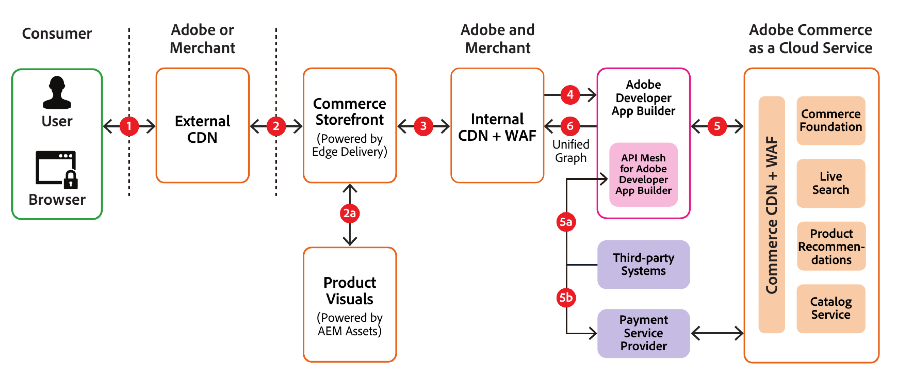

# セキュリティアーキテクチャとデータフロー

次の例は、[!DNL Adobe Commerce as a Cloud Service]でのデータの一般的な流れを示しています。

## データフローのストーリー

**手順1**：買い物客はブラウザーでマーチャントのストアフロントのURLを入力し、そのURLをCommerce StorefrontのContent Delivery Network （外部CDN）に送信します。

**手順2**: サイト URLがキャッシュされている場合、ストアフロント CDNは買い物客に返します。 リソースの最初のリクエストである場合に発生する可能性がある、まだキャッシュされていない場合、外部CDNは買い物客のリクエストを内部CDNに転送し、後続のリクエストに対する応答をキャッシュします。

**手順2a**：要求が画像またはビデオの場合、フルフィルメントのために[!DNL Product Visuals]に送信され、ストアフロントに戻されます。

**手順3**：サイト URLが内部CDNにキャッシュされている場合、そのキャッシュから返されます。 そうでない場合は、[!DNL API Mesh]に送信され、後続のリクエストに対して応答がキャッシュされます。

**手順4**: [!DNL API Mesh]はオーケストレーションレイヤーとして機能し、リクエストを[!DNL Adobe Commerce as a Cloud Service]またはサードパーティシステムに送信してリクエストを処理するかどうかを決定します。

>[!NOTE]
>
>[!DNL API Mesh]は、メッシュ設定をカスタマイズした場合にのみ、サードパーティシステムにリクエストを送信します。

**手順5**: [!DNL Adobe Commerce as a Cloud Service]に送信されたリクエストは、疑わしいリクエストや悪意のあるリクエストをブロックするWeb Application Firewall （WAF）を通過します。 要求されたURLが[!DNL Commerce] CDNにキャッシュされている場合、そのURLはそのキャッシュから配信されます。 キャッシュされていない場合は、1つ以上の[!DNL Adobe Commerce as a Cloud Service] マイクロサービス（基礎、検索、レコメンデーションなど）から返され、今後のリクエスト用にキャッシュされます。

**手順5a**：リクエストがサードパーティ システムに送信された場合、応答は[!DNL API Mesh]に返されます。

**手順5b**：支払い処理用のリクエストの場合、支払いプロバイダーはiframeをストアフロントにレンダリングして、買い物客がクレジットカード情報を安全に入力し、支払い取引を完了できるようにします。

**手順6**: [!DNL Adobe Commerce as a Cloud Service]またはサードパーティサービスからの応答を[!DNL API Mesh]が受信すると、それらの応答は統合グラフに合成され、買い物客の要求に応じて[!DNL Commerce Storefront]に戻されます。
