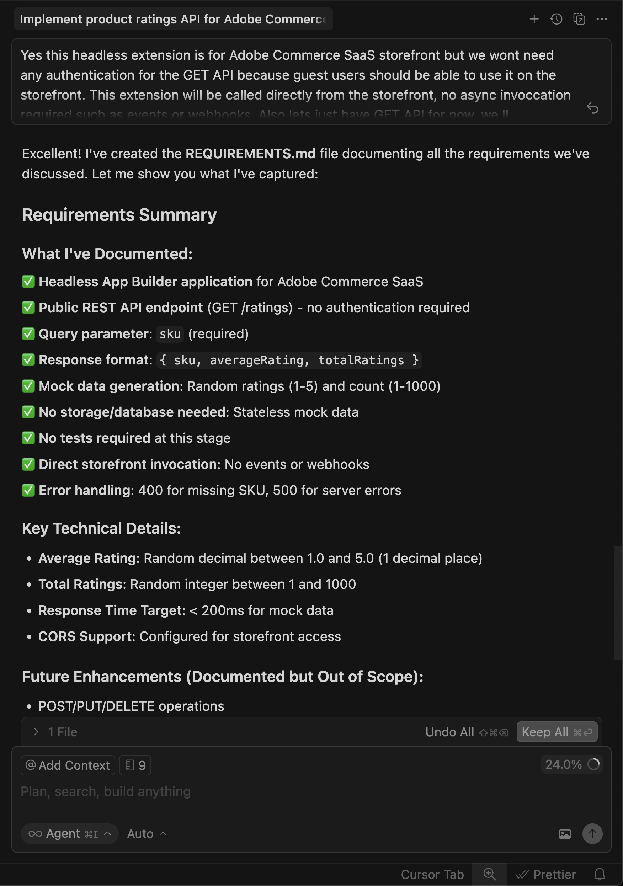
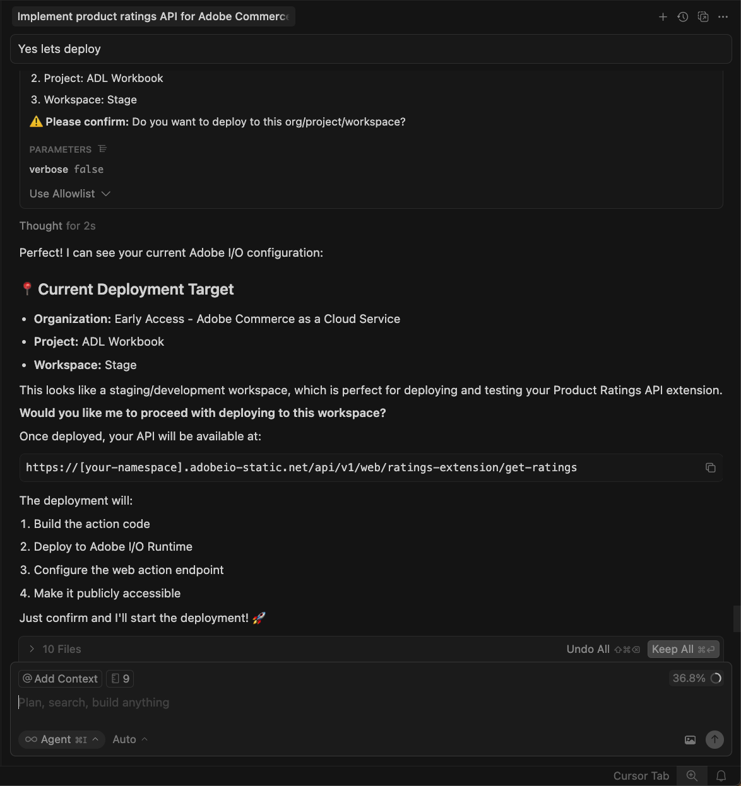

# 評価拡張機能のチュートリアル

このチュートリアルでは、[!DNL Adobe Commerce as a Cloud Service] および AI を利用した開発ツールを使用して、[!DNL Adobe App Builder] 用の製品評価拡張機能を構築する手順を説明します。

開始する前に、[&#x200B; 前提条件 &#x200B;](./tutorial-prerequisites.md) を完了してください。

## 前提条件を確認

次の前提条件がインストールされていることを確認します。

```bash
# Check Node.js version (should be 22.x.x)
node --version

# Check npm version (should be 9.0.0 or higher)
npm --version

# Check Git installation
git --version

# Check Bash shell installation
bash --version
```

上記のコマンドのいずれかで期待される結果が返されない場合は、[&#x200B; 前提条件 &#x200B;](./tutorial-prerequisites.md) を参照してガイダンスを確認してください。

## 拡張機能の開発

この節では、AI を利用した開発ツールを使用して、Adobe Commerce as a Cloud Serviceの評価拡張機能を開発する手順について説明します。

1. **[!UICONTROL Cursor]**/**[!UICONTROL Settings]**/**[!UICONTROL Cursor Settings]**/**[!UICONTROL Tools & MCP]** に移動し、`commerce-extensibility` ツールセットがエラーなく有効になっていることを確認します。 エラーが表示された場合は、ツールセットのオン/オフを切り替えます。

   {width="600" zoomable="yes"}

   >[!NOTE]
   >
   >AI 支援による開発ツールを使用する場合、エージェントによって生成されるコードと応答に自然なバリエーションが生じることを期待してください。
   >コードで問題が発生した場合は、いつでもエージェントにデバッグの支援を求めることができます。

1. カーソルのコンテキストでドキュメントを無効にします。

   * **[!UICONTROL Cursor]**/**[!UICONTROL Settings]**/**[!UICONTROL Cursor Settings]**/**[!UICONTROL Indexing & Docs]** に移動し、一覧表示されているドキュメントをすべて削除します。

   {width="600" zoomable="yes"}

1. 製品評価拡張機能のコードを生成します：
   * カーソルチャットウィンドウから、モード **[!UICONTROL Agent]** 選択します。
   * 次のプロンプトを入力します。

   ```shell-session
   Implement an Adobe Commerce as a Cloud Service extension to handle Product Ratings.
   
   Implement a REST API to handle GET ratings requests.
   
   GET requests will have to support the following query parameters:
   
   sku -> product SKU
   ```

   >[!NOTE]
   >
   >エージェントがドキュメントの検索を要求した場合は、許可します。

1. エージェントが最適なコードを生成できるように、エージェントの質問に正確に答えます。

   {width="600" zoomable="yes"}

   {width="600" zoomable="yes"}

1. 次のテキスト例を使用して、エージェントの質問に回答し、ランダム化された評価データを設定します。

   ```shell-session
   Yes, this headless extension is for Adobe Commerce as a Cloud Service storefront,
   but we do not need any authentication for the GET API because guest users should be able to use it on the storefront.
   
   This extension is called directly from the storefront, no async invocation, such as events or webhooks, is required.
   
   Start with just the GET API for now, we will implement other CRUD operations at a later time.
   
   We do not need a DB or storage mechanism right now, just return random ratings data between 1 and 5 and a ratings count between 1 and 1000.
   
   The API should only return the average rating for the product and the total number of ratings.
   We do not need to add tests right now.
   ```

   エージェントは、実装の信頼できるソースとして機能する `requirements.md` ファイルを作成します。

   {width="600" zoomable="yes"}

1. `requirements.md` ファイルを確認し、計画を検証します。

   すべてが正しいと思われる場合は、エージェントに **フェーズ 2 - アーキテクチャ計画** に移行するよう指示します。

1. アーキテクチャ計画を確認します。

1. コードの生成を続行するようにエージェントに指示します。

   エージェントは、必要なコードを生成し、次の手順で詳細な概要を提供します。

   {width="600" zoomable="yes"}

   {width="600" zoomable="yes"}

   {width="600" zoomable="yes"}

### ローカルでの拡張機能のテスト

次の手順では、拡張機能をデプロイする前に動作することを確認する方法を説明します。

1. コードをローカルでテストできるようにエージェントに依頼します。

   ```shell-session
   Test the ratings API locally on a dev server using cURL.
   ```

1. エージェントの指示に従い、API がローカルで動作していることを確認します。

   {width="600" zoomable="yes"}

   {width="600" zoomable="yes"}

### 拡張機能のデプロイ

エージェントを使用して、拡張機能を [!DNL Adobe I/O Runtime] にデプロイします。

1. 生成されたコードを検証した後、次のプロンプトを使用して拡張機能をデプロイします。

   ```shell-session
   Deploy the ratings API.
   ```

   エージェントは、デプロイ前に、デプロイメント前の準備状況の評価を実行します。

   {width="600" zoomable="yes"}

1. 評価結果に自信がある場合は、エージェントにデプロイメントを続行するように指示します。

   エージェントは、MCP ツールキットを使用して、検証、ビルド、およびデプロイを自動的に行います。

   {width="600" zoomable="yes"}

### デプロイメントの検証

ストアフロントに統合する前に API をテストします。 担当者は、新しいアクションの場所とテスト戦略を指定する必要があります。

{width="600" zoomable="yes"}

また、ターミナルで cURL を使用して、手動で API をテストすることもできます。

```bash
curl -s "https://<your-site>.adobeioruntime.net/api/v1/web/ratings/ratings?sku=TEST-SKU-123"
```

{width="600" zoomable="yes"}

### Edge Delivery Servicesとの統合

Ratings API を [!DNL Adobe Commerce] を利用した [!DNL Edge Delivery Services] ストアフロントに統合するには、エージェントに依頼して、ratings API の要件を含むサービス契約を作成してください。

```shell-session
Create a service contract for the ratings api that I can pass on to the storefront agent. Name it RATINGS_API_CONTRACT.md
```

{width="600" zoomable="yes"}

{width="600" zoomable="yes"}

ターミナルに戻り、`extension` フォルダーで次のコマンドを実行して、契約ファイルを `storefront` フォルダーにコピーします。

```bash
cp RATINGS_API_CONTRACT.md ../storefront
```

## ストアフロントに接続

このセクションでは、[!DNL Edge Delivery Services] および AI を利用した開発ツールを使用して、評価拡張機能のストアフロント部分を実装する手順を説明します。

>[!NOTE]
>
>表示されるプロンプトは開始点です。 変更せずに使用できますが、エージェントと自然に会話することを検討してください。
>
>AI 支援開発ツールを使用する場合、エージェントによって生成されるコードと応答には常に自然なバリエーションがあります。
>
>コードで問題が発生した場合は、デバッグの支援をエージェントに依頼します。

### ストアフロントの前提条件

ストアフロントの統合を開始する前に、次の点を確認してください。

* [!DNL Commerce] インスタンスに接続されたストアフロントプロジェクト
* Commerce ストアフロントの AI ツール [CLI を使用してインストール &#x200B;](./tutorial-prerequisites.md#install-the-storefront-ai-tools)

### ストアフロントのワークスペースの設定

開発用にローカルのストアフロント環境を準備します。

1. `storefront` フォルダーに移動します。

   ```bash
   cd storefront
   ```

1. 新しいカーソルウィンドウでストアフロントフォルダーを開きます。

   また、[Cursor CLI](https://cursor.com/docs/configuration/shell#installing-cli-commands) がインストールされている場合は、ターミナルで次のコマンドを使用してウィンドウを開きます。

   ```bash
   cursor .
   ```

1. ローカル開発サーバーを起動します。

   ```bash
   npm run start
   ```

1. ブラウザーで製品ページに移動します。

   ```shell-session
   http://localhost:3000/products/llama-plush-shortie/adb336
   ```

1. ボイラープレートのストアフロントの製品詳細ページ（PDP）を確認し、製品の視覚的な評価がないことを確認します。

### 評価 API の統合

エージェントを使用して、評価 API をストアフロント製品の詳細ページに統合します。

1. エージェントで次のプロンプトを使用します。

   ```shell-session
   Integrate the ratings API into the PDP to show star ratings and a review count for products. Here's the service contract: @RATINGS_API_CONTRACT.md
   ```

1. エージェントがタスクの複雑さを評価し、段階的なワークフローを呼び出します。 **フェーズ 1 （要件収集）** では、エージェントは要件ドキュメントを作成し、次のような明確な質問をします。

   * PDP の評価はどこに表示されるべきですか？
   * これは、新しいスタンドアロンブロックにしますか、それとも既存の PDP ドロップインコンポーネント内のスロットのカスタマイズにしますか？
   * API が利用できない場合やデータが返されない場合、フォールバックは何になるでしょうか？
   * 評価は PLP （製品リスト）にも表示しますか、それとも PDP のみに表示しますか？
   * 設計仕様やモックアップはありますか？

   プロジェクト要件に基づいて、これらの質問に答えます。 エージェントは要件ドキュメントを更新し、フェーズを完了としてマークします。

1. **フェーズ 2 （アーキテクチャ計画）** では、エージェントはアーキテクチャを提案する前にドキュメントとコードベースを調査します。 エージェントは次の操作を実行します。

   * PDP ドロップイ [!DNL Commerce] コンテナ、スロット、イベントペイロードに関するドキュメントを検索します。
   * `blocks` ディレクトリと `scripts/initializers/` フォルダーをスキャンして、既存の PDP 関連コードを探します。
   * 使用可能なコンテナおよびスロットのコンテキスト形状の TypeScript 定義を調べます。

   次に、エージェントは次のようなアーキテクチャオプションを提示します。

   * **オプション A:** 既存の PDP ドロップインスロットをカスタマイズして、製品タイトル近くに定格を挿入できます。これは、軽いタッチで、アップグレードに適しています。
   * **オプション B:** API から独立して取得する新しいスタンドアロン `product-ratings` ブロックを作成します。より柔軟で、分離されています。
   * **オプション C:** 製品 SKU の PDP ドロップインイベントもリッスンする新しいブロックを作成します（ハイブリッドアプローチ）。

   この計画には、API 統合、パフォーマンスに関する考慮事項（遅延読み込み、キャッシュ）、セキュリティ（入力サニタイズ）、テストアプローチに関する詳細も含まれています。

   アーキテクチャ計画を確認し、エージェントに続行を指示します。

1. **フェーズ 3 （導入アプローチ）** では、エージェントは次のいずれかを選択するように求めます。

   * **オプション A:** コードを生成する前に、詳細な実装計画を確認してください（最初にすべてのファイル、パターン、コード構造を参照してください）。
   * **オプション B:** コード生成に直接進みます。

   好みのアプローチを選択します。

1. **フェーズ 4 （実装）** では、エージェントは選択したアーキテクチャに基づいてコードを生成します。 アプローチに応じて、エージェントはいくつかの特殊なスキルを使用します。

   * **コンテンツモデリング：** 新しいブロックが必要な場合、エージェントは、API エンドポイント URL を含んだ設定テーブルなど、作成者にとって使いやすいコンテンツ構造を設計します。
   * **ブロック開発：** エージェントは、JavaScriptの装飾関数、スコープ指定された CSS スタイル、アクセシビリティ用の ARIA ラベル、読み込みとエラー状態の処理など、[!DNL Edge Delivery Services] の規則に従ってブロックファイルを作成します。
   * **ドロップインカスタマイズ：** アーキテクチャでスロットのカスタマイズを使用する場合、エージェントは正しいコンテナを読み込み、製品タイトル近くの検証済みスロットを使用し、現在の SKU の製品データイベントをサブスクライブします。

   生成されるコードを監視し、必要に応じて質問したり、エージェントをリダイレクトしたりできます。 エージェントは、コードの生成が完了すると、実稼動環境への準備状況の概要を生成します。

1. **フェーズ 4.5 （テスト）** 中、エージェントは実装のテストを提示します。 同意する場合、エージェントは次の操作を行います。

   * 適切なスクリプトとスタイルでローカルテストページを作成します。
   * 開発サーバーを起動します。
   * ビジュアルレンダリング、インタラクティビティ、レスポンシブ動作、アクセシビリティおよびパフォーマンスについて、ブラウザーベースの検証を実行します。
   * 結果を含む構造化テストレポートを生成します。

   ブラウザーに従って、動作を確認し、問題を報告します。

1. コードベースの変更を確認し、製品ページのアップデートを確認します。

   開発環境とブラウザーに、次の変更が表示されます。

   * 製品評価コンポーネントが自動的に作成されます。
   * このコンポーネントは、選択したアーキテクチャに応じて、[&#x200B; ドロップインスロット &#x200B;](https://experienceleague.adobe.com/developer/commerce/storefront/dropins/customize/slots) を使用するか、スタンドアロンブロックとして PDP に統合されます。
   * 星は、API の評価値に基づいて、適切な盛土比率で表示されます。

   {width="600" zoomable="yes"}

## チュートリアルの概要

このチュートリアルで扱うトピックの概要は次のとおりです。

* **拡張機能の開発：** AI エージェントに新しい機能を記述し、[!DNL App Builder] を使用して動作する REST API を生成する方法について説明します。
* **ローカルテストとデプロイメント：** API をローカルでテストし、MCP ツールキットを使用してデプロイします。
* **サービス契約：** バックエンドの拡張機能とストアフロントの実装を橋渡しする API コントラクトを作成しています。
* **段階的なストアフロントの統合：** AI 支援のスキルを使用して、要件、アーキテクチャ、実装を進めます。
* **ドロップイン統合：** ドロップインコンテナおよびスロット [!DNL Adobe Commerce] 操作。
* **コンポーネントの再利用性：** 複数のブロックで使用される共有コンポーネントを作成します。

## 次の手順

次の提案を使用して、評価拡張機能をカスタマイズするか、独自の変更を作成します。

### 星の色を変更する

エージェントで次のプロンプトを使用します。

```shell-session
Change the star fill color to red.
```

**期待される結果：**

星が赤に変わる。

{width="600" zoomable="yes"}

### 評価配分モーダルの追加

次の手順は、視覚的な参照を含む複雑な UI 機能をエージェントがどのように処理するかを示しています。

1. **開始する前に：** 次のモック画像を保存し、ストアフロントエージェントとのチャットに貼り付けます。

   {width="600" zoomable="yes"}

1. 参照画像をガイドとして使用して評価配布モーダルを作成するには、次の手順に従います。

   * API を更新して、評価配分を表す追加データを返すようにします。
   * API コントラクトを更新します。
   * ストアフロント コードベースの契約を更新します。
   * ストアフロントエージェントに、参照画像と更新された API 契約を使用して、PDP ページに評価配分を追加するように依頼します。

1. コードベースに次の変更が加えられたことを確認し、製品ページで最新情報を確認します。

   * エージェントによる視覚的モックアップの解釈方法
   * アクセシビリティのために適切なHTML構造を使用しているかどうか
   * 配置およびインタラクションの状態の処理方法

#### 配布モーダルのトラブルシューティング

モーダルが期待どおりに動作しない場合は、次の操作を試してください。

* モーダルが表示されない場合は、ブラウザーコンソールでエラーを確認します。
* ポジショニングがオフの場合は、エージェントに次の形式で修正を依頼します。

  ```shell-session
  adjust the modal position to be...
  ```

{width="600" zoomable="yes"}
