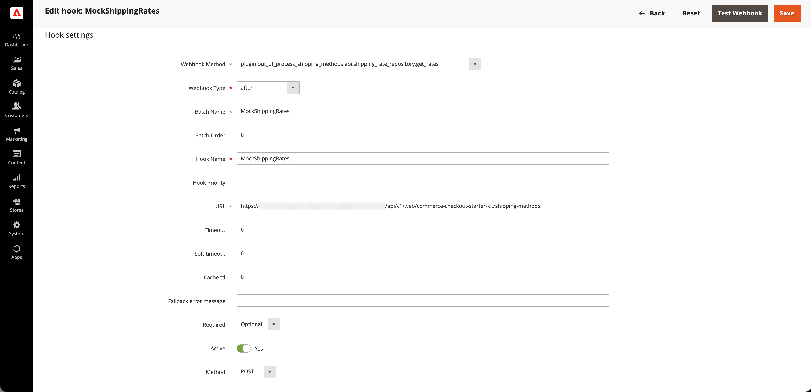
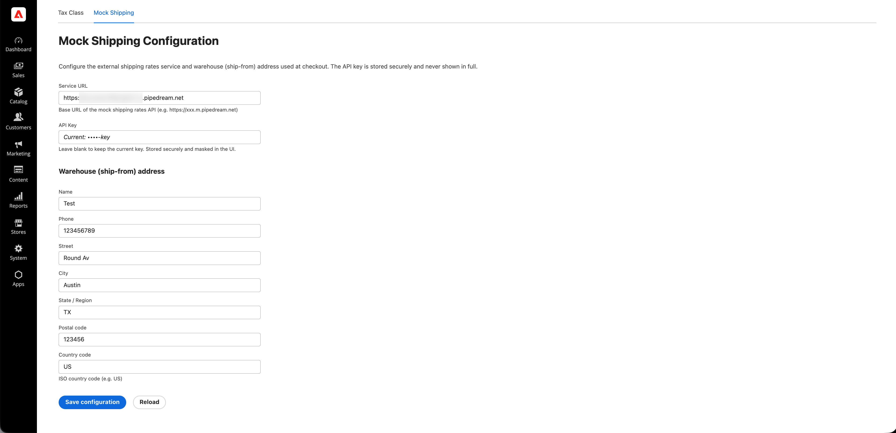

# 出荷方法の拡張機能チュートリアル

このチュートリアルでは、[!DNL Adobe App Builder]、[&#x200B; チェックアウトスターターキット &#x200B;](https://developer.adobe.com/commerce/extensibility/starter-kit/checkout/){target="_blank"}およびAI支援の開発ツールを使用して、[!DNL Adobe Commerce as a Cloud Service]の配送方法の拡張機能を構築する方法について説明します。

この拡張機能は、チェックアウト時に設定可能な配送方法を追加し、料金が外部モック配送料サービスから発生します。 マーチャントは、Admin UIでサービス URL、API キー、およびウェアハウス（送信元）アドレスを設定し、チェックアウト時に、拡張機能がそのサービスからの料金をリクエストし、返されたオプションを顧客に表示します。

開始する前に、[前提条件](./tutorial-prerequisites.md)を完了してください。

## 前提条件を確認 {#tutorial-verify-prerequisites}

次の前提条件がインストールされていることを確認します。

```bash
# Check Node.js version (should be 22.x.x)
node --version

# Check npm version (should be 9.0.0 or higher)
npm --version

# Check Git installation
git --version

# Check Bash shell installation
bash --version
```

上記のコマンドのいずれかが期待される結果を返さない場合は、ガイダンスについて[前提条件](./tutorial-prerequisites.md)を参照してください。

## モック配送料APIの作成

[前提条件](./tutorial-prerequisites.md)を完了したら、モック送料APIを作成し、[!DNL Commerce Admin]で拡張機能を設定する際にサービス URLとAPI キーを準備します。 拡張機能が外部送料APIを呼び出します。 このチュートリアルでは、モック APIを使用して、実際のキャリア アカウントなしでフローを実行できるようにします。 [Pipedream](https://pipedream.com)を使用してモック APIを作成します（無料アカウントが必要です）。 モック APIは、一般的な実際の配送料APIと同様のリクエスト/レスポンス契約を使用するため、この拡張機能を後で実際のプロバイダーに接続するのは簡単です。

モック APIを作成するには、[&#x200B; モックレート API仕様ファイル &#x200B;](../assets/mock-rates-api-spec.zip)をダウンロードして開き、`.md` ファイルをプロジェクトに追加します（例：`docs/mock-rates-api-spec.md`）。

**時間：** モック APIの作成には約&#x200B;**5 ～ 10分**&#x200B;かかる必要があります。

### ワークフローとHTTP トリガーの作成

1. [pipedream.com](https://pipedream.com)に移動して、サインアップまたはログインします。
1. **新しいワークフロー** （または&#x200B;**ワークフローを追加**）をクリックします。
1. トリガーで、**HTTP / Webhook**&#x200B;を選択します。
1. トリガー設定で、**HTTP Response**&#x200B;を&#x200B;**に設定し、ワークフロー**&#x200B;からカスタム応答を返します。 これにより、コードステップでモック JSON応答を送信できるようになります。
1. Pipedreamは、`https://123456.m.pipedream.net`などの一意の&#x200B;**HTTP エンドポイント URL**&#x200B;を表示します。
1. **このURL**&#x200B;をコピーし、Commerce Adminで拡張機能を設定する際に&#x200B;**サービス URL**&#x200B;として使用します。

   {width="600" zoomable="yes"}

トリガーに&#x200B;**Authorization**&#x200B;を設定する必要はありません。モック APIは、コードステップの`API-Key` ヘッダーを検証します。

### コードステップの追加

1. ステップを追加するには、**+** アイコンをクリックします。
1. 「**Node.js コードを実行**」（コードステップ）を選択します。
1. **デフォルトコードを**&#x200B;に置き換えて、次のJavaScriptを使用します。

   ```javascript
   export default defineComponent({
   async run({ steps, $ }) {
      const event = steps.trigger.event;
      const body = event.body ?? {};
      const headers = event.headers ?? {};
      const apiKey = headers["api-key"] ?? body.api_key ?? "";
   
      if (!apiKey || String(apiKey).trim() === "") {
         await $.respond({
         immediate: true,
         status: 401,
         headers: { "Content-Type": "application/json" },
         body: { error: "Missing or invalid API-Key header" },
         });
         return;
      }
   
      const shipment = body.shipment;
      if (!shipment || typeof shipment !== "object") {
         await $.respond({
         immediate: true,
         status: 400,
         headers: { "Content-Type": "application/json" },
         body: { error: "Missing or invalid shipment" },
         });
         return;
      }
   
      const rates = [
         {
         service_code: "mock_standard",
         service_name: "Mock Standard",
         carrier_friendly_name: "Mock Carrier",
         shipping_amount: { amount: 5.99 },
         shipment_cost: 5.99,
         cost: 5.99,
         },
         {
         service_code: "mock_express",
         service_name: "Mock Express",
         carrier_friendly_name: "Mock Carrier",
         shipping_amount: { amount: 12.99 },
         shipment_cost: 12.99,
         cost: 12.99,
         },
      ];
   
      await $.respond({
         immediate: true,
         status: 200,
         headers: { "Content-Type": "application/json" },
         body: { rates },
      });
   },
   });
   ```

1. 「**デプロイ**」をクリックします。

   {width="600" zoomable="yes"}

モックは、空でない`API-Key` ヘッダーと`shipment` オブジェクトを含む有効なリクエストに対して、2つのレートオプション（Mock StandardおよびMock Express）を返します。 このチュートリアルの後半の[!DNL Commerce Admin]でAPI キーを設定します。 また、同じ設定画面でPipedream ワークフローのURLを指定するので、注意してください。

## 拡張機能の開発

このセクションでは、[&#x200B; チェックアウトスターターキット &#x200B;](https://developer.adobe.com/commerce/extensibility/starter-kit/checkout/){target="_blank"}とAI支援の開発ツールを使用して、[!DNL Adobe Commerce as a Cloud Service]の配送方法の拡張機能を開発する方法について説明します。

1. コーディングエージェントのMCP設定に移動します。 例えば、カーソルで、**[!UICONTROL Cursor]** > **[!UICONTROL Settings]** > **[!UICONTROL Cursor Settings]** > **[!UICONTROL Tools & MCP]**&#x200B;に移動します。 エラーなしで`commerce-extensibility` ツールセットが有効になっていることを確認します。 エラーが表示された場合は、ツールセットのオンとオフを切り替えます。

   {width="600" zoomable="yes"}

   >[!NOTE]
   >
   >AI支援の開発ツールを使用する場合、エージェントによって生成されたコードと応答に自然なバリエーションが存在することを期待します。
   >
   >コードで問題が発生した場合は、いつでもエージェントにデバッグを依頼できます。

1. Cursorのコンテキストにドキュメントが追加されている場合は、そのドキュメントを無効にします。 [!UICONTROL **Cursor**] > [!UICONTROL **Settings**] > [!UICONTROL **Cursor Settings**] > [!UICONTROL **Indexing &amp; Docs**]&#x200B;に移動し、リストされているドキュメントをすべて削除します。

   {width="600" zoomable="yes"}

1. エージェントにモックレート API仕様へのアクセス権を付与して、クライアントを正しく実装できるようにします。 まだ実行していない場合は、[&#x200B; モックレート API仕様ファイル &#x200B;](../assets/mock-rates-api-spec.zip)をダウンロードして開き、`.md` ファイルをプロジェクト （例：`docs/mock-rates-api-spec.md`）に追加してから、プロンプトでそのファイルを参照してください。

1. 配送方法の拡張機能を生成：

   - エージェントのチャットウィンドウから、**プラン** モードを選択します（使用可能な場合）。 これにより、エージェントがプランなしで続行するのを防ぐことができます。
   - 次のプロンプトを入力します。

   ```shell-session
   Build an Adobe Commerce extension that adds a shipping method at checkout. The rates come from an external mock shipping rates service: the merchant configures the service's URL and API key in Admin, and at checkout the extension asks that service for rates and shows the returned options to the customer.
   
   External service (mock shipping rates API):
   - The service endpoint URL is configurable by the merchant (for example https://123456.m.pipedream.net).
   - The API is specified in ./docs/mock-rates-api-spec.md.
   
   The merchant must be able to configure the following in the Adobe Commerce Admin UI. Use the Adobe Commerce Admin UI SDK (or equivalent App Builder extensibility options for the Admin) to add a configuration screen where the merchant can set:
   - The service URL (where the extension sends rate requests).
   - An API key the service expects (any non-empty value for the mock). The API key is sensitive data: it must be stored securely and must never appear in logs, error messages, or in the UI in full (e.g. mask in the UI).
   - The warehouse (ship-from) address: name, phone, street, city, state, postal code, country. This is the origin used when requesting rates.
   ```

   >[!NOTE]
   >
   >担当者がドキュメントの検索をリクエストした場合は、許可します。

   {width="600" zoomable="yes"}

1. 担当者の質問に正確に答えて、最適なコードを生成できます。 使用するキットまたはテンプレートが必要な場合は、担当者が配送ドメインとAdmin UI SDK拡張機能を使用して[checkout starter kit](https://developer.adobe.com/commerce/extensibility/starter-kit/checkout/){target="_blank"}に転送し、配送Webhookとマーチャント設定画面の両方を実装します。

   エージェントは、実装の信頼できる唯一の情報源として機能する`requirements.md` （または同等の）ファイルを作成できます。

1. `requirements.md` （または同等の）ファイルを確認し、プランを確認します。 すべてが正しい場合は、担当者にアーキテクチャプランニングに移動するよう指示します（または&#x200B;**フェーズ 2**）。 次のことを確認します。

   - **shipping-methods** アクション（または同等のアクション）は、Commerce Webhookを処理し、外部レート APIを呼び出します。
   - **shipping-config** （または同等の）アクションは、GET （読み取り設定、API キーマスク）およびSET （サービス URL、API キー、ウェアハウスアドレスを保存）をサポートし、設定はランタイム状態など、安全に保存されます。
   - 管理UIには、**Mock Shipping** （または類似）タブがあり、サービス URL、API キー（パスワード/マスク済み）、およびウェアハウスアドレスのフィールドが含まれています。

   {width="600" zoomable="yes"}

1. エージェントが提供するアーキテクチャプランを確認します。

   {width="600" zoomable="yes"}

1. エージェントにコード生成を続行するように指示します。 担当者は、Commerceが返されたメソッドを受け入れることを許可する&#x200B;**モック**&#x200B;の通信事業者を配送業者設定に追加し、Webhook メソッド `plugin.magento.out_of_process_shipping_methods.api.shipping_rate_repository.get_rates`を使用する必要があります（Webhook type **after**、必須&#x200B;**Optional**）。

   担当者は必要なコードを生成し、次の手順（依存関係のインストール、モックキャリアの登録、Commerce Webhookの設定、デプロイなど）を詳しく説明します。

   {width="600" zoomable="yes"}

   {width="600" zoomable="yes"}

### デプロイ前のクリーンアップ

デプロイする前に、アプリケーションが必要としないコードを削除します。 チェックアウトスターターキットには、未使用のドメイン（支払い、税金、イベントなど）や基礎モードが含まれる場合があります。 次のようなプロンプトを使用して、担当者にそれらを削除してもらい、出荷と[!DNL Admin UI]個の部品のみを保持します。

```shell-session
Proceed with Phase 5 cleanup.
```

エージェントはクリーンアップレポートを生成し、未使用のアクション、設定、スクリプトを削除し、プロジェクトを更新します。 デプロイする前に、この手順を完了してください。

{width="600" zoomable="yes"}

### 拡張機能のデプロイ

1. 生成されたコードを確認したら、次のプロンプトを使用して拡張機能をデプロイします。

   ```shell-session
   Deploy the app.
   ```

   エージェントは、デプロイメント前の準備状況の評価を実行します（例えば、Admin UIまたはCommerce APIが使用されている場合は、`.env`を`COMMERCE_WEBHOOKS_PUBLIC_KEY`、`COMMERCE_BASE_URL`、およびOAuth/IMS変数で確認します）。

   {width="600" zoomable="yes"}

1. 評価結果に確信がある場合は、展開を続行するようにエージェントに指示します。 エージェントはMCP ツールキットを使用して、検証、ビルド、デプロイを自動的に行います。

   {width="600" zoomable="yes"}

### 導入後

デプロイメント後、次の手順を実行してモックキャリアを登録し、webhookと[!DNL Admin UI]を設定し、チェックアウト時に拡張機能を確認します。

1. **Commerceでモックキャリアを登録** （デプロイ後に1回実行）:

   ```bash
   npm run create-shipping-carriers
   ```

   スクリプトがキャリアを登録できるように、`.env`に`COMMERCE_BASE_URL`と有効なOAuth/IMS資格情報があることを確認してください。

1. **次の[!DNL Commerce Admin]で出荷Webhookを設定します：**

   - **Stores**/Settings > **Configuration** > **Adobe サービス** > **Commerce Webhook**&#x200B;に移動します。
   - Webhookを追加します。
      - **Webhook メソッド：** `plugin.magento.out_of_process_shipping_methods.api.shipping_rate_repository.get_rates`
      - **Webhook タイプ：** **後**
      - **URL:**&#x200B;は、デプロイされた&#x200B;**shipping-methods** web アクション URL （デプロイ出力または[!DNL Adobe Developer Console]から）です。
      - **必須：** **オプション** – これにより、外部APIが料金を返さない場合でも、チェックアウトを引き続き機能させることができます。

   {width="600" zoomable="yes"}

1. **拡張機能[!DNL Admin UI SDK]を設定：**

   - [!DNL Commerce Admin]で、**Stores**/Settings > **Configuration**&#x200B;に移動します。
   - **Adobe サービス** > **管理者UI SDK**&#x200B;を開きます。
   - **Enable Admin UI SDK**&#x200B;を&#x200B;**Yes**&#x200B;に設定し、まだ有効になっていない場合は&#x200B;**Save Config**&#x200B;をクリックします。
   - **拡張機能の設定**&#x200B;をクリックし、アプリのデプロイ先のワークスペースを選択してから、**適用**&#x200B;をクリックします。 「**カスタム**」オプションを選択して、ワークスペース名を入力することもできます。
   - リストから[!DNL App Builder] アプリを選択して保存します。 アプリが表示されない場合は、「**登録を更新**」をクリックして、もう一度試してください。

   {width="600" zoomable="yes"}

1. **Adobe Commerce管理UIでモック出荷方式を設定します：**
   - **アプリ**&#x200B;を開き、アプリを選択します。
   - 「**Mock Shipping**」タブ（または同等のタブ）を開きます。
   - 次の詳細を入力します。
      - **サービス URL:**&#x200B;さんがコピーしたPipedream ワークフローURL （例：`https://123456.m.pipedream.net`）。
      - **API キー：** モックの空でない値（例：`tutorial-key`）。
      - **倉庫（出荷元）住所：**&#x200B;名、電話、通り、都市、州、郵便番号、国。
   - **保存**&#x200B;をクリックします。 設定はランタイム状態に保存され、shipping-methods アクションで使用されます。

   {width="600" zoomable="yes"}

1. **チェックアウト時に確認：**&#x200B;商品をカートに追加し、チェックアウトに移動して、配送先住所を入力します。 **Mock Standard**&#x200B;や&#x200B;**Mock Express**&#x200B;などの模擬発送オプションが表示されます。

   {width="600" zoomable="yes"}

### トラブルシューティング

- **構成が管理UIに保存されない：** 「応答が無効な&#39;message/http&#39;」が表示されるか、保存後に値が更新されない場合は、次のようなコマンドを使用して、構成アクションのランタイムアクティベーションログを確認します。

  ```bash
  aio app logs --action CustomMenu/shipping-config --limit 20
  ```

  一般的な原因には、特定の応答形式（文字列本文や`Content-Type: application/json`など）を期待するゲートウェイや、文字列値を必要とするステートライブラリなどが含まれます。アクションが設定を文字列として保存し、読み取り時に解析し、shipping-methods アクションが同じ解析を使用することを確認します。 エージェントのチャットまたはログを確認して、正確な原因と修正を確認します。

- **「応答には、少なくとも1つの操作が含まれている必要があります」** （Webhook ログ内）: Commerceでは、少なくとも1つの操作を返すようにshipping webhookが必要です。 shipping-methods アクションが空のオペレーション配列を返さないようにするようエージェントに依頼します（例えば、外部APIがレートを返さない場合にフォールバックレートを返します）。

- **チェックアウト時に配送料が発生しません：** Webhook URLと方法が正しいことを確認し、モックキャリアが登録され（`npm run create-shipping-carriers`）、モックシッピング設定が[!DNL Admin UI]に設定されていることを確認します。 APIまたは検証エラーに対するshipping-methods アクションのランタイムログを確認します。アクションが1つ以上の操作を返すことを確認します。そのため、[!DNL Commerce]には「応答に1つ以上の操作が含まれている必要があります」と表示されません。

### チュートリアルの概要

このチュートリアルで取り上げたトピックの概要を次に示します。

- **前提条件と設定：** ツールの検証とモック配送料APIの作成。
- **エージェント主導の開発：** コマース拡張性ツールセットを使用して、出荷Webhookと管理UIの要件、実装計画、コードを生成します。
- **フェーズ 5 クリーンアップ：** デプロイする前に、未使用のチェックアウト スターターキット ドメインと基礎モードを削除しています。
- **デプロイメント：**&#x200B;導入前の評価とMCP ツールキットのデプロイ。
- **デプロイメント後の設定：** モックキャリアの登録、[!DNL Commerce] Webhookの設定、[!DNL Admin UI SDK]拡張機能の有効化、[!DNL Admin UI]でのモックシッピング（サービス URL、API キー、ウェアハウス）の設定。
- **確認：** チェックアウト時に、モックの配送オプションが表示されることを確認しています。

### 次のステップ

このチュートリアルでさらに実験するには、次の点を考慮してください。

- [!DNL Commerce]にモックキャリアを登録し、各デプロイメント後に出荷Webhookを設定するフックを使用して、デプロイ後の設定を自動化します。
- [!DNL Admin UI]のサービス URLとAPI キーを変更して、実際の配送料APIで拡張機能を指定します。
- [!DNL Admin UI]を拡張して、通信事業者のステータスを表示するか、料金サービスへの接続をテストします。
