# ユースケース

次のユースケースは、[!DNL Adobe Commerce as a Cloud Service]がサポートするコア機能とビジネス シナリオを示しています。 開発を加速させ、インパクトのあるエクスペリエンスをローンチできます。

問題が発生した場合は、[&#x200B; トラブルシューティング &#x200B;](#troubleshooting) セクションでガイダンスを確認してください。

## 前提条件

これらのユースケースを試みる前に、次の前提条件を満たす必要があります。

1. [次のオプションを使用してCloud Service インスタンス &#x200B;](./getting-started.md#create-an-instance)を作成します。
   1. [!UICONTROL **環境**] ドロップダウンで「[!UICONTROL **サンドボックス**]」を選択します。
   1. 「[!UICONTROL **データをテスト**]」ドロップダウンで「[!UICONTROL **Adobe Store**]」を選択します。
1. [&#x200B; [!DNL Adobe Experience Cloud]  アカウントにログイン](https://experience.adobe.com)
1. [次のオプションを使用してCloud Service ストアフロントを設定します](./storefront.md)。
   1. テンプレートの[!UICONTROL `adobe-commerce/adobe-demo-store`]を選択します。
   1. 接続方法として&#x200B;[!UICONTROL **利用可能なインスタンス（メッシュ/SaaS）**]&#x200B;を選択します。

## チェックアウトワークフロー

このワークフローでは、ストアフロントから商品を購入する顧客のチェックアウトプロセスと、管理者として注文を確認する方法を示します。

### 決済サービスを有効にする

1. Commerce管理者で、[!UICONTROL **Stores**] > [!UICONTROL Settings] > [!UICONTROL **Configuration**] > [!UICONTROL **Payment Methods**]&#x200B;に移動します。

1. 「[!UICONTROL **一般設定**]」セクションに、`Payment Services Sandbox ID`と`Payment Services Sandbox Key`を入力します。 これらのIDは、[&#x200B; サンドボックスオンボーディング &#x200B;](../payment-services/sandbox.md#sandbox-onboarding)で説明されている手順に従って取得できます

1. [!UICONTROL **有効**] ドロップダウンを&#x200B;[!UICONTROL **はい**]&#x200B;に設定します。

1. 「[!UICONTROL **設定を保存**]」をクリックします。

### 製品の購入

1. 前提条件で作成した[&#x200B; ストアフロント &#x200B;](./storefront.md)に移動します。

1. 商品を探して選択する： 必要に応じてカスタマイズを選択します。 次に、[!UICONTROL **買い物かごに追加**]&#x200B;をクリックします。

   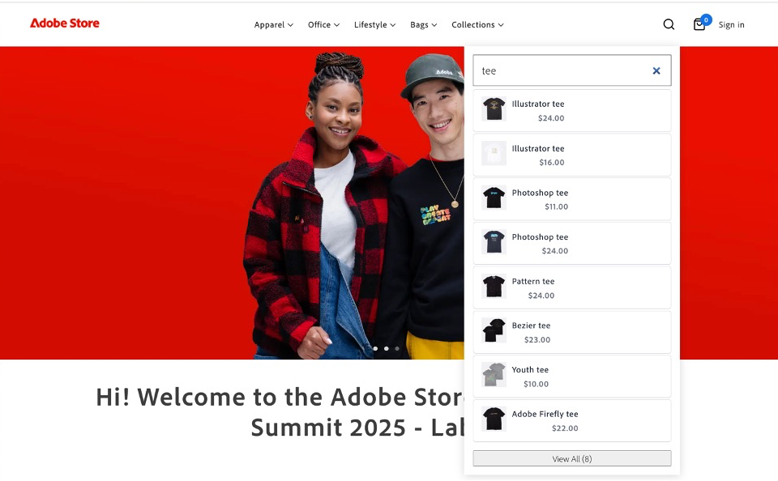{width="600" zoomable="yes"}

1. カートアイコンを選択して、カートを表示します。

   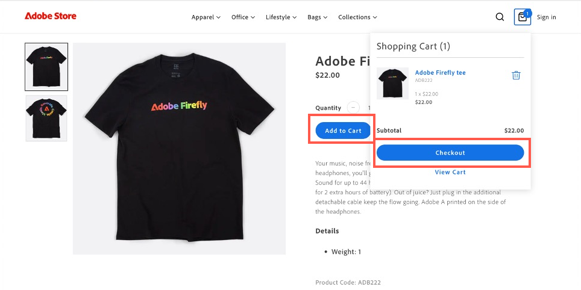{width="600" zoomable="yes"}

1. 「[!UICONTROL **チェックアウト**]」をクリックします。

   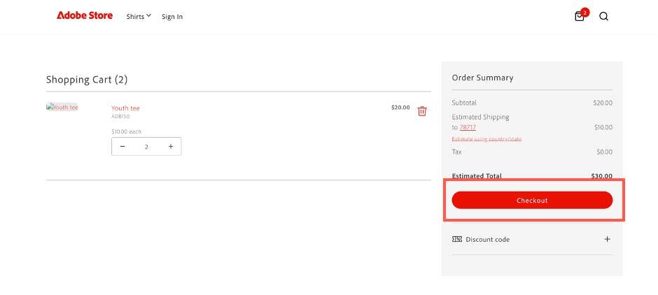{width="600" zoomable="yes"}

1. 必要な連絡先情報と配送情報を入力します。 この注文には架空の情報を使用できます。

1. チェックアウトするには、[!UICONTROL **チェックアウト/マネーオーダー**]&#x200B;を選択します。 クレジットカードを使用する場合は、Paypal[&#128279;](https://developer.paypal.com/tools/sandbox/card-testing/#link-teststaticcardnumbers)が提供する テストカードのいずれかを使用します。 これらは、今後の有効期限やCVCで使用できます。

   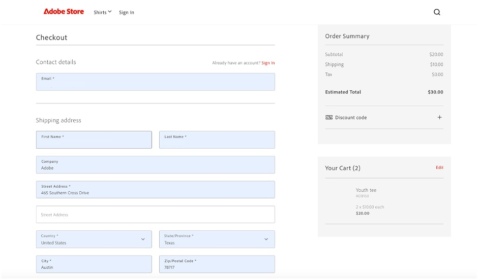{width="600" zoomable="yes"}

   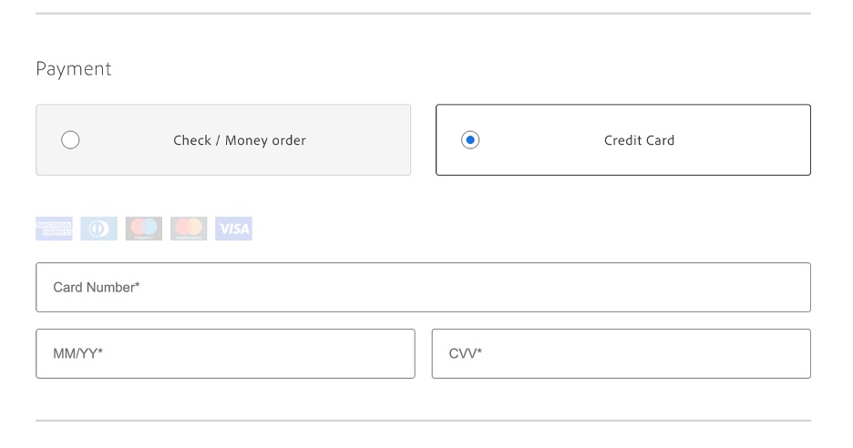{width="600" zoomable="yes"}

1. 「[!UICONTROL **注文を配置**]」をクリックします。

### 注文の確認

1. Commerce管理者を開きます：`<your store URL>/admin`。

1. Adobe IDでログインします。

1. [!UICONTROL **Sales**] > [!UICONTROL **Orders**]&#x200B;に移動します。

   最近の注文を表示するCommerce管理画面の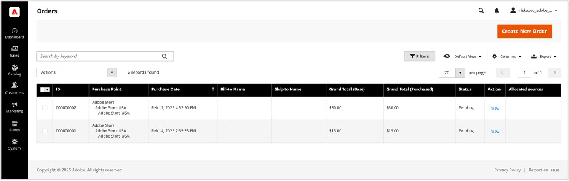{width="600" zoomable="yes"}

1. 注文した商品を探し、詳細を確認します。

   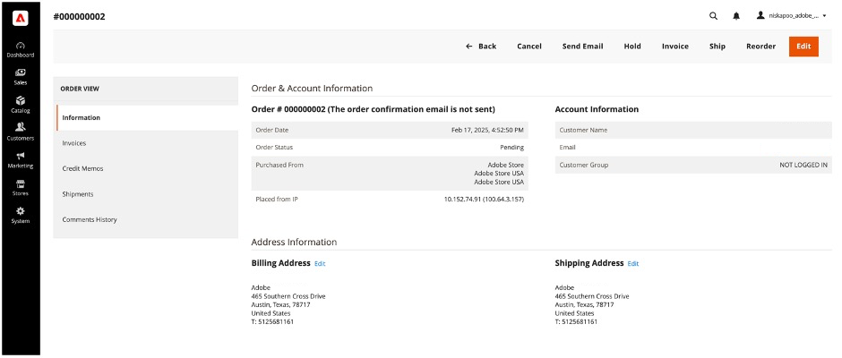{width="600" zoomable="yes"}

## ストアフロントコンテンツの更新

ストアフロントで直接コンテンツを制作、編集、公開できます。

1. 前提条件で作成した[&#x200B; ストアフロント &#x200B;](./storefront.md)を開きます。

1. ストアフロントビルダーを開きます。 `https://da.live/#/<GitHub User Name>/<Repository Name>/main/da/index.md`に移動します。

1. [!UICONTROL **Index**] ページを開きます。

1. カルーセルブロックの下にある「Adobe Store デモへようこそ」の行を編集して、新しいタイトルを入力します。

1. 送信アイコンをクリックし、[!UICONTROL **プレビュー**]&#x200B;をクリックします。

1. プレビューページを確認し、[!UICONTROL **公開**]&#x200B;をクリックします。

1. ストアフロントページを更新して、変更が有効であることを確認します。

## コンテクストの検証

[!DNL Adobe Commerce]のコンテクスト実験機能を使用すると、ストアフロントで実験を作成および管理して、様々なコンテンツと設定をテストできます。

### 前提条件

* [AEM Sidekick拡張機能](https://www.aem.live/docs/sidekick)をインストールします

1. ストアフロントビルダーで、インデックスページを選択し、[!UICONTROL **コピー**]&#x200B;をクリックします。

1. [!UICONTROL **New**] ボタンをクリックし、[!UICONTROL **Folder**]&#x200B;を選択して、メインフォルダーの下に&#x200B;[!UICONTROL **experiments**] フォルダーを作成します。

1. [!UICONTROL **experiments**] フォルダーに&#x200B;**1234**&#x200B;という名前のフォルダーを作成します。

1. インデックスページの2つのコピーを&#x200B;**1234** フォルダーに貼り付けます。

1. 各ページを開き、「homev1」と「homev2」の名前を変更します。 これらはあなたの[&#x200B; チャレンジャー](https://www.aem.live/docs/experimentation#create-your-challenger-page)です。

1. 各ページに異なるコンテンツを含めるように変更します。 例えば、ヒーロー画像やテキストを変更します。 各ページの違いを特定する必要があります。

1. それぞれのチャレンジャーページを公開します。

1. 元のインデックスページであるコントロールページを開きます。

1. タイトルが&#x200B;[!UICONTROL **メタデータ**]&#x200B;の新しいブロックを追加します。

1. メタデータブロックの行に次の情報を追加します

   * タイトル - Adobe Commerce
   * 説明 – web ストア
   * 実験 – 1234
   * 実験のバリエーション
      * `https://<your-site>.aem.live/experiments/1234/indexv1`
      * `https://<your-site>.aem.live/experiments/1234/indexv2`

   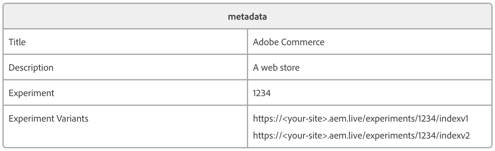{width="600" zoomable="yes"}

1. シークレットウィンドウまたはプライベートブラウジングウィンドウを開き、メインページへ移動します。

1. プライベートブラウジングウィンドウを閉じて、前の手順を繰り返します。 ページを開くたびに、作成したランダムなバリエーションが表示されます。

## ストアフロントコンテンツの強化

[!DNL AEM Assets]、[!DNL Adobe Express]、[!DNL Firefly]を使用すると、シンプルで自己主導型のワークフローを使用して、ストアフロントに表示される画像をすばやく変更できます。

### 前提条件

* [!DNL AEM Assets]、[!DNL Adobe Express]、[!DNL Adobe Firefly]へのアクセスが必要です。

### 画像の背景のカスタマイズ

製品画像の背景をすばやく修正するシナリオを考えてみましょう。 [!DNL Adobe Commerce]、[!DNL AEM Assets]および[!DNL Adobe Express]を組み合わせると、この変更を簡単な手順で完了できます。

1. 前提条件で作成した[&#x200B; ストアフロント &#x200B;](./storefront.md)を開き、変更する項目に移動します。 商品のSKUまたは製品コードを書き留めます。

1. [!DNL AEM Assets]を開くには、[Adobe Experience Cloud](https://experience.adobe.com/#/home)で選択します。

   [!DNL Adobe Experience Cloud] インターフェイス 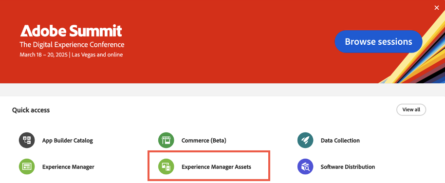{width="600" zoomable="yes"}を示す[!DNL AEM Assets] セレクター

1. [!UICONTROL **Assets**]&#x200B;をクリックします。

   [!DNL AEM Assets] インターフェイス 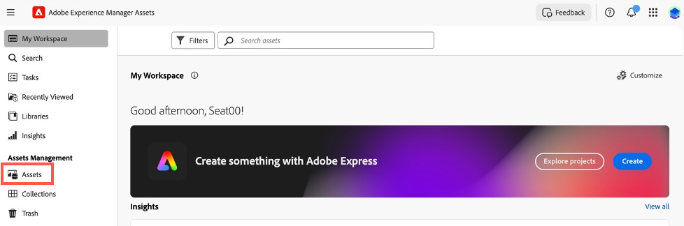{width="600" zoomable="yes"}のAssets ナビゲーション オプション

1. **SKU**&#x200B;または&#x200B;**製品コード**&#x200B;で項目を検索します。

1. 編集する項目を選択し、[!UICONTROL **Adobe Expressで開く**]&#x200B;をクリックします。

   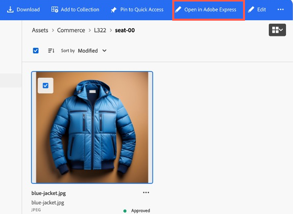{width="600" zoomable="yes"}

1. [!UICONTROL **画像**] パネルで、[!UICONTROL **オブジェクトを挿入**]&#x200B;を選択します。

   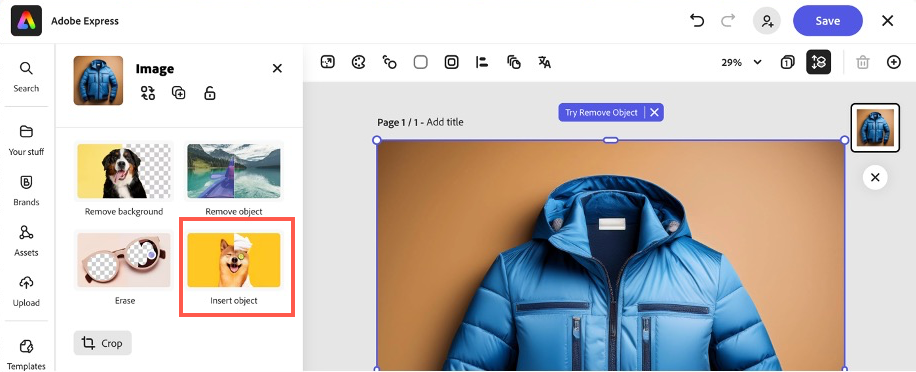{width="600" zoomable="yes"}

1. テキストボックスに、追加する画像を記述します。 例えば、「スノーマツの木」です。

   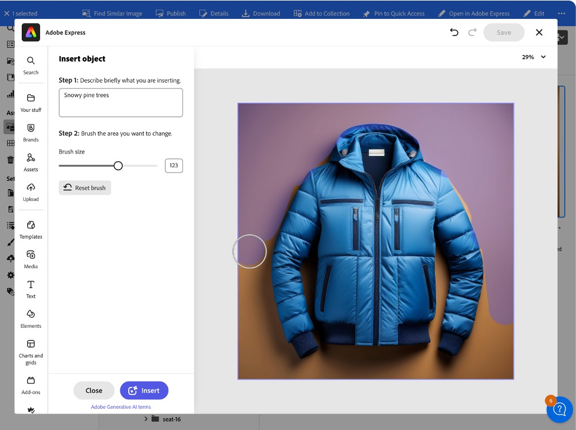{width="600" zoomable="yes"}

1. [!UICONTROL Brush size]を調整し、生成された画像を追加する場所に描画します。 この例では、既存のオブジェクトの周りを描画して、背景を選択します。

1. 「[!UICONTROL **Generate**]」をクリックして結果を表示します。

1. 目的のオプションを選択し、[!UICONTROL **Keep**]&#x200B;をクリックして、様々な結果から選択します。

1. [!UICONTROL **Your Stuff**]&#x200B;をクリックして、画像エディターに戻ります。

1. [!UICONTROL **保存**]&#x200B;をクリックして、画像の種類を指定します。

1. [!UICONTROL **保存**]&#x200B;をもう一度クリックして、変更を保存します。

1. [!UICONTROL **アセットを保存**] ダイアログで、Commerce [!UICONTROL **Destination フォルダー**]&#x200B;を選択します。

   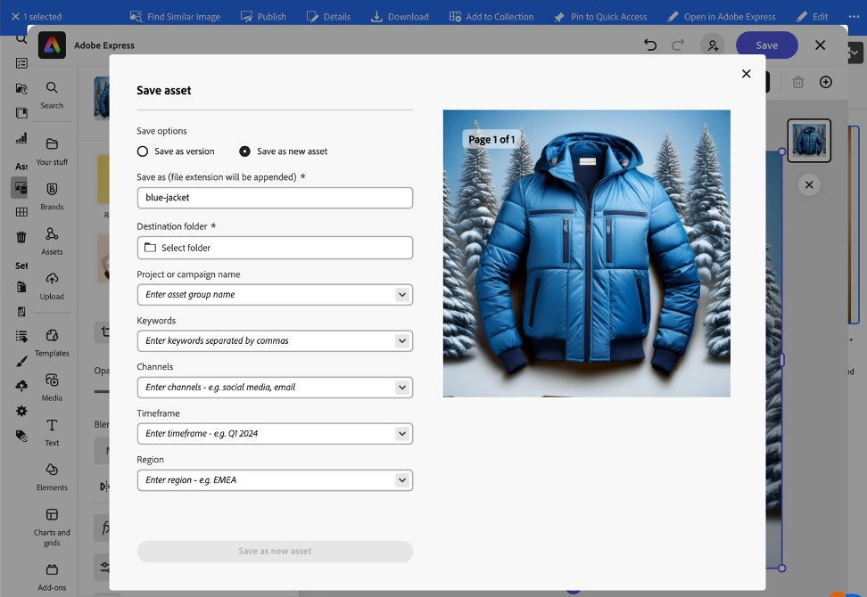{width="600" zoomable="yes"}

1. 「[!UICONTROL **新しいアセットとして保存**]」をクリックして、画像を保存します。

#### 画像を[!DNL Commerce AEM Assets]に追加

1. [!DNL AEM as a Cloud Service]の[&#x200B; ナビゲーションパネル &#x200B;](https://experienceleague.adobe.com/ja/docs/experience-manager-cloud-service/content/sites/authoring/basic-handling#navigation-panel)から、[!UICONTROL **Assets**] > [!UICONTROL **ファイル**] > [!UICONTROL **Commerce**]&#x200B;を選択し、前のセクションで作成したアセットをクリックします。

   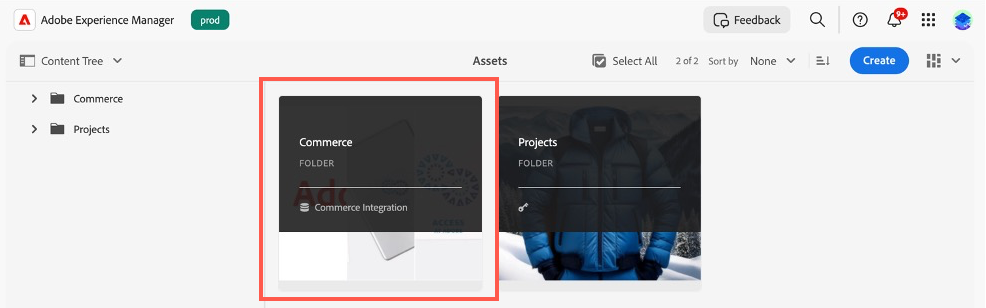{width="600" zoomable="yes"}を含む[!DNL AEM Assets]のCommerce フォルダー

1. [!UICONTROL **プロパティ**]&#x200B;をクリックします。

   [!DNL AEM Assets] ツールバー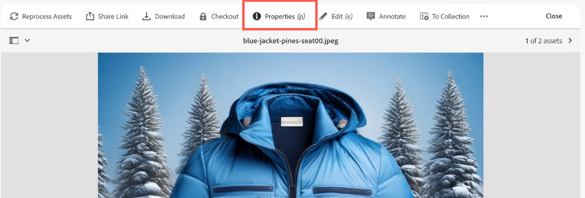{width="600" zoomable="yes"}の プロパティ ボタン

1. 「[!UICONTROL **Commerce**]」タブを選択します。

   アセットのプロパティパネルの「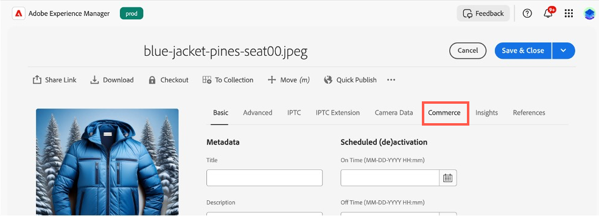{width="600" zoomable="yes"}

1. [!UICONTROL **がAdobe Commerceに存在することを確認しますか？**] フィールドは&#x200B;[!UICONTROL **はい**]&#x200B;に設定されています。

1. 「[!UICONTROL **追加**]」をクリックし、アセットを追加する製品SKUを入力します。

   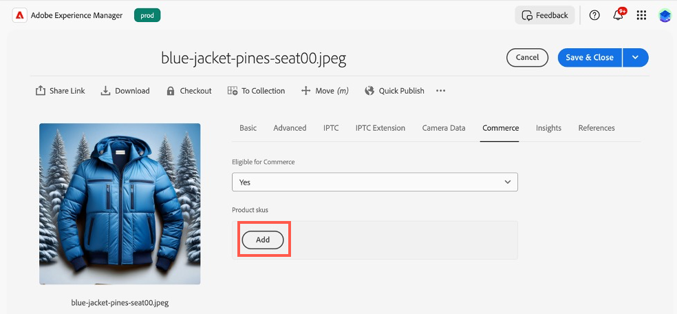{width="600" zoomable="yes"}

1. アセットの位置とアセットタイプを選択します。

1. 「[!UICONTROL **基本**]」タブを選択し、「[!UICONTROL **レビューステータス**]」タブを「[!UICONTROL **承認済み**]」に変更します。

   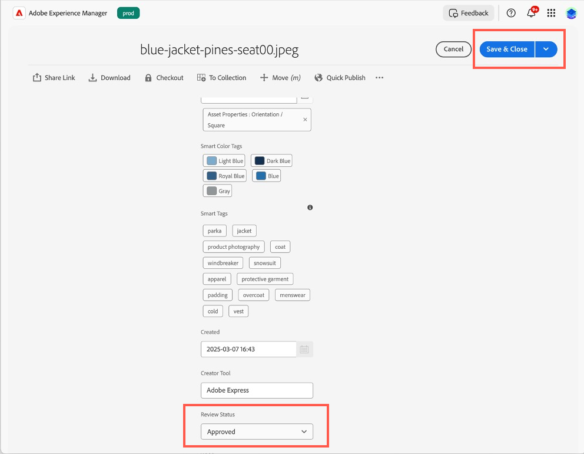{width="600" zoomable="yes"}

1. [!UICONTROL **保存して閉じる**]&#x200B;をクリックします。

#### Commerceで画像を確定

1. Adobe Commerce [!UICONTROL **管理者**]&#x200B;で、[!UICONTROL **カタログ**] > [!UICONTROL **製品**]&#x200B;に移動します。

1. 前のセクションで画像を追加した製品を選択します。

1. [!UICONTROL **画像とビデオ**] セクションを展開します。

   製品編集で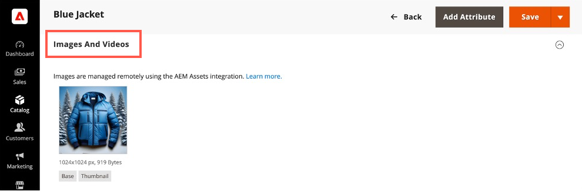{width="600" zoomable="yes"}

1. 画像が画像のリストで使用可能になったことを確認します。

1. ストアフロントに戻り、変更した商品のページに移動します。

1. 新しい画像が表示されることを確認します。

   新しく生成された画像を表示する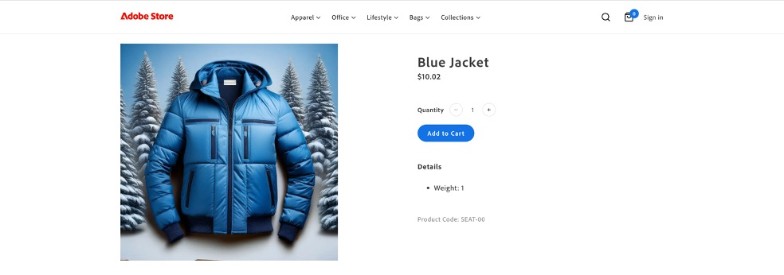{width="600" zoomable="yes"}

## バリエーションの生成

[!DNL Adobe Commerce]の「バリエーションを生成」では、生成AIを活用して、高品質なコンテンツ生成、メッセージの微調整、ストアフロントへのアセットのシームレスな公開を自動化します。

### テキストを生成

1. [&#x200B; ユニバーサルエディター](https://experienceleague.adobe.com/ja/docs/experience-manager-cloud-service/content/implementing/developing/universal-editor/introduction)を使用してストアフロントサイトを開きます。

1. 編集するテキストブロックを選択します。

1. [!UICONTROL **プロパティ**] パネルで、[!UICONTROL **バリエーションを生成**]&#x200B;をクリックします。

1. 「[!UICONTROL **生成**]」ボタンをクリックします。

1. 生成されたテキストを選択またはカスタマイズします。

1. 「[!UICONTROL **公開**]」をクリックして、ストアフロントを更新します。

### コンテンツと画像の生成

1. [[!DNL Generate Variations]](https://experienceleague.adobe.com/ja/docs/experience-manager-cloud-service/content/generative-ai/generate-variations)を開く

1. 「[!UICONTROL **ヒーローバナー**]」テンプレートを選択します。

1. [!UICONTROL **ユーザーインタラクションの説明**] テキストボックスに、「Adobeの従業員およびパートナーがAdobe ブランドの製品を購入するためのエクスペリエンス」と入力します。

1. ドメイン知識&#x200B;**の** URLに、**www.adobestore.com**&#x200B;と入力します。

1. 「[!UICONTROL **Generate**]」をクリックします。

1. コンテンツのバリエーションを選択し、[!UICONTROL **画像を生成**]&#x200B;をクリックします。

1. [!UICONTROL **画像サイズ**] ドロップダウンから、[!UICONTROL **ワイドスクリーン （16:9）**]&#x200B;を選択します。

1. [!UICONTROL **コンテンツの種類**] ドロップダウンから、[!UICONTROL **写真**]&#x200B;を選択します。

1. [!UICONTROL **スタイル**]&#x200B;の参照画像で、既存のAdobe ストアバナーを選択します。

1. 使用する生成された画像を選択し、[!UICONTROL **保存**]&#x200B;をクリックします。

1. このプロセスを他の参照画像でも繰り返すことで、より多くのバリエーションを生成できます。

## トラブルシューティング

これらのチュートリアルを試す際に直面する問題を解決するには、次の推奨事項を使用してください。

* コマンドまたはフラグに関するガイダンスが必要な場合：

   1. `aio --help`を実行して、使用可能なすべてのコマンドとフラグを表示します。
   1. 特定のコマンドの場合は、`--help` フラグを使用します。 例：
      * `aio console --help`
      * `aio commerce --help`

* 無効なログインの問題が発生した場合：

   1. `aio config clear`を実行します。
   1. `aio auth login --force`を実行します。
   1. ブラウザーにログインします。
   1. プロファイルを選択します。
   1. ターミナルに切り替えて続行します。

* `init` コマンドが失敗した場合：

   1. `aio api-mesh delete`を実行します。
   1. `aio commerce init`を再実行します。

* `init` コマンドを実行する前に、間違った組織、プロジェクト、またはワークスペースを選択した場合：

   1. `aio console org select`を実行します。
   1. `aio console project select`を実行します。
   1. `aio console workspace select`を実行します。

* 無効なテナント選択がある場合：

   1. **Ctrl-C**&#x200B;を押して、現在のCLI実行をキャンセルします。
   1. `aio commerce init`を実行します。

* 無効なAPI Mesh インストールが発生した場合：

   * `aio api-mesh update mesh-config.json`を実行します。
