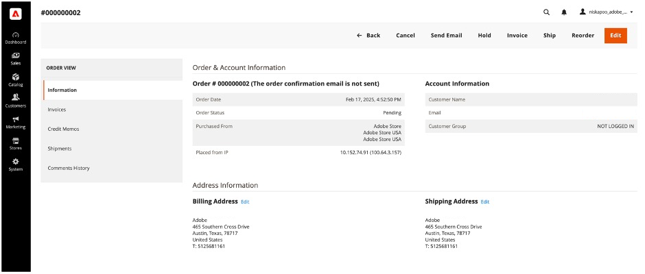
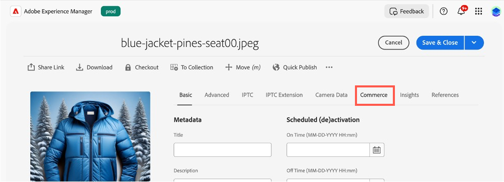
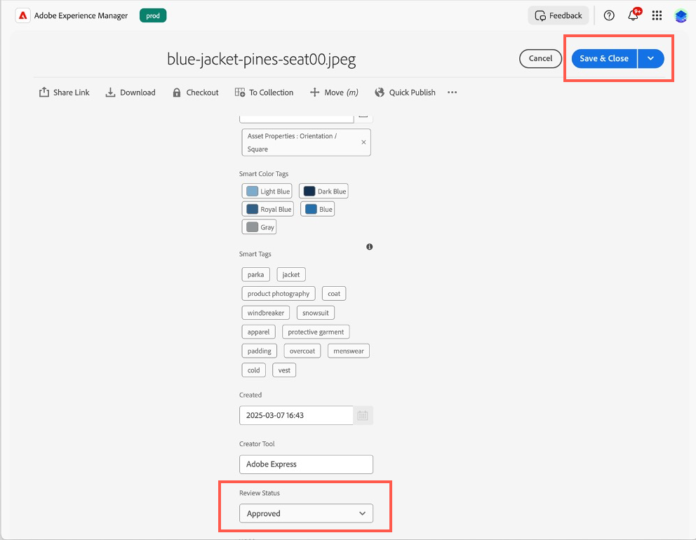

# ユースケース

次のユースケースは、[!DNL Adobe Commerce as a Cloud Service] がサポートするコア機能とビジネスシナリオを示しています。これにより、開発を加速し、効果の高いエクスペリエンスを開始できます。

問題が発生した場合は、[&#x200B; トラブルシューティング &#x200B;](#troubleshooting) の節でガイダンスを確認してください。

## 前提条件

これらのユースケースを試す前に、次の前提条件を満たす必要があります。

1. 次のオプションを使用して [Cloud Service インスタンスを作成します &#x200B;](./getting-started.md#create-an-instance)。
   1. [!UICONTROL **環境**] ドロップダウンで [!UICONTROL **サンドボックス**] を選択します。
   1. [!UICONTROL **データをテスト**] ドロップダウンで「[!UICONTROL **Adobe ストア**]」を選択します。
1. [Adobe Experience Cloud アカウントにログインします &#x200B;](https://experience.adobe.com)
1. [&#x200B; 次のオプションを使用して &#x200B;](./storefront.md)Cloud Service ストアフロントを設定します。
   1. テンプレートの [!UICONTROL `adobe-commerce/adobe-demo-store`] を選択します。
   1. 接続方法として、[!UICONTROL **使用可能なインスタンスを選択（メッシュ/SaaS）**] を選択します。

## チェックアウトワークフロー

このワークフローでは、顧客がストアフロントから製品を購入する際のチェックアウトプロセスと、管理者として注文を確認する方法を示します。

### 支払いサービスを有効にする

1. Commerce管理者で、[!UICONTROL **Stores**]/[!UICONTROL Settings]/[!UICONTROL **Configuration**]/[!UICONTROL **Payment Methods**] に移動します。

1. 「[!UICONTROL **一般設定**]」セクションで、`Payment Services Sandbox ID` と `Payment Services Sandbox Key` を入力します。 これらの ID は、[&#x200B; サンドボックスのオンボーディング &#x200B;](../payment-services/sandbox.md#sandbox-onboarding) に説明されている手順に従って取得できます

1. [!UICONTROL **有効**] ドロップダウンを [!UICONTROL **はい**] に設定します。

1. 「[!UICONTROL **設定を保存**]」をクリックします。

### 商品の購入

1. 前提条件で作成した [&#x200B; ストアフロント &#x200B;](./storefront.md) に移動します。

1. 製品を検索して選択します。 必要なカスタマイズを選択します。 次に、「[!UICONTROL **買い物かごに追加**]」をクリックします。

   {width="600" zoomable="yes"}

1. 買い物かごアイコンを選択して、買い物かごを表示します。

   {width="600" zoomable="yes"}

1. [!UICONTROL **チェックアウト**] をクリックします。

   {width="600" zoomable="yes"}

1. 必要な連絡先の詳細と発送情報を入力します。 この注文には架空の情報を使用できます。

1. チェックアウトするには、[!UICONTROL **小切手/マネーオーダー**] を選択します。 クレジットカードを使用する場合は、[Paypal が提供するテストカード &#x200B;](https://developer.paypal.com/tools/sandbox/card-testing/#link-teststaticcardnumbers) のいずれかを使用します。 これらは、任意の将来の有効期限および任意の CVC で使用できます。

   {width="600" zoomable="yes"}

   {width="600" zoomable="yes"}

1. [!UICONTROL **Place Order**] をクリックします。

### 注文を確定

1. Commerce Admin: `<your store URL>/admin` を開きます。

1. Adobe IDを使用してログインします。

1. [!UICONTROL **Sales**]/[!UICONTROL **Orders**] に移動します。

   {width="600" zoomable="yes"}

1. 注文した商品を探し、詳細を確認します。

   {width="600" zoomable="yes"}

## ストアフロントコンテンツの更新

コンテンツを作成、編集およびストアフロントに直接公開します。

1. 前提条件で作成した [&#x200B; ストアフロント &#x200B;](./storefront.md) を開きます。

1. Storefront Builder を開きます。 `https://da.live/#/<GitHub User Name>/<Repository Name>/main/da/index.md` に移動します。

1. [!UICONTROL **インデックス**] ページを開きます。

1. カルーセルブロックの下に、「Adobe Store デモへようこそ」という行を編集して新しいタイトルを入力します。

1. 送信アイコンをクリックし、「[!UICONTROL **プレビュー**]」をクリックします。

1. プレビューページを確認して、「[!UICONTROL **公開**]」をクリックします。

1. ストアフロントページを更新し、変更がライブになったことを確認します。

## コンテキスト実験

Adobe Commerceのコンテキスト実験機能を使用すると、ストアフロントで実験を作成および管理して、様々なコンテンツや設定をテストできます。

### 前提条件

* [AEM Sidekick拡張機能のインストール &#x200B;](https://www.aem.live/docs/sidekick)

1. Storefront Builder で、インデックスページを選択し、「[!UICONTROL **コピー**]」をクリックします。

1. メインフォルダーの下に [!UICONTROL **実験**] フォルダーを作成します。作成するには、「[!UICONTROL **新規**] ボタンをクリックし、[!UICONTROL **フォルダー**] を選択します。

1. **experiments** フォルダーに [!UICONTROL **1234**] という名前のフォルダーを作成します。

1. インデックスページの 2 つのコピーを **1234** フォルダーに貼り付けます。

1. 各ページを開き、名前を「homev1」および「homev2」に変更します。 これらは [&#x200B; 挑戦者 &#x200B;](https://www.aem.live/docs/experimentation#create-your-challenger-page) です。

1. 異なるコンテンツを含めるように各ページを変更します。 例えば、ヒーロー画像やテキストを変更します。 各ページの違いを識別できる必要があります。

1. チャレンジャーページをそれぞれ公開します。

1. コントロールページ（元のインデックスページ）を開きます。

1. タイトルが [!UICONTROL **metadata**] の新しいブロックを追加します。

1. メタデータブロックの行に次の情報を追加します

   * タイトル - Adobe Commerce
   * 説明 – Web ストア
   * 実験 – 1234
   * 実験のバリアント
      * `https://<your-site>.aem.live/experiments/1234/indexv1`
      * `https://<your-site>.aem.live/experiments/1234/indexv2`

   {width="600" zoomable="yes"}

1. 匿名またはプライベートブラウジングウィンドウを開き、メインページに移動します。

1. プライベートブラウジングウィンドウを閉じ、前の手順を繰り返します。 ページを開くたびに、作成したランダムバリアントが表示されます。

## ストアフロントコンテンツの強化

AEM Assets、Adobe Express、Fireflyを使用すると、シンプルな自己駆動型のワークフローで、ストアフロントに表示される画像をすばやく変更できるようになりました。

### 前提条件

* AEM Assets、Adobe ExpressおよびAdobe Fireflyへのアクセスが必要です。

### 画像の背景のカスタマイズ

製品画像の背景をすばやく変更するシナリオを考えます。 Adobe Commerce、AEM Assets、Adobe Expressを組み合わせると、いくつかの簡単な手順でこの変更を行うことができます。

1. 前提条件で作成した [&#x200B; ストアフロント &#x200B;](./storefront.md) を開き、変更する項目に移動します。 品目の SKU または製品コードを書き留めます。

1. [!UICONTROL AEM Assets]Adobe Experience Cloud[&#x200B; で選択して、](https://experience.adobe.com/#/home) を開きます。

   {width="600" zoomable="yes"}

1. 「[!UICONTROL Assets]」をクリックします。

   {width="600" zoomable="yes"}

1. **SKU** または **製品コード** で商品を検索します。

1. 編集する項目を選択し、「[!UICONTROL **Adobe Expressで開く**] をクリックします。

   {width="600" zoomable="yes"}

1. [!UICONTROL **画像**] パネルで「[!UICONTROL **オブジェクトを挿入**]」を選択します。

   {width="600" zoomable="yes"}

1. テキストボックスに、追加する画像を入力します。 例えば、「雪に覆われた松の木」。

   {width="600" zoomable="yes"}

1. [!UICONTROL Brush size] を調整し、生成された画像を追加する場所を描画します。 この例では、既存のオブジェクトの周囲に描画して、背景を選択します。

1. 「[!UICONTROL **生成**]」をクリックして結果を表示します。

1. 目的のオプションを選択し、「保持 [!UICONTROL **をクリックして、様々な結果から選択し**] す。

1. [!UICONTROL **自分のスタッフ**] をクリックして、画像エディターに戻ります。

1. [!UICONTROL **保存**] をクリックして、画像タイプを指定します。

1. もう一度 [!UICONTROL **保存**] をクリックして、変更を保存します。

1. [!UICONTROL **アセットを保存**] ダイアログで、Commerce [!UICONTROL **保存先フォルダー**] を選択します。

   {width="600" zoomable="yes"}

1. [!UICONTROL **新しいアセットとして保存**] をクリックして、画像を保存します。

#### Commerce AEM Assetsへの画像の追加

1. AEM as a Cloud Serviceの [&#x200B; ナビゲーションパネル &#x200B;](https://experienceleague.adobe.com/en/docs/experience-manager-cloud-service/content/sites/authoring/basic-handling#navigation-panel) から、**Assets** / **ファイル** / **Commerce** を選択し、前の節で作成したアセットをクリックします。

   {width="600" zoomable="yes"}

1. [!UICONTROL **プロパティ**] をクリックします。

   {width="600" zoomable="yes"}

1. 「[!UICONTROL **Commerce**]」タブを選択します。

   {width="600" zoomable="yes"}

1. [!UICONTROL **Adobe Commerceに存在しますか？フィ**] ルドは [!UICONTROL **はい**] に設定されています。

1. [!UICONTROL **追加**] をクリックして、アセットを追加する製品 SKU を入力します。

   {width="600" zoomable="yes"}

1. アセットの位置とアセットタイプを選択します。

1. 「[!UICONTROL **基本**]」タブを選択し、「[!UICONTROL **レビューステータス**]」タブを [!UICONTROL **承認済み**] に変更します。

   {width="600" zoomable="yes"}

1. [!UICONTROL **保存して閉じる**] をクリックします。

#### Commerceで画像を確認します。

1. Adobe Commerce [!UICONTROL **管理者**] で、[!UICONTROL **カタログ**]/[!UICONTROL **製品**] に移動します。

1. 前の節で画像を追加した製品を選択します。

1. 「[!UICONTROL **画像とビデオ**]」セクションを展開します。

   {width="600" zoomable="yes"}

1. 画像が画像のリストで使用できるようになったことを確認します。

1. ストアフロントに戻り、変更された製品のページに移動します。

1. 新しい画像が表示されることを確認します。

   {width="600" zoomable="yes"}

## バリエーションを生成

Adobe Commerceのバリエーションを生成では、ジェネレーティブ AI を活用して、高品質のコンテンツ生成の自動化、メッセージの微調整、ストアフロントへのアセットのシームレスな公開を行います。

### テキストを生成

1. [&#x200B; ユニバーサルエディター &#x200B;](https://experienceleague.adobe.com/en/docs/experience-manager-cloud-service/content/implementing/developing/universal-editor/introduction) を使用してストアフロントサイトを開きます。

1. 編集するテキストのブロックを選択します。

1. [!UICONTROL **プロパティ**] パネルで、「[!UICONTROL **バリエーションを生成**]」をクリックします。

1. 「[!UICONTROL **生成**] ボタンをクリックします。

1. 生成テキストを選択またはカスタマイズします。

1. 「[!UICONTROL **公開**]」をクリックして、ストアフロントを更新します。

### コンテンツと画像の生成

1. [&#x200B; バリエーションを生成 &#x200B;](https://experienceleague.adobe.com/en/docs/experience-manager-cloud-service/content/generative-ai/generate-variations) を開きます。

1. [!UICONTROL **ヒーローバナー**] テンプレートを選択します。

1. 「[!UICONTROL **ユーザーのインタラクションの説明**]」テキストボックスに、「Adobeの社員とパートナーがAdobe ブランドの商品を購入する経験」と入力します。

1. [!UICONTROL **ドメインの知識の URL**] に、**www.adobestore.com** と入力します。

1. [!UICONTROL **生成**] をクリックします。

1. コンテンツバリエーションを選択し、「[!UICONTROL **画像を生成**]」をクリックします。

1. [!UICONTROL **画像サイズ**] ドロップダウンから [!UICONTROL **ワイドスクリーン （16:9）**] を選択します。

1. [!UICONTROL **コンテンツタイプ**] ドロップダウンから「[!UICONTROL **写真**]」を選択します。

1. [!UICONTROL **スタイル**] 参照画像については、既存のAdobe ストアバナーを選択します。

1. 使用する生成画像を選択し、「[!UICONTROL **保存**]」をクリックします。

1. 他の参照画像と一緒にこのプロセスを繰り返して、より多くのバリエーションを生成します。

## トラブルシューティング

これらのチュートリアルを試みる際に発生した問題を解決するには、次の推奨事項を使用してください。

* コマンドやフラグに関するガイダンスが必要な場合：

   1. `aio --help` を実行すると、使用可能なすべてのコマンドとフラグが表示されます。
   1. 特定のコマンドに対しては、`--help` フラグを使用します。 例：
      * `aio console --help`
      * `aio commerce –help`

* 無効なログインの問題が発生した場合：

   1. `aio config clear` を実行します。
   1. `aio auth login –-force` を実行します。
   1. ブラウザーでログインします。
   1. プロファイルを選択します。
   1. 端子に切り替えて続行します。

* `init` コマンドが失敗した場合：

   1. `aio api-mesh delete` を実行します。
   1. `aio commerce init` を再実行します。

* `init` コマンドを実行する前に、間違った組織、プロジェクト、またはワークスペースを選択した場合：

   1. `aio console org select` を実行します。
   1. `aio console project select` を実行します。
   1. `aio console workspace select` を実行します。

* 無効なテナントの選択がある場合：

   1. **Ctrl+C** キーを押して、現在の CLI の実行をキャンセルします。
   1. `aio commerce init` を実行します。

* 無効な API メッシュのインストールが発生した場合：

   * `aio api-mesh update mesh-config.json` を実行します。
