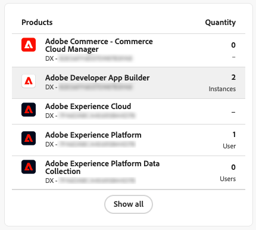

# ユーザーとIdentity Management

ユーザーが [!DNL Adobe Commerce as a Cloud Service] で管理者にアクセスできるようにするには、ユーザーを組織内のユーザーとして追加し、[Adobe Admin Console](https://adminconsole.adobe.com){target="_blank"} のCloud Service製品にアクセスできることを確認します。

このプロセスを実行するには、[!DNL Adobe Commerce as a Cloud Service] へのアクセス権を持つ IMS 組織が必要です。 これらのプロセスを実行できるのは、組織のシステム管理者または製品管理者のみです。

>[!TIP]
>
>複数のユーザーを同時に追加するには、[CSV の一括アップロード &#x200B;](https://helpx.adobe.com/enterprise/using/bulk-upload-users.html){target="_blank"} を実行します。
>
> [&#x200B; ユーザーグループ &#x200B;](https://helpx.adobe.com/enterprise/using/user-groups.html){target="_blank"} を作成して、1 つの役割に複数のユーザーを追加することもできます。 次に、[!UICONTROL **Adobe Commerce - Commerce Cloud Manager**] 製品をユーザーグループに追加できます。

## 役割について

[!DNL Adobe Commerce as a Cloud Service] では、次の役割を使用できます。 これらのロールを表示または編集するには、Commerce管理者で [!UICONTROL **システム**]/[!UICONTROL **権限**]/[!UICONTROL **ユーザーロール**] に移動します。

* **ユーザー** - ユーザーは、Commerce管理者に管理者アクセス権を持っていますが、Admin Consoleで製品レベルのアクセス権を管理することはできません。 ユーザーは、クレジットを使用して [&#x200B; で &#x200B;](./getting-started.md#create-an-instance) インスタンスを作成 [!DNL Commerce Cloud Manager] することもできます。

  >[!NOTE]
  >
  >デベロッパーと管理者を含むすべてのCommerce ユーザーにも、ユーザーの役割を割り当てる必要があります。 これは、Commerceの基本的な権限に必要です。

* [**開発者**](https://helpx.adobe.com/enterprise/using/manage-developers.html#Adddevelopers){target="_blank"} – 開発者はユーザー権限を持ち、開発者ユーザーとしてCommerce インスタンスに追加されます。 [[!DNL Admin UI SDK]](https://developer.adobe.com/commerce/extensibility/admin-ui-sdk/){target="_blank"}、[&#x200B; イベントの設定 &#x200B;](https://developer.adobe.com/commerce/extensibility/events/){target="_blank"}、[Webhook の作成 &#x200B;](https://developer.adobe.com/commerce/extensibility/webhooks/){target="_blank"} を使用できます。

* 管理者 – 管理者には次の 3 つのタイプがあります。
   * [&#x200B; システム管理者 &#x200B;](https://helpx.adobe.com/enterprise/using/admin-roles.html){target="_blank"} - システム管理者は、Admin Consoleを通じて組織内のすべての製品と製品プロファイルにアクセスできます。
   * [&#x200B; 製品管理者 &#x200B;](#add-a-product-admin) – 製品管理者は [&#x200B; 製品のユーザー、役割、権限を管理 &#x200B;](#add-users) [!DNL Adobe Admin Console] で、[Commerce管理者でユーザーを管理 &#x200B;](https://experienceleague.adobe.com/en/docs/commerce-admin/systems/user-accounts/permissions-users-all#create-a-user){target="_blank"} できます。
   * [&#x200B; 製品プロファイル管理者 &#x200B;](#add-developers-and-product-profile-admins) – 製品プロファイル管理者は、Adobe Commerce管理者へのアクセス権を持っていませんが、[!DNL Adobe Admin Console] 内の製品のユーザーを管理できます。

Adobe Commerce内の各ロールに付与される権限について詳しくは、[&#x200B; ユーザー権限 &#x200B;](#user-permissions) を参照してください。

## 製品管理者を追加

>[!BEGINTABS]

>[!NOTE]
>
>製品管理者を製品管理者として追加する前に、製品管理者に [&#x200B; ユーザーの役割 &#x200B;](#add-users) を割り当てます。 ユーザーの役割は、Commerceの基本的な権限に必要です。

>[!TAB GA （2025 年 10 月 13 日（PT）以降にプロビジョニング） ]

1. <https://adminconsole.adobe.com> に移動し、Adobe IDを使用してログインします。

1. 組織を選択します。

1. 「[!UICONTROL **ユーザー**]」タブを選択します。

1. 「[!UICONTROL **管理者**] タブを選択します。

1. [!UICONTROL **管理者を追加**] をクリックします。

1. 管理者として追加するユーザーのユーザー名またはメールアドレスを入力し、「[!UICONTROL **次へ**]」をクリックします。

1. [!UICONTROL **製品プロファイル管理者**] の役割を選択します。

1. 「[!UICONTROL **+**]」をクリックして製品を追加します。

1. 管理者を追加する既存のCommerce インスタンスを選択します。 Commerce インスタンスでは、`Adobe Commerce - <instance-name> - ACCS - <environment-type> - <tenant-id>` のフォーマットを使用します。

1. 製品プロファイルを選択します。

1. [!UICONTROL **適用**] をクリックします。

1. [!UICONTROL **保存**] をクリックします。

>[!TAB  早期アクセス（2025 年 10 月 13 日（PT）以前にプロビジョニング） ]

1. <https://adminconsole.adobe.com> に移動し、Adobe IDを使用してログインします。

1. 組織を選択します。

1. 「[!UICONTROL **製品**]」タブの [!UICONTROL **製品とサービス**] で、[!UICONTROL **Adobe Commerce - Commerce Cloud Manager**] を選択します。

   {width="600" zoomable="yes"}

1. 「[!UICONTROL **管理者**]」タブを選択します。

1. [!UICONTROL **管理者を追加**] をクリックします。

1. 管理者として追加するユーザーのユーザー名またはメールアドレスを入力し、「[!UICONTROL **保存**]」をクリックします。

>[!ENDTABS]

## ユーザーを追加

以下の手順では、[!DNL Commerce Cloud Manager] とCommerce管理者にユーザーを追加する方法について説明します。 [!DNL Commerce Cloud Manager] インターフェイスを使用すると、Commerce インスタンスを作成および管理できます。 このプロセスは、開発者と管理者を含むすべてのユーザーに必要です。

>[!NOTE]
>
>製品管理者とシステム管理者のみが、ユーザーと開発者をAdobe Commerce as a Cloud Service製品に追加できます。

>[!BEGINTABS]

>[!TAB GA （2025 年 10 月 13 日（PT）以降にプロビジョニング） ]

1. <https://adminconsole.adobe.com> に移動し、Adobe IDを使用してログインします。

1. 組織を選択します。

1. 「[!UICONTROL **製品**]」タブを選択します。

1. [!UICONTROL **Adobe Commerce**] 商品を選択します。

1. Commerce Cloud インスタンスを作成および管理できる Cloud Manager インターフェイスにユーザーを追加する場合は、Commerce Manager 製品を選択します。または、ユーザーを追加する既存のCommerce インスタンスを選択します。 Commerce インスタンスでは、`Adobe Commerce - <instance-name> - ACCS - <environment-type> - <tenant-id>` のフォーマットを使用します。

1. 「[!UICONTROL **ユーザー**]」タブを選択し、「[!UICONTROL **ユーザーを追加**]」をクリックします。

1. 追加するユーザーのユーザー名またはメールアドレスを入力し、「[!UICONTROL **保存**]」をクリックします。

1. 目的の製品プロファイルを選択します。

1. [!UICONTROL **適用**] をクリックします。

1. [!UICONTROL **保存**] をクリックします。

>[!TAB  早期アクセス（2025 年 10 月 13 日（PT）以前にプロビジョニング） ]

1. <https://adminconsole.adobe.com> に移動し、Adobe IDを使用してログインします。

1. 組織を選択します。

1. 「[!UICONTROL **製品**]」タブの [!UICONTROL **製品とサービス**] で、[!UICONTROL **Adobe Commerce - Commerce Cloud Manager**] を選択します。

   {width="600" zoomable="yes"}

1. [!UICONTROL **デフォルト - Cloud Manager**] 製品プロファイルをクリックします。

1. 「[!UICONTROL **ユーザー**]」タブを選択し、「[!UICONTROL **ユーザーを追加**]」をクリックします。

   {width="600" zoomable="yes"}

1. 追加するユーザーのユーザー名またはメールアドレスを入力し、「[!UICONTROL **保存**]」をクリックします。

>[!ENDTABS]

### 開発者と製品プロファイル管理者の追加

開発者と製品プロファイル管理者を追加するには、[&#x200B; ユーザーを追加 &#x200B;](#add-users) プロセスを繰り返しますが、「[!UICONTROL **ユーザー**] タブではなく [!UICONTROL **開発者**] または [!UICONTROL **管理者**] タブを選択します。

>[!NOTE]
>
>製品プロファイル管理者は、Commerce管理者にアクセスできません。 詳しくは、[&#x200B; 役割について &#x200B;](#understanding-roles) を参照してください。
>
>開発者を開発者として追加する前に、開発者にユーザーの役割を割り当てます。 ユーザーの役割は、Commerceの基本的な権限に必要です。

{width="600" zoomable="yes"}

## 役割リソース

次のリストは、デフォルトの役割に、[!DNL Adobe Commerce] Admin 内でのアクセス権を持つリソースを示しています。 各役割のデフォルトの権限を変更するには、Commerce管理で [!UICONTROL **システム**]/[!UICONTROL **権限**]/[!UICONTROL **ユーザーの役割**] に移動します。

**ユーザー**

* カタログ
   * 在庫
      * 製品
         * 製品価格の読み取り

**開発者**

* カタログ
   * 在庫
      * 製品
         * 製品価格の読み取り
* システム
   * データ転送
      * 履歴の読み込み
* Adobe IO イベントの設定
   * 設定チェック
   * イベント プロバイダーの作成
   * 設定の更新
   * イベントの同期
   * イベント プロバイダーリストの取得
* イベント フレームワーク
   * イベントリスト
   * 送信接続のテスト
   * イベントの購読
   * イベントの登録解除
   * イベントステータス
   * イベント購読を取得するための API
   * イベント購読管理 UI の表示
   * イベント購読管理 UI の作成
   * 新しいイベント管理 UI をリクエスト
* Webhook
   * Webhook デジタル署名
      * Webhook デジタル署名設定
      * Webhook デジタル署名によるキーの生成
   * Webhook 管理
      * Webhook グリッド
      * Webhook 編集
      * Webhook のテスト
      * Webhook の API 購読
      * Webhook からの API 購読解除
      * Webhook リスト
      * 新しい Webhook をリクエスト
      * Webhook ログ
      * Webhook のリストを取得

**管理者**

管理者は、すべての権限にアクセスできます。

## [!DNL AEM Assets] または [!DNL Product Visuals] へのユーザーの追加

[!DNL Adobe Experience Manager Assets] ユーザーと [!DNL Product Visuals powered by AEM Assets] ユーザーには、次の設定が必要です。

アカウントが [[!DNL Adobe Experience Manager as a Cloud Service]](https://experienceleague.adobe.com/en/docs/experience-manager-cloud-service) へのアクセス権を持ち、ユーザーが [[!DNL AEM Assets] と共に &#x200B;](https://experienceleague.adobe.com/en/docs/commerce/aem-assets-integration/overview){target="_blank"}[!DNL Adobe Commerce as a Cloud Service] の高度な機能にアクセスできるようにする場合は、次のプロセスを実行します。

>[!NOTE]
>
>適切なアセット権限を持たないユーザーは、[!DNL AEM Assets]AI 画像の生成 [、](https://experienceleague.adobe.com/en/docs/experience-manager-cloud-service/content/generative-ai/generative-ai-in-aem){target="_blank"} 生成されたバリエーション [&#x200B; など、](https://experienceleague.adobe.com/en/docs/experience-manager-cloud-service/content/generative-ai/generate-variations-integrated-editor){target="_blank"} の高度な機能にアクセスできません。

>[!TIP]
>
>複数のユーザーを同時に追加するには、[CSV の一括アップロード &#x200B;](https://helpx.adobe.com/enterprise/using/bulk-upload-users.html){target="_blank"} を実行します。
>
>[&#x200B; ユーザーグループ &#x200B;](https://helpx.adobe.com/enterprise/using/user-groups.html){target="_blank"} を作成して、1 つの役割に複数のユーザーを追加することもできます。 次に、[!UICONTROL **Adobe Experience Manager as a Cloud Service - Cloud Manager**] 製品をユーザーグループに追加できます。

1. <https://adminconsole.adobe.com> に移動し、Adobe IDを使用してログインします。

1. 組織を選択します。

1. [!UICONTROL **製品**] タブの [!UICONTROL **製品とサービス**] で、[!UICONTROL **Adobe Experience Manager as a Cloud Service - Cloud Manager**] を選択します。

   {width="600" zoomable="yes"}

1. 「[!UICONTROL **ユーザー**]」タブを選択します。

1. [!UICONTROL **ユーザーを追加**] をクリックします。

1. 追加するユーザーのユーザー名またはメールアドレスを入力します。

1. [!UICONTROL **製品を追加**] をクリックします。

1. [!DNL AEM Assets] とCommerceを統合するために必要な、次の製品プロファイルを選択します。

   * ビジネスオーナー – プログラムの作成と管理に必要です。
   * デプロイメントマネージャー – リポジトリからAEMにコードをデプロイするために必要です。

   Cloud Manager インターフェイスやExperience Manager インターフェイスへのアクセスを必要としない開発者を追加する場合は、代わりに開発者のロールを割り当てることができます。

   >[!NOTE]
   >
   >これらの権限が [!DNL AEM Assets] へのアクセスにどのように影響するかについて詳しくは、[Cloud Manager製品プロファイル &#x200B;](https://experienceleague.adobe.com/en/docs/experience-manager-cloud-service/content/onboarding/concepts/aem-cs-team-product-profiles#cloud-manager-product-profiles){target="_blank"} を参照してください。

1. [!UICONTROL **適用**] をクリックします。

1. [!UICONTROL **保存**] をクリックします。

ユーザーがアクセス権を持っていることを確認するには、ユーザーの名前をクリックして、自分のプロファイルページを開きます。 「[!UICONTROL **Products**]」セクションでは、「[!UICONTROL **Adobe Experience Manager as a Cloud Service - Cloud Manager**]」商品の下の「[!UICONTROL **完了**] と表示されます。 ユーザーを追加した後、プロファイルのステータスが更新されるのを確認するまでに数秒かかる場合があります。 ページを更新して、更新されたステータスを確認します。

{width="600" zoomable="yes"}

## Experience Manager インターフェイスへのアクセス

[!DNL AEM Assets] にユーザーを追加した後、[!DNL Experience Manager]https://experience.adobe.com/[&#x200B; に移動すると、](https://experience.adobe.com/){target="_blank"} インターフェイスにアクセスできます。

1. 「[!UICONTROL **クイックアクセス**]」セクションで、「[!UICONTROL **Experience Manager**]」をクリックします。[!UICONTROL **6&rbrace;Experience Manager**] が表示されていない場合は、「[!UICONTROL **すべて表示」をクリックします。**]&#x200B;次に、[!UICONTROL **Cloud Manager**] をクリックするか、[https://my.cloudmanager.adobe.com](https://my.cloudmanager.adobe.com){target="_blank"} に直接移動します。

1. [!UICONTROL **Cloud Manager**] ページで、「[!UICONTROL **プログラムを追加**]」をクリックして開始します。

1. [&#x200B; 新しいプログラムを作成します &#x200B;](https://experienceleague.adobe.com/en/docs/experience-manager-cloud-service/content/onboarding/journey/create-program){target="_blank"}。

1. [&#x200B; 新しい環境の作成 &#x200B;](https://experienceleague.adobe.com/en/docs/experience-manager-cloud-service/content/screens-as-cloud-service/onboarding-screens-cloud/creating-an-environment){target="_blank"}。

1. 環境を作成したら、[Admin Consoleに戻り &#x200B;](https://adminconsole.adobe.com){target="_blank"} 「[!UICONTROL **Adobe Experience Manager as a Cloud Service**]」を選択します。

1. これで、新しい製品プロファイルが表示されます。 `- author -` を含むを選択します。 例：`<environment-name> - author - <program-id> - <environment-id>`。

1. [&#x200B; 製品プロファイルへのユーザーの追加 &#x200B;](https://experienceleague.adobe.com/en/docs/experience-manager-cloud-manager/content/requirements/users-and-roles){target="_blank"}。

* [Commerce メタデ  [!DNL AEM Assets]  タをサポートするように設定 &#x200B;](https://experienceleague.adobe.com/en/docs/commerce/aem-assets-integration/get-started/configure-aem)
* [Commerce [!DNL AEM Assets]  統合してアセットを同期させる &#x200B;](https://experienceleague.adobe.com/en/docs/commerce/aem-assets-integration/get-started/setup-synchronization)

## ID 管理とシングルサインオン設定

{{ims-identity-and-sso-config}}

