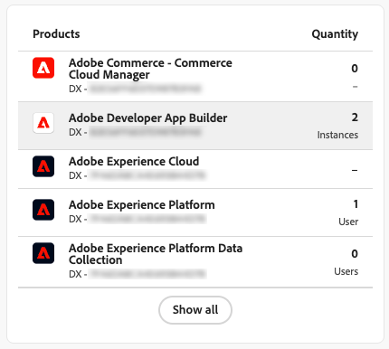
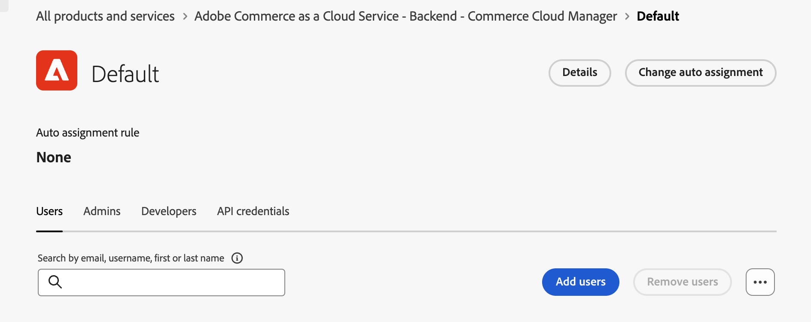
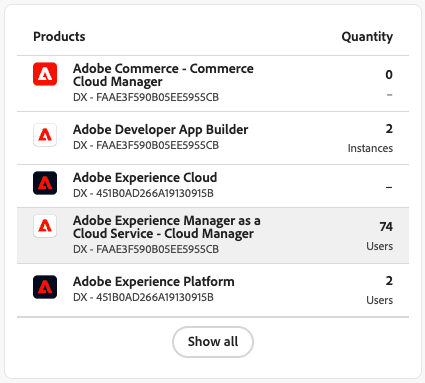
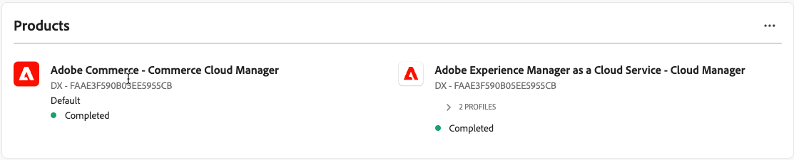

# ユーザーとIdentity Management

ユーザーが[!DNL Adobe Commerce as a Cloud Service]の管理者にアクセスできるようにするには、組織内のユーザーとして追加し、[Adobe Admin Console](https://adminconsole.adobe.com){target="_blank"}のCloud Service製品にアクセスできることを確認します。

このプロセスには、[!DNL Adobe Commerce as a Cloud Service]へのアクセス権を持つIMS組織が必要です。 組織のシステム管理者または製品管理者のみが、これらのプロセスを実行できます。

>[!TIP]
>
>複数のユーザーを同時に追加するには、[一括CSV アップロード &#x200B;](https://helpx.adobe.com/enterprise/using/bulk-upload-users.html){target="_blank"}を実行できます。
>
> [&#x200B; ユーザーグループ &#x200B;](https://helpx.adobe.com/enterprise/using/user-groups.html){target="_blank"}を作成して、役割に複数のユーザーを追加することもできます。 次に、適切な商品をユーザーグループに追加します。

## 役割について

[!DNL Adobe Commerce as a Cloud Service]に対して次の役割を使用できます。 これらのロールを表示または編集するには、Commerce管理者で&#x200B;[!UICONTROL **System**] > [!UICONTROL **権限**] > [!UICONTROL **User Roles**]&#x200B;に移動します。

* **ユーザー** - ユーザーはCommerce管理者に対する管理者アクセス権を持っていますが、Admin Consoleでは製品レベルのアクセス権を管理できません。 ユーザーは、[で](./getting-started.md#create-an-instance) インスタンスを作成[!DNL Commerce Cloud Manager]するためのクレジットを使用することもできます。

  >[!NOTE]
  >
  >開発者や管理者を含むすべてのCommerce ユーザーにも、ユーザーロールが割り当てられている必要があります。 これは、基本的なCommerce権限に必要です。

  >[!TIP]
  >
  >Commerce管理者へのアクセスをIP アドレスで制限する場合は、[IP アドレスで製品アクセスを制限](https://helpx.adobe.com/enterprise/using/ip-based-access.html){target="_blank"}を参照してください。

* [**Developers**](https://helpx.adobe.com/enterprise/using/manage-developers.html#Adddevelopers){target="_blank"}：開発者にはユーザー権限があり、開発者ユーザーとしてCommerce インスタンスに追加されます。 [[!DNL Admin UI SDK]](https://developer.adobe.com/commerce/extensibility/admin-ui-sdk/){target="_blank"}、[&#x200B; イベントの設定](https://developer.adobe.com/commerce/extensibility/events/){target="_blank"}、[webhookの作成](https://developer.adobe.com/commerce/extensibility/webhooks/){target="_blank"}を使用できます。

* 管理者 – 管理者には3つの種類があります。
   * [&#x200B; システム管理者](https://helpx.adobe.com/enterprise/using/admin-roles.html){target="_blank"} - システム管理者は、Admin Consoleを通じて、組織内のすべての製品および製品プロファイルにアクセスできます。
   * [製品管理者](#add-a-product-admin) – 製品管理者は、[の製品](#add-users)のユーザー、ロール、権限を[!DNL Adobe Admin Console]管理し、[Commerce管理者](https://experienceleague.adobe.com/en/docs/commerce-admin/systems/user-accounts/permissions-users-all#create-a-user){target="_blank"}のユーザーを管理できます。
   * [製品プロファイル管理者](#add-developers-and-product-profile-admins) – 製品プロファイル管理者はAdobe Commerce管理者にアクセスできませんが、[!DNL Adobe Admin Console]で製品のユーザーを管理できます。

Adobe Commerce内の各ロールに付与される権限について詳しくは、[&#x200B; ロールリソース &#x200B;](#role-resources)を参照してください。

## 製品管理者の追加

>[!BEGINTABS]

>[!NOTE]
>
>製品管理者として追加する前に、製品管理者に[&#x200B; ユーザーの役割](#add-users)を割り当てます。 Commerceの基本権限には、ユーザーロールが必要です。

>[!TAB GA （2025年10月13日（PT）以降にプロビジョニング） ]

1. <https://adminconsole.adobe.com>に移動し、Adobe IDでログインします。

1. 組織の選択。

1. 「[!UICONTROL **ユーザー**]」タブを選択します。

1. 「[!UICONTROL **管理者**]」タブを選択します。

1. 「[!UICONTROL **管理者を追加**]」をクリックします。

1. 管理者として追加するユーザーのユーザー名またはメールアドレスを入力し、[!UICONTROL **次へ**]&#x200B;をクリックします。

1. [!UICONTROL **製品プロファイル管理者**]&#x200B;の役割を選択します。

1. [!UICONTROL **+**]&#x200B;をクリックして製品を追加します。

1. 管理者を追加する既存のCommerce インスタンスを選択します。 Commerce インスタンスでは、次のフォーマットが使用されます：`Adobe Commerce - <instance-name> - ACCS - <environment-type> - <tenant-id>`。

1. 製品プロファイルを選択します。

1. 「[!UICONTROL **適用**]」をクリックします。

1. [!UICONTROL **保存**]&#x200B;をクリックします。

>[!TAB 早期アクセス （2025年10月13日より前にプロビジョニング） ]

1. <https://adminconsole.adobe.com>に移動し、Adobe IDでログインします。

1. 組織の選択。

1. [!UICONTROL **製品**] タブの&#x200B;[!UICONTROL **製品とサービス**]&#x200B;で、[!UICONTROL **Adobe Commerce - Commerce Cloud Manager**]&#x200B;製品を選択します。

   Adobe Commerce Cloud Managerが表示されているAdmin Consoleの{width="600" zoomable="yes"}

1. 「[!UICONTROL **管理者**]」タブを選択します。

1. 「[!UICONTROL **管理者を追加**]」をクリックします。

1. 管理者として追加するユーザーのユーザー名またはメールアドレスを入力し、[!UICONTROL **保存**]&#x200B;をクリックします。

>[!ENDTABS]

## ユーザーを追加

次の手順では、[!DNL Commerce Cloud Manager]とCommerce管理者にユーザーを追加する方法について説明します。 [!DNL Commerce Cloud Manager] インターフェイスでは、Commerce インスタンスを作成および管理できます。 このプロセスは、開発者と管理者を含むすべてのユーザーに必要です。

>[!NOTE]
>
>Adobe Commerce as a Cloud Service製品にユーザーと開発者を追加できるのは、製品管理者とシステム管理者のみです。

組織がプロビジョニングされた日付に基づいて、製品管理者ユーザーをAdobe Commerce as a Cloud Serviceに追加するには、2つの異なる方法があります。 早期アクセス組織では、製品管理者の役割を割り当てられた各ユーザーに、組織内のすべてのインスタンスを管理する権限が付与されます。 2025年10月13日以降にプロビジョニングされた一般提供（GA）組織では、特定のインスタンスの製品管理者としてユーザーを割り当てることができます。 製品管理者ユーザーがログインすると、管理する権限を持つインスタンスのみが表示されます。

>[!BEGINTABS]

>[!TAB GA （2025年10月13日（PT）以降にプロビジョニング） ]

1. <https://adminconsole.adobe.com>に移動し、Adobe IDでログインします。

1. 組織の選択。

1. 「[!UICONTROL **製品**]」タブを選択します。

1. 「[!UICONTROL **Adobe Commerce**]」商品を選択します。

1. Commerce Cloud インスタンスを作成および管理できるcloud manager インターフェイスにユーザーを追加する場合は、Commerce Manager製品を選択するか、ユーザーを追加する既存のCommerce インスタンスを選択します。 Commerce インスタンスでは、次のフォーマットが使用されます：`Adobe Commerce - <instance-name> - ACCS - <environment-type> - <tenant-id>`。

1. 「[!UICONTROL **ユーザー**]」タブを選択し、「[!UICONTROL **ユーザーを追加**]」をクリックします。

1. 追加するユーザーのユーザー名またはメールアドレスを入力し、[!UICONTROL **保存**]&#x200B;をクリックします。

1. 必要な製品プロファイルを選択します。

1. 「[!UICONTROL **適用**]」をクリックします。

1. [!UICONTROL **保存**]&#x200B;をクリックします。

>[!TAB 早期アクセス （2025年10月13日より前にプロビジョニング） ]

1. <https://adminconsole.adobe.com>に移動し、Adobe IDでログインします。

1. 組織の選択。

1. [!UICONTROL **製品**] タブの&#x200B;[!UICONTROL **製品とサービス**]&#x200B;で、[!UICONTROL **Adobe Commerce - Commerce Cloud Manager**]&#x200B;製品を選択します。

   {width="600" zoomable="yes"}

1. 「[!UICONTROL **Default - Cloud Manager**] product profile」をクリックします。

1. 「[!UICONTROL **ユーザー**]」タブを選択し、「[!UICONTROL **ユーザーを追加**]」をクリックします。

   {width="600" zoomable="yes"}

1. 追加するユーザーのユーザー名またはメールアドレスを入力し、[!UICONTROL **保存**]&#x200B;をクリックします。

>[!ENDTABS]

### 開発者と製品プロファイル管理者の追加

開発者と製品プロファイル管理者を追加するには、[&#x200B; ユーザーを追加](#add-users) プロセスを繰り返しますが、[!UICONTROL **ユーザー**] タブの代わりに&#x200B;[!UICONTROL **開発者**]&#x200B;または&#x200B;[!UICONTROL **管理者**] タブを選択します。

>[!NOTE]
>
>製品プロファイル管理者は、Commerce管理者にアクセスできません。 詳しくは、[役割について](#understanding-roles)を参照してください。
>
>開発者として追加する前に、開発者にユーザーの役割を割り当てます。 Commerceの基本権限には、ユーザーロールが必要です。

Admin Consoleの「{width="600" zoomable="yes"}

## 役割のリソース

次のリストは、デフォルトの役割が[!DNL Adobe Commerce]管理者内でアクセスする権限を持つリソースについて説明します。 各ロールのデフォルトの権限を編集するには、Commerce Adminで&#x200B;[!UICONTROL **System**] > [!UICONTROL **Permissions**] > [!UICONTROL **User Roles**]&#x200B;に移動します。

**ユーザー**

* カタログ
   * 在庫
      * 特定可能
         * 商品の価格を読む

**開発者**

* カタログ
   * 在庫
      * 特定可能
         * 商品の価格を読む
* システム
   * データ転送
      * 履歴を読み込み
* Adobe IO イベント設定
   * 設定の確認
   * イベントプロバイダーの作成
   * 設定の更新
   * イベントの同期
   * イベントプロバイダーリストの取得
* イベントフレームワーク
   * イベントリスト
   * イベント接続のテスト
   * イベントの購読
   * イベントから購読を解除
   * イベントステータス
   * イベントサブスクリプションを取得するAPI
   * イベント購読の表示の管理者UI
   * イベント購読の作成の管理UI
   * 新しいイベント管理UIのリクエスト
* Webhook
   * Webhook デジタル署名
      * Webhook デジタル署名設定
      * Webhook デジタル署名キーの生成
   * Webhook管理
      * Webhook グリッド
      * Webhook Edit
      * Webhookのテスト
      * WebhookのAPI登録
      * WebhookからのAPIの登録解除
      * Webhook リスト
      * 新しいWebhookをリクエスト
      * Webhook ログ
      * Webhookのリストを取得

**管理者**

管理者はすべての権限にアクセスできます。

## ユーザーを[!DNL AEM Assets]または[!DNL Product Visuals]に追加

[!DNL Adobe Experience Manager Assets]および[!DNL Product Visuals powered by AEM Assets] ユーザーには、次の設定が必要です。

アカウントに[[!DNL Adobe Experience Manager as a Cloud Service]](https://experienceleague.adobe.com/en/docs/experience-manager-cloud-service)へのアクセス権があり、[[!DNL AEM Assets]とともに](https://experienceleague.adobe.com/en/docs/commerce/aem-assets-integration/overview){target="_blank"}[!DNL Adobe Commerce as a Cloud Service]の高度な機能へのアクセスをユーザーに許可する場合は、次のプロセスを完了してください。

>[!NOTE]
>
>適切なアセット権限を持たないユーザーは、[!DNL AEM Assets]AI画像生成[、](https://experienceleague.adobe.com/en/docs/experience-manager-cloud-service/content/generative-ai/generative-ai-in-aem){target="_blank"}生成バリエーション [など、](https://experienceleague.adobe.com/en/docs/experience-manager-cloud-service/content/generative-ai/generate-variations-integrated-editor){target="_blank"}の高度な機能にアクセスできません。

>[!TIP]
>
>複数のユーザーを同時に追加するには、[一括CSV アップロード &#x200B;](https://helpx.adobe.com/enterprise/using/bulk-upload-users.html){target="_blank"}を実行できます。
>
>[&#x200B; ユーザーグループ &#x200B;](https://helpx.adobe.com/enterprise/using/user-groups.html){target="_blank"}を作成して、役割に複数のユーザーを追加することもできます。 次に、[!UICONTROL **Adobe Experience Manager as a Cloud Service - Cloud Manager**]&#x200B;商品をユーザーグループに追加できます。

1. <https://adminconsole.adobe.com>に移動し、Adobe IDでログインします。

1. 組織の選択。

1. [!UICONTROL **製品**] タブの&#x200B;[!UICONTROL **製品とサービス**]&#x200B;で、[!UICONTROL **Adobe Experience Manager as a Cloud Service - Cloud Manager**]&#x200B;製品を選択します。

   {width="600" zoomable="yes"}

1. 「[!UICONTROL **ユーザー**]」タブを選択します。

1. 「[!UICONTROL **ユーザーを追加**]」をクリックします。

1. 追加するユーザーのユーザー名またはメールアドレスを入力します。

1. 「[!UICONTROL **製品を追加**]」をクリックします。

1. [!DNL AEM Assets]とCommerceの統合に必要な次の製品プロファイルを選択します。

   * ビジネスオーナー – プログラムの作成と管理に必要です。
   * Deployment Manager - リポジトリからAEMにコードをデプロイするために必要です。

   Cloud ManagerまたはExperience Manager インターフェイスにアクセスする必要がない開発者を追加する場合は、代わりに開発者ロールを割り当てることができます。

   >[!NOTE]
   >
   >これらの権限が[!DNL AEM Assets]へのアクセスにどのように影響するかについては、[Cloud Manager製品プロファイル &#x200B;](https://experienceleague.adobe.com/en/docs/experience-manager-cloud-service/content/onboarding/concepts/aem-cs-team-product-profiles#cloud-manager-product-profiles){target="_blank"}を参照してください。

   Commerce AdminのAsset Selectorおよび自動入力された設定フィールド（プログラム ID、Environment ID、Domain mapping）の場合、ユーザーには&#x200B;**AEM Assets DM OpenAPI Users - delivery**&#x200B;製品プロファイルも必要です。 詳しくは、[&#x200B; ユーザー権限とIMS](https://experienceleague.adobe.com/en/docs/commerce/aem-assets-integration/get-started/permissions){target="_blank"}を参照してください。

1. 「[!UICONTROL **適用**]」をクリックします。

1. [!UICONTROL **保存**]&#x200B;をクリックします。

ユーザーにアクセス権があることを確認するには、ユーザーの名前をクリックしてプロファイルページを開きます。 [!UICONTROL **製品**] セクションでは、[!UICONTROL **Adobe Experience Manager as a Cloud Service - Cloud Manager**]&#x200B;製品の下の&#x200B;[!UICONTROL **完了済み**]&#x200B;と表示する必要があります。 ユーザーを追加してプロファイルでステータスが更新されるのを確認するには、数秒かかる場合があります。 ページを更新して、更新されたステータスを確認します。

完了製品のアクセス状態を表示する{width="600" zoomable="yes"}

## Experience Managerのインターフェイスにアクセス

ユーザーを[!DNL AEM Assets]に追加した後、[!DNL Experience Manager]https://experience.adobe.com/[に移動して](https://experience.adobe.com/){target="_blank"} インターフェイスにアクセスできます。

1. [!UICONTROL **クイックアクセス**] セクションで、[!UICONTROL **Experience Manager**]&#x200B;をクリックするか、[!UICONTROL **Experience Manager**]&#x200B;が表示されない場合は&#x200B;[!UICONTROL **すべて表示**]&#x200B;をクリックします。 次に、[!UICONTROL **Cloud Manager**]&#x200B;をクリックするか、[https://my.cloudmanager.adobe.com](https://my.cloudmanager.adobe.com){target="_blank"}に直接移動します。

1. [!UICONTROL **Cloud Manager**] ページで、「[!UICONTROL **プログラムを追加**]」をクリックして開始します。

1. [新しいプログラムを作成](https://experienceleague.adobe.com/en/docs/experience-manager-cloud-service/content/onboarding/journey/create-program){target="_blank"}。

1. [新しい環境を作成](https://experienceleague.adobe.com/en/docs/experience-manager-cloud-service/content/screens-as-cloud-service/onboarding-screens-cloud/creating-an-environment){target="_blank"}。

1. 環境を作成したら、[Admin Console](https://adminconsole.adobe.com){target="_blank"}に戻り、[!UICONTROL **Adobe Experience Manager as a Cloud Service**]&#x200B;を選択します。

1. 新製品のプロファイルが表示されます。 `- author -`を含むを選択してください。 例：`<environment-name> - author - <program-id> - <environment-id>`。

1. [製品プロファイルにユーザーを追加](https://experienceleague.adobe.com/en/docs/experience-manager-cloud-manager/content/requirements/users-and-roles){target="_blank"}。

* [Commerce メタデータをサポートするように [!DNL AEM Assets] 設定](https://experienceleague.adobe.com/en/docs/commerce/aem-assets-integration/get-started/configure-aem)
* [&#x200B; アセットの同期のために [!DNL AEM Assets] Commerceと統合](https://experienceleague.adobe.com/en/docs/commerce/aem-assets-integration/get-started/setup-synchronization)

{{aem-assets-instance-mapping}}

## ID管理とシングルサインオン設定

{{ims-identity-and-sso-config}}

