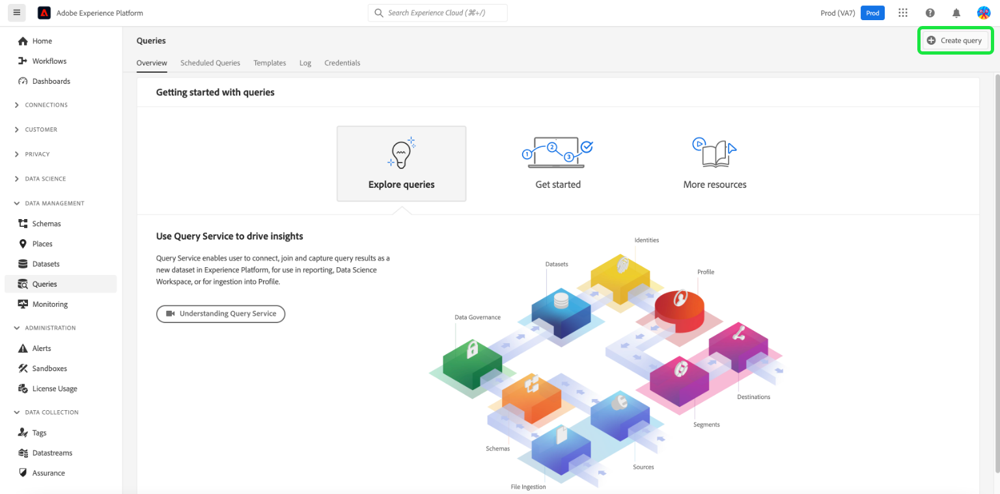
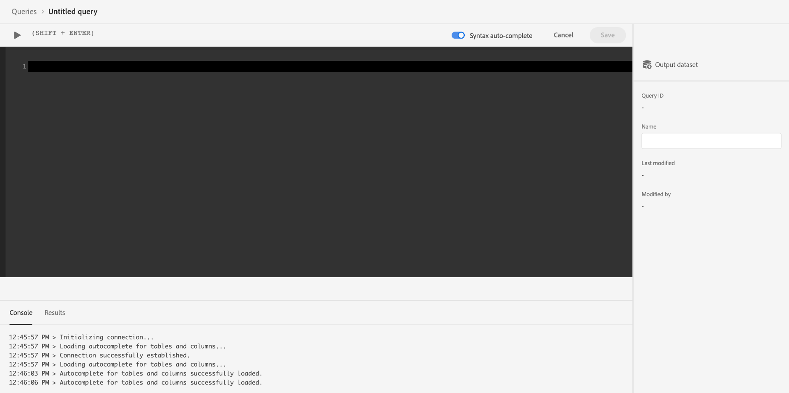
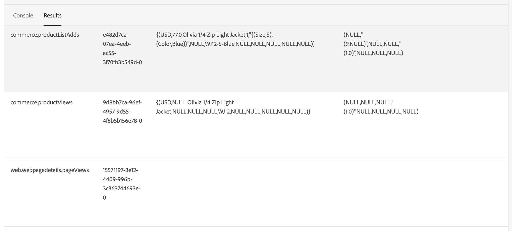

# Adobe CommerceのデータをAdobe Experience Platformに接続する

[!DNL Data Connection]拡張機能をインストールすると、Commerce **管理者**&#x200B;の&#x200B;**サービス**&#x200B;の&#x200B;_システム_ メニューに2つの新しい設定ページが表示されます。

- Commerce Services Connector
- [!DNL Data Connection]

Adobe Commerce インスタンスをAdobe Experience Platformに接続するには、両方のコネクタを設定する必要があります。Commerce Services コネクタから始めて、[!DNL Data Connection]拡張機能で終了します。

## Commerce サービスコネクタの設定

以前にAdobe Commerce サービスをインストールしたことがある場合は、Commerce サービスコネクタが既に設定されている可能性があります。 そうでない場合は、[Commerce Services コネクタ ](../landing/saas.md) ページで次のタスクを実行する必要があります。

1. Commerce アカウントにログインして[実稼動およびサンドボックス API キーを取得](../landing/saas.md#credentials)します。
1. [SaaS データスペース ](../landing/saas.md#saas-configuration)を選択します。
1. Adobe アカウントにログインして[組織IDを取得](../landing/saas.md#ims-organization-optional)します。

Commerce サービス コネクタを構成したら、次に[!DNL Data Connection]拡張機能を構成します。

## [!DNL Data Connection]拡張機能の設定

この節では、[!DNL Data Connection]拡張機能の設定方法について説明します。

### サービスアカウントと資格情報の詳細の追加

[過去の注文データ ](#send-historical-order-data)または[顧客プロファイルデータ ](#send-customer-profile-data)を収集して送信する場合は、サービスアカウントと資格情報の詳細を追加する必要があります。 また、[Audience Activation](https://experienceleague.adobe.com/docs/commerce-admin/customers/audience-activation.html)拡張機能を設定する場合は、次の手順を実行する必要があります。

ストアフロントまたはバックオフィスのデータのみを収集して送信する場合は、[general](#general) セクションにスキップできます。

#### 手順1:Adobe Developer Consoleでのプロジェクトの作成

Commerceを認証するプロジェクトをAdobe Developer Consoleで作成し、Experience Platform API呼び出しを行えるようにします。

プロジェクトを作成するには、[認証してExperience Platform APIにアクセス ](https://experienceleague.adobe.com/docs/experience-platform/landing/platform-apis/api-authentication.html) チュートリアルで説明されている手順に従います。

チュートリアルを進める際には、プロジェクトに次の要素が含まれていることを確認します。

- 次の[製品プロファイル ](https://experienceleague.adobe.com/docs/experience-platform/landing/platform-apis/api-authentication.html#select-product-profiles)へのアクセス：**既定の実稼動環境のすべてのアクセス**&#x200B;および&#x200B;**AEP既定のすべてのアクセス**。
- 正しい[役割と権限が設定されています](https://experienceleague.adobe.com/docs/experience-platform/landing/platform-apis/api-authentication.html#assign-api-to-a-role)。
- サーバー間の認証方法としてJSON Web Tokens （JWT）を使用することを決定した場合は、秘密鍵もアップロードする必要があります。

この手順の結果、次の手順で使用する設定ファイルが作成されます。

#### 手順2：設定ファイルのダウンロード

[ ワークスペース設定ファイル ](https://developer.adobe.com/commerce/extensibility/events/project-setup/#download-the-workspace-configuration-file)をダウンロードします。 `<workspace-name>.json` ファイルには、Commerce管理者の&#x200B;**サービスアカウント/資格情報の詳細** ページに入力する必要があるすべての値が含まれています。

![[!DNL Data Connection]管理者設定](./assets/epc-admin-config.png){width="700" zoomable="yes"}

1. Commerce管理者で、**Stores**/Settings > **Configuration** > **Services** > **[!DNL Data Connection]**&#x200B;に移動します。

1. **Adobe Developer Authorization Type** メニューから実装したサーバー間の認証メソッドを選択します。 Adobeでは、OAuthを使用することをお勧めします。 [学習を増やす](https://developer.adobe.com/commerce/webapi/rest/authentication/server-to-server/)。

1. `<workspace-name>.json` ファイルの内容を&#x200B;**サービスアカウント/資格情報の詳細** フィールド（`"client_id"`、`"client_secrets"`、`"technical_account_email"`、`"technical_account_id"`など）にコピーします。

1. 「**設定を保存**」をクリックします。

1. 「**[!UICONTROL Test connection]**」ボタンをクリックして、入力したサービスアカウントと資格情報が正しいことを確認します。

### 一般

1. 管理者で、**システム**/サービス/**[!DNL Data Connection]**&#x200B;に移動します。

   ![[!DNL Data Connection]設定](./assets/epc-settings.png){width="700" zoomable="yes"}

1. **一般**&#x200B;の「**設定**」タブで、[Commerce サービスコネクタ ](../landing/saas.md#organizationid)で設定されているように、Adobe Experience Platform アカウントに関連付けられているIDを確認します。 組織IDはグローバルです。 Adobe Commerce インスタンスごとに関連付けることができる組織IDは1つだけです。

1. **スコープ** ドロップダウンで、コンテキストを&#x200B;**Web サイト**&#x200B;に設定します。

1. （オプション）既に[AEP Web SDK （alloy） ](https://experienceleague.adobe.com/docs/experience-platform/edge/home.html)がサイトにデプロイされている場合は、チェックボックスを有効にし、AEP Web SDKの名前を追加します。 それ以外の場合は、これらのフィールドを空白のままにして、[!DNL Data Connection]拡張機能が1つをデプロイします。

   >[!NOTE]
   >
   >独自のAEP Web SDKを指定した場合、[!DNL Data Connection]拡張機能は、このページで指定されたデータストリーム IDではなく、そのSDKに関連付けられたデータストリーム IDを使用します（存在する場合）。

### データ収集

このセクションでは、収集してExperience Platform エッジに送信するデータのタイプを指定します。 データには3つの種類があります。

- **行動** （クライアント側データ）は、ストアフロントに取り込まれたデータです。 これには、`View Page`、`View Product`、`Add to Cart`、[要求リスト ](events.md#b2b-events)など、買い物客とのやり取りが含まれます（B2B販売者の場合）。

- **バックオフィス** （サーバーサイドデータ）は、Commerce サーバーにキャプチャされたデータです。 これには、注文の配送状況に関する情報（注文が行われた場合、キャンセルされた場合、返金された場合、発送された場合、完了した場合など）が含まれます。 また、[過去の注文データ ](#send-historical-order-data)も含まれます。

- **プロファイル**&#x200B;は、買い物客のプロファイル情報に関連するデータです。 [詳細](#send-customer-profile-data)を学習します。

Adobe Commerce インスタンスでデータ収集を開始できるようにするには、[前提条件](overview.md#prerequisites)を確認してください。

[ ストアフロント ](events.md#storefront-events)、[ バックオフィス ](events-backoffice.md)、[ プロファイル ](events-backoffice.md#customer-profile-events)のイベントについて詳しくは、イベントのトピックを参照してください。

>[!NOTE]
>
>**データ収集** セクションのすべてのフィールドは、**Web サイト**&#x200B;以上のスコープに適用されます。

1. ストアフロントの行動データを送信する場合は、**ストアフロントイベント**&#x200B;を選択します。

1. 注文が行われた、キャンセルされた、返金された、または発送されたなどの注文ステータス情報を送信する場合は、**バックオフィスイベント**&#x200B;を選択します。

   >[!NOTE]
   >
   >**バックオフィスイベント**&#x200B;を選択すると、すべてのバックオフィスデータがExperience Platform エッジに送信されます。 買い物客がデータ収集をオプトアウトする場合は、Experience Platformで買い物客のプライバシー設定を明示的に設定する必要があります。 これは、コレクターが買い物客の好みにもとづいて同意を既に処理しているストアフロントイベントとは異なります。 Experience Platformでの買い物客のプライバシー設定について[詳細](https://experienceleague.adobe.com/docs/experience-platform/landing/governance-privacy-security/consent/adobe/dataset.html)を説明します。

1. （独自のAEP Web SDKを使用している場合は、この手順をスキップしてください。） [Adobe Experience Platformでデータストリームを作成](https://experienceleague.adobe.com/docs/experience-platform/datastreams/configure.html#create)するか、収集に使用する既存のデータストリームを選択します。 「**データストリーム ID**」フィールドにそのデータストリーム IDを入力します。

1. Commerce データを含める&#x200B;**データセット ID**&#x200B;を入力します。 データセット IDを検索するには：

   1. Experience Platform UIを開き、左側のナビゲーションで「**データセット**」を選択して、**データセット** ダッシュボードを開きます。 ダッシュボードには、組織で使用可能なすべてのデータセットが一覧表示されます。 リストされた各データセットの詳細（名前、データセットが準拠するスキーマ、最新の取り込み実行のステータスなど）が表示されます。
   1. データストリームに関連付けられているデータセットを開きます。
   1. 右側のペインで、データセットの詳細を表示します。 データセット IDをコピーします。

1. [cron](https://experienceleague.adobe.com/docs/commerce-admin/systems/tools/cron.html) ジョブに従ったスケジュールに基づいてバックオフィスイベントデータを更新するには、`Sales Orders Feed` インデックスを`Update by Schedule`に変更する必要があります。

   1. _管理者_ サイドバーで、**[!UICONTROL System]** > _[!UICONTROL Tools]_>**[!UICONTROL Index Management]**に移動します。

   1. `Sales Orders Feed` インデクサーのチェックボックスを選択します。

   1. **[!UICONTROL Actions]**&#x200B;を`Update by Schedule`に設定します。

   1. バックオフィスデータを初めて有効にする場合は、次のコマンドを実行して再インデックスを作成し、再同期をトリガーします。 後続の再同期は、[cron](https://experienceleague.adobe.com/docs/commerce-admin/systems/tools/cron.html) ジョブが正しく設定されている限り、自動的に行われます。

      ```bash
      bin/magento index:reindex sales_order_data_exporter_v2
      ```

      ```bash
      bin/magento saas:resync --feed orders
      ```

#### フィールドの説明

| フィールド | 説明 |
|--- |--- |
| 範囲 | 設定設定を適用する特定のweb サイト。 |
| 組織ID （グローバル） | ADOBE DX製品を購入した組織に属するID。 このIDは、Adobe Commerce インスタンスをAdobe Experience Platformにリンクします。 |
| AEP Web SDKは既にサイトにデプロイされていますか？ | 独自のAEP Web SDKをサイトにデプロイしている場合は、このチェックボックスをオンにします |
| AEP Web SDK名（グローバル） | 既にExperience Platform Web SDKがサイトにデプロイされている場合は、このフィールドにそのSDKの名前を指定します。 これにより、Storefront Event CollectorとStorefront Event SDKは、[!DNL Data Connection]拡張機能によってデプロイされたバージョンではなく、Experience Platform Web SDKを使用できるようになります。 サイトにデプロイされたExperience Platform Web SDKがない場合は、このフィールドを空白のままにして、[!DNL Data Connection]拡張機能が1つをデプロイします。 |
| ストアフロントイベント | 組織IDとデータストリーム IDが有効である限り、はデフォルトでオンになっています。 ストアフロントイベントは、サイトを閲覧する顧客から匿名化された行動データを収集します。 |
| バックオフィスイベント | チェックを入れた場合、イベントペイロードには、注文が行われた場合、キャンセルされた場合、返金された場合、または発送された場合など、匿名の注文ステータス情報が含まれます。 |
| データストリーム ID （web サイト） | ADOBE EXPERIENCE PLATFORMから他のAdobe DX製品へのデータの流れを許可するID。 このIDは、特定のAdobe Commerce インスタンス内の特定のweb サイトに関連付ける必要があります。 独自のExperience Platform Web SDKを指定する場合は、このフィールドにデータストリーム IDを指定しないでください。 [!DNL Data Connection]拡張機能は、そのSDKに関連付けられたデータストリーム IDを使用し、このフィールドで指定されたデータストリーム IDを無視します（存在する場合）。 |
| データセット ID （web サイト） | COMMERCE データを含むデータセットのID。 このフィールドは、**ストアフロントイベント**&#x200B;または&#x200B;**バックオフィスイベント**&#x200B;のチェックボックスを選択解除しない限り必須です。 また、独自のExperience Platform Web SDKを使用しており、データストリーム IDを指定していない場合でも、データストリームに関連付けられているデータセット IDを追加する必要があります。 それ以外の場合は、このフォームを保存できません。 |

オンボーディングが完了すると、ストアフロントデータがExperience Platformエッジに流れ始めます。 バックオフィスデータは、エッジに表示されるまでに約5分かかります。 後続の更新は、cron スケジュールに基づいてエッジに表示されます。

### 顧客プロファイルデータの送信

Experience Platformに送信できるプロファイルデータには、プロファイルレコードと時系列プロファイルイベントの2種類があります。

プロファイルレコードには、買い物客がCommerce インスタンスでプロファイル（買い物客の名前など）を作成したときに保存されるデータが含まれます。 スキーマとデータセットが[適切に設定されている](profile-data.md)場合、プロファイルレコードがExperience Platformに送信され、Adobeのプロファイル管理およびセグメント化サービス [Real-Time CDP](https://experienceleague.adobe.com/docs/experience-platform/rtcdp/intro/rtcdp-intro/overview.html?lang=ja)に転送されます。

時系列プロファイルイベントには、顧客のプロファイル情報に関するデータが含まれます。たとえば、顧客がサイトでアカウントを作成、編集、削除するかどうかも含まれます。 プロファイルイベントデータがExperience Platformに送信されると、他のDX製品で使用できるデータセットに格納されます。

1. [提供された](#add-service-account-and-credential-details) サービス アカウントと資格情報の詳細があることを確認してください。

1. [ プロファイルレコードデータ取り込み](profile-data.md)および[時系列プロファイルイベントデータ取り込み](update-xdm.md#time-series-profile-event-data)にスキーマとデータセットが指定されていることを確認してください。

1. Experience Platformにプロファイルデータを送信する場合は、**顧客プロファイル** チェックボックスにチェックマークを付けます。

1. **プロファイルデータセット ID**&#x200B;を入力します。

   プロファイルレコードデータは、行動データやバックオフィスのイベントデータに現在使用しているのとは異なるデータセットを使用する必要があります。

1. 行動データとバックオフィスデータに使用しているのと同じデータストリーム IDを使用してプロファイルイベントをストリーミングしない場合は、**同じデータストリーム IDを使用して顧客プロファイルをストリーミング**&#x200B;からチェックマークを削除し、代わりに使用するデータストリーム IDを入力します。

プロファイルレコードがReal-Time CDPで使用可能になるまでに約10分かかります。 プロファイルイベントはすぐにストリーミングを開始します。

>[!TIP]
>
>Experience Platformにプロファイルデータが表示されない場合は、[Commerce KnowledgeBase](https://experienceleague.adobe.com/en/docs/commerce-knowledge-base/kb/troubleshooting/miscellaneous/data-connection-customer-profiles-not-exported)でトラブルシューティングの候補を参照してください。

#### フィールドの説明

| フィールド | 説明 |
|--- |--- |
| 顧客プロファイル | 顧客プロファイルレコードを収集して送信する場合は、このチェックボックスを選択します。 |
| プロファイルデータセット ID | プロファイルレコードでは、行動イベントやバックオフィスイベントに使用されるデータセットとは異なるデータセットを使用する必要があります。 |
| 同じデータストリーム IDを使用した顧客プロファイルのストリーム | 現在、行動イベントやバックオフィスイベントに使用しているのと同じデータストリームを使用するかどうかを決定します。 |
| 顧客プロファイル用データストリーム | 顧客プロファイルレコード固有のデータストリームを指定します。 |

### 過去の注文データを送信する

Adobe Commerceは、最大5年間の[過去の注文データとステータス ](events-backoffice.md)を収集します。 [!DNL Data Connection]拡張機能を使用して、その履歴データをExperience Platformに送信し、顧客プロファイルを強化し、過去の注文に基づいて顧客体験をパーソナライズできます。 データは、Experience Platform内のデータセットに保存されます。

Commerceは既に過去の注文データを収集していますが、そのデータをExperience Platformに送信するには、いくつかのステップを完了する必要があります。

このビデオでは、過去の注文について詳しく説明し、次の手順を完了して過去の注文収集を実装します。

>[!VIDEO](https://video.tv.adobe.com/v/3424672)

#### Order Sync サービスの設定

注文同期サービスでは、[ メッセージキューフレームワーク ](https://developer.adobe.com/commerce/php/development/components/message-queues/)とRabbitMQを使用しています。 これらの手順を完了すると、注文状況データをSaaSに同期できるようになります。これは、Experience Platformに送信する前に必要です。

1. [提供された](#add-service-account-and-credential-details) サービス アカウントと資格情報の詳細があることを確認してください。

1. [RabbitMQを](https://experienceleague.adobe.com/docs/commerce-cloud-service/user-guide/configure/service/rabbitmq.html)有効にします。

   >[!NOTE]
   >
   >RabbitMQは、既にCommerce バージョン 2.4.7以降に設定されていますが、コンシューマーを有効にする必要があります。

1. `.magento.env.yaml`環境変数を使用して、`CRON_CONSUMERS_RUNNER`のcron ジョブでメッセージキューコンシューマーを有効にします。

   ```yaml
      stage:
        deploy:
          CRON_CONSUMERS_RUNNER:
            cron_run: true
   ```

   >[!NOTE]
   >
   >使用可能なすべての設定オプションについて詳しくは、[変数のデプロイに関するドキュメント ](https://experienceleague.adobe.com/docs/commerce-cloud-service/user-guide/configure/env/stage/variables-deploy.html#cron_consumers_runner)を参照してください。

注文同期サービスが有効になっている場合は、**[!UICONTROL [!DNL Data Connection]]** ページで過去の注文日付範囲を指定できます。

#### 注文履歴の日付範囲の指定

Experience Platformに送信する履歴オーダーの日付範囲を指定します。

1. 管理者で、**システム**/サービス/**[!DNL Data Connection]**&#x200B;に移動します。

1. 「**注文履歴**」タブを選択します。

   ![[!DNL Data Connection]注文履歴](./assets/epc-order-history.png){width="700" zoomable="yes"}

1. **注文履歴の同期**&#x200B;で、**設定からデータセット IDをコピー** チェックボックスが既に有効になっています。 これにより、**設定** タブで指定したデータセットと同じデータセットを使用できます。

1. **差出人**&#x200B;および&#x200B;**差出人** フィールドで、送信する履歴注文データの日付範囲を指定します。 5年を超える日付範囲は選択できません。

1. **[!UICONTROL Start Sync]**&#x200B;を選択して同期をトリガーし、開始します。 過去の注文データは、ストアフロントやバックオフィスのデータがストリーミングされるのではなく、バッチデータです。 バッチ処理は、Experience Platformに到着するまでに約45分かかります。

##### フィールドの説明

| フィールド | 説明 |
|--- |--- |
| 設定からデータセット IDをコピー | 「**設定**」タブで入力したデータセット IDをコピーします。 |
| データセット ID （web サイト） | COMMERCE データを含むデータセットのID。 このフィールドは、**ストアフロントイベント**&#x200B;または&#x200B;**バックオフィスイベント**&#x200B;のチェックボックスを選択解除しない限り必須です。 また、独自のExperience Platform Web SDKを使用しており、データストリーム IDを指定していない場合でも、データストリームに関連付けられているデータセット IDを追加する必要があります。 それ以外の場合は、このフォームを保存できません。 |
| 送信者 | 注文履歴データの収集を開始する日付。 |
| へ | 注文履歴データの収集を終了する日付。 |
| 同期を開始 | 注文履歴データをExperience Platform エッジに同期するプロセスを開始します。 **[!UICONTROL Dataset ID]** フィールドが空白であるか、データセット IDが無効な場合、このボタンは無効になります。 |

### データのカスタマイズ

「**Data Customization**」タブでは、[!DNL Commerce]で設定され、Experience Platformに送信されたカスタム属性を表示できます。

![[!DNL Data Connection] データのカスタマイズ ](./assets/epc-data-customization.png){width="700" zoomable="yes"}

>[!IMPORTANT]
>
>「[ データ収集](#data-collection)」タブで&#x200B;**指定したデータストリーム ID**&#x200B;が、カスタム属性を取り込むためにスキーマにリンクされているIDと一致していることを確認します。

注文のカスタム属性を作成してExperience Platformに送信する場合、Commerceの属性名は、Experience Platformの[!DNL Commerce] スキーマの属性名と一致する必要があります。 それらが一致しない場合、違いを特定するのは難しい場合があります。 名前が一致しない場合は、**カスタム注文属性** テーブルを使用すると、問題の解決に役立ちます。

**カスタム注文属性** テーブルは、Experience Platformの[!DNL Commerce] バックオフィスと[!DNL Commerce] スキーマ間のカスタム注文属性の設定とマッピングを可視化します。 このテーブルでは、様々なソースの注文レベルと注文アイテムレベルのカスタム属性を表示できるため、欠落している属性や不整合している属性を簡単に特定できます。 また、データセット IDを表示して、ライブデータセットと過去のデータセットを区別できます。各データセットには、独自のカスタム属性を設定できます。

テーブル内のカスタム属性名の横に緑色のチェックマークが表示されない場合は、ソース内の属性名が一致していないことを示します。 1つのソースで属性名を修正すると、名前が一致したことを示す緑色のチェックマークが表示されます。

- Experience Platformのスキーマで属性名が更新された場合は、「**Data Customization**」タブに設定を保存して、Experience Platform スキーマの変更をトリガーする必要があります。 この変更は、**ボタンをクリックすると、** カスタム注文属性&#x200B;**[!UICONTROL Refresh]** テーブルに反映されます。
- [!DNL Commerce]で属性名が更新された場合、**カスタム注文属性** テーブルの名前を更新するには、注文イベントを生成する必要があります。 約60分で変更が反映されます。

カスタム属性を[設定](custom-attributes.md)する方法について詳しくは、こちらを参照してください。

#### フィールドの説明

| フィールド | 説明 |
|--- |--- |
| データセット | カスタム属性を含むデータセットが表示されます。 ライブデータセットと履歴データセットには、独自のカスタム属性を設定できます。 |
| Adobe Commerce | [!DNL Commerce] バックオフィスで作成されたカスタム属性を表示します。 |
| Experience Platform | Experience Platformの[!DNL Commerce] スキーマで指定されたカスタム属性を表示します。 |
| 更新 | Experience Platformの[!DNL Commerce] スキーマからカスタム属性名を取得します。 |

## イベントデータが収集されていることを確認する

Commerce ストアからデータが収集されていることを確認するには、[Adobe Experience Platform debugger](https://experienceleague.adobe.com/docs/experience-platform/debugger/home.html)を使用してCommerce サイトを調べます。 データが収集されていることを確認したら、作成した[ データセット ](overview.md#prerequisites)からデータを返すクエリを実行して、ストアフロントとバックオフィスのイベントデータがエッジに表示されていることを確認できます。

1. Experience Platformの左側のナビゲーションで「**クエリ**」を選択し、[!UICONTROL Create Query]をクリックします。

   

1. クエリエディターが開いたら、データセットからデータを選択するクエリを入力します。

   

   例えば、クエリは次のようになります。

   ```sql
   SELECT * from `your_dataset_name` ORDER by TIMESTAMP DESC
   ```

1. クエリの実行後、結果は&#x200B;**コンソール** タブの横にある&#x200B;**結果** タブに表示されます。 このビューには、クエリの表形式の出力が表示されます。

   

この例では、`commerce.productListAdds`、`commerce.productViews`、`web.webpagedetails.pageViews`などのイベントデータが表示されています。 このビューでは、Commerce データがエッジに届いたことを確認できます。

期待した結果と異なる場合は、データセットを開き、失敗したバッチインポートを探します。 [ バッチ インポートのトラブルシューティング ](https://experienceleague.adobe.com/docs/experience-platform/ingestion/batch/troubleshooting.html)の詳細をご覧ください。

### Experience Platformにプロファイルデータが表示されることを確認する

Experience Platformにプロファイルデータが表示されない場合は、[Commerce KnowledgeBase](https://experienceleague.adobe.com/en/docs/commerce-knowledge-base/kb/troubleshooting/miscellaneous/data-connection-customer-profiles-not-exported)でトラブルシューティングの候補を参照してください。

## 次のステップ

Commerce データがExperience Platform エッジに送信されると、Adobe Journey Optimizerなどの他のAdobe Experience Cloud製品で、そのデータを使用できます。 例えば、特定のイベントをリッスンするようにJourney Optimizerを設定し、そのイベントデータに基づいて、初めてのユーザーやカート放棄のトリガーメールを送信することができます。 Journey Optimizerで[ カスタマージャーニー](using-ajo.md)を作成することにより、Commerce プラットフォームを拡張する方法について説明します。
