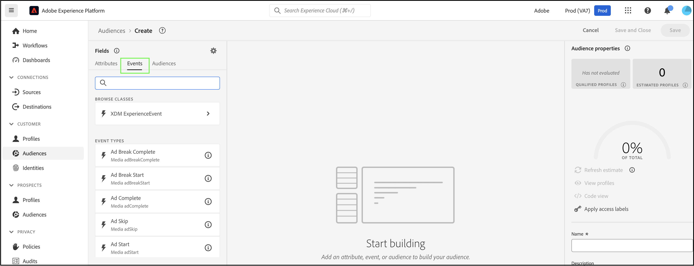
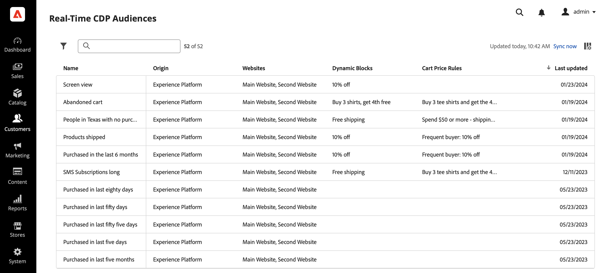

# [!DNL Commerce] Event Data を使用したReal-Time CDPでのオーディエンスの作成

[!DNL Commerce] ストアから取得したイベントデータを使用して、Real-Time CDPでオーディエンスを作成します。 取得されるデータは、閲覧行動、過去の購入、プロファイル属性、コンバージョンまたはチャーンへの傾向、ロイヤルティステータス、高および低の顧客価値などに基づいています。

## どのデータの使用を検討すればよいですか？

ストアフロント、バックオフィス、プロファイルイベントからのデータを使用して、Real-Time CDPでオーディエンスを作成します。

| データタイプ | ストアフロントデータ（行動イベント） | バックオフィスデータ（サーバーサイドイベント） | 顧客プロファイルとセグメントデータ |
|---|---|---|---|
| **定義** | サイトに対する顧客のクリックまたはアクション。 | 各注文のライフサイクルと詳細（過去および現在）に関する情報。 | 買い物客は誰で、どのようなセグメントに該当するか。 |
| **Adobe Commerceのイベント** | `productPageView` `addToCart` | `placeOrder` `orderplaced` `orderLineItemRefunded` `order Canceled` `order history` | `createAccount` `editAccount` `Profile Record` |

## 他の顧客は何を達成しましたか？

Adobe [!DNL Commerce] のお客様は、Real-Time CDPで作成されたオーディエンスをアクティブ化し、[!DNL Commerce] インスタンスにデプロイすることで、ビジネスに大きな影響を与えています。

グローバルなマルチブランドのアパレルretailerが達成した成果：

- 1,000 万件に及ぶ統合された顧客プロファイルを持つ 1 つの情報源
- 様々なチャネルにわたってエンゲージメントを高めるために、「ハイインテント顧客」の 40 以上の一意のオーディエンスを作成しました

あるグローバル飲料企業は以下の情報を収集した。

- 100 か国以上から 9,800 万件の顧客プロファイル

## それでは、始めましょう

この記事では、以下の方法を学びます。

- イベントが収集した [!DNL Commerce] データに基づいて、Real-Time CDPでオーディエンスを作成します
- [!DNL Commerce] ストアに対してそのオーディエンスをアクティブ化
- [!DNL Commerce] のオーディエンスを使用して、買い物かごの価格ルールを通知します

>[!IMPORTANT]
>
>[!DNL Commerce] サンドボックス環境を使用して、この記事で説明しているタスクを実行します。 これにより、Experience Platformに送信するストアフロントおよびバックオフィスのイベントデータが、実稼動イベントデータを薄めることがなくなります。

### 前提条件

開始する前に、次を確認します。

- Real-Time CDPを使用するようにプロビジョニングされています。 不明な場合は、システムインテグレーターまたはプロジェクトや環境を管理する開発チームにお問い合わせください。
- [ で ](install.md) 拡張機能を [ インストール ](connect-data.md) および [!DNL Data Connection] 設定 [!DNL Commerce] しました。
- [ イベントデータがExperience Platform Edge に届いていることを ](connect-data.md#confirm-that-event-data-is-collected) 確認 [!DNL Commerce] しました。

### &#x200B;1. オーディエンスの作成

オーディエンスは、類似した行動や特性を共有する顧客のセットです。 この演習では、ストア内の特定の製品に関心を持つユーザーを選定するオーディエンスを作成します。

この演習を簡略化するには、`productPageView` イベントのイベントデータを使用します。 このイベントでは、製品名、SKU、価格など、表示された製品に関する詳細をキャプチャします。

このイベントデータを使用して、SKU （製品識別子）がサイト上の特定の製品と等しく、イベントが最終日に発生する「製品表示数」イベントを少なくとも 1 つ持つ個人がオーディエンスに含まれることを指定します。&#x200B;

1. Experience Platformを開き、左側のナビゲーションメニューから「**[!UICONTROL Audiences]**」を選択します。

   

1. 「**[!UICONTROL Create Audience]**」をクリックします。

   

   **セグメントビルダー** ワークスペースが表示されます。

1. **セグメントビルダー** ワークスペースで、「**ルールを作成**」作成方法を選択します。

   

   **セグメントビルダー** ワークスペースでは、オーディエンスのルールと条件を定義&#x200B;きます。 これらのルールと条件は、Commerce ストアのイベントおよびプロファイルデータに基づいており、ユーザーがオーディエンスに該当するかどうかを判断する条件を定義します。 例えば、特定の製品を表示したユーザーや、特定の期間内に購入を行ったユーザーを含むルールを作成できます。 [ セグメントビルダー ](https://experienceleague.adobe.com/en/docs/experience-platform/segmentation/ui/segment-builder) およびルールと条件の詳細をご覧ください。

1. 「[ イベント ](https://experienceleague.adobe.com/en/docs/experience-platform/segmentation/ui/segment-builder#events)」タブを選択します。

   

1. 「製品表示回数」イベントタイプを検索します。 次に、**セグメントビルダー** ワークスペースにドラッグ&amp;ドロップします。

1. 「**イベント**」タブに戻り、「SKU」を検索します。`productListItems` フィールドの下にあるデータフィールドです。 **製品表示** イベントの上にある **セグメントビルダー** ワークスペースにドラッグ&amp;ドロップします。

   「**イベントルール**」セクションが表示され、オーディエンスを作成する特定の製品を指定できます。

   

1. 「任意の時間」をクリックし、値 **1** で *最後に入力* を選択して、時間間隔を 1 日に設定 *ま*。

   オーディエンスを作成する際に、最近のアクティビティを取り込むための時間間隔を指定できます。 時間間隔を設定すると、特定の期間内の最近のインタラクションまたは行動に基づいてユーザーをターゲットに設定できます。

1. ワークスペースの右側にある **オーディエンスのプロパティ** セクションで、オーディエンスの名前、説明、評価方法を指定してオーディエンスプロパティを設定します。

1. オーディエンスを保存するには、「**[!UICONTROL Save and Close]**」をクリックします。

   オーディエンスの詳細は、**オーディエンス** ダッシュボードに表示されます。

### &#x200B;2. [!DNL Commerce] の宛先へのオーディエンスをアクティブ化する

オーディエンスを [!DNL Commerce] で使用できるようにするには、[!DNL Commerce] の宛先に対してオーディエンスをアクティブ化します。

>[!IMPORTANT]
>
>データを受け取るための使用可能な宛先として [!DNL Commerce] をまだ設定していない場合は、[Adobe [!DNL Commerce] Connection](https://experienceleague.adobe.com/en/docs/experience-platform/destinations/catalog/personalization/adobe-commerce) のトピックを参照してください。

1. オーディエンスの **詳細** タブで、「**宛先に対してアクティブ化**」をクリックします。

1. [!DNL Commerce] の宛先を選択します。 次に、「**次へ** をクリックします。

1. 「**[!UICONTROL Finish]**」をクリックしてアクティベーションプロセスを完了します。

## &#x200B;3. オーディエンスダッシュボードでオーディエンスを表示する

[!DNL Commerce] では、{4[Real-Time CDP オーディエンス ](https://experienceleague.adobe.com/en/docs/experience-platform/destinations/ui/activate/activate-edge-personalization-destinations) ダッシュボードを使用して、[!DNL Commerce] インスタンス用にパーソナライズできるすべての **アクティブな）オーディエンスを表示できます。**

**Real-Time CDP オーディエンス** ダッシュボードにアクセスするには、_管理者_ サイドバーで **[!UICONTROL Customers]**/**[!UICONTROL Real-time CDP Audience]** に移動します。

ダッシュボードで、作成したオーディエンスを探します。 買い物かごの価格ルールまたは動的ブロックでは使用されていないことに注意してください。 次の節では、オーディエンスを買い物かごの価格ルールにリンクします。

### &#x200B;4. オーディエンスに基づく買い物かご価格ルールの作成

この節では、新しいオーディエンスに基づいて買い物かごの価格ルールを作成する方法について説明します。

1. 新しいオーディエンスが **Real-Time CDP Audiences** ダッシュボードに表示されていることを確認します。
1. [ 買い物かご価格ルールを作成 ](https://experienceleague.adobe.com/en/docs/commerce-admin/marketing/promotions/cart-rules/price-rules-cart-create) します。
1. 新しいオーディエンスを使用して、買い物かごの価格ルールの [ 条件を設定 ](https://experienceleague.adobe.com/en/docs/commerce-admin/marketing/promotions/cart-rules/price-rules-cart-create#use-real-time-cdp-audiences-to-set-a-condition) します。
1. 製品が買い物かごに追加されたときに実行される [ アクションを設定 ](https://experienceleague.adobe.com/en/docs/commerce-admin/marketing/promotions/cart-rules/price-rules-cart-create#step-3-define-the-actions) します。
1. 引き続き買い物かご価格ルールを設定します。
1. サンドボックスインスタンスの顧客ビューに移動します。
1. オーディエンスに基づいて作成した製品を買い物かごに追加します。 買い物かごの価格ルールが有効になっていることに注意してください。

## まとめ

この演習では、Real-Time CDPでオーディエンスを作成し、[!DNL Commerce] の宛先に対してアクティブ化しました。 次に、[!DNL Commerce] 管理者で、そのオーディエンスに基づいて買い物かご価格ルールを作成し、サンドボックス環境でそのルールを有効にしました。
