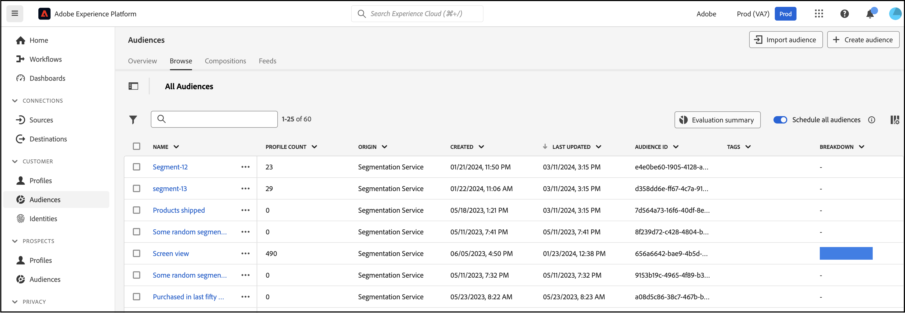
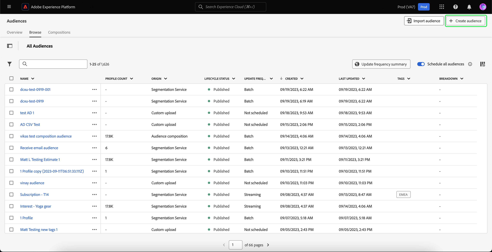

# [!DNL Commerce] イベントデータを使用してReal-Time CDPでオーディエンスを作成

[!DNL Commerce] ストアから取得したイベントデータを使用して、Real-Time CDPでオーディエンスを作成します。 取り込まれるデータは、閲覧行動、過去の購入履歴、プロファイル属性、コンバージョンや解約の傾向、ロイヤルティステータス、顧客価値の高い製品や低い製品など、様々な情報にもとづいています。

## どのようなデータの利用を検討すればよいか？

ストアフロント、バックオフィス、プロファイルイベントからのデータを利用して、Real-Time CDPでオーディエンスを構築できます。

| データタイプ | ストアフロントデータ（行動イベント） | バックオフィスデータ（サーバーサイドイベント） | 顧客プロファイルデータとセグメントデータ |
|---|---|---|---|
| **定義** | 顧客がサイトで実行するクリック数やアクション数。 | 各注文のライフサイクルと詳細に関する情報（過去と現在）。 | 顧客が誰であり、その適格性を判断するセグメントは何か。 |
| **Adobe Commerceによってキャプチャされたイベント** | `productPageView` `addToCart` | `placeOrder` `orderplaced` `orderLineItemRefunded` `order Canceled` `order history` | `createAccount` `editAccount` `Profile Record` |

## 他の顧客は何を達成しましたか？

Adobe [!DNL Commerce]のお客様は、Real-Time CDPで構築されたオーディエンスをアクティブ化し、[!DNL Commerce] インスタンスにデプロイすることで、大きなビジネス効果を得ました。

グローバルなマルチブランドアパレルのretailerは、次のことを実現しました。

- 数百万の統合顧客プロファイルを活用して、信頼できる唯一の情報源を構築
- 「購買意欲の高い顧客」の40以上の独自のオーディエンスを作成し、チャネルをまたいでエンゲージ

世界的な飲料会社のデータを収集：

- 100 ヶ国以上で9,800万人分の顧客プロファイル

## では始めましょう

この記事では、次の方法について説明します。

- イベントが収集した[!DNL Commerce] データに基づいて、Real-Time CDPでオーディエンスを作成します
- [!DNL Commerce] ストアのオーディエンスをアクティブ化
- [!DNL Commerce]のオーディエンスを使用して、買い物かごの価格ルールを通知する

>[!IMPORTANT]
>
>[!DNL Commerce] サンドボックス環境を使用して、この記事で説明したタスクを完了します。 これにより、Experience Platformに送信するストアフロントおよびバックオフィスのイベントデータが、本番イベントデータを希薄化しないようにします。

### 前提条件

始める前に、次の点を確認してください。

- Real-Time CDPを使用するようにプロビジョニングされています。 不明な場合は、システムインテグレーターまたはプロジェクトや環境を管理する開発チームに確認してください。
- [さんが[!DNL Commerce]の[!DNL Data Connection]拡張機能を](install.md) インストールし、[さんが](connect-data.md)設定しました。
- [!DNL Commerce] イベントデータがExperience Platform エッジに到達していることを[確認しました](connect-data.md#confirm-that-event-data-is-collected)。

### &#x200B;1. オーディエンスの作成

オーディエンスとは、類似の行動や特徴を共有する顧客のセットのことです。 この演習では、ストアの特定の製品に関心を持つユーザーを対象とするオーディエンスを作成します。

この演習を簡素化するには、`productPageView` イベントのイベントデータを使用します。 このイベントは、製品名、SKU、価格など、閲覧された製品に関する詳細をキャプチャします。

このイベントデータを使用して、SKU （製品識別子）がサイト上の特定の製品に等しく、イベントが最終日に発生する「製品ビュー」イベントを少なくとも1つ持つ個人をオーディエンスに含めるように指定します。 &#x200B;

1. Experience Platformを開き、左側のナビゲーションメニューから「**[!UICONTROL Audiences]**」を選択します。

   

1. **[!UICONTROL Create Audience]**&#x200B;をクリックします。

   

   The **Segment Builder** workspace displays.

1. In the **Segment Builder** workspace, select the **Build rule** creation method.

   

   The **Segment Builder** workspace is where you define the rules and conditions for your audience.&#x200B; These rules and conditions are based on event and profile data from your Commerce store and define the criteria that determine whether a user qualifies for the audience. For example, you might create a rule that includes users who have viewed a specific product, or users that have made a purchase within a certain time frame. Learn more about [Segment Builder](https://experienceleague.adobe.com/ja/docs/experience-platform/segmentation/ui/segment-builder) and rules and conditions.

1. Select the [Events](https://experienceleague.adobe.com/ja/docs/experience-platform/segmentation/ui/segment-builder#events) tab.

   

1. Search for the &quot;Product Views&quot; event type. Then, drag and drop it into the **Segment Builder** workspace.

1. Return to the **Events** tab and search for &quot;SKU&quot;, which is data field under the `productListItems` field. Drag and drop it to the **Segment Builder** workspace on top of the **Product View** event.

   The **Event Rules** section displays where you can specify the specific product you want to build your audience off of.

   

1. Set the time interval to one day by clicking on **Any Time** and selecting *In last* with a value of *1*.

   When building an audience, you can specify a time interval to capture recent activity. Setting a time interval allows you to target users based on their recent interactions or behaviors within a specific timeframe.

1. In the **Audience Properties** section on the right-hand side of the workspace, set the audience properties by providing a name, description, and evaluation method for the audience.

1. To save the audience, click **[!UICONTROL Save and Close]**.

   The details of your audience displays on the **Audience** dashboard.

### 2. Activate the audience to the [!DNL Commerce] destination

You make an audience available in [!DNL Commerce] by activating it for the [!DNL Commerce] destination.

>[!IMPORTANT]
>
>If you have not already set [!DNL Commerce] as an available destination to receive data, see the [Adobe [!DNL Commerce] Connection](https://experienceleague.adobe.com/ja/docs/experience-platform/destinations/catalog/personalization/adobe-commerce) topic.

1. オーディエンスの「**詳細**」タブで、「**宛先にアクティベート**」をクリックします。

1. [!DNL Commerce]の宛先を選択します。 次に、**次へ**&#x200B;をクリックします。

1. **[!UICONTROL Finish]**&#x200B;をクリックして、アクティブ化プロセスを完了します。

## &#x200B;3. オーディエンスダッシュボードでのオーディエンスの表示

[!DNL Commerce]では、**Real-Time CDP Audiences** ダッシュボードを使用して、[!DNL Commerce] インスタンスに対してパーソナライズできるすべての[&#x200B; アクティブ &#x200B;](https://experienceleague.adobe.com/ja/docs/experience-platform/destinations/ui/activate/activate-edge-personalization-destinations) オーディエンスを表示できます。

**Real-Time CDP Audiences** ダッシュボードにアクセスするには、_管理者_ サイドバーに移動し、**[!UICONTROL Customers]** > **[!UICONTROL Real-time CDP Audience]**&#x200B;に移動します。

ダッシュボードで、作成したオーディエンスを探します。 カート価格ルールまたはダイナミックブロックで使用されていないことに注意してください。 次のセクションでは、オーディエンスをカート価格ルールにリンクします。

### &#x200B;4. オーディエンスに基づいてカートの価格ルールを作成します

このセクションでは、新しいオーディエンスに基づいてカート価格ルールを作成する方法について説明します。

1. 新しいオーディエンスが&#x200B;**Real-Time CDP Audiences** ダッシュボードに表示されていることを確認します。
1. [買い物かごの価格ルールを作成](https://experienceleague.adobe.com/ja/docs/commerce-admin/marketing/promotions/cart-rules/price-rules-cart-create)。
1. [新しいオーディエンスを使用して、カート価格ルールの条件](https://experienceleague.adobe.com/ja/docs/commerce-admin/marketing/promotions/cart-rules/price-rules-cart-create#use-real-time-cdp-audiences-to-set-a-condition)を設定します。
1. [商品がカートに追加されたときに実行するアクション &#x200B;](https://experienceleague.adobe.com/ja/docs/commerce-admin/marketing/promotions/cart-rules/price-rules-cart-create#step-3-define-the-actions)を設定します。
1. 引き続き、カート価格ルールを設定します。
1. サンドボックスインスタンスの顧客ビューに移動します。
1. オーディエンスを元にした商品をカートに追加します。 カート価格ルールが有効になっていることに注意してください。

## まとめ

この演習では、Real-Time CDPでオーディエンスを作成し、[!DNL Commerce]の宛先に対してアクティブ化しました。 次に、[!DNL Commerce]管理者で、そのオーディエンスに基づいてカート価格ルールを作成し、サンドボックス環境でルールを有効にしました。
