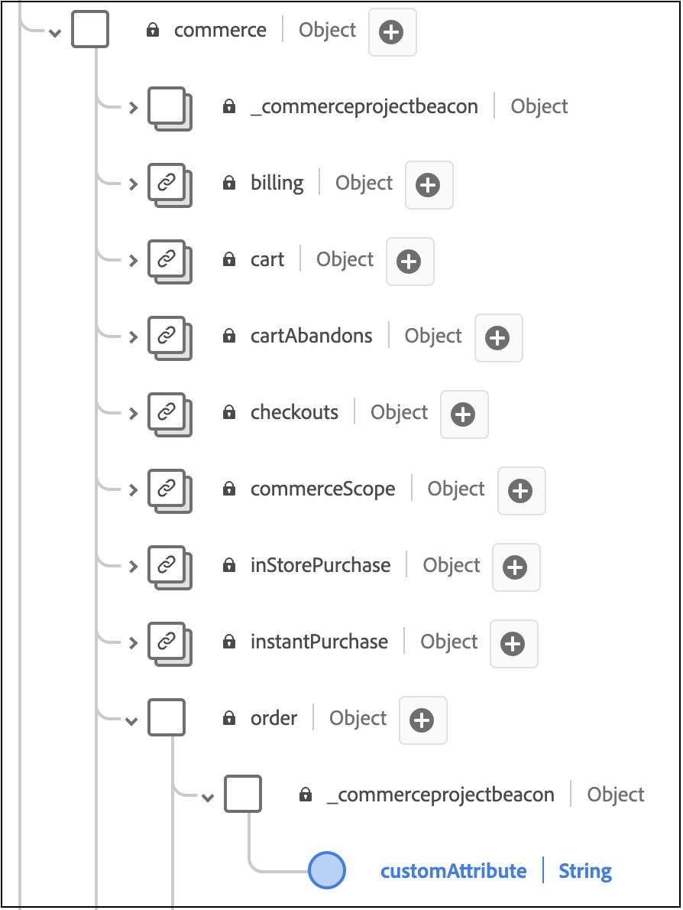
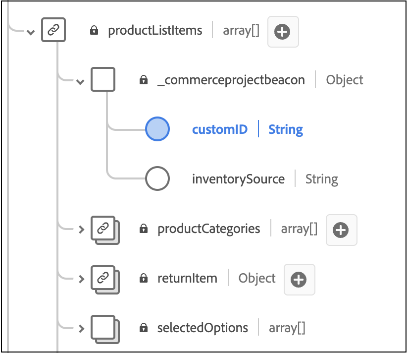

# 注文へのカスタム属性の追加

この記事では、バックオフィスイベントにカスタム属性を追加する方法について説明します。 カスタム属性を使用すると、豊富なデータインサイトを取得して分析を強化し、買い物客にパーソナライズされた体験をさらに構築できます。

>[!NOTE]
>
>プロファイルにカスタム ID[を](custom-identities.md)追加する方法について説明します。

カスタム属性は、次の2つのレベルでサポートされています。

- 注文レベル
- 注文品目レベル

>[!NOTE]
>
>Adobe [!DNL Commerce]は、文字列、ブール値、または日付のデータタイプを持つカスタム属性をサポートしています。

バックオフィスイベントにカスタム属性を追加するには、次の操作を行う必要があります。

1. [!DNL Commerce] インストールでプロジェクトを作成します。
1. 新しいカスタム属性をExperience Platformに正しく取り込めるように、スキーマを更新します。
1. 管理者で、カスタム属性がキャプチャされ、Experience Platformに送信されていることを確認します。

>[!IMPORTANT]
>
>以下のディレクトリ構造とコードサンプルは、カスタム属性を実装する方法を示しています。 実際に必要なディレクトリ構造とコードは、ストアの設定と環境によって異なります。

## 手順1：ディレクトリ構造の作成

1. `app/code` インストールの[!DNL Commerce] ディレクトリに移動し、モジュールディレクトリを作成します。 例：`Magento/AepCustomAttributes`。 このディレクトリには、カスタム属性に必要なファイルが含まれています。
1. モジュールディレクトリに、`etc`というサブディレクトリを作成します。 `etc` ディレクトリには、`module.xml`、`query.xml`、`di.xml`および`et_schema.xml`個のファイルが含まれています。

## 手順2：依存関係と設定バージョンの定義

依存関係と設定バージョンを定義する`module.xml` ファイルを作成します。 例：

```xml
<?xml version="1.0"?>
<config xmlns:xsi="http://www.w3.org/2001/XMLSchema-instance" xsi:noNamespaceSchemaLocation="urn:magento:framework:Module/etc/module.xsd">
    <module name="Magento_AepCustomAttributes">
        <sequence>
            <module name="Magento_SalesOrderDataExporter"/>
        </sequence>
    </module>
</config>
```

## 手順3：受注データの取得

販売注文データを取得する`query.xml` ファイルを作成します。 例：

```xml
<?xml version="1.0"?>
<config xmlns:xsi="http://www.w3.org/2001/XMLSchema-instance" xsi:noNamespaceSchemaLocation="urn:magento:Module:Magento_QueryXml:etc/query.xsd">
  <query name="salesOrdersV2">
    <source name="sales_order">
      <link-source name="sales_order_inventory_source" link-type="inner">
        <attribute name="inventory_source_code" alias="inventory_source" />
        <using glue="and">
          <condition attribute="order_id" operator="eq" type="identifier">entity_id</condition>
         </using> 
        </link-source>
    </source>
  </query>
  </config>
```

## 手順4：依存関係インジェクションの設定

依存関係インジェクションを設定する`di.xml` ファイルを作成します。 例：

```xml
  <?xml version="1.0"?>
  <config xmlns:xsi="http://www.w3.org/2001/XMLSchema-instance" xsi:noNamespaceSchemaLocation="urn:magento:framework:ObjectManager/etc/config.xsd">
      <type name="Magento\AepCustomAttributes\Model\Provider\CustomAttribute">
          <arguments>
              <argument name="usingField" xsi:type="string">commerceOrderId</argument>
          </arguments>
      </type>
      <type name="Magento\AepCustomAttributes\Model\Provider\OrderItemCustomAttribute">
          <arguments>
              <argument name="usingField" xsi:type="string">entityId</argument>
          </arguments>
      </type>
      <type name="Magento\DataServices\Model\ProductContext">
          <plugin name="product-context-plugin" type="Magento\AepCustomAttributes\Plugin\Model\ProductContext"/>
      </type>
  </config>
```

## 手順5：依存関係インジェクションに使用するサービスの定義

依存関係インジェクションに使用されるサービスを定義する`et_schema.xml` ファイルを作成します。 例：

```xml
  <?xml version="1.0"?>
  <config xmlns:xsi="http://www.w3.org/2001/XMLSchema-instance" xsi:noNamespaceSchemaLocation="urn:magento:module:Magento_DataExporter:etc/et_schema.xsd">
      <record name="OrderV2">
          <field name="additionalInformation" type="CustomAttribute" repeated="true" provider="Magento\AepCustomAttributes\Model\Provider\CustomAttribute">
              <using field="commerceOrderId"/>
          </field>
      </record>
      <record name="OrderItemV2">
          <field name="additionalInformation" type="CustomAttribute" repeated="true" provider="Magento\AepCustomAttributes\Model\Provider\OrderItemCustomAttribute">
              <using field="entityId"/>
          </field>
      </record>
  </config>
```

## 手順6:PHP ファイルのディレクトリを作成する

`etc` ディレクトリと同じレベルで、`Module/Provider`という名前のディレクトリを作成します。 このディレクトリには、`OrderCustomAttributes`および`OrderItemCustomAttributes`個のPHP ファイルが含まれています。

## 手順7:OrderCustomAttributesの定義

注文カスタム属性を定義する`OrderCustomAttributes.php` ファイルを作成します。 例：

```php
declare(strict_types=1);

namespace Magento\AepCustomAttributes\Model\Provider;

use Magento\Framework\Serialize\Serializer\Json;

class CustomAttribute
{
  /**
   * @var Json
   */
  private Json $jsonSerializer;

  /**
   * @var string
   */
  private string $usingField = '';

  /**
   * @param string $usingField
   * @param Json $jsonSerializer
   */
  public function __construct(
      string $usingField,
      Json $jsonSerializer
  ) {
      $this->usingField = $usingField;
      $this->jsonSerializer = $jsonSerializer;
  }

  /**
   * @param array $values
   * @return array
   */
  public function get(array $values): array
  {
      $output = [];

      /**
       * Entity IDs
       */
      $ids = array_column($values, $this->usingField);

      foreach ($this->flatten($values) as $row) {
          $info = \is_string($row['additionalInformation']) ? $row['additionalInformation'] : '{}';
          $unserializedData = $this->jsonSerializer->unserialize($info) ?? [];

          if (isset($row)) {
              $unserializedData['order_channel'] = 'order_channel';
              $unserializedData['order_status'] = 'order_status';

              $additionalInformation = [];
              foreach ($unserializedData as $name => $value) {
                  $additionalInformation[] = [
                      'name' => $name,
                      'value' => \is_string($value) ? $value : $this->jsonSerializer->serialize($value)
                  ];
              }
              foreach ($additionalInformation as $information) {
                  $output[] = [
                      'additionalInformation' => $information,
                      $this->usingField => $row[$this->usingField],
                  ];
              }
          }
      }
      return $output;
  }

  /**
   * @param $values
   * @return array
   */
  private function flatten($values): array
  {
      if (isset(current($values)[0])) {
          return array_merge([], ...array_values($values));
      }
      return $values;
  }
}
```

## 手順8:OrderItemCustomAttributesの定義

注文項目のカスタム属性を定義する`OrderItemCustomAttributes.php` ファイルを作成します。 例：

```php
declare(strict_types=1);

namespace Magento\AepCustomAttributes\Model\Provider;

use Magento\Framework\Serialize\Serializer\Json;

class OrderItemCustomAttribute
{
  /**
   * @var Json
   */
  private Json $jsonSerializer;

  /**
   * @var string
   */
  private string $usingField = '';

  /**
   * @param Json $jsonSerializer
   * @param string $usingField
   */
  public function __construct(
      Json $jsonSerializer,
      string $usingField
  ) {
      $this->jsonSerializer = $jsonSerializer;
      $this->usingField = $usingField;
  }

  /**
   * Getting additional attributes data.
   *
   * @param array $values
   * @return array
   */
  public function get(array $values): array
  {
      $output = [];
      $values = $this->flatten($values);

      foreach ($values as $row) {
          $info = \is_string($row['additionalInformation']) ? $row['additionalInformation'] : '{}';
          $unserializedData = $this->jsonSerializer->unserialize($info) ?? [];
          $unserializedData['product_brand'] = implode(',', ['label 1', 'label 2']);

          $additionalInformation = [];
          foreach ($unserializedData as $name => $value) {
              $additionalInformation[] = [
                  'name' => $name,
                  'value' => \is_string($value) ? $value : $this->jsonSerializer->serialize($value)
              ];
          }
          foreach ($additionalInformation as $information) {
              $output[] = [
                  'additionalInformation' => $information,
                  $this->usingField => $row[$this->usingField],
              ];
          }
      }
      return $output;
  }

  /**
   * @param $values
   * @return array
   */
  private function flatten($values): array
  {
      if (isset(current($values)[0])) {
          return array_merge([], ...array_values($values));
      }
      return $values;
  }
}
```

## 手順9:productContext ファイルのディレクトリを作成する

`etc` ディレクトリと同じレベルで、`Plugin/Module`という名前のディレクトリを作成します。 このディレクトリには`ProductContext.php` ファイルが含まれています。

## 手順10:ProductContext クラスの定義

`ProductContext.php` クラスを定義する`ProductContext`という名前のファイルを作成します。 例：

```php
<?php>
namespace Magento\AepCustomAttributes\Plugin\Model;
use Magento\Catalog\Model\Product;
use Magento\DataServices\Model\ProductContext as Subject;
use Magento\Framework\App\ResourceConnection;

class ProductContext
{
    private ?array $brandCache = [];
    public function __construct(
        private ResourceConnection $resourceConnection ) {
    }  

    public function afterGetContextData(Subject $subject, array $result Product $product)
    {
        $brand = $product->getCustomAttribute('cust_attr1');
        if (!empty($brand) && $brand->getValue()) {
            $result['brands'] = ['brand_label_1', 'brand_label_2'];
            }
            return $result;
      }
  }
```

## 手順11：モジュールの登録

`etc` ディレクトリと同じレベルで、モジュールを登録する`registration.php` ファイルを作成します。 例：

```php
<?php>
declare(strict_types=1);

use \Magento\Framework\Component\ComponentRegistrar;

ComponentRegistrar::register(
    ComponentRegistrar::MODULE,
    'Magento_AepCustomAttributes',
    __DIR__
);
```

## 手順12：既存のXDM スキーマの拡張

新しいカスタム注文属性をExperience Platformの[!DNL Commerce] スキーマで取り込むことができるようにするには、スキーマを拡張してこれらのカスタムフィールドを含める必要があります。

既存のXDM スキーマを拡張してこれらのカスタムフィールドを含める方法については、Experience Platform ドキュメントの「[UIでのスキーマの作成と編集」を参照してください。 ](https://experienceleague.adobe.com/en/docs/experience-platform/xdm/ui/resources/schemas#custom-fields-for-standard-groups)テナント ID フィールドは動的に生成されますが、フィールド構造はExperience Platform ドキュメントに記載されている例に似ている必要があります。

>[!IMPORTANT]
>
>XDM カスタム属性は、[!DNL Commerce]から送信された属性と一致する必要があります。

`commerce.order`に、注文レベルのフィールドを追加します。



`productListItems`に、注文項目レベルのフィールドを追加します：



## 手順12：データがキャプチャされていることを確認する

管理者の「[Data Customization](connect-data.md#data-customization)」タブを表示して、カスタム属性データがキャプチャされ、Experience Platformに送信されていることを確認します。

### トラブルシューティング

「`No custom order attributes found.`」タブに「**[!UICONTROL Data Customization]**」というメッセージが表示された場合は、次の点を確認してください。

1. [Data Connector拡張機能](overview.md#prerequisites)を有効にするための前提条件が完了しました。
1. [ カスタム注文属性](#add-custom-attributes-to-orders)を設定しました。
1. 少なくとも1つの注文イベントが生成されました。
