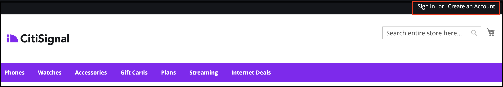
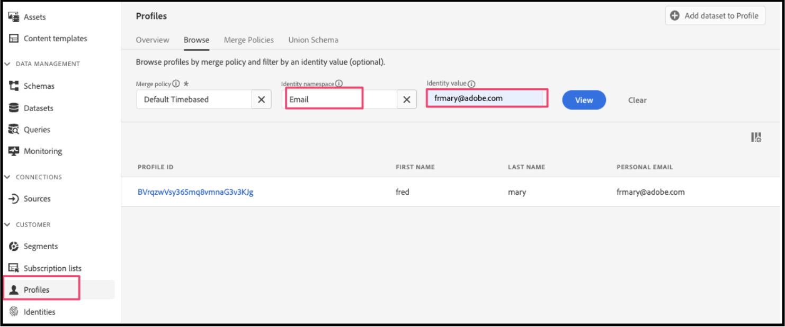
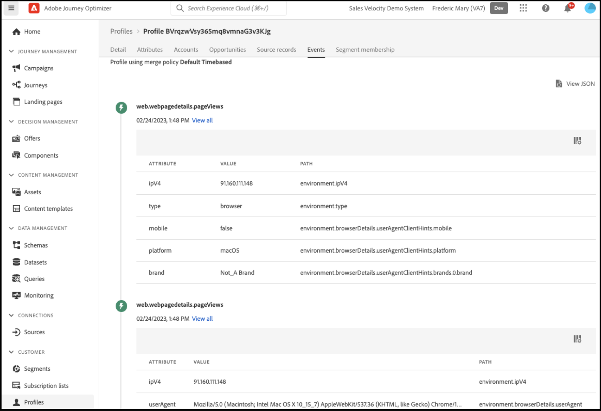
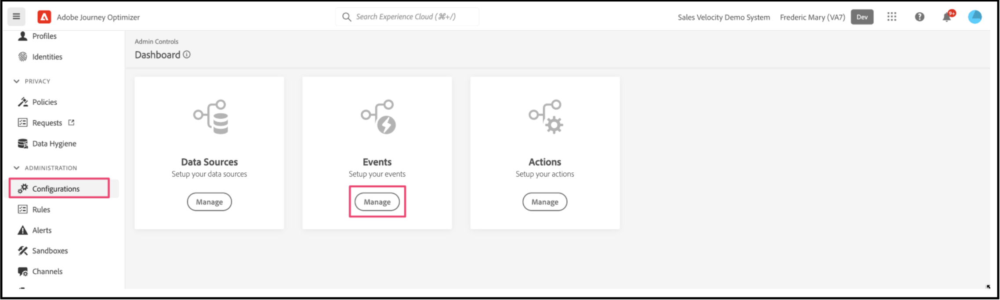
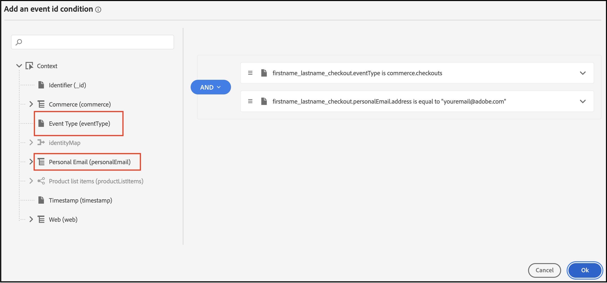
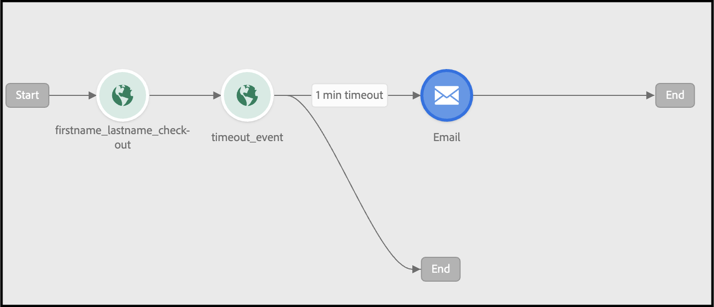
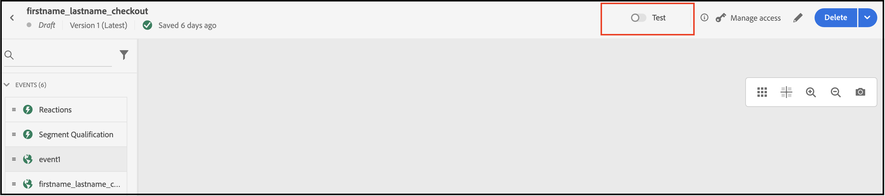

# Adobe Journey Optimizerを使用してカート放棄メールを送信する

カートやブラウザーセッションが放棄された場合に、パーソナライズされたリエンゲージメントメールや通知を配信する方法を説明します。 この記事では、多数の商品やカテゴリーを閲覧した、商品に興味を持った、ページに時間を費やした、などの顧客から生成されたデータを使用します。

## どのようなデータの利用を検討すればよいか？

ストアフロントやバックオフィスのイベントからのデータを利用して、放棄されたカート、電子メール、通知を構築する。

| データタイプ | ストアフロントデータ（行動イベント） | バックオフィスデータ（サーバーサイドイベント） |
|---|---|---|
| **定義** | 顧客がサイトで実行するクリック数やアクション数。 | 各注文のライフサイクルと詳細に関する情報（過去と現在）。 |
| **Adobe Commerceによってキャプチャされたイベント** | [pageView](https://experienceleague.adobe.com/ja/docs/commerce/data-connection/event-forwarding/events#pageview)<br>[productPageView](https://experienceleague.adobe.com/ja/docs/commerce/data-connection/event-forwarding/events)<br>[addToCart](https://experienceleague.adobe.com/ja/docs/commerce/data-connection/event-forwarding/events#addtocart)<br>[openCart](https://experienceleague.adobe.com/ja/docs/commerce/data-connection/event-forwarding/events#opencart)<br>[startCheckout](https://experienceleague.adobe.com/ja/docs/commerce/data-connection/event-forwarding/events#startcheckout)<br>[completeCheckout](https://experienceleague.adobe.com/ja/docs/commerce/data-connection/event-forwarding/events#completecheckout) | [orderPlaced](https://experienceleague.adobe.com/ja/docs/commerce/data-connection/event-forwarding/events-backoffice#orderplaced)<br>[注文履歴](https://experienceleague.adobe.com/ja/docs/commerce/data-connection/fundamentals/connect-data#send-historical-order-data) |

### 他の顧客は何を達成しましたか？

Adobe [!DNL Commerce]のお客様は、Adobe [!DNL Commerce]、Adobe [!DNL Journey Optimizer]、Adobe [!DNL Real-Time CDP]を使用して、パーソナライズされた放棄キャンペーンを実装することで、大きなビジネス効果を実現しました。

グローバルなマルチブランドアパレルのretailerは、次のことを実現しました。

- 新しいキャンペーンのクリック数が1.9倍に増加
- オムニチャネルの離脱ジャーニーによる売上が57%増加
- リエンゲージメントキャンペーンのコンバージョン率が41%増加
- 1週間に1000人以上の新規顧客のエンゲージメント

世界的な飲料会社が次の達成を達成：

- メール開封率が36%再エンゲージメント
- クリック率が21%向上
- コンバージョン率が8.5%向上
- コンバージョン率を向上できることが明らかになっています

## では始めましょう

この特定のユースケースでは、[!DNL Commerce] インスタンスのデータを使用してカート放棄メールを作成し、それをAdobe [!DNL Journey Optimizer]に送信することに焦点を当てています。

### Adobe Journey Optimizerとは？

[Adobe Journey Optimizer](https://experienceleague.adobe.com/docs/journey-optimizer/using/get-started/get-started.html?lang=ja)は、買い物客のコマース体験をパーソナライズするのに役立ちます。 たとえば、Journey Optimizerを使用して、小売店での週次プロモーションなどのスケジュール化されたマーケティング施策を構築して配信したり、顧客が商品をカートに追加したものの、チェックアウトプロセスを完了しなかった場合に、カート放棄メールを生成したりすることができます。

このトピックでは、[!DNL Commerce] インスタンスから生成された`checkout` イベントをリッスンし、そのイベントにJourney Optimizerで応答して、カート放棄メールを作成する方法について説明します。

>[!IMPORTANT]
>
>デモの目的では、[!DNL Commerce] サンドボックス環境を使用して、実稼動イベントデータを、Experience Platformに送信するストアフロントおよびバックオフィスのイベントデータで希薄化しないようにします。

### 前提条件

これらの手順を開始する前に、次のことを確認します。

- Adobe [!DNL Journey Optimizer]を使用するようにプロビジョニングされています。 不明な場合は、システムインテグレーターまたはプロジェクトや環境を管理する開発チームに確認してください。
- [さんが[!DNL Commerce]の[!DNL Data Connection]拡張機能を](install.md) インストールし、[さんが](connect-data.md)設定しました。
- [!DNL Commerce] イベントデータがExperience Platform エッジに到達していることを[確認しました](connect-data.md#confirm-that-event-data-is-collected)。

## 手順1: [!DNL Commerce] サンドボックス環境でユーザーを作成する

サンドボックス環境でユーザーを作成し、そのユーザーアカウント情報がExperience Platformに表示されることを確認します。 指定した電子メールが、このセクションの後半でカート放棄メールを送信するために使用されるので、有効であることを確認します。

1. [!DNL Commerce] サンドボックス環境でログインするか、アカウントを作成します。

   {width="700" zoomable="yes"}

   [!DNL Data Connection]拡張機能をインストールして設定すると、このアカウント情報はプロファイルとしてExperience Platformに送信されます。

1. お客様のユーザーアカウント情報がExperience Platformの&#x200B;**[!UICONTROL Profile]** セクションに表示されていることを確認します。

   Adobe Experience Platformの&#x200B;**[!UICONTROL Profiles]**&#x200B;に移動します。 プロファイルの「**[!UICONTROL Detail]**」をクリックして、作成したプロファイルを表示します。

   {width="700" zoomable="yes"}

## ステップ 2: Journey Optimizerでのイベントの表示

[!DNL Commerce] サンドボックス環境では、ストアフロントのトリガーイベントを利用して、商品ページを表示したり、商品をカートに追加したり、買い物客が行うその他の様々なアクティビティを完了したりします。 次に、これらのイベントがJourney Optimizerに流れていることを確認します。

1. [Adobe Journey Optimizer](https://experienceleague.adobe.com/docs/journey-optimizer/using/get-started/user-interface.html?lang=ja)を起動します。
1. **[!UICONTROL Profiles]**&#x200B;を選択します。
1. **[!UICONTROL Identity namespace]**&#x200B;を`Email`に設定します。
1. **[!UICONTROL Identity value]**&#x200B;を電子メールアドレスに設定します。
1. プロファイルを選択し、「**[!UICONTROL Events]**」タブを選択します。

   {width="700" zoomable="yes"}

   `commerce.checkouts` イベントを探し、イベントペイロードを調べます。

   ```json
   "personID": "84281643067178465783746543501073369488", 
   "eventType": "commerce.checkouts", 
   "_id": "4b41703f-e42e-485b-8d63-7001e3580856-0", 
   "commerce": { 
       "cart": {}, 
       "checkouts": { 
           "value": 1 
       } 
   ```

   ご覧のとおり、イベントペイロード全体にはリッチイベントデータが含まれています。 次のセクションでは、[!DNL Commerce] ストアフロントから生成された`commerce.checkouts` イベントをリッスンして応答するように、Journey Optimizerでイベントを設定します。

## 手順3:Journey Optimizerでのイベントの設定

Journey Optimizerで2つのイベントを設定します。1つのイベントはCommerceからの`commerce.checkouts` イベントをリッスンし、もう1つはカート放棄メールをトリガーする前に特定の時間が経過するのを待つ基本的なタイムアウトイベントです。

### リスナーイベントの作成

1. [Adobe Journey Optimizer](https://experienceleague.adobe.com/docs/journey-optimizer/using/get-started/user-interface.html?lang=ja)を起動します。

1. 左側のペインの&#x200B;**[!UICONTROL Administration]** セクションの下にある&#x200B;**[!UICONTROL Configurations]**&#x200B;をクリックします。

1. **[!UICONTROL Events]** タイルで、**[!UICONTROL Manage]**&#x200B;をクリックします。

   {width="700" zoomable="yes"}

1. **[!UICONTROL Events]** ページで、**[!UICONTROL Create Event]**&#x200B;をクリックします。

1. 右側のナビゲーションで、次のようにイベントを設定します。

   1. **[!UICONTROL Name]**&#x200B;を`firstname_lastname_checkout`に設定します。
   1. **[!UICONTROL Type]**&#x200B;を&#x200B;**[!UICONTROL Unitary]**&#x200B;に設定します。
   1. **[!UICONTROL Event id typ]e**&#x200B;を&#x200B;**[!UICONTROL Rule based]**&#x200B;に設定します。
   1. **[!UICONTROL Schema]**&#x200B;を[!DNL Commerce] [&#x200B; スキーマ &#x200B;](update-xdm.md)に設定します。
   1. 「**[!UICONTROL Fields]**」を選択して、**[!UICONTROL Fields]** ページを開きます。 次に、このイベントに役立つフィールドを選択します。 例えば、**[!UICONTROL Product list items]**、**[!UICONTROL Commerce]**、**[!UICONTROL eventType]**、**[!UICONTROL Web]**&#x200B;の下のすべてのフィールドを選択します。
   1. 選択したフィールドを保存するには、**[!UICONTROL OK]**&#x200B;をクリックします。
   1. **[!UICONTROL Event id condition]** フィールド内をクリックします。 次に、条件を作成します。`eventType`は`commerce.checkouts`に等しく、`personalEmail.address`は前の節でプロファイルを作成したときに使用したメールアドレスに等しくなります。

      {width="700" zoomable="yes"}

   1. **[!UICONTROL OK]**&#x200B;をクリックします。
   1. **[!UICONTROL Save]**&#x200B;をクリックしてイベントを保存します。

### タイムアウトイベントの作成

1. 以前と同様に、Journey Optimizerでイベントを作成します。

1. 右側のナビゲーションで、次のようにイベントを設定します。

   1. **[!UICONTROL Name]**&#x200B;を`firstname_lastname_timeout`に設定します。
   1. **[!UICONTROL Type]**&#x200B;を&#x200B;**[!UICONTROL Unitary]**&#x200B;に設定します。
   1. **[!UICONTROL Event id type]**&#x200B;を&#x200B;**[!UICONTROL Rule based]**&#x200B;に設定します。
   1. **[!UICONTROL Schema]**&#x200B;を[!DNL Commerce] [&#x200B; スキーマ &#x200B;](update-xdm.md)に設定します。
   1. **[!UICONTROL Schema]**、**[!UICONTROL Fields]**、**[!UICONTROL Event id condition]**&#x200B;を上記と同じに設定します。
   1. **[!UICONTROL Save]**&#x200B;をクリックしてイベントを保存します。

これらのイベントを設定して、カート放棄メールを送信するジャーニーを作成します。

## ステップ 4：チェックアウトジャーニーの構築

`commerce.checkouts` イベントをリッスンし、指定された時間が経過した後に放棄されたカート メールを送信するジャーニーを作成します。

1. Journey Optimizerで、**J[!UICONTROL OURNEY MANAGEMENT]**&#x200B;の下の&#x200B;**[!UICONTROL Journeys]**&#x200B;を選択します。
1. **[!UICONTROL Create Journey]**&#x200B;をクリックします。
1. ジャーニーの名前を指定します。
1. 「**[!UICONTROL OK]**」をクリックしてジャーニーを保存します。
1. **[!UICONTROL EVENTS]** セクションの左側のナビゲーションで、以前に作成したチェックアウトイベント `firstname_lastname_checkout`を検索し、キャンバスにドラッグ&amp;ドロップします。

   >[!TIP]
   >
   >イベントをダブルクリックすると、自動的にキャンバスに追加されます。

1. タイムアウトイベントを検索し、キャンバスに追加します。
1. タイムアウトイベントをダブルクリックします。

   1. 「**[!UICONTROL Timeout]**」セクションで、「**[!UICONTROL Define the event time]**」チェックボックスを選択します。
   1. **[!UICONTROL Wait for]** フィールドに`1`と`Minute`と入力します。
   1. 「**[!UICONTROL Set a timeout path]**」チェックボックスを選択します。

   このタイムアウト設定を使用すると、チェックアウトを行うが、このタイムアウトブランチをトリガーした1分以内に注文を完了しない買い物客。 実際の本番環境では、これを24時間など、より長い期間に設定します。

1. **[!UICONTROL ACTIONS]**&#x200B;の下の左側のナビゲーションで、**[!UICONTROL Email]** アクションをタイムアウトブランチに追加します。 例えば、次のようなジャーニーを構築します。

   {width="700" zoomable="yes"}

### カート放棄メールの作成

カート放棄メールは、カート放棄が検出されたときに送信されます。

1. 上で作成したジャーニーで、キャンバスの&#x200B;**[!UICONTROL Email]** アイコンをダブルクリックします。

1. Journey Optimizer ガイドの[手順](https://experienceleague.adobe.com/docs/journey-optimizer/using/content-management/personalization/personalization-use-cases/personalization-use-case-helper-functions.html?lang=ja#configure-email)に従って、カート放棄メールを作成します。

これで、Journey Optimizerで[!DNL Commerce] ストアの`commerce.checkouts` イベントをリッスンするジャーニーと、一定期間が経過した後に送信されるカート放棄メールが作成されました。 次のセクションでは、ジャーニーをテストする方法を示します。

## ステップ 5：チェックアウトイベントをリアルタイムでトリガーする

このセクションでは、イベントをリアルタイムでテストします。

1. Journey Optimizerで、テストモードをオンにします。

   {width="700" zoomable="yes"}

1. このジャーニーをリアルタイムでテストするには、別のブラウザータブを開き、サンドボックス環境の[!DNL Commerce] web サイトに移動します。

   1. 商品をカートに追加します。
   1. チェックアウトページに移動します。
   1. チェックアウトページから、メインページに戻るかタブを閉じて、カートを放棄します。

      ジャーニーがトリガーされます。 確定するには、Journey Optimizerでジャーニーが含まれているタブを開きます。 ユーザーが通過したパスを示す緑色の矢印が表示されます。

1. 電子メールの受信トレイを確認します。
