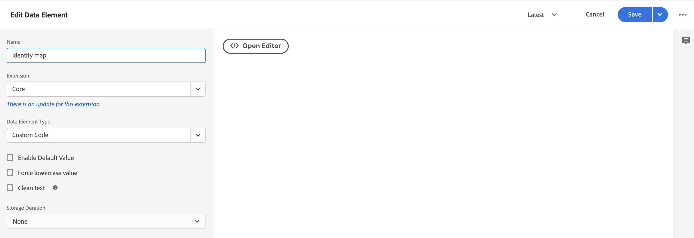

# Adobe Experience Platform タグを使用したCommerce データの収集

[!DNL Data Connection] 拡張機能を使用してストアフロントイベントを公開および購読できますが、[Adobe Experience Platform タグ ](https://experienceleague.adobe.com/docs/platform-learn/data-collection/tags/create-a-property.html) などのデータ収集ソリューションを既に使用しているマーチャントも存在します。 これらのマーチャントについては、Adobe Commerceでは、Adobe Commerce イベント SDKを使用する [!DNL Data Connection] 拡張機能で公開専用のオプションを提供します。

![[!DNL Data Connection] 拡張データフロー ](assets/tags-data-flow.png)
タグを使用した _[!DNL Data Connection]拡張機能のデータフロー_

このトピックでは、[!DNL Data Connection] 拡張機能で提供されるストアフロントイベント値を、既に使用しているAdobe Experience Platform タグソリューションにマッピングする方法について説明します。

## Adobe Commerceからイベントデータを収集

Commerce イベントデータを収集するには：

- [Adobe Commerce Events SDK](https://github.com/adobe/commerce-events/tree/main/packages/storefront-events-sdk) をインストールします。 PHP ストアフロントについては、[install](install.md) のトピックを参照してください。 PWA Studio ストアフロントについては、[PWA Studio ガイド ](https://developer.adobe.com/commerce/pwa-studio/integrations/adobe-commerce/aep/) を参照してください。

  >[!NOTE]
  >
  > 組織 ID **データストリーム ID**&#x200B;[ 設定 ](connect-data.md) はしないでください。

## Commerce ストアフロントデータのAdobe Experience Platformへのマッピング

Commerce ストアフロントのデータをAdobe Experience Platformにマッピングするには、以下を設定し、Adobe Experience Platform タグ内からインストールします。

1. Adobe Experience Platform Data Collection で [ タグプロパティを設定 ](https://experienceleague.adobe.com/docs/platform-learn/implement-in-websites/configure-tags/create-a-property.html) します。

1. **オーサリング** で **拡張機能** を選択し、次の拡張機能をインストールして設定します。

   - [Adobe Client Data Layer](https://experienceleague.adobe.com/docs/experience-platform/tags/extensions/client/client-data-layer/overview.html)

   - [Adobe Experience Platform Web SDK](https://experienceleague.adobe.com/docs/experience-platform/edge/fundamentals/installing-the-sdk.html)

1. 開発環境に [ タグを公開 ](https://experienceleague.adobe.com/docs/experience-platform/tags/publish/overview.html) します。

1. 特定のイベントのデータ要素とルールを設定するには、以下の **イベントマッピング** 手順に従います。

### イベントマッピング

タグを使用したデータ収集はAdobe Commerce Event SDKを使用した場合とは異なるので、両方のフレームワークで使用される同等の用語を理解することが重要です。

| Adobe Experience Platform タグの用語 | Adobe Commerce Event SDK用語 |
|---|---|
| _データ要素_ | context |
| _ルール_ | イベント |
|  | _ルール条件_ - イベントリスナー（ACDL から） <br><br>_ルールアクション_ - イベントハンドラー（Adobe Experience Platformに送信） |

Adobe Commerce固有のイベントデータを使用してAdobe Experience Platform タグのデータ要素とルールを更新する場合、いくつかの一般的な手順を実行します。

例えば、Adobe Commerce `signOut` イベントをAdobe Experience Platform タグに追加します。 以下で説明する手順では、特定の値を設定する場合を除き、タグに追加するすべてのAdobe Commerce イベントに当てはまる [data elements](https://experienceleague.adobe.com/docs/experience-platform/collection/e2e.html#data-element) および [rules](https://experienceleague.adobe.com/docs/experience-platform/collection/e2e.html#create-a-rule) の追加方法について説明します。

1. データ要素を作成します。

   
   _新しいデータ要素の作成_

1. **Name** を `sign out` に設定します。

1. **Extension** を `Adobe Experience Platform Web SDK` に設定します。

1. **データ要素タイプ** を `XDM object` に設定します。

1. 更新する **サンドボックス** と **スキーマ** を選択します。

1. **userAccount**/**ログアウト** で、**訪問者ログアウト** の **値** を `1` に設定します。

   
   _ログアウト値の更新_

1. **保存** を選択します。

1. ルールを作成します。

   
   _新しいルールの作成_

1. **EVENTS** の下の **追加** を選択します。

1. **Extension** を `Adobe Client Data Layer` に設定します。

1. **イベントタイプ** を `Data Pushed` に設定します。

1. **特定のイベント** を選択し、登録する **イベント/キー** を `sign-out` に設定します。

1. 「**変更を保持**」を選択して、新しいルールを保存します。

1. アクションを追加します。

1. **Extension** を `Adobe Experience Platform Web SDK` に設定します。

1. **アクションタイプ** を `Send Event` に設定します。

1. **Instance** を `Alloy` に設定します。

1. **Type** を `userAccount.logout` に設定します。

1. **XDM データ** を `%sign out%` に設定します。

1. **保存** をクリックします。

   Adobe Commerceから `signOut` イベント用のデータ要素をスキーマに作成しました。 また、そのイベントがAdobe Commerce ストアフロントから発生した場合に実行される特定のアクションを含むルールを作成しました。

以下に説明する各Adobe Commerce イベントに対して、タグで上記の手順を繰り返します。

## 使用可能なイベント

次の各イベントについて、上記の手順に従ってAdobe Commerce イベントを XDM にマッピングします。

- [&#39;サインアウト&#39;](#signout)
- [&#39;サインイン&#39;](#signin)
- [&#39;createAccount&#39;](#createaccount)
- [&#39;editAccount&#39;](#editaccount)
- [&#39;pageView&#39;](#pageview)
- [&#39;productView&#39;](#productview)
- [&#39;searchRequestSent&#39;](#searchrequestsent)
- [&#39;searchResponseReceived&#39;](#searchresponsereceived)
- [&#39;addToCart&#39;](#addtocart)
- [&#39;openCart&#39;](#opencart)
- [&#39;viewCart&#39;](#viewcart)
- [&#39;removeFromCart&#39;](#removefromcart)
- [`initiateCheckout`](#initiatecheckout)
- [&#39;placeOrder&#39;](#placeorder)

### signOut

買い物客がログアウトを試みたときにトリガーされます。

#### データ要素

次のデータ要素を作成します。

1. サインアウト：

   - **名前**: `Sign out`
   - **拡張機能**: `Adobe Experience Platform Web SDK`
   - **データ要素タイプ**: `XDM object`
   - **フィールドグループ**:`userAccount`/`logout`
   - **訪問者ログアウト**:**値** = `1`

#### ルール 

- **名前**: `Sign out`
- **拡張機能**: `Adobe Client Data Layer`
- **イベントタイプ**: `Data Pushed`
- **特定のイベント**:`sign-out`

##### アクション

- **拡張機能**: `Adobe Experience Platform Web SDK`
- **アクションの種類**: `Send event`
- **タイプ**: `userAccount.logout`
- **XDM データ**: `%sign-out%`

### ログイン

買い物客がログインを試みたときにトリガーされます。

#### データ要素

次のデータ要素を作成します。

1. アカウントのメールアドレス :

   - **名前**: `account email`
   - **拡張機能**: `Adobe Client Data Layer`
   - **データ要素タイプ**: `Data Layer Computed State`
   - **[オプション ] パス**:`accountContext.emailAddress`

1. アカウントタイプ：

   - **名前**: `account type`
   - **拡張機能**: `Adobe Client Data Layer`
   - **データ要素タイプ**: `Data Layer Computed State`
   - **[オプション ] パス**:`accountContext.accountType`

1. アカウント ID :

   - **名前**: `account id`
   - **拡張機能**: `Adobe Client Data Layer`
   - **データ要素タイプ**: `Data Layer Computed State`
   - **[オプション ] パス***: `accountContext.accountId`

1. ログイン：

   - **名前**: `sign in`
   - **拡張機能**: `Adobe Experience Platform Web SDK`
   - **データ要素タイプ**: `XDM object`
   - **フィールドグループ**:`person`/`accountID`
   - **アカウント ID**: **値** = `%account id%`
   - **フィールドグループ**:`person`/`accountType`
   - **アカウントタイプ**:**値** = `%account type%`
   - **フィールドグループ**:`person`/`personalEmailID`
   - **個人のメールアドレス**: **値** = `%account email%`
   - **フィールドグループ**:`personalEmail`/`address`
   - **Address**: **Value** = `%account email%`
   - **フィールドグループ**:`userAccount`/`login`
   - **訪問者ログイン**:**値** = `1`

#### ルール 

- **名前**: `sign in`
- **拡張機能**: `Adobe Client Data Layer`
- **イベントタイプ**: `Data Pushed`
- **特定のイベント**:`sign-in`

##### アクション

- **拡張機能**: `Adobe Experience Platform Web SDK`
- **アクションの種類**: `Send event`
- **タイプ**: `userAccount.login`
- **XDM データ**: `%sign in%`

### createAccount

買い物客がアカウントを作成しようとしたときにトリガーされます。

#### データ要素

次のデータ要素を作成します。

1. アカウントのメールアドレス :

   - **名前**: `account email`
   - **拡張機能**: `Adobe Client Data Layer`
   - **データ要素タイプ**: `Data Layer Computed State`
   - **[オプション ] パス**:`accountContext.emailAddress`

1. アカウントタイプ：

   - **名前**: `account type`
   - **拡張機能**: `Adobe Client Data Layer`
   - **データ要素タイプ**: `Data Layer Computed State`
   - **[オプション ] パス**:`accountContext.accountType`

1. アカウント ID :

   - **名前**: `account id`
   - **拡張機能**: `Adobe Client Data Layer`
   - **データ要素タイプ**: `Data Layer Computed State`
   - **[オプション ] パス**:`accountContext.accountId`

1. アカウントを作成：

   - **名前**: `Create account`
   - **拡張機能**: `Adobe Experience Platform Web SDK`
   - **データ要素タイプ**: `XDM object`
   - **フィールドグループ**:`person`/`accountID`
   - **アカウント ID**: **値** = `%account id%`
   - **フィールドグループ**:`person`/`accountType`
   - **アカウントタイプ**:**値** = `%account type%`
   - **フィールドグループ**:`person`/`personalEmailID`
   - **個人のメールアドレス**: **値** = `%account email%`
   - **フィールドグループ**:`personalEmail`/`address`
   - **Address**: **Value** = `%account email%`
   - **フィールドグループ**:`userAccount`/`createProfile`
   - **アカウントプロファイル作成**:**値** = `1`

#### ルール 

- **名前**: `Create account`
- **拡張機能**: `Adobe Client Data Layer`
- **イベントタイプ**: `Data Pushed`
- **特定のイベント**:`create-account`

##### アクション

- **拡張機能**: `Adobe Experience Platform Web SDK`
- **アクションの種類**: `Send event`
- **タイプ**: `userAccount.createProfile`
- **XDM データ**: `%create account%`

### editAccount

買い物客がアカウントを編集しようとしたときにトリガーされます。

#### データ要素

次のデータ要素を作成します。

1. アカウントのメールアドレス :

   - **名前**: `account email`
   - **拡張機能**: `Adobe Client Data Layer`
   - **データ要素タイプ**: `Data Layer Computed State`
   - **[オプション ] パス**:`accountContext.emailAddress`

1. アカウントタイプ：

   - **名前**: `account type`
   - **拡張機能**: `Adobe Client Data Layer`
   - **データ要素タイプ**: `Data Layer Computed State`
   - **[オプション ] パス**:`accountContext.accountType`

1. アカウント ID :

   - **名前**: `account id`
   - **拡張機能**: `Adobe Client Data Layer`
   - **データ要素タイプ**: `Data Layer Computed State`
   - **[オプション ] パス**:`accountContext.accountId`

1. アカウントを編集：

   - **名前**: `Edit account`
   - **拡張機能**: `Adobe Experience Platform Web SDK`
   - **データ要素タイプ**: `XDM object`
   - **フィールドグループ**:`person`/`accountID`
   - **アカウント ID**: **値** = `%account id%`
   - **フィールドグループ**:`person`/`accountType`
   - **アカウントタイプ**:**値** = `%account type%`
   - **フィールドグループ**:`person`/`personalEmailID`
   - **個人のメールアドレス**: **値** = `%account email%`
   - **フィールドグループ**:`personalEmail`/`address`
   - **Address**: **Value** = `%account email%`
   - **フィールドグループ**:`userAccount`/`updateProfile`
   - **アカウントプロファイル作成**:**値** = `1`

#### ルール

- **名前**: `Edit account`
- **拡張機能**: `Adobe Client Data Layer`
- **イベントタイプ**: `Data Pushed`
- **特定のイベント**:`edit-account`

##### アクション

- **拡張機能**: `Adobe Experience Platform Web SDK`
- **アクションの種類**: `Send event`
- **タイプ**: `userAccount.updateProfile`
- **XDM データ**: `%edit account%`

### pageView

任意のページの読み込み時にトリガーされます。

#### データ要素

次のデータ要素を作成します。

1. ページ名：

   - **名前**: `page name`
   - **拡張機能**: `Adobe Client Data Layer`
   - **データ要素タイプ**: `Data Layer Computed State`
   - **[オプション ] パス**:`pageContext.pageName`

#### ルール 

- **名前**: `page view`
- **拡張機能**: `Adobe Client Data Layer`
- **イベントタイプ**: `Data Pushed`
- **特定のイベント**:`page-view`

##### アクション

- **拡張機能**: `Adobe Experience Platform Web SDK`
- **アクションの種類**: `Send event`
- **タイプ**: `web.webPageDetails.pageViews`
- **XDM データ**: `%page view%`

### productView

任意の製品ページの読み込み時にトリガーされます。

#### データ要素

次のデータ要素を作成します。

1. 製品名：

   - **名前**: `product name`
   - **拡張機能**: `Adobe Client Data Layer`
   - **データ要素タイプ**: `Data Layer Computed State`
   - **[オプション ] パス**:`productContext.name`

1. 製品 SKU:

   - **名前**: `product sku`
   - **拡張機能**: `Adobe Client Data Layer`
   - **データ要素タイプ**: `Data Layer Computed State`
   - **[オプション ] パス**:`productContext.sku`

1. 商品画像 URL:

   - **名前**: `product image`
   - **拡張機能**: `Adobe Client Data Layer`
   - **データ要素タイプ**: `Data Layer Computed State`
   - **[オプション ] パス**:`productContext.mainImageUrl`

1. 商品の通貨：

   - **名前**: `product currency`
   - **拡張機能**: `Adobe Client Data Layer`
   - **データ要素タイプ**: `Data Layer Computed State`
   - **[オプション ] パス**:`productContext.pricing.currencyCode`

1. 通貨コード：

   - **名前**: `currency code`
   - **拡張機能**: `Core`
   - **データ要素タイプ**: `Custom Code`
   - **エディターを開く**:

   ```bash
   return _satellite.getVar('product currency') || _satellite.getVar('storefront').storeViewCurrencyCode
   ```

1. 特別価格：

   - **名前**: `special price`
   - **拡張機能**: `Adobe Client Data Layer`
   - **データ要素タイプ**: `Data Layer Computed State`
   - **[オプション ] パス**:`productContext.pricing.specialPrice`

1. 通常価格：

   - **名前**: `regular price`
   - **拡張機能**: `Adobe Client Data Layer`
   - **データ要素タイプ**: `Data Layer Computed State`
   - **[オプション ] パス**:`productContext.pricing.regularPrice`

1. 製品価格：

   - **名前**: `product price`
   - **拡張機能**: `Core`
   - **データ要素タイプ**: `Custom Code`
   - **エディターを開く**:

   ```bash
   return _satellite.getVar('product regular price') || _satellite.getVar('product special price')
   ```

1. 製品表示：

   - **名前**: `product view`
   - **拡張機能**: `Adobe Experience Platform Web SDK`
   - **データ要素タイプ**: `XDM object`
   - **フィールドグループ**:`productListItems`。 「**個別の項目を指定**」を選択し、「**項目を追加**」ボタンをクリックします。 このビューは PDP 用なので、1 つの項目を入力できます。
   - **フィールドグループ**:`productListItems`/`name`
   - **Name**: **Value** = `%product name%`
   - **フィールドグループ**:`productListItems`/`SKU`
   - **SKU**: **Value** = `%product sku%`
   - **フィールドグループ**:`productListItems`/`priceTotal`
   - **価格合計**: **値** = `%product price%`
   - **フィールドグループ**:`productListItems`/`currencyCode`
   - **通貨コード**: **Value** = `%currency code%`
   - **フィールドグループ**:`productListItems`/`ProductImageUrl`
   - **ProductImageUrl**: **Value** = `%product image%`
   - **フィールドグループ**:`commerce`/`productViews`/`value`
   - **value**: **Value** = `1`

#### ルール 

- **名前**: `product view`
- **拡張機能**: `Adobe Client Data Layer`
- **イベントタイプ**: `Data Pushed`
- **特定のイベント**:`product-page-view`

##### アクション

- **拡張機能**: `Adobe Experience Platform Web SDK`
- **アクションの種類**: `Send event`
- **タイプ**: `commerce.productViews`
- **XDM データ**: `%product view%`

### searchRequestSent

「入力中に検索」ポップオーバーのイベントと、検索結果ページのイベントがトリガーします。

#### データ要素

次のデータ要素を作成します。

1. 検索入力

   - **名前**: `search input`
   - **拡張機能**: `Adobe Client Data Layer`
   - **データ要素タイプ**: `Data Layer Computed State`
   - **[オプション ] パス**:`searchInputContext.units[0]`

1. 入力フレーズを検索

   - **名前**: `search input phrase`
   - **拡張機能**: `Core`
   - **データ要素タイプ**: `Custom Code`
   - **エディターを開く**:

   ```bash
   return _satellite.getVar('search input').phrase;
   ```

1. 検索入力ソート

   - **名前**: `search input sort`
   - **拡張機能**: `Core`
   - **データ要素タイプ**: `Custom Code`
   - **エディターを開く**:

   ```bash
   const searchInput = _satellite.getVar('search input');
   const sortFromInput = searchInput ? searchInput.sort : [];
   const sort = sortFromInput.map((searchSort) => {
       return {
           attribute: searchSort.attribute,
           order: searchSort.direction,
       };
   });
   return sort;
   ```

1. 入力フィルターを検索

   - **名前**: `search input filters`
   - **拡張機能**: `Core`
   - **データ要素タイプ**: `Custom Code`
   - **エディターを開く**:

   ```bash
   const searchInput = _satellite.getVar('search input');
   const filtersFromInput = searchInput ? searchInput.filter : [];
   const filters = filtersFromInput.map(
       (searchFilter) => {
           let value = [];
           let isRange = false;
           if (searchFilter.eq) {
               value.push(searchFilter.eq);
           } else if (searchFilter.in) {
               value = searchFilter.in;
           } else if (searchFilter.range) {
               isRange = true;
               value.push(String(searchFilter.range.from));
               value.push(String(searchFilter.range.to));
           }
           return {
               attribute: searchFilter.attribute,
               value,
               isRange,
           };
       }
   );
   
   return filters;
   ```

1. 検索リクエスト :

   - **名前**: `search request`
   - **拡張機能**: `Adobe Experience Platform Web SDK`
   - **データ要素タイプ**: `XDM object`
   - **フィールドグループ**:`siteSearch`/`phrase`
   - **value**：まだ使用できません
   - **フィールドグループ**:`siteSearch`/`sort`。 「**オブジェクト全体を指定**」を選択します。
   - **フィールドグループ**:`siteSearch`/`filter`。 「**オブジェクト全体を指定**」を選択します。
   - **フィールドグループ**:`searchRequest`/`id`
   - **一意の ID**:**値** = `%search request ID%`
   - **フィールドグループ**:`searchRequest`/`value`
   - **value**: **Value** = `1`

#### ルール 

- **名前**: `search request sent`
- **拡張機能**: `Adobe Client Data Layer`
- **イベントタイプ**: `Data Pushed`
- **特定のイベント**:`search-request-sent`

##### アクション

- **拡張機能**: `Adobe Experience Platform Web SDK`
- **アクションの種類**: `Send event`
- **タイプ**: `searchRequest`
- **XDM データ**: `%search request%`

### searchResponseReceived

Live Search が「入力中に検索」ポップオーバーまたは検索結果ページの結果を返したときにトリガーされます。

#### データ要素

次のデータ要素を作成します。

1. 検索結果：

   - **名前**: `search results`
   - **拡張機能**: `Adobe Client Data Layer`
   - **データ要素タイプ**: `Data Layer Computed State`
   - **[オプション ] パス**:`searchResultsContext.units[0]`

1. 製品の検索結果数：

   - **名前**: `search result number of products`
   - **拡張機能**: `Core`
   - **データ要素タイプ**: `Custom Code`
   - **エディターを開く**:

   ```bash
   return _satellite.getVar('search result').products.length;
   ```

1. 製品の検索：

   - **名前**: `search result products`
   - **拡張機能**: `Core`
   - **データ要素タイプ**: `Custom Code`
   - **エディターを開く**:

   ```bash
   const searchResult = _satellite.getVar('search result');
   const productsFromResult = searchResult.products ? searchResult.products : [];
   const products = productsFromResult.map(
       (product) => {
           return { SKU: product.sku, name: product.name };
       }
   );
   return products;
   ```

1. 検索結果候補：

   - **名前**: `search result products`
   - **拡張機能**: `Core`
   - **データ要素タイプ**: `Custom Code`
   - **エディターを開く**:

   ```bash
   const searchResult = _satellite.getVar('search result');
   const suggestionsFromResult = searchResult.suggestions ? searchResult.suggestions : [];
   const suggestions = suggestionsFromResult.map((suggestion) => suggestion.suggestion);
   return suggestions;
   ```

1. 商品画像 URL:

   - **名前**: `product image`
   - **拡張機能**: `Adobe Client Data Layer`
   - **データ要素タイプ**: `Data Layer Computed State`
   - **[オプション ] パス**:`productContext.mainImageUrl`

1. 検索応答：

   - **名前**: `search response`
   - **拡張機能**: `Adobe Experience Platform Web SDK`
   - **データ要素タイプ**: `XDM object`
   - **フィールドグループ**:`siteSearch`/`suggestions`。 「**オブジェクト全体を指定**」を選択します。
   - **データ要素**: `%search result suggestions%`
   - **フィールドグループ**:`siteSearch`/`numberOfResults`
   - **値**: `%search result number of products%`
   - **フィールドグループ**:`productListItems`。 「**オブジェクト全体を指定**」を選択します。
   - **フィールドグループ**:`productListItems`/`ProductImageUrl`
   - **ProductImageUrl**: **Value** = `%product image%`
   - **データ要素**: `%search result products%`
   - **フィールドグループ**:`searchResponse`/`id`
   - **一意の ID**:**値** = `%search response ID%`
   - **フィールドグループ**:`searchResponse`/`value`
   - **value**: **Value** = `1`

#### ルール 

- **名前**: `search response received`
- **拡張機能**: `Adobe Client Data Layer`
- **イベントタイプ**: `Data Pushed`
- **特定のイベント**:`search-response-received`

##### アクション

- **拡張機能**: `Adobe Experience Platform Web SDK`
- **アクションの種類**: `Send event`
- **タイプ**: `searchResponse`
- **XDM データ**: `%search response%`

### addToCart

商品が買い物かごに追加されたとき、または買い物かご内の商品の数量が増加するたびにトリガーされます。

#### データ要素

次のデータ要素を作成します。

1. 製品名：

   - **名前**: `product name`
   - **拡張機能**: `Adobe Client Data Layer`
   - **データ要素タイプ**: `Data Layer Computed State`
   - **[オプション ] パス**:`productContext.name`

1. 製品 SKU:

   - **名前**: `product sku`
   - **拡張機能**: `Adobe Client Data Layer`
   - **データ要素タイプ**: `Data Layer Computed State`
   - **[オプション ] パス**:`productContext.sku`

1. 通貨コード：

   - **名前**: `currency code`
   - **拡張機能**: `Adobe Client Data Layer`
   - **データ要素タイプ**: `Data Layer Computed State`
   - **[オプション ] パス**:`productContext.pricing.currencyCode`

1. 製品の特別価格：

   - **名前**: `product special price`
   - **拡張機能**: `Adobe Client Data Layer`
   - **データ要素タイプ**: `Data Layer Computed State`
   - **[オプション ] パス**:`productContext.pricing.specialPrice`

1. 商品画像 URL:

   - **名前**: `product image`
   - **拡張機能**: `Adobe Client Data Layer`
   - **データ要素タイプ**: `Data Layer Computed State`
   - **[オプション ] パス**:`productContext.mainImageUrl`

1. 製品の通常価格：

   - **名前**: `product regular price`
   - **拡張機能**: `Adobe Client Data Layer`
   - **データ要素タイプ**: `Data Layer Computed State`
   - **[オプション ] パス**:`productContext.pricing.regularPrice`

1. 製品  価格：

   - **名前**: `product price`
   - **拡張機能**: `Core`
   - **データ要素タイプ**: `Custom Code`
   - **エディターを開く**:

   ```bash
   return _satellite.getVar('product regular price') || _satellite.getVar('product special price') 
   ```

1. カート :

   - **名前**: `cart`
   - **拡張機能**: `Adobe Client Data Layer`
   - **データ要素タイプ**: `Data Layer Computed State`
   - **[オプション ] パス**:`shoppingCartContext`

1. 買い物かご ID :

   - **名前**: `cart id`
   - **拡張機能**: `Core`
   - **データ要素タイプ**: `Custom Code`
   - **エディターを開く**:

   ```bash
   return _satellite.getVar('cart').id
   ```

1. カートに追加：

   - **名前**: `add to cart`
   - **拡張機能**: `Adobe Experience Platform Web SDK`
   - **データ要素タイプ**: `XDM object`
   - **フィールドグループ**:`productListItems`。 「**個別の項目を指定**」を選択し、「**項目を追加**」ボタンをクリックします。 このビューは PDP 用なので、1 つの項目を入力できます。
   - **フィールドグループ**:`productListItems`/`name`
   - **Name**: **Value** = `%product name%`
   - **フィールドグループ**:`productListItems`/`SKU`
   - **SKU**: **Value** = `%product sku%`
   - **フィールドグループ**:`productListItems`/`priceTotal`
   - **価格合計**: **値** = `%product price%`
   - **フィールドグループ**:`productListItems`/`currencyCode`
   - **フィールドグループ**:`productListItems`/`ProductImageUrl`
   - **ProductImageUrl**: **Value** = `%product image%`
   - **通貨コード**: **Value** = `%currency code%`
   - **フィールドグループ**:`commerce`/`cart`/`cartID`
   - **買い物かご ID**: **Value** = `%cart id%`
   - **フィールドグループ**:`commerce`/`productListAdds`/`value`
   - **value**: **Value** = `1`

#### ルール 

- **名前**: `add to cart`
- **拡張機能**: `Adobe Client Data Layer`
- **イベントタイプ**: `Data Pushed`
- **特定のイベント**:`add-to-cart`

##### アクション

- **拡張機能**: `Adobe Experience Platform Web SDK`
- **アクションの種類**: `Send event`
- **タイプ**: `commerce.productListAdds`
- **XDM データ**: `%add to cart%`

### openCart

新しい買い物かごが作成されたときにトリガーされます。これは、製品が空の買い物かごに追加されたときに発生します。

#### データ要素

次のデータ要素を作成します。

1. カートを開く：

   - **名前**: `open cart`
   - **拡張機能**: `Adobe Experience Platform Web SDK`
   - **データ要素タイプ**: `XDM object`
   - **フィールドグループ**:`commerce`/`productListOpens`/`value`
   - **value**: **Value** = `1`
   - **フィールドグループ**:`commerce`/`cart`/`cartID`
   - **買い物かご ID**: **Value** = `%cart id%`
   - **フィールドグループ**:`productListItems`。 `productListItems` の場合、複数の項目を事前計算できます。 **productListItems**/**配列全体を指定** を選択します。

#### ルール 

- **名前**: `open cart`
- **拡張機能**: `Adobe Client Data Layer`
- **イベントタイプ**: `Data Pushed`
- **特定のイベント**:`open-cart`

##### アクション

- **拡張機能**: `Adobe Experience Platform Web SDK`
- **アクションの種類**: `Send event`
- **タイプ**: `commerce.productListOpens`
- **XDM データ**: `%open cart%`

### viewCart

いずれかの買い物かごページが読み込まれるとトリガーされます。

#### データ要素

次のデータ要素を作成します。

1. ストアフロント :

   - **名前**: `storefront`
   - **拡張機能**: `Adobe Client Data Layer`
   - **データ要素タイプ**: `Data Layer Computed State`
   - **[オプション ] パス**:`storefrontInstanceContext`

1. 商品画像 URL:

   - **名前**: `product image`
   - **拡張機能**: `Adobe Client Data Layer`
   - **データ要素タイプ**: `Data Layer Computed State`
   - **[オプション ] パス**:`productContext.mainImageUrl`

   1. カート :

   - **名前**: `cart`
   - **拡張機能**: `Adobe Client Data Layer`
   - **データ要素タイプ**: `Data Layer Computed State`
   - **[オプション ] パス**:`shoppingCartContext`

1. 買い物かご ID :

   - **名前**: `cart id`
   - **拡張機能**: `Core`
   - **データ要素タイプ**: `Custom Code`
   - **エディターを開く**:

   ```bash
   return _satellite.getVar('cart').id
   ```

1. 商品リスト項目：

   - **名前**: `product list items:`
   - **拡張機能**: `Core`
   - **データ要素タイプ**: `Custom Code`
   - **エディターを開く**:

   ```bash
   const storefrontContext = _satellite.getVar('storefront');
   const cart = _satellite.getVar('cart');
   
   const returnList = [];
   cart.items.forEach(item => {
       const selectedOptions = [];
       item.configurableOptions?.forEach(option => {
           selectedOptions.push({
               attribute: option.optionLabel,
               value: option.valueLabel,
           });
       });
   
       const productListItem = {
           SKU: item.product.sku,
           name: item.product.name,
           quantity: item.quantity,
           priceTotal: item.prices.price.value * item.quantity,
           currencyCode: item.prices.price.currency ? item.prices.price.currency : storefrontContext.storeViewCurrencyCode,
           selectedOptions: selectedOptions,
       };
   
       returnList.push(productListItem);
   });
   return returnList;
   ```

1. 買い物かごを表示：

   - **名前**: `view cart`
   - **拡張機能**: `Adobe Experience Platform Web SDK`
   - **データ要素タイプ**: `XDM object`
   - **フィールドグループ**:`productListItems`。 `productListItems` えば、事前計算された項目が複数存在する場合があります。 **productListItems**/**配列全体の入力** を選択します。
   - **データ要素**: `%product list items%`
   - **フィールドグループ**:`productListItems`/`ProductImageUrl`
   - **ProductImageUrl**: **Value** = `%product image%`
   - **フィールドグループ**:`commerce`/`cart`/`cartID`
   - **買い物かご ID**: **Value** = `%cart id%`
   - **フィールドグループ**:`commerce`/`productListViews`/`value`
   - **value**: **Value** = `1`

#### ルール

- **名前**: `view cart`
- **拡張機能**: `Adobe Client Data Layer`
- **イベントタイプ**: `Data Pushed`
- **特定のイベント**:`shopping-cart-view`

##### アクション

- **拡張機能**: `Adobe Experience Platform Web SDK`
- **アクションの種類**: `Send event`
- **タイプ**: `commerce.productListViews`
- **XDM データ**: `%view cart%`

### removeFromCart

買い物かごから商品が削除されたとき、または買い物かごの商品の数量が減るたびにトリガーされます。

#### データ要素

次のデータ要素を作成します。

1. 製品名：

   - **名前**: `product name`
   - **拡張機能**: `Adobe Client Data Layer`
   - **データ要素タイプ**: `Data Layer Computed State`
   - **[オプション ] パス**:`productContext.name`

1. 製品 SKU:

   - **名前**: `product sku`
   - **拡張機能**: `Adobe Client Data Layer`
   - **データ要素タイプ**: `Data Layer Computed State`
   - **[オプション ] パス**:`productContext.sku`

1. 通貨コード：

   - **名前**: `currency code`
   - **拡張機能**: `Adobe Client Data Layer`
   - **データ要素タイプ**: `Data Layer Computed State`
   - **[オプション ] パス**:`productContext.pricing.currencyCode`

1. 製品の特別価格：

   - **名前**: `product special price`
   - **拡張機能**: `Adobe Client Data Layer`
   - **データ要素タイプ**: `Data Layer Computed State`
   - **[オプション ] パス**:`productContext.pricing.specialPrice`

1. 製品の通常価格：

   - **名前**: `product regular price`
   - **拡張機能**: `Adobe Client Data Layer`
   - **データ要素タイプ**: `Data Layer Computed State`
   - **[オプション ] パス**:`productContext.pricing.regularPrice`

1. 製品  価格：

   - **名前**: `product price`
   - **拡張機能**: `Core`
   - **データ要素タイプ**: `Custom Code`
   - **エディターを開く**:

   ```bash
   return _satellite.getVar('product regular price') || _satellite.getVar('product special price') 
   ```

1. カート :

   - **名前**: `cart`
   - **拡張機能**: `Adobe Client Data Layer`
   - **データ要素タイプ**: `Data Layer Computed State`
   - **[オプション ] パス**:`shoppingCartContext`

1. 買い物かご ID :

   - **名前**: `cart id`
   - **拡張機能**: `Core`
   - **データ要素タイプ**: `Custom Code`
   - **エディターを開く**:

   ```bash
   return _satellite.getVar('cart').id
   ```

1. カートから削除：

   - **名前**: `remove from cart`
   - **拡張機能**: `Adobe Experience Platform Web SDK`
   - **データ要素タイプ**: `XDM object`
   - **フィールドグループ**:`productListItems`。 「**個別の項目を指定**」を選択し、「**項目を追加**」ボタンをクリックします。 このビューは PDP 用なので、1 つの項目を入力できます。
   - **フィールドグループ**:`productListItems`/`name`
   - **Name**: **Value** = `%product name%`
   - **フィールドグループ**:`productListItems`/`SKU`
   - **SKU**: **Value** = `%product sku%`
   - **フィールドグループ**:`productListItems`/`priceTotal`
   - **価格合計**: **値** = `%product price%`
   - **フィールドグループ**:`productListItems`/`currencyCode`
   - **通貨コード**: **Value** = `%currency code%`
   - **フィールドグループ**:`commerce`/`cart`/`cartID`
   - **買い物かご ID**: **Value** = `%cart id%`
   - **フィールドグループ**:`commerce`/`productListRemovals`/`value`
   - **value**: **Value** = `1`

#### ルール 

- **名前**: `remove from cart`
- **拡張機能**: `Adobe Client Data Layer`
- **イベントタイプ**: `Data Pushed`
- **特定のイベント**:`remove-from-cart`

##### アクション

- **拡張機能**: `Adobe Experience Platform Web SDK`
- **アクションの種類**: `Send event`
- **タイプ**: `commerce.productListRemovals`
- **XDM データ**: `%remove from cart%`

### initiateCheckout

買い物客がチェックアウトボタンをクリックするとトリガーされます。

#### データ要素

次のデータ要素を作成します。

1. ストアフロント :

   - **名前**: `storefront`
   - **拡張機能**: `Adobe Client Data Layer`
   - **データ要素タイプ**: `Data Layer Computed State`
   - **[オプション ] パス**:`storefrontInstanceContext`

1. 商品画像 URL:

   - **名前**: `product image`
   - **拡張機能**: `Adobe Client Data Layer`
   - **データ要素タイプ**: `Data Layer Computed State`
   - **[オプション ] パス**:`productContext.mainImageUrl`

1. カート :

   - **名前**: `cart`
   - **拡張機能**: `Adobe Client Data Layer`
   - **データ要素タイプ**: `Data Layer Computed State`
   - **[オプション ] パス**:`shoppingCartContext`

1. 買い物かご ID :

   - **名前**: `cart id`
   - **拡張機能**: `Core`
   - **データ要素タイプ**: `Custom Code`
   - **エディターを開く**:

   ```bash
   return _satellite.getVar('cart').id
   ```

1. 商品リスト項目：

   - **名前**: `product list items`
   - **拡張機能**: `Core`
   - **データ要素タイプ**: `Custom Code`
   - **エディターを開く**:

   ```bash
   const storefrontContext = _satellite.getVar('storefront');
   const cart = _satellite.getVar('cart');
   
   const returnList = [];
   cart.items.forEach(item => {
       const selectedOptions = [];
       item.configurableOptions?.forEach(option => {
           selectedOptions.push({
               attribute: option.optionLabel,
               value: option.valueLabel,
           });
       });
   
       const productListItem = {
           SKU: item.product.sku,
           name: item.product.name,
           quantity: item.quantity,
           priceTotal: item.prices.price.value * item.quantity,
           currencyCode: item.prices.price.currency ? item.prices.price.currency : storefrontContext.storeViewCurrencyCode,
           selectedOptions: selectedOptions,
       };
   
       returnList.push(productListItem);
   });
   return returnList;
   ```

1. チェックアウトの開始：

   - **名前**: `initiate checkout`
   - **拡張機能**: `Adobe Experience Platform Web SDK`
   - **データ要素タイプ**: `XDM object`
   - **フィールドグループ**:`productListItems`。 `productListItems` えば、事前計算された項目が複数存在する場合があります。 **productListItems**/**配列全体の入力** を選択します。
   - **データ要素**: `%product list items%`
   - **フィールドグループ**:`productListItems`/`ProductImageUrl`
   - **ProductImageUrl**: **Value** = `%product image%`
   - **フィールドグループ**:`commerce`/`cart`/`cartID`
   - **買い物かご ID**: **Value** = `%cart id%`
   - **フィールドグループ**:`commerce`/`checkouts`/`value`
   - **value**: **Value** = `1`

#### ルール 

- **名前**: `initiate checkout`
- **拡張機能**: `Adobe Client Data Layer`
- **イベントタイプ**: `Data Pushed`
- **特定のイベント**:`initiate-checkout`

##### アクション

- **拡張機能**: `Adobe Experience Platform Web SDK`
- **アクションの種類**: `Send event`
- **タイプ**: `commerce.checkouts`
- **XDM データ**: `%initiate checkout%`

### placeOrder

買い物客が注文を行ったときにトリガーされます。

#### データ要素

次のデータ要素を作成します。

1. アカウントのメールアドレス :

   - **名前**: `account email`
   - **拡張機能**: `Adobe Client Data Layer`
   - **データ要素タイプ**: `Data Layer Computed State`
   - **[オプション ] パス**:`accountContext.emailAddress`

1. ストアフロント :

   - **名前**: `storefront`
   - **拡張機能**: `Adobe Client Data Layer`
   - **データ要素タイプ**: `Data Layer Computed State`
   - **[オプション ] パス**:`storefrontInstanceContext`

1. 商品画像 URL:

   - **名前**: `product image`
   - **拡張機能**: `Adobe Client Data Layer`
   - **データ要素タイプ**: `Data Layer Computed State`
   - **[オプション ] パス**:`productContext.mainImageUrl`

1. カート :

   - **名前**: `cart`
   - **拡張機能**: `Adobe Client Data Layer`
   - **データ要素タイプ**: `Data Layer Computed State`
   - **[オプション ] パス**:`shoppingCartContext`

1. 買い物かご ID :

   - **名前**: `cart id`
   - **拡張機能**: `Core`
   - **データ要素タイプ**: `Custom Code`
   - **エディターを開く**:

   ```bash
   return _satellite.getVar('cart').id
   ```

1. 注文：

   - **名前**: `order`
   - **拡張機能**: `Adobe Client Data Layer`
   - **データ要素タイプ**: `Data Layer Computed State`
   - **[オプション ] パス**:`orderContext`

1. Commerce注文：

   - **名前**: `commerce order`
   - **拡張機能**: `Core`
   - **データ要素タイプ**: `Custom Code`
   - **エディターを開く**:

   ```bash
   const order = _satellite.getVar('order');
   const storefront = _satellite.getVar('storefront');
   
   if (order.payments && order.payments.length) {
       payments = order.payments.map(payment => {
           return {
               paymentAmount: payment.total,
               paymentType: payment.paymentMethodCode,
               transactionID: order.orderId.toString(),
           };
       });
   } else {
       payments = [
           {
               paymentAmount: order.grandTotal,
               paymentType: order.paymentMethodCode,
               transactionID: order.orderId.toString(),
           },
       ];
   }
   
   return {
       purchaseID: order.orderId.toString(),
       currencyCode: storefront.storeViewCurrencyCode,
       payments,
   };
   ```

1. 注文の出荷：

   - **名前**: `order shipping`
   - **拡張機能**: `Core`
   - **データ要素タイプ**: `Custom Code`
   - **エディターを開く**:

   ```bash
   const order = _satellite.getVar('order');
   return {
       shippingMethod: order.shipping.shippingMethod,
       shippingAmount: order.shipping.shippingAmount || 0,
   }
   ```

1. プロモーション ID :

   - **名前**: `promotion id`
   - **拡張機能**: `Core`
   - **データ要素タイプ**: `Custom Code`
   - **エディターを開く**:

   ```bash
   return _satellite.getVar('order').appliedCouponCode
   ```

1. 商品リスト項目：

   - **名前**: `product list items`
   - **拡張機能**: `Core`
   - **データ要素タイプ**: `Custom Code`
   - **エディターを開く**:

   ```bash
   const storefrontContext = _satellite.getVar('storefront');
   const cart = _satellite.getVar('cart');
   
   const returnList = [];
   cart.items.forEach(item => {
       const selectedOptions = [];
       item.configurableOptions?.forEach(option => {
           selectedOptions.push({
               attribute: option.optionLabel,
               value: option.valueLabel,
           });
       });
   
       const productListItem = {
           SKU: item.product.sku,
           name: item.product.name,
           quantity: item.quantity,
           priceTotal: item.prices.price.value * item.quantity,
           currencyCode: item.prices.price.currency ? item.prices.price.currency : storefrontContext.storeViewCurrencyCode,
           selectedOptions: selectedOptions,
       };
   
       returnList.push(productListItem);
   });
   return returnList;
   ```

1. 注文：

   - **名前**: `place order`
   - **拡張機能**: `Adobe Experience Platform Web SDK`
   - **データ要素タイプ**: `XDM object`
   - **フィールドグループ**:`productListItems`。 `productListItems` えば、事前計算された項目が複数存在する場合があります。 **productListItems**/**配列全体の入力** を選択します。
   - **データ要素**: `%product list items%`
   - **フィールドグループ**:`productListItems`/`ProductImageUrl`
   - **ProductImageUrl**: **Value** = `%product image%`
   - **フィールドグループ**:`commerce`/`order`
   - **一意の ID**:**値** = `%commerce order%`
   - **フィールドグループ**:`commerce`/`shipping`
   - **一意の ID**:**値** = `%order shipping%`
   - **フィールドグループ**:`commerce`/`promotionID`
   - **プロモーション ID**: **値** = `%promotion id%`
   - **フィールドグループ**:`commerce`/`purchases`/`value`
   - **value**: **Value** = `1`
   - **個人のメールアドレス**: **値** = `%account email%`
   - **フィールドグループ**:`personalEmail`/`address`
   - **Address**: **Value** = `%account email%`

#### ルール 

- **名前**: `place order`
- **拡張機能**: `Adobe Client Data Layer`
- **イベントタイプ**: `Data Pushed`
- **特定のイベント**:`place-order`

##### アクション

- **拡張機能**: `Adobe Experience Platform Web SDK`
- **アクションの種類**: `Send event`
- **タイプ**: `commerce.order`
- **XDM データ**: `%place order%`

## ストアフロントイベントでの ID の設定

ストアフロントイベントには、（アカウントイベントの場合は） `personalEmail` フィールドと（その他すべてのストアフロントイベントの場合） `identityMap` フィールドに基づくプロファイル情報が含まれています。 [!DNL Data Connection] 拡張機能は、これら 2 つのフィールドに基づいてプロファイルを結合および生成します。 ただし、フィールドごとに、プロファイルを作成するための手順が異なります。

>[!NOTE]
>
>異なるフィールドに基づく以前の設定がある場合は、引き続きそれらを使用できます。

- `personalEmail` - アカウントイベントにのみ適用されます。 上記の手順、ルール、アクションに従 [ ます ](#createaccount)
- `identityMap` – その他すべてのストアフロントイベントに適用されます。 次の例を参照してください。

### 例

次の手順は、拡張機能で `identityMap` を使用して `pageView` イベントを設定する方法 [!DNL Data Connection] 示しています。

1. ECID のカスタムコードを使用してデータ要素を設定します。

   
   _カスタムコードを使用したデータ要素の設定_

1. [!UICONTROL Open Editor] を選択して、次のカスタムコードを追加します。

   ```javascript
   return alloy("getIdentity").then((result) => {
       var identityMap = {
           ECID: [
           {
               id: ecid,
               primary: true
           }
           ],
           email: [
           {
               id: email,
               primary: false
           }
           ]
       };
     _satelite.setVar("identityMap", identityMap);
   });
   ```

1. `identityMap` を ECID として設定して XDM スキーマを更新します。

   
   _identityMap を ECID として設定_

1. ECID を取得するルールアクションを定義します。

   
   _ECID の取得_

## バックオフィスイベントでの ID の設定

ECID を使用してプロファイル情報を識別およびリンクするストアフロントイベントとは異なり、バックオフィスイベントデータは SaaS ベースであり、ECID は使用できません。 バックオフィスイベントの場合、買い物客を一意に識別するには、メールを使用する必要があります。 この節では、メールを使用してオフィスイベントデータを ECID にリンクする方法について説明します。

1. ID マップ要素を作成します。

   
   _バックオフィス ID マップの作成_

1. [!UICONTROL Open Editor] を選択して、次のカスタムコードを追加します。

```javascript
const IdentityMap = {
  "ECID": [
    {
      id:  _satellite.getVar('ECID'),
      primary: true,
    },
  ],
};
 
if (_satellite.getVar('account email')) {
    IdentityMap.email = [
        {
            id: _satellite.getVar('account email'),
            primary: false,
        },
    ];
}
return IdentityMap;
```

1. この新しい要素を各 `identityMap` フィールドに追加します。

   
   _各 identityMap の更新_

## 同意の設定

Adobe Commerceに [!DNL Data Connection] 拡張機能をインストールすると、データ収集の同意がデフォルトで有効になります。 オプトアウトは、[`mg_dnt` cookie](https://experienceleague.adobe.com/docs/commerce-admin/start/compliance/privacy/compliance-cookie-law.html) を通じて管理されます。 `mg_dnt` を使用して同意を管理する場合は、ここで説明する手順に従ってください。 [Adobe Experience Platform Web SDKのドキュメント ](https://experienceleague.adobe.com/docs/experience-platform/edge/consent/supporting-consent.html) には、同意を管理するためのいくつかの追加オプションがあります。

1. `mg_dnt` の cookie 用に **コアカスタムコード** データ要素（`%do not track cookie%`）を作成します。

   
   _データ要素を追跡しない作成_

1. cookie が設定されている場合は `out` を返し、それ以外の場合は `in` を返す **コアカスタムコード** データ要素（`%consent%`）を作成します。

   
   _同意データ要素の作成_

1. データ要素を使用してAdobe Experience Platform Web SDK拡張機能 `%consent%` 設定します。

   
   _同意を得てSDKを更新_

## 警告

- Experience Platform コレクションをオフにする手順に従わないと、イベントが二重カウントされます
- このトピックで説明するようにマッピング/イベントを設定しないと、Adobe Analytics ボードに影響を与える可能性があります
- データ収集が無効な場合は、[!DNL Data Connection] 拡張機能を使用して Target を設定できません
