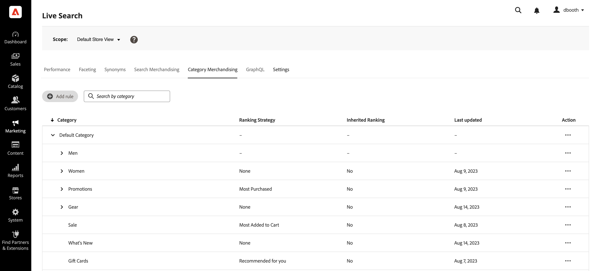
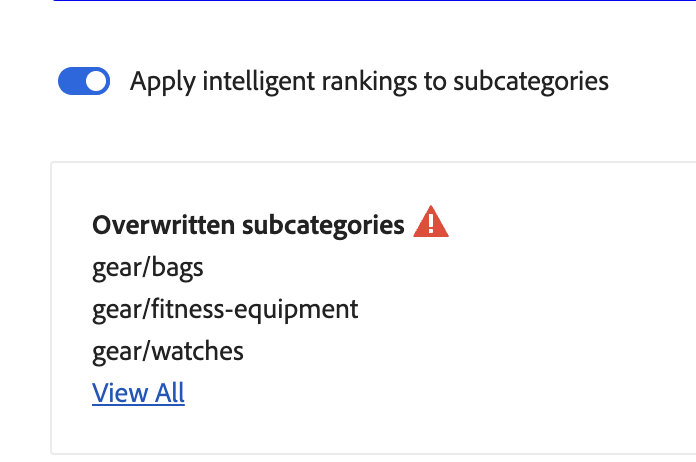
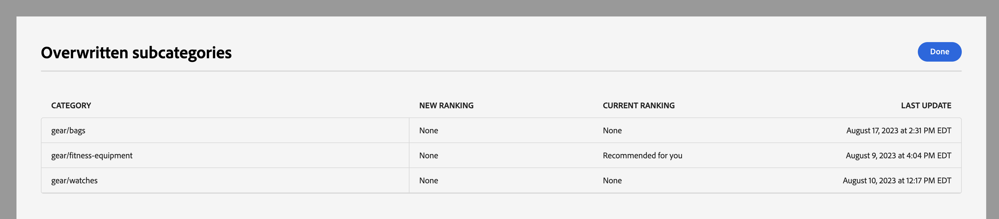
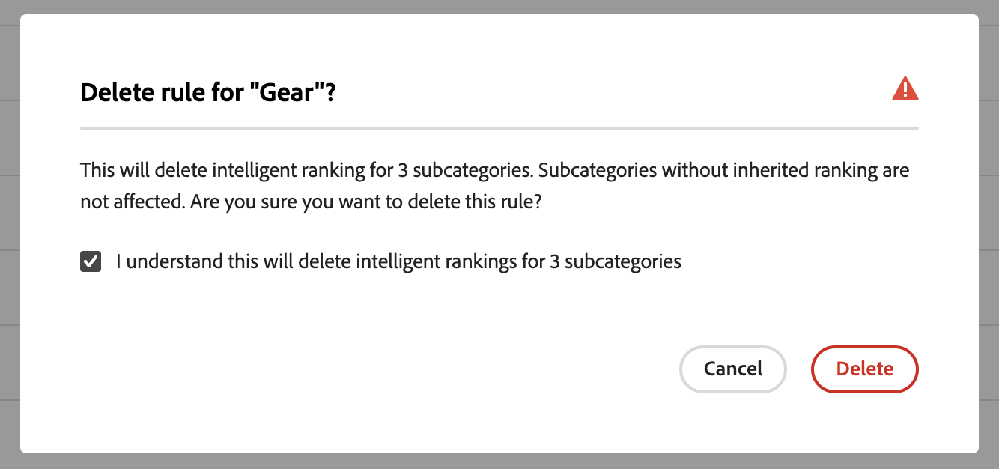
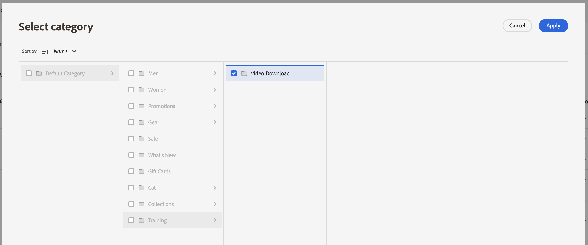
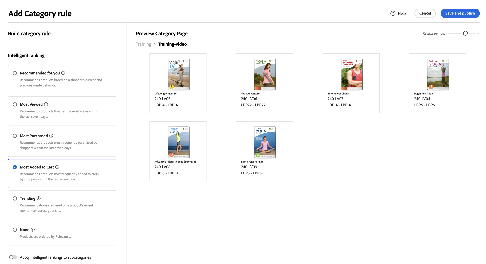

# カテゴリーマーチャンダイジング

カテゴリーマーチャンダイジングを使用すると、ストア所有者は、インテリジェントなランキング [&#x200B; ルール &#x200B;](rules.md)を製品カテゴリとサブカテゴリに適用できます。[!DNL Live Search]

このビデオでは、カテゴリーマーチャンダイジングの概要を説明します。

>[!VIDEO](https://video.tv.adobe.com/v/3424617)

この機能は、管理画面の&#x200B;**マーケティング**/SEOと検索> **[!DNL Live Search]**> **カテゴリーマーチャンダイジング**&#x200B;からアクセスできます。

>[!NOTE]
>
>カテゴリ マーチャンダイジングは、[!DNL Live Search] [3.0.0以降](release-notes.md)で利用できます。 カテゴリ マーチャンダイジング ワークスペースが表示されますが、データが入力されていない場合は、[!DNL Live Search] モジュールを更新してください。

カテゴリマーチャンダイジングビューには、定義されたカテゴリルールが表示され、次の列が表示されます。

* カテゴリ
* ランキング戦略
* 継承したランキング
* 最終更新日
* アクション

「カテゴリ別に検索」フィールドで、カテゴリまたはサブカテゴリを検索できます。

## ランキング戦略

カテゴリーマーチャンダイジングでは、[個の個々の商品](rules-workspace.md)と同じランキングタイプを使用します。
ランクには、「インテリジェント」と「手動」の2種類があります。

**インテリジェントランキング**&#x200B;は、[Adobe AI](https://business.adobe.com/jp/ai.html)によるストアフロントの行動データ分析を活用して、選択したカテゴリ内のすべての商品を特定のアルゴリズムで並べ替えます。 インテリジェントなランキングが選択されると、基盤となるデータが継続的にAdobe AIによって再分析されるため、商品の具体的な順序は時間の経過とともに変化することが予想されます。 例えば、トレンドになっている商品は、買い物客の好みが変化すると、時間の経過とともに自動的に変化します。
インテリジェントなランキング方法は次のとおりです。

* 購入率：過去7日間に買い物客が購入した頻度で商品をランク付けします。
* カートに追加された商品の多さ：過去7日間に買い物客がカートに追加した頻度で商品をランク付けします。
* 閲覧数：過去7日間に買い物客が閲覧した頻度で商品をランク付けします。
* 商品のレコメンデーション：各買い物客の過去と現在のサイト上での行動にもとづいて、買い物客がどれくらいの割合で各買い物客と関わるかによって商品をランク付けします。
* トレンド：閲覧数にもとづいて、人気が最近上昇した商品をランク付けします。
* なし：デフォルトの順序で商品をランク付けします。

**None**&#x200B;を除くインテリジェントなランキング方法では、ルールエディターで&#x200B;**[!UICONTROL Intelligent Ranking Boost]**&#x200B;を設定して、行動シグナルが商品の注文に与える影響を強く調整できます。 デフォルト、制限、プレビュー動作、およびboostが&#x200B;**手動ランキング**&#x200B;と比較される方法について詳しくは、[&#x200B; インテリジェント ランキング boost](rules-add.md#intelligent-ranking-boost)を参照してください。

**手動ランキング**&#x200B;を使用すると、手動ピン、ブースト、埋め込み、非表示のルールを定義することで、自動商品の並べ替え順序を上書きできます。

## 継承したランキング

マーチャンダイザーとして、「トレンド」で分類するレディースウェアのカテゴリーをすべて選択できる場合があります。 これには、「女性のズボン」、「女性のシャツ」、「女性のアクセサリー」というサブカテゴリーが含まれます。 男性のカテゴリは影響を受けません。 継承したランキングを使用して、これを実現できます。

サブカテゴリを持つカテゴリまたはサブカテゴリのインテリジェントなランキング方法を選択する場合、「**インテリジェントなランキングをサブカテゴリに適用**」オプションをオンにすることができます。 これは、ランキング方法をすべてのサブカテゴリに適用します。

これらのサブカテゴリは、親カテゴリからそのルールを継承するようになりました（継承されたランキング列の「はい」）。 アクション列では、使用可能なオプションは&#x200B;**ルールの編集**&#x200B;と&#x200B;**詳細の表示**&#x200B;のみです。 サブカテゴリの継承されたルールに対して、**削除** オプションは無効になっています。 サブカテゴリの継承を削除するには、親カテゴリからの継承を元に戻す必要があります。

任意のカテゴリまたはサブカテゴリに適用できるインテリジェントなランキングは、一度に1つだけです。 手動によるランキングも追加で適用される場合があります。

インテリジェントランキングをカテゴリに適用し、**サブカテゴリにインテリジェントランキングを適用** オプションをオンにすると、サブカテゴリに既に適用されているインテリジェントランキングは上書きされます。

{width="700"}

**すべて表示**&#x200B;をクリックすると、提案された変更の詳細を示すダイアログが開きます。

継承されたインテリジェントランキングを持つカテゴリにインテリジェントランキングを直接追加する場合、継承は新しいインテリジェントランキングによって上書きされます。

カテゴリからインテリジェントランキングを削除すると、継承が再確立されます。
どちらのシナリオでも、手動によるランキングは維持されます。

カテゴリからインテリジェントランキングを削除し、サブカテゴリの継承を選択した場合、継承されたインテリジェントランキングのみがサブカテゴリから削除されます。 手作業によるランキングは継承の対象ではなく、引き続き使用されます。

上位レベルのカテゴリに加えた変更の影響を受ける継承されたサブカテゴリを示すダイアログが表示されます。

{width="1200"}

## カテゴリルールの作成

カテゴリルールを作成するには：

1. 「**ルールを追加**」ボタンをクリックします。
1. _カテゴリを選択_&#x200B;表示で、カテゴリとサブカテゴリをクリックします。
1. チェックボックスを選択して、ランク付けするカテゴリを選択します。
1. 「**適用**」をクリックします。

   

1. _カテゴリ ルールを追加_ ビューで、カテゴリに適用するインテリジェント ランキング方法を選択します。
カテゴリープレビューページには、[!DNL Live Search] データを使用して、選択したランキングの実際の結果が表示されます。
1. 「**保存して公開**」をクリックして、ルールを保存します。

[!DNL Live Search] サービスはルールを処理し、完了時にストア上でルールをアクティブ化します。

## カテゴリルールの変更

既存のルールを変更するには：

1. アクション列の&#x200B;**...**&#x200B;をクリックし、**編集**&#x200B;を選択します。
1. カテゴリ ルールを編集ビューで、必要な変更を行い、**保存して公開**&#x200B;をクリックします。

[!DNL Live Search]が変更を処理すると、変更内容がストアに反映されます。

## カテゴリルールの削除

カテゴリルールを削除するには：

1. アクション列の&#x200B;**...**&#x200B;をクリックし、**削除**&#x200B;を選択します。
1. _ルールを削除_ モーダルで、**ルールを削除**&#x200B;を選択してルールを削除するか、**キャンセル**&#x200B;を選択してアクションをキャンセルします。

## 手動ランキング

手動ランキングを使用すると、インテリジェントランキングルールによって決定された製品の順序を上書きし（存在する場合）、結果の中で製品が表示される場所を手動で制御できます。

イベントは、定義された条件が満たされたときに検索結果を変更するアクションです。 手作業によるランク付けは、最大25件のイベントで実施できます。

* ブースト：検索結果の上位に商品を移動します。
* 埋める：検索結果の下に商品を移動します。
* 製品をピン留め：結果の特定の位置に製品を移動します。
* 商品を非表示：検索結果から商品を除外します。

手動ランキングの作成：

1. 前述のように、カテゴリにインテリジェントなランキングルールを設定します。 クエリの結果は、カテゴリのプレビューページビューに表示されます。 これにより、実際のライブ検索データを使用して結果をプレビューできます。

1. プレビューカテゴリーページビューで製品をクリックしてドラッグします。 目的の位置にドラッグ&amp;ドロップします。 「製品」フィールドと「位置」フィールドは、「イベント」ペインに自動的に入力されます。

ピン留めアイコンをクリックして、製品を現在の場所にピン留めすることもできます。 省略記号コンテキストメニューを使用して、「上にピン留め」または「下にピン留め」します。

イベントを手動で追加するには：

1. 「手動ランキング」で、**イベントを選択** メニューをクリックし、関連付けられた条件が満たされたときに実行するイベントを選択します。
1. 影響を与える製品の名前を入力します。 入力すると、商品が提案されます。
1. 複数のイベントの場合、条件が満たされたときにトリガーする他のイベントを選択します。

>[!NOTE]
>
>ルールは、ストアフロントで特定のカテゴリが開かれ、そのカテゴリにルールが存在する場合に適用されます。 カテゴリ マーチャンダイジングルールの場合、デフォルトの並べ替え順序は「並べ替え：位置」です。 買い物客が並べ替え順序を変更すると、非表示、ピン留め、埋め込まれた商品はすべて並べ替えられなくなります。
