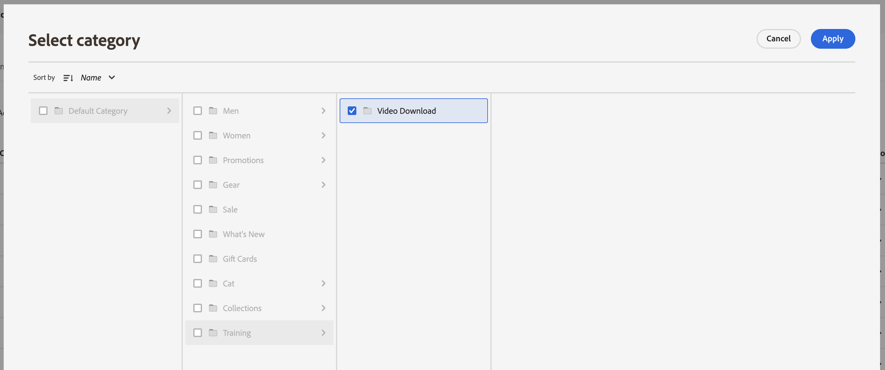

# カテゴリマーチャンダイジング

カテゴリマーチャンダイジングを使用すると、店舗所有者 [!DNL Live Search] 製品カテゴリとサブカテゴリにインテリジェントランキング [ ルール ](rules.md) を適用できます。

このビデオは、カテゴリマーチャンダイジングの概要です。

>[!VIDEO](https://video.tv.adobe.com/v/3424617)

この機能には、管理者の **マーケティング**/SEO と検索/**[!DNL Live Search]**/**カテゴリマーチャンダイジング** でアクセスします。

>[!NOTE]
>
>カテゴリマーチャンダイジングは、[!DNL Live Search] [3.0.0 以降 ](release-notes.md) で使用できます。 カテゴリマーチャンダイジングワークスペースが表示されても、データが入力されていない場合は、[!DNL Live Search] モジュールを更新します。

カテゴリマーチャンダイジング表示には、定義済みのカテゴリルールと、次の列が表示されます。

* カテゴリ
* ランキング戦略
* 継承されたランキング
* 最終更新日
* アクション

「カテゴリで検索」フィールドでカテゴリまたはサブカテゴリを検索できます。

## ランキング戦略

カテゴリマーチャンダイジングでは、[ 個々の製品 ](rules-workspace.md) と同じランキングタイプを使用します。
ランキングには、インテリジェントと手動の 2 種類があります。

**インテリジェントランキング** では、[Adobe Sensei](https://www.adobe.com/sensei.html) によるストアフロントの行動データ分析を活用して、選択したカテゴリ内のすべての商品を特定のアルゴリズムで並べ替えます。 インテリジェントなランキングが選択されると、基になるデータが継続的にAdobe Senseiによって再分析されるので、商品の特定の順序は時間の経過と共に変化することが予想されます。 例えば、上位のトレンド製品は、買い物客の環境設定の変化に応じて、時間の経過と共に自動的に変化します。
インテリジェントなランキングメソッドは次のとおりです。

* 最も多く購入された：過去 7 日間に買い物客が購入した頻度で製品をランク付けします。
* 買い物かごに最も追加された数：過去 7 日間に買い物客によって買い物かごに追加された頻度に基づいて製品をランク付けします。
* 最も多く閲覧された：過去 7 日間に買い物客が閲覧した頻度で製品をランク付けします。
* 推奨：各買い物客の現在および以前のオンサイト行動に基づいて、買い物客が各買い物客とやり取りする可能性の高さで製品をランク付けします。
* トレンド：表示に基づいて、最近の人気上昇別に製品をランク付けします。
* なし：デフォルトの順序に基づいて製品をランク付けします。

**手動ランキング** を使用すると、手動のピン、ブースト、ベリー、非表示ルールを定義することで、製品の自動並べ替え順を上書きできます。

## 継承されたランキング

マーチャンダイザーの場合、「トレンド」で並べ替える女性用着こなしカテゴリをすべて選択できる場合があります。 サブカテゴリには、「女性のパンツ」、「女性のシャツ」、「女性のアクセサリー」が含まれます。 男性のカテゴリーは影響を受けるべきではありません。 継承されたランキングを使用して、これを実現できます。

サブカテゴリを持つカテゴリまたはサブカテゴリに対してインテリジェントランキング方法を選択する際に、「**サブカテゴリにインテリジェントランキングを適用** オプションをオンにできます。 これにより、ランキングメソッドがすべてのサブカテゴリに適用されます。

これらのサブカテゴリは、親カテゴリからそのルールを継承するようになりました（「継承されたランキング」列の「はい」を参照）。 「アクション」列で使用できるオプションは「**ルールを編集**」および **詳細を表示** のみです。 サブカテゴリの継承されたルールに対しては、「**削除**」オプションは無効になります。 サブカテゴリの継承を削除するには、親カテゴリから継承を元に戻す必要があります。

どのカテゴリまたはサブカテゴリにも、一度に 1 つのインテリジェントランキングのみを適用できます。 追加の手動ランキングが適用されている場合もあります。

カテゴリにインテリジェントランキングを適用し、「**サブカテゴリにインテリジェントランキングを適用** オプションをオンにすると、サブカテゴリに既に適用されているインテリジェントランキングが上書きされます。

{width="700"}

**すべて表示** をクリックすると、提案された変更の詳細を示すダイアログが開きます。

継承されたインテリジェントランキングを持つカテゴリにインテリジェントランキングを直接追加する場合、継承は新しいインテリジェントランキングによって上書きされます。

カテゴリからインテリジェントランキングを削除すると、継承が再確立されます。
どちらのシナリオでも、手動によるランキングは維持されます。

カテゴリからインテリジェントランキングを削除し、サブカテゴリの継承を選択した場合、継承されたインテリジェントランキングのみがサブカテゴリから削除されます。 手動ランキングは継承の対象ではなく、今後も維持されます。

上位レベルのカテゴリに対して行った変更によって影響を受ける継承されたサブカテゴリを示すダイアログが表示されます。

{width="1200"}

## カテゴリルールの作成

カテゴリルールを作成するには：

1. 「**ルールを追加** ボタンをクリックします。
1. _カテゴリを選択_ ビューで、カテゴリとサブカテゴリをクリックして選択します。
1. チェックボックスを選択して、ランク付けするカテゴリを選択します。
1. **適用** をクリックします。

   

1. _カテゴリルールを追加_ ビューで、カテゴリに適用するインテリジェントランキング方法を選択します。
カテゴリプレビューページには、ライブ検索データを使用して、選択したランキングの実際の結果が表示されます。
1. **保存して公開** をクリックして、ルールを保存します。

[!DNL Live Search] サービスはルールを処理し、完了するとストア上でアクティブ化します。

## カテゴリルールの変更

既存のルールを変更するには：

1. 「アクション」列の「**...**」をクリックし、「**編集**」を選択します。
1. カテゴリルールを編集ビューで、必要な変更を行い、「**保存して公開**」をクリックします。

変更は、変更を処理するとストアに反映さ [!DNL Live Search] ます。

## カテゴリルールの削除

カテゴリルールを削除するには：

1. 「アクション」列の「**...**」をクリックし、「**削除**」を選択します。
1. _ルールを削除_ モーダルで、「**削除**」を選択してルールを削除するか、「**キャンセル**」を選択してアクションをキャンセルします。

## 手動ランキング

手動ランキングを使用すると、インテリジェントランキングルール（存在する場合）で決定された製品の順序を上書きし、結果に表示される製品の場所を手動で制御できます。

イベントとは、定義された条件が満たされた場合に検索結果を変更するアクションです。 手動ランキングには、最大 25 個のイベントを指定できます。

* ブースト：検索結果で製品を上に移動します。
* Bury：検索結果で商品を下に移動します。
* 製品をピン留め：結果の特定の位置に製品を移動します。
* 製品を非表示にする：検索結果から製品を除外します。

手動ランキングを作成します。

1. 上記のように、カテゴリに対してインテリジェントなランキングルールを設定します。 クエリの結果は、カテゴリページのプレビューに表示されます。 この場合、実際のライブ検索データを使用して結果をプレビューします。

1. カテゴリページをプレビュービューで製品をクリックしてドラッグします。 目的の位置にドラッグ&amp;ドロップします。 「製品」および「位置」フィールドは、イベント・ペインに自動的に入力されます。

ピン アイコンをクリックして、製品を現在の場所にピン留めすることもできます。 省略記号コンテキストメニューを使用して、「上にピン留め」または「下にピン留め」を使用します。

イベントを手動で追加するには：

1. 「手動ランキング」で **イベントを選択** メニューをクリックし、関連する条件が満たされた場合に実行するイベントを選択します。
1. 影響を与える製品の名前を入力します。 製品は入力時に推奨されます。
1. 複数のイベントの場合、条件が満たされた場合にトリガーにしたい他のイベントを選択します。

>[!NOTE]
>
>ルールが適用されるのは、特定のカテゴリがストアフロントで開かれたときに、そのカテゴリのルールが存在する場合です。 カテゴリマーチャンダイジングルールの場合、デフォルトの並べ替え順は「並べ替え：位置」です。 買い物客が並べ替え順を変更すると、非表示、ピン留め、埋め込みのすべての製品が並べ替えられなくなります。
