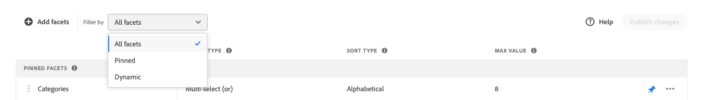

# ファセットの管理

次の手順に従って、既存のファセットのプロパティを更新するか、ストアフロントでの表示を変更します。

## 価格ファセット グループ化の構成

価格ファセット間隔およびグループ化を構成するには、[ 設定 ](settings.md) を参照してください。

## ファセットを編集

1. 編集するファセットを見つけます。
1. リストに多数のファセットがある場合、「フィルター条件 *を次のいずれかに設定します*。

   * ピン留め
   * 動的

   詳しくは、[ ファセットタイプ ](facets-type.md) を参照してください。

   

1. ファセットのプロパティを編集するには、「**その他**」（...）オプションをクリックします。
1. **編集** をクリックします。

   

1. ファセットラベルを編集するには、次のいずれかの操作を行います。

   * [!DNL Commerce] ストアフロントの場合は、[ 属性ラベル ](https://experienceleague.adobe.com/docs/commerce-admin/catalog/product-attributes/product-attributes.html?lang=ja) を編集します。
   * ヘッドレス実装の場合、最初の列の値をクリックし、必要に応じてテキストを編集します。

   

1. （ヘッドレスのみ）ファセット値の並べ替えに使用するメソッドを変更するには、*並べ替えタイプ* 列の値をクリックして、次のいずれかを選択します。

   * アルファベット順
   * カウント

   

1. **最大値** 列で、ストアフロントに表示するファセットフィルター値の最大数（0 ～ 10）を設定します。
1. 完了したら、「**保存**」をクリックします。

   変更内容は、公開されるまでストアフロントに表示されません。

## ファセットのピン留め/ピン留めを解除

クリックするとピンの色が変わり、ファセットを *ピン留めファセット* または *動的ファセット* セクションに移動するために使用します。

1. ファセットを「*フィルター*」リストの上部にピン留めするには、「*動的ファセット*」リストでファセットを見つけて、グレーのピン （）をクリックします。

   ピンが青色に変わり、ファセットが *ピンされたファセット* セクションに移動します。

1. ファセットのピン留めを解除するには、*ピン留めされたファセット* リストでファセットを見つけ、青いピン（）をクリックします。

   ピンがグレーに変わり、ファセットが *動的ファセット* セクションに移動します。

   

>[!NOTE]
>
>同じ名前のラベルが 2 つある場合、ピン留めされたファセットの順序に一貫性がない場合があります。

## ピン留めされたファセットを移動

>[!NOTE]
>
>ピン留めされたファセットの順序は、ヘッドレス実装でのみサポートされます。 順序付きファセットが必要な場合は、[!DNL Live Search] PLP ウィジェットを使用します。

ピン留めされたファセットの順序は、行を別の位置に移動することで変更できます。 ピン留めされたファセットには、行の先頭に *移動* アイコン（）があります。 ピンされたファセットとは異なり、動的ファセットは移動できません。

1. リストの *ピンされたファセット* セクションでファセットを見つけます。
1. **移動** （）アイコンを使用して、行を「*ピン留めファセット*」セクションの新しい位置にドラッグします。

   変更が公開されると、並べ替えられたファセットがストアフロントの *フィルター* リストに表示されます。

## ファセットを削除

1. リストでファセットを見つけ、「**その他**」（...）オプションをクリックします。
1. **削除** をクリックします。
1. 確認を求められたら、「**ファセットを削除**」をクリックします。
変更が公開されると、ファセットがストアフロントから削除されます。

## 変更を公開

1. 変更をストアフロントに反映させるには、「**変更を公開**」をクリックします。
1. 更新がストアに表示されるまで、約 15 分待ちます。
