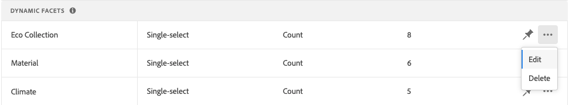
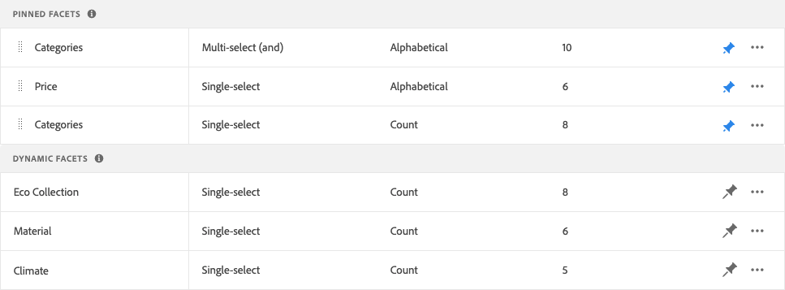

# ファセットの管理

次の手順に従って、既存のファセットのプロパティを更新するか、ストアフロントでのプレゼンテーションを変更します。

## 価格ファセット グループの設定

価格ファセットの間隔とグループ化を設定するには、[設定](settings.md)を参照してください。

## ファセットを編集

1. 編集したいファセットを見つけます。
1. リストに多くのファセットがある場合、*Filter by*&#x200B;を次のいずれかに設定します。

   * ピン留め
   * 動的

   詳しくは、[ ファセットタイプ ](facets-type.md)にアクセスしてください。

   

1. ファセットプロパティを編集するには、**詳細** （。..）をクリックします。 オプション：
1. **編集**&#x200B;をクリック

   

1. ファセットラベルを編集するには、次のいずれかの操作を行います。

   * [!DNL Commerce] ストアフロントの場合、[属性ラベル ](https://experienceleague.adobe.com/docs/commerce-admin/catalog/product-attributes/product-attributes.html)を編集します。
   * ヘッドレス実装の場合は、最初の列の値をクリックし、必要に応じてテキストを編集します。

   

1. （ヘッドレスのみ）ファセット値の並べ替えに使用するメソッドを変更するには、*並べ替えタイプ*&#x200B;列の値をクリックし、次のいずれかを選択します。

   * アルファベット
   * カウント

   

1. **Max Value**&#x200B;列で、ストアフロントに表示するファセットフィルター値の最大数（0 ～ 10）を設定します。
1. 完了したら、**保存**&#x200B;をクリックします。

   変更は、公開後までストアフロントに表示されません。

## ファセットのピン/ピン解除

ピンはクリックすると色が変わり、ファセットを&#x200B;*ピン留めファセット*&#x200B;または&#x200B;*動的ファセット* セクションのいずれかに移動するために使用されます。

1. ファセットを&#x200B;*フィルター* リストの先頭にピン留めするには、*動的ファセット* リストでファセットを見つけ、グレーのピン （）をクリックします。

   ピンが青になり、ファセットが&#x200B;*ピン留めファセット* セクションに移動します。

1. ファセットのピン留めを解除するには、*ピン留めファセット* リストでファセットを見つけ、青いピン （）をクリックします。

   ピンがグレーになり、ファセットが&#x200B;*動的ファセット* セクションに移動します。

   

>[!NOTE]
>
>同じ名前を持つ2つのラベルがある場合、ピン留めされたファセットの順序に一貫性がない可能性があります。

## ピン留めファセットを移動

>[!NOTE]
>
>ピン留めされたファセットの順序は、ヘッドレス実装でのみサポートされています。 順序付きファセットが必要な場合は、[!DNL Live Search] PLP ウィジェットを使用します。

ピン留めされたファセットの順序は、行を別の位置に移動することで変更できます。 ピン留めされたファセットには、行の先頭に&#x200B;*移動* アイコン （）が表示されます。 ピン留めされたファセットとは異なり、動的ファセットは移動できません。

1. リストの&#x200B;*ピン留めファセット* セクションでファセットを検索します。
1. **移動** （）アイコンを使用して、行を&#x200B;*ピン留めファセット* セクションの新しい位置にドラッグします。

   変更が公開されると、並べ替えられたファセットがストアフロント *フィルター* リストに表示されます。

## ファセットを削除

1. リスト内のファセットを見つけ、**詳細** （。..）をクリックします。 オプション：
1. 「**削除**」をクリックします。
1. 確認を求められたら、**ファセットを削除**をクリックします。
変更が公開されると、ファセットはストアフロントから削除されます。

## 変更を公開

1. 変更を加えてストアフロントを更新するには、**変更を公開**&#x200B;をクリックします。
1. 更新がストアに表示されるまで約15分待ちます。
