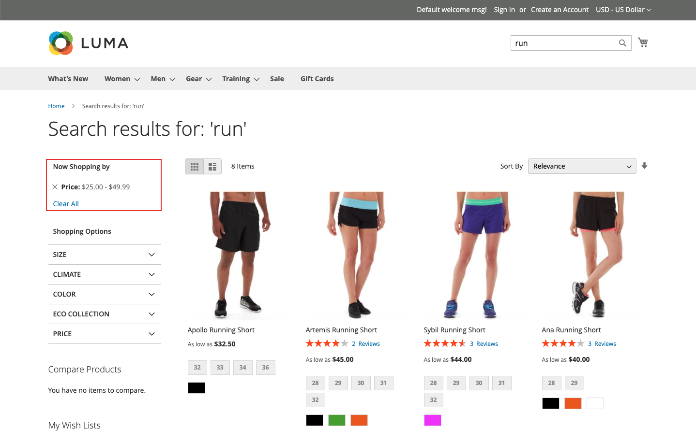

# ファセットのタイプ

[!DNL Live Search] では様々なファセットタイプを使用し、関連性がある場合にのみ *フィルター* リストに表示されます。 使用可能なファセットのリストは、返される製品に応じて変わります。 その表示と動作には、次の特徴が影響します。

* ピンされたファセット – 最も一般的に使用されるファセットをリストの上部にピン留めできます。 残りのファセットは、ピン留めされたファセットの後に *並べ替えタイプ* の順序で一覧表示されます。
* 動的ファセット - [Adobe AI](https://business.adobe.com/jp/ai.html) が商品セットおよびクエリと最も関連性の高い商品を見つける商品属性。 計算では、カタログ全体の属性メタデータが考慮され、クエリ時に、クエリに最も関連性の高いファセットが決定されます。

  >[!NOTE]
  >
  >動的ファセットの作成後にGraphQLのクエリ応答にタイムアウトエラーが表示されている場合は、すべてのファセットをピン留めに変更して、パフォーマンスの問題が解決されるかどうかを確認します。

* 人気のあるファセット – 検索結果に最も頻繁に存在する製品属性。
* 価格ファセット – 価格範囲別に製品を返します。 [*設定*](settings.md) ワークスペースで、選択数と価格範囲間隔を指定できます。

クエリ時に、[!DNL Live Search] は、動的なファセットと一般的なファセットのグループに検索結果を生成します。

## ストアフロントおよびヘッドレスオプション

[!DNL Commerce] ストアフロント用にレンダリングされるファセットは、検索アダプターによって処理され、リクエストのルーティングとストアフロントでの結果のレンダリングを行います。 ストアフロント [!DNL Commerce] ファセットはすべて、対応する属性に割り当てられた入力タイプに関係なく、単一選択オプションを使用してアルファベット順に並べ替えられます。 ストアフロントで使用可能なファセットは、現在のテーマに従ってレンダリングされ、レイヤー化されたナビゲーションの表示に加えられたカスタマイズを反映します。

これに対し、[&#x200B; ヘッドレス &#x200B;](https://developer.adobe.com/commerce/php/architecture/technical-vision/web-api/) 実装は API によって処理され、追加のオプションをサポートします。 ヘッドレスファセットは、アルファベット順またはカウント順に並べ替えることができ、単一選択または複数選択のオプションを設定できます。

### ファセットラベル

ストアフロント [!DNL Commerce] 場合、ファセットラベルは [*属性プロパティ*](https://experienceleague.adobe.com/docs/commerce-admin/catalog/product-attributes/create/attribute-product-create.html?lang=ja) によって決まります。 複数のビューを持つストアの場合、追加のラベルは *ラベルを管理* で定義できます。 ヘッドレス実装の場合、ラベルは [&#x200B; ファセットワークスペース &#x200B;](faceting-workspace.md) から編集されます。

### 並べ替えタイプ

ストアフロント用にレンダリングされるすべてのファセットは、アルファベット順に並べ替えられます。 ヘッドレス実装の場合、ファセットはアルファベット順またはカウント順に並べ替えることができます。

| 並べ替えタイプ | 説明 |
|--- |--- |
| アルファベット | ストアフロントの *フィルター* リストでは、ファセットがアルファベット順に並べ替えられます。 |
| カウント | （ヘッドレスのみ）ヘッドレス実装の場合、ファセットは、現在の返された製品セットでファセットごとに見つかった値の数で並べ替えることもできます。 |
