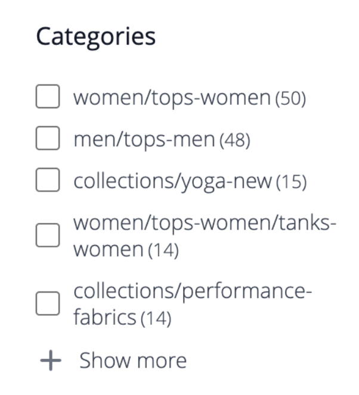

# ファセット

ファセットは、複数のディメンションの属性値を検索条件として使用する、高パフォーマンスのフィルタリング方法です。 ファセット検索も似ていますが、標準の [ レイヤー化されたナビゲーション ](https://experienceleague.adobe.com/docs/commerce-admin/catalog/catalog/navigation/navigation-layered.html) よりも大幅に「スマート」です。 使用可能なフィルターのリストは、検索結果で返される製品の [ フィルタリング可能な属性 ](https://experienceleague.adobe.com/docs/commerce-admin/catalog/catalog/navigation/navigation-layered.html#filterable-attributes) によって決まります。

[!DNL Live Search] は `productSearch` クエリを使用して、[!DNL Live Search] に固有のファセットやその他のデータを返します。 コード例については [`productSearch` 開発者向けドキュメントの ](https://developer.adobe.com/commerce/webapi/graphql/schema/live-search/queries/product-search/) クエリを参照してください。

ファセット内で、買い物客は「スタイル」の「基本」や「スナッグ」など、複数のオプションを選択でき、検索結果はこれらのスタイルのみを表示するように更新されます。 同様に、買い物客がファセットをまたいだオプション（「スタイル」の「基本」や「気候」の「屋内」など）を選択すると、検索結果が更新され、選択したスタイルと選択した気候が表示されます。

定義済みのファセットを URL パラメーターとして使用でき、結果はパラメーター値 `http://yourstore.com?brand=acme&color=red` に基づいてフィルターされます。

## ファセットの要件

ファセットのカテゴリと製品属性の要件は、レイヤーナビゲーションで使用するフィルタリング可能な属性に似ています。 属性の各ストアフロントのプロパティでは、「検索結果の階層型ナビゲーションで使用」の値を「はい」に設定する必要があります。 属性設定の確認と更新は、管理者の [!DNL Stores]/[!DNL Attribute] メニューから行えます。

>[!NOTE]
>
>製品カテゴリをファセットとして定義した場合、ファセットにはカテゴリとサブカテゴリの `url_path` が表示されます。
>
>

[ のファセット要件について詳しくは、](./boundaries-limits.md#facets) 境界と制限 [!DNL Live Search] を参照してください。

競合する属性が多数ある場合は、属性を 1 つの「meta-attribute」に組み合わせることを検討してください。 例えば、靴は一般的に数値サイズ、シャツは一般的に「S/M/L/XL」サイズです。 これら 2 種類のサイズを 1 つの検索可能な属性に組み合わせることができます。

| 設定 | 説明 |
|--- |--- |
| [ カテゴリの表示設定 ](https://experienceleague.adobe.com/docs/commerce-admin/catalog/categories/create/categories-display-settings.html) | アンカー – `Yes` |
| [ 属性プロパティ ](https://experienceleague.adobe.com/docs/commerce-admin/catalog/product-attributes/create/attribute-product-create.html) | [ カタログ入力タイプ ](https://experienceleague.adobe.com/docs/commerce-admin/catalog/product-attributes/attributes-input-types.html) - `Yes/No`、`Dropdown`、`Multiple Select`、`Price`、`Visual swatch` （ウィジェットのみ）、`Text swatch` （ウィジェットのみ） |
| 属性ストアフロント プロパティ | 検索結果での使用階層ナビゲーション - `Yes` |

## ファセットの集約

ファセットの集計は、ストアフロントに 3 つのファセット（カテゴリ、カラー、価格）があり、3 つすべてに対して買い物客がフィルターを適用する場合（カラー= ブルー、価格は$10.00～50.00、カテゴリ = `promotions`）に実行されます。

* `categories` aggregation - `categories` を集計して、`color` フィルターと `price` フィルターを適用しますが、`categories` フィルターは適用しません。
* `color` aggregation - `color` を集計して、`price` フィルターと `categories` フィルターを適用しますが、`color` フィルターは適用しません。
* `price` aggregation - `price` を集計して、`color` フィルターと `categories` フィルターを適用しますが、`price` フィルターは適用しません。

## デフォルトの属性値

次の製品属性には [storefront プロパティ ](https://experienceleague.adobe.com/docs/commerce-admin/catalog/product-attributes/product-attributes.html) があり、[!DNL Live Search] で使用され、デフォルトで有効になっています。

| プロパティ | Storefront プロパティ | 属性 |
|---|---|---|
| 並べ替え | 製品リストでの並べ替えに使用 | `price` |
| 検索可能 | 検索で使用 | `price`  `sku` `name` |
| FilterableInSearch | レイヤーナビゲーションでの使用 – フィルタリング可能（結果を含む） | `price` `visibility` `category_name` |

## システム以外のデフォルトの属性プロパティ

次の表に、システム以外の属性のデフォルトの検索プロパティとフィルタリング可能なプロパティを示します。これには、Luma サンプルデータに固有のプロパティが含まれます。 *検索で使用* 属性プロパティを `Yes` に設定すると、[!DNL Live Search] とネイティブの両方のAdobe Commerceで属性を検索できるようになります。

| 属性コード | 検索可能 | レイヤーナビゲーションでの使用 |
|--- |--- |--- |
| activity | はい | フィルタリング可能（結果あり） |
| attributes_brand | はい | 不可 |
| ブランド | はい | 不可 |
| 気候 | はい | フィルタリング可能（結果あり） |
| カラー | はい | フィルタリング可能（結果あり） |
| 色 | はい | フィルタリング可能（結果あり） |
| 費用 | はい | 不可 |
| eco_collection | はい | フィルタリング可能（結果あり） |
| 性別 | はい | フィルタリング可能（結果あり） |
| 製造元 | はい | フィルタリング可能（結果あり） |
| 素材 | はい | フィルタリング可能（結果あり） |
| 目的 | はい | フィルタリング可能（結果あり） |
| strap_bags | はい | フィルタリング可能（結果あり） |
| style_general | はい | フィルタリング可能（結果あり） |

## デフォルトのシステム属性プロパティ

次の表に、システム属性のデフォルトの検索およびフィルタリング可能プロパティを示します。

| 属性コード | 検索可能 | レイヤーナビゲーションでの使用 |
|--- |--- |--- |
| allow_open_amount | はい | フィルタリング可能（結果あり） |
| 説明 | はい | 不可 |
| name | はい | 不可 |
| 価格 | はい | フィルタリング可能（結果あり） |
| short_description | はい | 不可 |
| sku | はい | 不可 |
| ステータス | はい | 不可 |
| tax_class_id | はい | 不可 |
| url_key | はい | 不可 |
| 重み | はい | 不可 |
