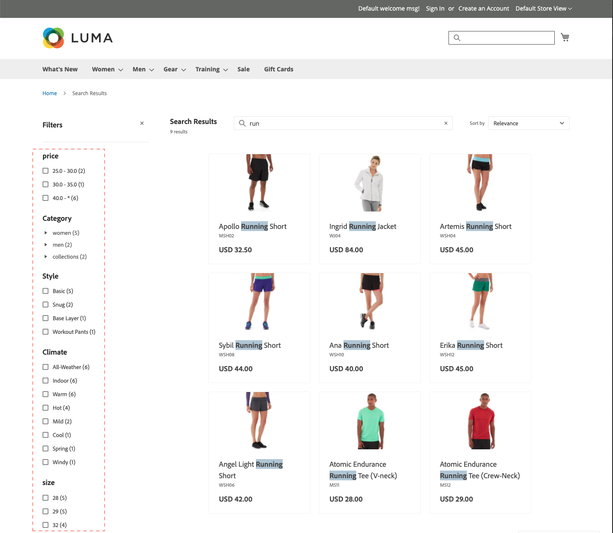

# ファセット

ファセット処理は、属性値の複数の次元を検索条件として使用する高性能フィルタリングの方法です。 ファセット検索は類似していますが、標準の[階層化ナビゲーション ](https://experienceleague.adobe.com/docs/commerce-admin/catalog/catalog/navigation/navigation-layered.html)よりもかなり「スマート」です。 使用可能なフィルターのリストは、検索結果で返される商品の[ フィルター可能な属性](https://experienceleague.adobe.com/docs/commerce-admin/catalog/catalog/navigation/navigation-layered.html#filterable-attributes)によって決まります。

[!DNL Live Search]は`productSearch` クエリを使用しています。このクエリは、[!DNL Live Search]に固有のファセットおよびその他のデータを返します。 コード例については、開発者ドキュメントの[`productSearch` クエリ ](https://developer.adobe.com/commerce/webapi/graphql/schema/live-search/queries/product-search/)を参照してください。

買い物客は、ファセット内で「スタイル」の下の「基本」や「スナップ」など、複数のオプションを選択でき、検索結果はそれらのスタイルのみを表示するように更新されます。 同様に、買い物客が「スタイル」の「基本」や「気候」の「屋内」など、複数のファセットにまたがるオプションを選択した場合、検索結果は選択したスタイルと選択した気候を表示するように更新されます。

定義されたファセットはURL パラメーターとして使用でき、結果はパラメーター値`http://yourstore.com?brand=acme&color=red`に基づいてフィルタリングされます。

## ファセット要件

ファセットのカテゴリと製品属性の要件は、階層化されたナビゲーションに使用されるフィルター可能な属性と似ています。 属性の各ストアフロントプロパティには、「検索結果レイヤーナビゲーションで使用」の値を「はい」に設定する必要があります。 管理画面の[!DNL Stores] > [!DNL Attribute] メニューから属性設定を確認し、更新できます。

>[!NOTE]
>
>製品カテゴリをファセットとして定義すると、ファセットにはカテゴリの`url_path`とサブカテゴリが表示されます。
>
>

[!DNL Live Search]のファセット要件について詳しくは、[境界と制限](./boundaries-limits.md#facets)を参照してください。

対応する属性が多数ある場合は、属性を単一の「メタ属性」に組み合わせることを検討してください。 例えば、靴は一般的に数値サイズですが、シャツは一般的に「S/M/L/XL」サイズです。 これら2種類のサイズを組み合わせて、1つの検索可能な属性にすることができます。

| 設定 | 説明 |
|--- |--- |
| [ カテゴリの表示設定](https://experienceleague.adobe.com/docs/commerce-admin/catalog/categories/create/categories-display-settings.html) | アンカー – `Yes` |
| [属性プロパティ ](https://experienceleague.adobe.com/docs/commerce-admin/catalog/product-attributes/create/attribute-product-create.html) | [ カタログ入力タイプ ](https://experienceleague.adobe.com/docs/commerce-admin/catalog/product-attributes/attributes-input-types.html) - `Yes/No`、`Dropdown`、`Multiple Select`、`Price`、`Visual swatch` （ウィジェットのみ）、`Text swatch` （ウィジェットのみ） |
| 属性ストアフロントプロパティ | 検索結果の階層化されたナビゲーションで使用 – `Yes` |

## ファセット集計

ファセットの集計は次のように実行されます。ストアフロントが3つのファセット（カテゴリ、色、価格）を持ち、買い物客が3つすべてのファセットにフィルターを適用した場合（色=青、価格は$10.00～50.00、カテゴリ= `promotions`）。

* `categories`集計 – `categories`を集計し、`color`および`price` フィルターを適用しますが、`categories` フィルターは適用しません。
* `color`集計 – `color`を集計し、`price`および`categories` フィルターを適用しますが、`color` フィルターは適用しません。
* `price`集計 – `price`を集計し、`color`および`categories` フィルターを適用しますが、`price` フィルターは適用しません。
