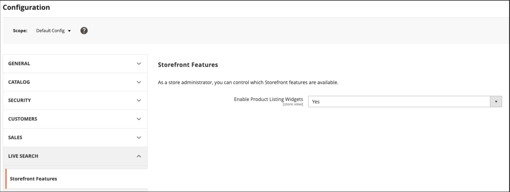

# [!DNL Live Search]で成功するように設定

Adobe Commerce [!DNL Live Search]と[[!DNL Catalog Service]](../catalog-service/guide-overview.md)は連携して、パフォーマンスが高く、適切で、直観的な検索ソリューションを提供し、お客様が必要なものをすばやく正確に見つけられるようにします。 具体的には、[!DNL Catalog Service]は、使用する[!DNL Live Search]などのSaaS サービス用にカタログデータを表示します。

この記事では、[!DNL Live Search]を使用して[!DNL Catalog Service]を実装するための手順を説明します。

## オーディエンス

この記事は、Adobe Commerce インスタンスのインストールと設定を担当する開発者向けまたはシステム インテグレーターを対象としています。

## 要件定義

- [Adobe Commerce](https://business.adobe.com/products/magento/magento-commerce.html) 2.4.4以降
- PHP 8.1、8.2、8.3、または8.4
- [!DNL Composer]
- cron ジョブとインデクサーの実行

>[!IMPORTANT]
>
>[!DNL Live Search]を実装する前に、[制限](boundaries-limits.md) セクションを参照して、[!DNL Live Search]がビジネスニーズに適合していることを確認してください。

## 重要な更新

- [!DNL Live Search] 3.0.2現在、[!DNL Catalog Service]拡張機能はインストールにバンドルされています。

## サポートされているプラットフォーム

- Adobe Commerce クラウド版（ECE） : 2.4.4以降
- Adobe Commerce オンプレミス（EE） : 2.4.4以降

>[!IMPORTANT]
>
> **HIPAA対応**
>
> ライブサーチはHIPAA対応サービスではありません。 HIPAA対応の拡張機能とヘルスケアアドオンでAdobe Commerceを使用している場合は、保護された健康情報（PHI）を処理する可能性がある環境でライブサーチを有効にしないでください。
>
> 詳しくは、[HIPAA対応Adobe Commerce](https://experienceleague.adobe.com/en/docs/commerce-admin/start/compliance/hipaa-ready-service/overview)および[操作](https://experienceleague.adobe.com/en/docs/commerce-admin/start/compliance/hipaa-ready-service/operations) ガイダンスを参照してください。このガイダンスでは、HIPAA対応ではないCommerce サービスの中からライブサーチをリストしています。

## ワークフローの概要

[!DNL Live Search]をオンボーディングするには、次の操作が必要です。

1. [拡張機能を](#install) インストール [!DNL Live Search]
1. [API キーを](#configure)設定
1. [ カタログ データの同期](#sync)
1. カタログ データがエクスポートされたことを[確認](#verify)
1. [ データを設定](#configuredata)
1. [接続をテスト ](#test)
1. [ イベントがデータをキャプチャしていることを検証](#capture)します
1. [ ストアフロントのカスタマイズ ](#customize)

## &#x200B;1. [!DNL Live Search]拡張機能をインストールする {#install}

[!DNL Live Search]は、[Adobe Marketplace](https://commercemarketplace.adobe.com/magento-live-search.html) ～ [Composer](https://getcomposer.org/)の拡張機能としてインストールされています。 [!DNL Live Search]をインストールして設定すると、Adobe [!DNL Commerce]はSaaS サービスとの検索データとカタログデータの共有を開始します。 この時点で、*管理者*&#x200B;のユーザーは、検索ファセット、類義語、マーチャンダイジングルールを設定、カスタマイズ、管理できます。

>[!BEGINTABS]

>[!TAB 新しいCommerce インスタンス ]

新しいCommerce インスタンスに[!DNL Live Search]をインストールする場合は、次の手順に従います。

1. [cron ジョブ ](https://experienceleague.adobe.com/en/docs/commerce-operations/configuration-guide/cli/configure-cron-jobs)および[ インデクサー](https://experienceleague.adobe.com/en/docs/commerce-admin/systems/tools/index-management)が実行中であることを確認します。

1. Composerを使用して、ライブ検索モジュールをプロジェクトに追加します。

   ```bash
   composer require magento/live-search --no-update
   ```

1. 依存関係を更新し、拡張機能をインストールします。

   ```bash
   composer update magento/live-search --with-dependencies
   ```

1. [!DNL OpenSearch]と関連モジュールを無効にし、[!DNL Live Search]をインストールします。 [!DNL OpenSearch]と[!DNL Live Search]の両方を同じCommerce インスタンスで有効にすることはできません。

   ```bash
   bin/magento module:disable Magento_Elasticsearch Magento_Elasticsearch8 Magento_Elasticsearch7 Magento_OpenSearch Magento_ElasticsearchCatalogPermissions Magento_InventoryElasticsearch Magento_ElasticsearchCatalogPermissionsGraphQl
   ```

   [!DNL Elasticsearch]は、ストアフロントからの検索要求を引き続き管理しますが、[!DNL Live Search] サービスはカタログデータを同期し、バックグラウンドで製品をインデックス化します。

1. アップデートのインストール。

   ```bash
   bin/magento setup:upgrade
   ```

1. 次の[ インデクサー](https://experienceleague.adobe.com/en/docs/commerce-admin/systems/tools/index-management)が「スケジュールで更新」に設定されていることを確認します。

   - 製品フィード
   - 製品バリアントフィード
   - カタログ属性フィード
   - 製品価格フィード
   - ScopesのWeb サイトデータフィード
   - スコープ顧客グループ データフィード
   - カテゴリフィード
   - カテゴリ権限フィード

インデクサーを検証したら、次の手順は[API キーの設定](#2-configure-api-keys)です。

>[!TAB 既存のCommerce インスタンス ]

既存のCommerce インスタンスに[!DNL Live Search]をインストールする場合は、次の手順に従います。

1. [cron ジョブ ](https://experienceleague.adobe.com/en/docs/commerce-operations/configuration-guide/cli/configure-cron-jobs)および[ インデクサー](https://experienceleague.adobe.com/en/docs/commerce-admin/systems/tools/index-management)が実行中であることを確認します。

1. Composerを使用して、ライブ検索モジュールをプロジェクトに追加します。

   ```bash
   composer require magento/live-search --no-update
   ```

1. 依存関係を更新し、拡張機能をインストールします。

   ```bash
   composer update magento/live-search --with-dependencies
   ```

1. ストアフロントの検索結果を提供する[!DNL Live Search] モジュールを無効にします。

   ```bash
   bin/magento module:disable Magento_LiveSearchAdapter Magento_LiveSearchStorefrontPopover Magento_LiveSearchProductListing
   ```

   [!DNL Elasticsearch]は、ストアフロントからの検索要求を引き続き管理しますが、[!DNL Live Search] サービスはカタログデータを同期し、バックグラウンドで製品をインデックス化します。

1. アップデートのインストール。

   ```bash
   bin/magento setup:upgrade
   ```

1. 次の[ インデクサー](https://experienceleague.adobe.com/en/docs/commerce-admin/systems/tools/index-management)が「スケジュールで更新」に設定されていることを確認します。

   - 製品フィード
   - 製品バリアントフィード
   - カタログ属性フィード
   - 製品価格フィード
   - ScopesのWeb サイトデータフィード
   - スコープ顧客グループ データフィード
   - カテゴリフィード
   - カテゴリ権限フィード

1. [!DNL Live Search]拡張機能を有効にし、[!DNL OpenSearch] （Magento ElasticsearchおよびOpenSearch モジュール）を無効にします。

   ```bash
   bin/magento module:enable Magento_LiveSearchAdapter Magento_LiveSearchStorefrontPopover  Magento_LiveSearchProductListing
   ```

   ```
   bin/magento module:disable Magento_Elasticsearch Magento_Elasticsearch6 Magento_Elasticsearch7 Magento_Elasticsearch8 Magento_OpenSearch Magento_ElasticsearchCatalogPermissions Magento_InventoryElasticsearch Magento_ElasticsearchCatalogPermissionsGraphQl
   ```

   >[!NOTE]
   >
   >[!DNL OpenSearch]と[!DNL Live Search]の両方を同じCommerce インスタンスで有効にすることはできません。 disable コマンドには、OpenSearchをサポートするCommerce モジュールのリストが含まれます。 Commerce インスタンスにモジュールがインストールされていない場合は、`module does not exist` エラーが表示されます。

1. アップデートのインストール。

   ```bash
   bin/magento setup:upgrade
   ```

インデクサーを検証したら、次の手順は[API キーの設定](#2-configure-api-keys)です。

>[!ENDTABS]

## &#x200B;2. API キーの設定 {#configure}

[!DNL Live Search]をAdobe Commerceのインストールに接続するには、Adobe Commerce API キーと関連する秘密鍵が必要です。 API キーは、開発者またはシステム インテグレーターと共有できる[!DNL Commerce] ライセンス所有者のアカウントで生成および管理されます。 開発者は、ライセンス所有者に代わってSaaS データスペースを作成および管理できます。 既に一連のAPI キーがある場合は、再生成する必要はありません。

API キーの設定方法については、[Commerce Services Connector](../landing/saas.md)の記事を参照してください。

## &#x200B;3. カタログデータの同期 {#sync}

[!DNL Live Search]は、カタログデータをAdobeのSaaS インフラストラクチャに移動します。 データにインデックスが付けられ、このインデックスから検索結果がストアフロントに直接配信されます。 サイズと複雑さによっては、インデックス作成に30分から数時間かかる場合があります。

カタログデータのSaaS サービスへの初期同期を開始するには、次のコマンドを順番に実行します。

```bash
bin/magento saas:resync --feed productattributes
bin/magento saas:resync --feed products
bin/magento saas:resync --feed scopesCustomerGroup
bin/magento saas:resync --feed scopesWebsite
bin/magento saas:resync --feed prices
bin/magento saas:resync --feed productoverrides
bin/magento saas:resync --feed variants
bin/magento saas:resync --feed categories
bin/magento saas:resync --feed categoryPermissions
```

これらのコマンドを実行すると、カタログデータのSaaS サービスへの初期同期が開始されます。

>[!WARNING]
>
>同期中は、検索とカテゴリの参照の操作を使用できません。 カタログサイズによっては、1時間以上かかる場合もあります。

### 同期の進行状況を監視

同期の進行状況を監視するには、[ データ管理ダッシュボード ](https://experienceleague.adobe.com/en/docs/commerce-admin/systems/data-transfer/data-sync/data-dashboard)を使用します。 このダッシュボードは、ストアフロント上の商品データの可用性に関する貴重なインサイトを提供し、顧客に迅速に表示できるようにします。


[Commerce CLI](../data-export/data-export-cli-commands.md#troubleshooting)とデータ書き出し拡張機能ログを使用して、同期コマンドを実行し、同期プロセスをトラブルシューティングすることもできます。

#### 今後の製品アップデート

初期同期後、ストアフロント検索で製品の増分更新が利用可能になるまでに、最大15分かかることがあります。 詳しくは、インデックス作成ドキュメントの「[製品アップデートのストリーミング ](indexing.md)」を参照してください。

## &#x200B;4. データが書き出されたことを確認する {#verify}

カタログデータがAdobe Commerceから書き出され、[!DNL Live Search]と同期されているかどうかを確認するには、いくつかのオプションがあります。

- 次の表のエントリを探します。

   - `cde_products_feed`
   - `cde_product_attributes_feed`

  >[!NOTE]
  >
  >`table does not exist` エラーが発生した場合は、`catalog_data_exporter_products`および`catalog_data_exporter_product_attributes` テーブルのエントリを探します。 これらのテーブル名は、4.2.1より前の[!DNL Live Search] バージョンで使用されます。

- デフォルトクエリで[GraphQL playground](https://experienceleague.adobe.com/en/docs/commerce/live-search/live-search-admin/graphql)を使用して（詳細は[GraphQL reference](https://developer.adobe.com/commerce/webapi/graphql/schema/live-search/)を参照）、次の点を確認します。

   - 返品商品数は、ストアビューに期待した数に近いです。
   - ファセットが返されます。

追加のヘルプについては、サポート サポート サポート技術情報の「[[!DNL Live Search]  カタログが同期されていません](https://experienceleague.adobe.com/en/docs/commerce-knowledge-base/kb/troubleshooting/miscellaneous/live-search-catalog-data-sync)」を参照してください。

## &#x200B;5. データの設定 {#configuredata}

商品データを正しく設定すれば、顧客にとって適切な検索結果を提供できます。 この節では、製品リストウィジェットを有効にして、カテゴリを割り当てます。

### 製品リストウィジェットの有効化

[!DNL Live Search] 4.0.0以降をインストールすると、製品リストウィジェットはデフォルトで有効になります。 ウィジェットが有効になっている場合、検索結果には別のUI コンポーネントが使用され、カテゴリでは製品リストページを参照します。 このUI コンポーネントは、[Catalog Service API](https://developer.adobe.com/commerce/webapi/graphql/schema/live-search/queries/product-search/)への直接呼び出しを行い、応答時間が短縮されます。

4.0.0以降より古い[!DNL Live Search] バージョンを使用している場合は、製品リストウィジェットを手動で有効にする必要があります。

1. *管理者*&#x200B;から、**[!UICONTROL Stores]** > _[!UICONTROL Settings]_>**[!UICONTROL Configuration]**に移動します。
1. **[!UICONTROL Live Search]**&#x200B;で、**[!UICONTROL Storefront Features]**&#x200B;を選択します。
1. **[!UICONTROL Enable Product Listing Widgets]**&#x200B;を`Yes`に設定します。

   

この設定を変更すると、メッセージ `Page cache is invalidated`が表示されます。 変更内容を保存するには、Magento キャッシュをフラッシュする必要があります。

1. 次のいずれかの操作を行って、[ キャッシュ管理](https://experienceleague.adobe.com/en/docs/commerce-admin/systems/tools/cache-management) ページにアクセスします。

   - ワークスペースの上にあるメッセージの&#x200B;**[!UICONTROL Cache Management]** リンクをクリックします。
   - _管理者_ サイドバーで、**[!UICONTROL System]** > _[!UICONTROL Tools]_>**[!UICONTROL Cache Management]**に移動します。

1. **設定** [!UICONTROL Cache Type]を選択し、**[!UICONTROL Flush Magento Cache]**&#x200B;をクリックします。

   ストアフロントへの変更は、キャッシュをフラッシュした後すぐに行われます。

### カテゴリの割り当て

[!DNL Live Search]に返される製品は、[ カテゴリ ](https://experienceleague.adobe.com/en/docs/commerce-admin/catalog/categories/categories)に割り当てる必要があります。 例えば、Lumaでは、製品は「男性」、「女性」、「ギア」などのカテゴリに分類されます。 「トップス」、「ボトムス」、「ウォッチ」には、サブカテゴリーも設定されます。 これらのカテゴリの割り当てにより、フィルタリング時の精度が向上します。

## &#x200B;6. 接続のテスト {#test}

SaaSにカタログデータを取り込んだ状態で、テストして次のシナリオで商品データが返されるようにします。

- [!UICONTROL Search] ボックスが正しく結果を返します
- カテゴリ参照が正しく結果を返す
- ファセットは、検索結果ページのフィルターとして使用できます

すべてが正しく動作すれば、[!DNL Live Search]はインストールされ、接続され、使用する準備ができています。

ストアフロントで問題が発生した場合は、`var/log/system.log` ファイルで、API通信の失敗またはサービス側のエラーを確認してください。

ファイアウォール経由で[!DNL Live Search]を許可するには、`commerce.adobe.io`をファイアウォール許可リストに加えるに追加します。

## &#x200B;7. イベントがデータをキャプチャしていることを確認する {#capture}

サイトにデプロイされたストアフロントイベントが機能していることを確認します。 このチェックは、ヘッドレス実装では特に重要です。

- [に必要な](https://developer.adobe.com/commerce/services/shared-services/storefront-events/#live-search) イベント [!DNL Live Search]を確認してください。
- [ ライブ検索ダッシュボード ](performance.md)が、実稼動以外の環境のデータを表示していることを確認します。
- [ イベントコレクションを確認](https://developer.adobe.com/commerce/services/shared-services/storefront-events/collector/verify/)。

## &#x200B;8. ストアフロント向けにカスタマイズ {#customize}

[!DNL Live Search]拡張機能がインストールされ、データが同期され、検証され、設定されました。 次のステップは、[!DNL Live Search] ウィジェットがストアのルックアンドフィールに準拠していることを確認することです。

必要に応じてカスタム CSS ルールを定義することで、ポップオーバーおよびPLP ウィジェットのスタイルを設定できます。 [ ポップオーバー要素のスタイル設定](storefront-popover.md#styling-popover-example)および[製品リストページウィジェット ](plp-styling.md#styling-example)を参照してください。

ウィジェットの機能を拡張する場合は、各ウィジェットのソースコードを公開リポジトリで利用できます。
この場合、JavaScriptを独自のニーズに合わせてカスタマイズし、CDNでカスタムコードをホストできます。 このカスタムスクリプトは[!DNL Live Search] サービスと通信し、通常と同じように結果を返します。これにより、ウィジェットの機能を制御できます。

- [PLP ウィジェット リポジトリ ](https://github.com/adobe/storefront-product-listing-page)
- [検索バーのリポジトリ ](https://github.com/adobe/storefront-search-as-you-type)

## [!DNL Live Search]を更新中

[!DNL Live Search]を更新する前に、Composerを使用してインストールされている[!DNL Live Search]のバージョンを確認してください。

```bash
composer show magento/module-live-search | grep version
```

[!DNL Live Search]を更新するには、コマンドラインから次のコマンドを実行します。

```bash
composer update magento/live-search --with-dependencies
```

3.1.1から4.0.0などのメジャーバージョンに更新するには、プロジェクトのルート [!DNL Composer] `.json` ファイルを次のように編集します。

1. 現在インストールされている`magento/live-search` バージョンが`3.1.1`以下で、バージョン `4.0.0`以降にアップグレードする場合は、アップグレードする前に次のコマンドを実行します。

   ```bash
   bin/magento module:enable Magento_AdvancedSearch
   ```

   現在インストールされている`magento/live-search` バージョンについて詳しくは、次のコマンドを実行してください。

   ```bash
   composer show magento/live-search
   ```

1. ルート `composer.json` ファイルを開き、`magento/live-search`を検索します。

1. 「`require`」セクションで、バージョン番号を次のように更新します。

   ```json
   "require": {
      ...
      "magento/live-search": "^4.0",
      ...
    }
   ```

1. `composer.json`を保存します。 次に、コマンドラインから次のコマンドを実行します。

   ```bash
   composer update magento/live-search --with-dependencies
   ```

## [!DNL Live Search]をアンインストールしています

[!DNL Live Search]をアンインストールするには、[ モジュールのアンインストール ](https://experienceleague.adobe.com/en/docs/commerce-operations/installation-guide/tutorials/uninstall-modules)を参照してください。

## [!DNL Live Search]個のパッケージ

[!DNL Live Search]拡張機能は、次のパッケージで構成されています。

| パッケージ | 説明 |
|--- |--- |
| `module-live-search` | 販売者がファセット、類義語、クエリルールなどの検索設定を行えるようにし、読み取り専用のGraphQL プレイグラウンドにアクセスして、*管理者*&#x200B;からクエリをテストできるようにします。 |
| `module-live-search-adapter` | 検索リクエストをストアフロントから[!DNL Live Search] サービスにルーティングし、結果をストアフロントにレンダリングします。 <br />- カテゴリ参照 – ストアフロント [上部ナビゲーション ](https://experienceleague.adobe.com/en/docs/commerce-admin/catalog/catalog/navigation/navigation-top)から検索サービスへのリクエストをルーティングします。<br />- グローバル検索 – リクエストを[ クイック検索](https://experienceleague.adobe.com/en/docs/commerce-admin/catalog/catalog/search/search) フィールドから[!DNL Live Search] サービスにルーティングします。 クイック検索フィールドは、ストアフロントページの右上隅にあります。 |
| `module-live-search-storefront-popover` | 「入力中の検索」ポップオーバーは、標準のクイック検索に代わって、上位の検索結果のデータとサムネールを返します。 |

## [!DNL Live Search]依存関係

[!DNL Composer]拡張機能をインストールするための[!DNL Live Search] メタパッケージには、次のモジュール依存関係が含まれています。

- `magento/module-saas-catalog`
- `magento/module-saas-category`
- `magento/module-saas-category-permissions`
- `magento/module-saas-product-override`
- `magento/module-saas-product-variant`
- `magento/module-saas-price`
- `magento/module-saas-scopes`
- `magento/module-bundle-product-data-exporter`
- `magento/module-catalog-inventory-data-exporter`
- `magento/module-catalog-url-rewrite-data-exporter`
- `magento/module-configurable-product-data-exporter`
- `magento/module-parent-product-data-exporter`
- `magento/module-gift-card-product-data-exporter`
- `magento/module-bundle-product-override-data-exporter`
- `data-services`
- `services-id`

## 高度な概念

次の節では、[!DNL Live Search]および[!DNL Catalog Service]を使用する場合の、より高度なトピックについて説明します。

### エンドポイント

[!DNL Live Search]は`https://catalog-service.adobe.io/graphql`のエンドポイントを通じて通信します。

[!DNL Live Search]は完全な製品データベースにアクセスできないため、[!DNL Live Search] GraphQLとCommerce core GraphQL APIには完全なパリティがありません。

Adobeでは、SaaS API、特にカタログサービスエンドポイントを直接呼び出すことをお勧めします。

- Commerce データベース/Graphql プロセスをバイパスして、パフォーマンスを向上させ、プロセッサの負荷を軽減します
- [!DNL Catalog Service] フェデレーションを利用して、単一のエンドポイントから[!DNL Live Search]、[!DNL Catalog Service]、[!DNL Product Recommendations]を呼び出します。

一部のユースケースでは、製品の詳細や同様のケースについては、[!DNL Catalog Service]に電話することをお勧めします。 詳しくは、[refineProduct](https://developer.adobe.com/commerce/webapi/graphql/schema/catalog-service/queries/refine-product/)を参照してください。

カスタムヘッドレス実装がある場合は、[!DNL Live Search]の参照実装を確認してください。

- [PLP ウィジェット ](https://github.com/adobe/storefront-product-listing-page)
- [[!DNL Live Search]  フィールド ](https://github.com/adobe/storefront-search-as-you-type)

検索アダプタ、Luma ウィジェット、AEM CIF ウィジェットなどの標準コンポーネントを使用しない場合、ユーザーインタラクションデータの自動収集はデフォルトでは機能しません。 Adobe AIでは、収集したそれらのデータを使用して、インテリジェントなマーチャンダイジングとパフォーマンス追跡を実現できます。 この問題を解決するには、ヘッドレス方式でこのデータ収集を実装するためのカスタムソリューションを開発する必要があります。

最新バージョンの[!DNL Live Search]は既に[!DNL Catalog Service]を使用しています。

### 言語サポート

[!DNL Live Search] ウィジェットは次の言語をサポートしています：

|  |  |  |  |
|---|---|---|---|
| 言語 | 地域 | 言語コード | Magento ロケール |
| ブルガリア語 | ブルガリア | bg_BG | bg_BG |
| カタラン | スペイン | ca_ES | ca_ES |
| チェコ語 | チェコ共和国 | cs_CZ | cs_CZ |
| デンマーク語 | デンマーク | da_DK | da_DK |
| ドイツ語 | ドイツ | de_DE | de_DE |
| ギリシャ語 | ギリシャ | el_GR | el_GR |
| 英語 | United Kingdom | en_GB | en_GB |
| 英語 | United States | en_US | en_US |
| スペイン語 | スペイン | es_ES | es_ES |
| エストニア語 | エストニア | et_EE | et_EE |
| バスク語 | スペイン | eu_ES | eu_ES |
| ペルシャ語 | イラン | fa_IR | fa_IR |
| フィンランド語 | フィンランド | fi_FI | fi_FI |
| フランス語 | フランス | fr_FR | fr_FR |
| ガリシア語 | スペイン | gl_ES | gl_ES |
| ヒンディー語 | インド | hi_IN | hi_IN |
| ハンガリー語 | ハンガリー | hu_HU | hu_HU |
| インドネシア語 | インドネシア | id_ID | id_ID |
| イタリアン | イタリア | it_IT | it_IT |
| 日本語 | 日本 | ja_JP | ja_JP |
| 韓国語 | 韓国 | ko_KR | ko_KR |
| リトアニア | リトアニア | lt_LT | lt_LT |
| ラトビア語 | ラトビア | lv_LV | lv_LV |
| ノルウェー語 | ノルウェー・ボクマール | nb_NO | nb_NO |
| ダッチ | オランダ | nl_NL | nl_NL |
| ポーランド語 | ポーランド | pl_PL | pl_PL |
| ポルトガル語 | ブラジル | pt_BR | pt_BR |
| ポルトガル語 | ポルトガル | pt_PT | pt_PT |
| ルーマニア語 | ルーマニア | ro_RO | ro_RO |
| ロシア語 | ロシア | ru_RU | ru_RU |
| スウェーデン語 | スウェーデン | sv_SE | sv_SE |
| タイ語 | タイ | th_TH | th_TH |
| トルコ語 | トルコ | tr_TR | tr_TR |
| 中国語 | 中国 | zh_CN | zh_Hans_CN |
| 中国語 | 台湾 | zh_TW | zh_Hant_TW |

ウィジェットでCommerce管理者言語設定がサポートされている言語と一致していることが検出された場合、デフォルトはその言語になります。 それ以外の場合、ウィジェットのデフォルトは英語になります。 管理者で、言語設定を設定するには、_[!UICONTROL Stores]_> [!UICONTROL Settings] >_[!UICONTROL Configuration]_ > _[!UICONTROL General]_> [!UICONTROL Country Options]に移動します。

また、管理者は[検索インデックス ](settings.md#language)の言語を設定して、より良い検索結果を表示できるようにすることもできます。

### Widget コードリポジトリ

製品リストページウィジェットと[!DNL Live Search] フィールドウィジェットのコードは、GitHubからダウンロードできます。

このコードにアクセスできる開発者は、その仕組みや見た目を完全にカスタマイズすることができます。 独自のサーバーでコードをホストしますが、[!DNL Live Search] サービスを使用します。

- [PLP ウィジェット ](https://github.com/adobe/storefront-product-listing-page)
- [検索バー](https://github.com/adobe/storefront-search-as-you-type)

### データ書き出し拡張機能

[!DNL Live Search]が有効になると、Data Export拡張機能によって、Commerce アプリケーションと[!DNL Live Search]の間でCommerce データが同期されます。 このプロセスにより、最新のCommerceデータがストアフロントで利用可能になります。 管理者では、データ管理ダッシュボードを使用して同期ステータスを確認できます。 Commerce CLIとログを使用して、データ書き出しプロセスを管理し、トラブルシューティングできます。 詳しくは、[ データ書き出しガイド ](../data-export/overview.md)を参照してください。

### Inventory management

[!DNL Live Search]は、Commerceの[Inventory management](https://experienceleague.adobe.com/en/docs/commerce-admin/inventory/introduction)機能をサポートしています（以前はマルチSource インベントリ（MSI）と呼ばれていました）。 完全なサポートを有効にするには、依存関係モジュール [をバージョン 102.2.0以降に](install.md#updating-live-search)更新`commerce-data-export`する必要があります。

[!DNL Live Search]は、商品がInventory management内で利用できるかどうかを示すブール値を返しますが、在庫を持つソースに関する情報は含まれません。

### 価格インデクサー

[!DNL Live Search]のお客様は[SaaS価格インデクサー](../price-index/price-indexing.md)を使用できます。これにより、価格変更の更新と同期時間を短縮できます。

### 価格サポート

[!DNL Live Search]個のウィジェットは、Adobe Commerceでサポートされているほとんどの価格タイプをサポートしていますが、すべての価格タイプをサポートしているわけではありません。

現在、基本価格がサポートされています。 サポートされていない高度な価格は次のとおりです。

- コスト
- 最低広告価格

より複雑な価格計算については、[API メッシュ ](../catalog-service/mesh.md)を参照してください。

価格フォーマットは、Commerce インスタンス内のロケール設定をサポートしています：*Stores* > Settings > *Configuration* > General > *General* > Local Options > Locale.

### ヘッドレスストアフロントのサポート

オプションとして、ストアフロントの行動データ収集に必要なフィールドを含めるように、アプリケーションの既存のGraphQL カバレッジを拡張する`module-data-services-graphql` モジュールをインストールする必要がある場合があります。

```bash
composer require magento/module-data-services-graphql
```

このモジュールは、GraphQL クエリにコンテキストを追加します。

- `dataServicesStorefrontInstanceContext`
- `dataServicesMagentoExtensionContext`
- `dataServicesStoreConfigurationContext`

### B2B サポート

[!DNL Live Search]は[B2B機能](https://experienceleague.adobe.com/en/docs/commerce-admin/b2b/guide-overview)をサポートしており、さらに[制限](boundaries-limits.md#b2b-and-category-permissions)があります。

### PWAサポート

[!DNL Live Search]はPWA Studioで動作しますが、他のCommerceの実装と比較すると、若干の違いが見られる場合があります。 Veniaでは検索や製品リストページなどの基本的な機能は機能しますが、Graphqlの一部の順序付けが正しく機能しない場合があります。 パフォーマンスの違いもあります。

- 現在の[!DNL Live Search]のPWAの実装では、ネイティブのCommerce ストアフロントを使用して[!DNL Live Search]よりも多くの検索結果を返すには、より多くの処理時間が必要です。
- PWAの[!DNL Live Search]は[ イベント処理](https://developer.adobe.com/commerce/services/shared-services/storefront-events/sdk/)をサポートしていません。 そのため、検索レポートやインテリジェントなマーチャンダイジングは、PWAのストアフロントでは機能しません。
- [PWA Studio](https://developer.adobe.com/commerce/pwa-studio/)を使用する場合、GraphQLでは`description`、`name`、`short_description`での直接フィルタリングはサポートされていませんが、これらのフィールドは、より一般的なフィルターで返すことができます。

PWA Studioで[!DNL Live Search]を使用するには、インテグレーターも次の操作を行う必要があります。

1. [livesearch-storefront-utils](https://www.npmjs.com/package/@magento/ds-livesearch-storefront-utils)をインストールします。
1. `environmentId` オブジェクトに`storeDetails`を設定します。

   ```javascript
   const storeDetails: StoreDetailsProps = {
       environmentId: <Storefront_ID>,
       websiteCode: "base",
       storeCode: "main_website_store",
       storeViewCode: "default",
       searchUnitId: searchUnitId,
       config: {
           minQueryLength: 5,
           pageSize: 8,
           currencySymbol: "$",
           },
       };
   ```

### Cookie

[!DNL Live Search]は、検索機能を向上させるためにユーザーインタラクションデータを収集し、この情報をブラウザーのCookieに保存します。 Cookie制限が有効になっている場合、このデータ収集にはユーザーの同意が必要です。 [!DNL Live Search]と[!DNL Product Recommendations]は、同じデータ収集メカニズムとCookie処理を共有しています。 Cookieの制限とプライバシーコンプライアンスについて詳しくは、[Cookieの制限を処理](../product-recommendations/setting-cookie.md)を参照してください。
