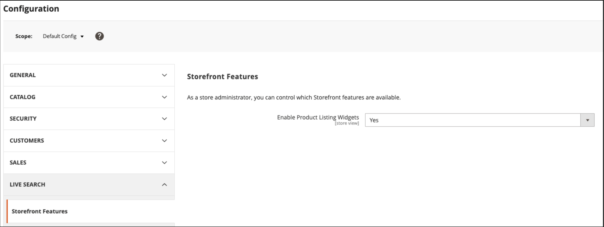

# [!DNL Live Search] で成功するための設定

Adobe Commerce [!DNL Live Search] と [[!DNL Catalog Service]](../catalog-service/guide-overview.md) は連携して、パフォーマンスが高く関連性の高い直感的な検索ソリューションを提供し、顧客が必要なものを正確かつ迅速に見つけられるようにします。 特に、[!DNL Catalog Service] は、使用する [!DNL Live Search] など、SaaS サービスのカタログデータを表示します。

この記事では、[!DNL Live Search] を使用して [!DNL Catalog Service] を実装する手順を説明します。

## オーディエンス

この記事は、Adobe Commerce インスタンスのインストールと設定を担当するデベロッパーまたはシステムインテグレーターを対象としています。

## 要件

- [Adobe Commerce](https://business.adobe.com/products/magento/magento-commerce.html) 2.4.4 以降
- PHP 8.1、8.2、または 8.3
- [!DNL Composer]
- Cron ジョブとインデクサーの実行

>[!IMPORTANT]
>
>[!DNL Live Search] を実装する前に、[ 境界と制限 ](boundaries-limits.md) の節を参照して、ビジネスニーズに適合する [!DNL Live Search] とを確認してください。

## 重要な更新

- [!DNL Live Search] 3.0.2 の時点では、[!DNL Catalog Service] 拡張機能はインストールにバンドルされています。

- 2023 年 8 月のElasticsearch 7 のサポート終了のお知らせに伴い、Adobeでは、Adobe Commerceのすべてのお客様に OpenSearch 2.x 検索エンジンに移行することをお勧めします。 製品のアップグレード中に検索エンジンを移行する方法については、[ アップグレード ガイド ](https://experienceleague.adobe.com/en/docs/commerce-operations/upgrade-guide/prepare/opensearch-migration) の _OpenSearch への移行_ を参照してください。

## サポートされるプラットフォーム

- クラウド上のAdobe Commerce（ECE） :2.4.4 以降
- Adobe Commerce オンプレミス（EE） :2.4.4 以降

## ワークフローの概要

大まかに言えば、オンボーディング [!DNL Live Search] では、次の操作が必要です。

1. [ 拡張機能の ](#1-install-the-live-search-extension) インストール [!DNL Live Search]
1. API キーの [ 設定 ](#2-configure-api-keys)
1. カタログデータの [ 同期 ](#3-sync-your-catalog-data)
1. カタログ データがエクスポートされたことを [ 確認 ](#4-verify-that-the-data-was-exported) します
1. データ [](#5-configure-the-data) 設定）
1. [ テスト ](#6-test-the-connection) 接続
1. イベントでデータがキャプチャされていることを [ 確認 ](#7-validate-events-are-capturing-data) します
1. ストアフロントの [ カスタマイズ ](#8-customize-for-your-storefront)

## &#x200B;1. [!DNL Live Search] 拡張機能をインストールする

[!DNL Live Search] は、[Adobe Marketplace} から {Composer](https://commercemarketplace.adobe.com/magento-live-search.html) を通じて拡張機能と [ てインストールさ ](https://getcomposer.org/) ます。 [!DNL Live Search] をインストールして設定すると、Adobe [!DNL Commerce] は検索とカタログデータの SaaS サービスとの共有を開始します。 この時点で、*管理者* ユーザーは、検索ファセット、同義語およびマーチャンダイジングルールの設定、カスタマイズおよび管理を行うことができます。

>[!BEGINTABS]

>[!TAB  新しいCommerce インスタンス ]

新しいCommerce インスタンスに [!DNL Live Search] をインストールする場合は、次の手順に従います。

1. [cron ジョブ ](https://experienceleague.adobe.com/en/docs/commerce-operations/configuration-guide/cli/configure-cron-jobs) と [ インデクサー ](https://experienceleague.adobe.com/en/docs/commerce-admin/systems/tools/index-management) が実行中であることを確認します。

1. Composer を使用して、Live Search モジュールをプロジェクトに追加します。

   ```bash
   composer require magento/live-search --no-update
   ```

1. 依存関係を更新し、拡張機能をインストールします。

   ```bash
   composer update magento/live-search --with-dependencies
   ```

1. [!DNL OpenSearch] および関連モジュールを一時的に無効にして、[!DNL Live Search] をインストールします。

   ```bash
   bin/magento module:disable Magento_ Magento_Elasticsearch8 Magento_Elasticsearch7 Magento_OpenSearch Magento_ElasticsearchCatalogPermissions Magento_InventoryElasticsearch Magento_ElasticsearchCatalogPermissionsGraphQl
   ```

   [!DNL Elasticsearch] サービス [!DNL Live Search]、バックグラウンドでカタログデータとインデックス製品を同期している間、はストアフロントからの検索要求を引き続き管理します。

1. アップデートをインストールします。

   ```bash
   bin/magento setup:upgrade
   ```

1. 次の [ インデクサー ](https://experienceleague.adobe.com/en/docs/commerce-admin/systems/tools/index-management) が「スケジュールに従って更新」に設定されていることを確認します。

   - 製品フィード
   - 製品バリアントフィード
   - カタログ属性フィード
   - 製品価格フィード
   - Scopes Web サイトデータフィード
   - 範囲顧客グループデータフィード
   - カテゴリフィード
   - カテゴリ権限フィード

インデクサーを検証したら、次の手順は [API キーを設定 ](#2-configure-api-keys) します。

>[!TAB  既存のCommerce インスタンス ]

既存のCommerce インスタンスに [!DNL Live Search] をインストールする場合は、次の手順に従います。

1. [cron ジョブ ](https://experienceleague.adobe.com/en/docs/commerce-operations/configuration-guide/cli/configure-cron-jobs) と [ インデクサー ](https://experienceleague.adobe.com/en/docs/commerce-admin/systems/tools/index-management) が実行中であることを確認します。

1. Composer を使用して、Live Search モジュールをプロジェクトに追加します。

   ```bash
   composer require magento/live-search --no-update
   ```

1. 依存関係を更新し、拡張機能をインストールします。

   ```bash
   composer update magento/live-search --with-dependencies
   ```

1. ストアフロントの検索結果を提供する [!DNL Live Search] モジュールを無効にします。

   ```bash
   bin/magento module:disable Magento_LiveSearchAdapter Magento_LiveSearchStorefrontPopover Magento_LiveSearchProductListing
   ```

   [!DNL Elasticsearch] サービス [!DNL Live Search]、バックグラウンドでカタログデータとインデックス製品を同期している間、はストアフロントからの検索要求を引き続き管理します。

1. アップデートをインストールします。

   ```bash
   bin/magento setup:upgrade
   ```

1. 次の [ インデクサー ](https://experienceleague.adobe.com/en/docs/commerce-admin/systems/tools/index-management) が「スケジュールに従って更新」に設定されていることを確認します。

   - 製品フィード
   - 製品バリアントフィード
   - カタログ属性フィード
   - 製品価格フィード
   - Scopes Web サイトデータフィード
   - 範囲顧客グループデータフィード
   - カテゴリフィード
   - カテゴリ権限フィード

1. [!DNL Live Search] 拡張機能を有効にし、[!DNL OpenSearch] （Magento Elasticsearchおよび OpenSearch モジュール）を無効にします。

   ```bash
   bin/magento module:enable Magento_LiveSearchAdapter Magento_LiveSearchStorefrontPopover  Magento_LiveSearchProductListing
   ```

   ```
   bin/magento module:disable Magento_Elasticsearch Magento_Elasticsearch6 Magento_Elasticsearch7 Magento_Elasticsearch8 Magento_OpenSearch Magento_ElasticsearchCatalogPermissions Magento_InventoryElasticsearch Magento_ElasticsearchCatalogPermissionsGraphQl
   ```

   >[!NOTE]
   >
   >disable コマンドには、OpenSearch をサポートするCommerce モジュールのリストが含まれています。 Commerce インスタンスにモジュールがインストールされていない場合は、`module does not exist` エラーが表示されます。

1. アップデートをインストールします。

   ```bash
   bin/magento setup:upgrade
   ```

インデクサーを検証したら、次の手順は [API キーを設定 ](#2-configure-api-keys) します。

>[!ENDTABS]

### [!DNL Live Search] ベータ版のインストール

>[!IMPORTANT]
>
>次の機能はベータ版です。 ベータ版に参加するには、[commerce-storefront-services](mailto:commerce-storefront-services@adobe.com) にメールリクエストを送信します。

このベータ版では、[`productSearch` の 3 つの新しい機能が ](https://developer.adobe.com/commerce/webapi/graphql/schema/live-search/queries/product-search/) クエリでサポートされています。

- **レイヤー検索** – 別の検索コンテキスト内の検索 – この機能を使用すると、検索クエリを最大 2 つのレイヤーで検索できます。 例：

   - **レイヤー 1 検索** - 「product_attribute_1」で「motor」を検索します。
   - **レイヤー 2 検索** – 「product_attribute_2」の「品番 123」を検索します。 この例では、「motor」の結果に含まれる「part number 123」を検索します。

  レイヤー検索は、以下に説明するように、`startsWith` 検索インデックスと `contains` 検索インデックスの両方で使用できます。

- **startsWith 検索インデックス付け** - `startsWith` インデックス付けを使用して検索します。 この新機能により、次のことが可能になります。

   - 属性値が特定の文字列で始まる製品の検索。
   - 「次で終わる」検索の設定による、買い物客での属性値が特定の文字列で終わる製品の検索。 「次で終わる」検索を有効にするには、製品属性を逆に取り込む必要があり、API 呼び出しも逆の文字列にする必要があります。

- **contains search indexation** -contains indexation を使用して属性を検索します。 この新機能により、次のことが可能になります。

   - 大きい文字列内でのクエリの検索。 例えば、買い物客が「HAPE-123」という文字列で製品番号「PE-123」を検索するとします。

     >[!NOTE]
     >
     >この検索タイプは、オートコンプリート検索を実行する既存の [ フレーズ検索 ](https://developer.adobe.com/commerce/webapi/graphql/schema/live-search/queries/product-search/#phrase) とは異なります。 例えば、製品属性値が「outdoor pants」の場合、フレーズ検索は「out pan」に対する応答を返しますが、「or ants」に対する応答は返しません。 ただし、「を含む」検索では、「または ants」に対する応答が返されます。

これらの新しい条件により、検索クエリのフィルタリングメカニズムが強化され、検索結果を絞り込むことができます。 これらの新しい条件は、メインの検索クエリには影響しません。

これらの新しい条件は、検索結果ページに実装できます。 例えば、ページに新しいセクションを追加して、買い物客が検索結果をさらに絞り込めるようにすることができます。 買い物客が「製造元」、「部品番号」、「説明」など、特定の製品属性を選択できるようにすることができます。 そこから、`contains` 条件または `startsWith` 条件を使用して、これらの属性内を検索します。 検索可能な [ 属性 ](https://experienceleague.adobe.com/en/docs/commerce-admin/catalog/product-attributes/attributes-input-types) のリストについては、管理ガイドを参照してください。

1. ベータ版をインストールするには、次の依存関係をプロジェクトに追加します。

   ```bash
   composer require magento/module-live-search-search-types:"^1.0.0-beta1"
   ```

1. 変更をコミットして `composer.json` にプッシュし、ファイル `composer.lock` クラウドプロジェクトにプッシュします。 [学習を増やす](https://experienceleague.adobe.com/en/docs/commerce-cloud-service/user-guide/configure-store/extensions#upgrade-an-extension)。

   このベータ版では、管理者に **[!UICONTROL Search types]**、**[!UICONTROL Autocomplete]**、**[!UICONTROL Contains]** の **[!UICONTROL Starts with]** チェックボックスが追加されています。 また、[`productSearch`](https://developer.adobe.com/commerce/webapi/graphql/schema/live-search/queries/product-search/#filtering-using-search-capability) GraphQL API を更新して、これらの新しい検索機能を組み込みます。

1. 管理者で、検索可能にする [ 製品属性を設定する ](https://experienceleague.adobe.com/en/docs/commerce-admin/catalog/product-attributes/product-attributes-add#step-5-describe-the-storefront-properties) と、その属性の検索機能を指定します。例えば、**次を含む** （デフォルト）や **次で始まる** などです。 **Contains** に対して有効にする属性を最大 6 つ指定し、**Starts with** に対して有効にする属性を最大 6 つ指定できます。 ベータ版の場合、管理者はこの制限を強制しませんが、API 検索では強制されます。

   

1. 新しい [ および ](https://developer.adobe.com/commerce/webapi/graphql/schema/live-search/queries/product-search/#filtering-using-search-capability) の検索機能を使用して [!DNL Live Search] API 呼び出しを更新する方法については、`contains` 開発者向けドキュメント `startsWith` を参照してください。

### フィールドの説明

| フィールド | 説明 |
|--- |--- |
| `Autocomplete` | デフォルトで有効になっており、変更できません。 `Autocomplete` では、`contains` 検索フィルター [ で ](https://developer.adobe.com/commerce/webapi/graphql/schema/live-search/queries/product-search/#filtering) を使用できます。 ここで、`contains` の検索クエリは、オートコンプリートタイプの検索応答を返します。 Adobeでは、通常 50 文字を超える説明フィールドに、このタイプの検索を使用することをお勧めします。 |
| `Contains` | オートコンプリート検索ではなく、真の「文字列に含まれるテキスト」検索を有効にします。 `contains` 検索フィルター [ で ](https://developer.adobe.com/commerce/webapi/graphql/schema/live-search/queries/product-search/#filtering-using-search-capability) を使用します。 詳しくは、[ 制限事項 ](https://developer.adobe.com/commerce/webapi/graphql/schema/live-search/queries/product-search/#limitations) を参照してください。 |
| `Starts with` | 特定の値で始まるクエリ文字列。 `startsWith` 検索フィルター [ で ](https://developer.adobe.com/commerce/webapi/graphql/schema/live-search/queries/product-search/#filtering-using-search-capability) を使用します。 |

## &#x200B;2. API キーの設定

Adobe Commerce API キーとそれに関連する秘密鍵は、Adobe Commerceのインストールに接続する [!DNL Live Search] めに必要です。 API キーは、[!DNL Commerce] のライセンス所有者のアカウントで生成および管理され、開発者またはシステムインテグレーターと共有できます。 その後、開発者は、ライセンス所有者に代わって SaaS データスペースを作成および管理できます。 既に一連の API キーがある場合は、それらを再生成する必要はありません。

API キーを設定する方法については、[Commerce サービスコネクタ ](../landing/saas.md) の記事を参照してください。

## &#x200B;3. カタログデータを同期する

[!DNL Live Search] は、カタログデータをAdobeの SaaS インフラストラクチャに移動します。 データにインデックスが作成され、検索結果はこのインデックスからストアフロントに直接配信されます。 サイズと複雑さに応じて、インデックス作成に 30 分から数時間かかる場合があります。

カタログ データを SaaS サービスに初期同期するには、次のコマンドをこの順序で実行します。

```bash
bin/magento saas:resync --feed productattributes
bin/magento saas:resync --feed products
bin/magento saas:resync --feed scopesCustomerGroup
bin/magento saas:resync --feed scopesWebsite
bin/magento saas:resync --feed prices
bin/magento saas:resync --feed productoverrides
bin/magento saas:resync --feed variants
bin/magento saas:resync --feed categories
bin/magento saas:resync --feed categoryPermissions
```

これらのコマンドを実行すると、カタログ データの SaaS サービスへの初期同期が開始されます。

>[!WARNING]
>
>同期中は、検索およびカテゴリ参照操作を使用できません。 カタログのサイズによっては、この処理に 1 時間以上かかる場合があります。

### 同期の進行状況の監視

[ データ管理ダッシュボード ](https://experienceleague.adobe.com/en/docs/commerce-admin/systems/data-transfer/data-dashboard) を使用して、同期の進行状況を監視します。 このダッシュボードは、ストアフロントでの製品データの可用性に関する貴重なインサイトを提供し、顧客に迅速に表示できるようにします。


また、[Commerce CLI](../data-export/data-export-cli-commands.md#troubleshooting) およびデータ書き出し拡張機能のログを使用して、同期コマンドを実行し、同期プロセスのトラブルシューティングを行うこともできます。

#### 今後の製品アップデート

初回同期後、製品の増分更新がストアフロント検索で使用できるようになるまで最大 15 分かかる場合があります。 詳しくは、インデックス作成ドキュメントの [ 製品アップデートのストリーミング ](indexing.md) を参照してください。

## &#x200B;4. データが書き出されたことを確認する

カタログデータがAdobe Commerceから書き出され、[!DNL Live Search] と同期されているかどうかを確認するには、次のいずれかの方法を使用します。

- 次の表のエントリを探します。

   - `cde_products_feed`
   - `cde_product_attributes_feed`

  >[!NOTE]
  >
  >`table does not exist` エラーが発生した場合は、`catalog_data_exporter_products` テーブルと `catalog_data_exporter_product_attributes` テーブルでエントリを探します。 これらのテーブル名は、4.2.1 より前の [!DNL Live Search] バージョンで使用されます。

- [GraphQL playground](https://experienceleague.adobe.com/en/docs/commerce/live-search/live-search-admin/graphql) をデフォルトのクエリで使用して（詳しくは [GraphQL リファレンス ](https://developer.adobe.com/commerce/webapi/graphql/schema/live-search/) を参照）、次の点を確認してください。

   - 返される製品数は、ストア表示で期待される数に近くなります。
   - ファセットが返されます。

その他のヘルプについては、サポートナレッジベースの [[!DNL Live Search]  同期されていないカタログ ](https://experienceleague.adobe.com/en/docs/commerce-knowledge-base/kb/troubleshooting/miscellaneous/live-search-catalog-data-sync) を参照してください。

## &#x200B;5. データを設定する

製品データを正しく設定すると、顧客に適した検索結果が得られます。 このセクションでは、製品リストウィジェットを有効にし、カテゴリを割り当てます。

### 製品リストウィジェットの有効化

[!DNL Live Search] 4.0.0 以降をインストールすると、製品リストへのウィジェットはデフォルトで有効になります。 ウィジェットを有効にすると、検索結果やカテゴリ参照製品リストページに別の UI コンポーネントが使用されます。 この UI コンポーネントは、[Catalog Service API](https://developer.adobe.com/commerce/webapi/graphql/schema/live-search/queries/product-search/) を直接呼び出すことで、応答時間を短縮します。

バージョン 4.0.0 以降の [!DNL Live Search] がある場合は、手動で製品一覧ウィジェットを有効にする必要があります。

1. *管理者* から、**[!UICONTROL Stores]**/_[!UICONTROL Settings]_/**[!UICONTROL Configuration]**に移動します。
1. 「**[!UICONTROL Live Search]**」で、「**[!UICONTROL Storefront Features]**」を選択します。
1. **[!UICONTROL Enable Product Listing Widgets]** を `Yes` に設定します。

   

この設定を変更すると、`Page cache is invalidated` というメッセージが表示されます。 Magentoのキャッシュをフラッシュして、変更内容を保存する必要があります。

1. 次のいずれかの操作を行って、[ キャッシュ管理 ](https://experienceleague.adobe.com/en/docs/commerce-admin/systems/tools/cache-management) ページにアクセスします。

   - ワークスペースの上にあるメッセージ内の「**[!UICONTROL Cache Management]**」リンクをクリックします。
   - _管理者_ サイドバーで、**[!UICONTROL System]**/_[!UICONTROL Tools]_/**[!UICONTROL Cache Management]**に移動します。

1. **Configuration**[!UICONTROL Cache Type] を選択し、「**[!UICONTROL Flush Magento Cache]**」をクリックします。

   ストアフロントに対する変更は、キャッシュをフラッシュした直後に行われます。

### カテゴリの割り当て

[!DNL Live Search] で返された製品は、[ カテゴリ ](https://experienceleague.adobe.com/en/docs/commerce-admin/catalog/categories/categories) に割り当てられている必要があります。 例えば Luma では、製品が「男性」、「女性」、「歯車」などのカテゴリに分類されます。 サブカテゴリも「トップス」、「ボトムス」、「ウォッチポイント」に設定されます。 これらのカテゴリの割り当てにより、フィルタリング時の精度が向上します。

## 6.接続をテストする

カタログデータを SaaS にして、テストを行い、次のシナリオで製品データが返されることを確認します。

- [!UICONTROL Search] ボックスは正しく結果を返します
- カテゴリの参照で結果が正しく返される
- ファセットは、検索結果ページでフィルターとして使用できます

すべてが正しく動作している場合は、[!DNL Live Search] がインストールされ、接続され、使用できる状態になっています。

ストアフロントで問題が発生した場合は、`var/log/system.log` ファイルで API 通信の失敗やサービス側のエラーを確認します。

ファイアウォールを通過する [!DNL Live Search] を許可するには、`commerce.adobe.io` を許可リストに追加します。

## &#x200B;7. イベントでデータが取り込まれていることを確認する

サイトにデプロイしたストアフロントイベントが機能していることを確認します。 このチェックは、ヘッドレス実装で特に重要です。

- リク [ ストに必要な ](events.md) イベント [!DNL Live Search] を確認します。
- [[!DNL Live Search]  ダッシュボード ](performance.md) に非実稼動環境のデータが表示されていることを確認します。
- [ イベント コレクションの検証 ](../product-recommendations/verify.md). このページは [!DNL Product Recommendations] ガイドですが、検証手順は [!DNL Live Search] にも適用されます。

## &#x200B;8. ストアフロントに合わせたカスタマイズ

[!DNL Live Search] 拡張機能のインストール、データの同期、検証および設定が完了していること。 次の手順では、[!DNL Live Search] ウィジェットがストアのルックアンドフィールに合っていることを確認します。

ポップオーバーウィジェットと PLP ウィジェットのスタイルを設定するには、必要に応じてカスタム CSS ルールを定義します。 [ ポップオーバー要素のスタイル設定 ](storefront-popover.md#styling-popover-example) および [ 製品一覧表示ページウィジェット ](plp-styling.md#styling-example) を参照してください。

ウィジェットの機能を拡張する場合は、各のソースコードを公開リポジトリで入手できます。
このシナリオでは、独自のニーズに合わせてJavaScriptをカスタマイズし、カスタムコードを CDN でホストできます。 このカスタムスクリプトは、[!DNL Live Search] サービスと通信し、通常と同様の結果を返すので、ウィジェットの機能を制御できます。

- [PLP ウィジェットリポジトリ ](https://github.com/adobe/storefront-product-listing-page)
- [ 検索バーのリポジトリ ](https://github.com/adobe/storefront-search-as-you-type)

## [!DNL Live Search] を更新中

[!DNL Live Search] を更新する前に、Composer を使用してインストールされている [!DNL Live Search] のバージョンを確認します。

```bash
composer show magento/module-live-search | grep version
```

[!DNL Live Search] を更新するには、コマンドラインから次のコマンドを実行します。

```bash
composer update magento/live-search --with-dependencies
```

3.1.1 から 4.0.0 などのメジャーバージョンにアップデートするには、プロジェクトのルート [!DNL Composer] `.json` ファイルを次のように編集します。

1. 現在インストールされている `magento/live-search` のバージョンが `3.1.1` 以下で、バージョン `4.0.0` 以降にアップグレードする場合は、アップグレードの前に次のコマンドを実行します。

   ```bash
   bin/magento module:enable Magento_AdvancedSearch
   ```

   現在インストールされている `magento/live-search` バージョンについて詳しくは、次のコマンドを実行してください。

   ```bash
   composer show magento/live-search
   ```

1. ルート `composer.json` ファイルを開き、`magento/live-search` を検索します。

1. `require` セクションで、バージョン番号を次のように更新します。

   ```json
   "require": {
      ...
      "magento/live-search": "^4.0",
      ...
    }
   ```

1. 保存 `composer.json` ます。 コマンドラインから次のコマンドを実行します。

   ```bash
   composer update magento/live-search --with-dependencies
   ```

## [!DNL Live Search] のアンインストール

[!DNL Live Search] をアンインストールするには、[ モジュールのアンインストール ](https://experienceleague.adobe.com/en/docs/commerce-operations/installation-guide/tutorials/uninstall-modules) を参照してください。

## [!DNL Live Search] パッケージ

[!DNL Live Search] 拡張機能は、次のパッケージで構成されています。

| パッケージ | 説明 |
|--- |--- |
| `module-live-search` | を使用すると、マーチャントは、ファセット、同義語、クエリルールなどの検索設定を指定したり、読み取り専用のGraphQL プレイグラウンドにアクセスして *Admin* からクエリをテストしたりできます。 |
| `module-live-search-adapter` | 検索リクエストをストアフロントから [!DNL Live Search] サービスにルーティングし、結果をストアフロントにレンダリングします。 <br />- カテゴリの参照 – ストアフロント [ 上部のナビゲーション ](https://experienceleague.adobe.com/en/docs/commerce-admin/catalog/catalog/navigation/navigation-top) から検索サービスにリクエストをルーティングします。<br />- グローバル検索 – 「[ クイック検索 ](https://experienceleague.adobe.com/en/docs/commerce-admin/catalog/catalog/search/search)」フィールドからリク [!DNL Live Search] ストを配信サービスにルーティングします。 クイック検索フィールドは、ストアフロントページの右上隅にあります。 |
| `module-live-search-storefront-popover` | 「入力中に検索」ポップオーバーは、標準のクイック検索に代わるもので、上位の検索結果のデータとサムネールを返します。 |

## [!DNL Live Search] 依存関係

[!DNL Composer] 拡張機能をインストールするための [!DNL Live Search] メタパッケージには、次のモジュール依存関係が含まれています。

- `magento/module-saas-catalog`
- `magento/module-saas-category`
- `magento/module-saas-category-permissions`
- `magento/module-saas-product-override`
- `magento/module-saas-product-variant`
- `magento/module-saas-price`
- `magento/module-saas-scopes`
- `magento/module-bundle-product-data-exporter`
- `magento/module-catalog-inventory-data-exporter`
- `magento/module-catalog-url-rewrite-data-exporter`
- `magento/module-configurable-product-data-exporter`
- `magento/module-parent-product-data-exporter`
- `magento/module-gift-card-product-data-exporter`
- `magento/module-bundle-product-override-data-exporter`
- `data-services`
- `services-id`

## 高度な概念

以下のセクションでは、[!DNL Live Search] と [!DNL Catalog Service] を使用する際の、より高度なトピックを示します。

### エンドポイント

[!DNL Live Search] は、`https://catalog-service.adobe.io/graphql` のエンドポイントを介して通信します。

[!DNL Live Search] は全製品データベースにアクセスできないので、[!DNL Live Search] GraphQL API とCommerce Core GraphQL API は同等ではありません。

Adobeでは、SaaS API （特にカタログサービスエンドポイント）を直接呼び出すことをお勧めします。

- Commerce データベース/Graphql プロセスをバイパスすることで、パフォーマンスを向上させ、プロセッサー負荷を軽減します。
- [!DNL Catalog Service] フェデレーションを活用して、1 つのエンドポイントから [!DNL Live Search]、[!DNL Catalog Service]、[!DNL Product Recommendations] を呼び出します。

一部のユースケースでは、製品の詳細や同様のケースについては、[!DNL Catalog Service] に問い合わせることをお勧めします。 詳細については、「[refineProduct](https://developer.adobe.com/commerce/webapi/graphql/schema/catalog-service/queries/refine-product/)」を参照してください。

カスタムヘッドレス実装がある場合は、[!DNL Live Search] のリファレンス実装を確認してください。

- [PLP ウィジェット ](https://github.com/adobe/storefront-product-listing-page)
- [[!DNL Live Search]  フィールド ](https://github.com/adobe/storefront-search-as-you-type)

検索アダプター、Luma ウィジェット、AEM CIF ウィジェットなどの標準コンポーネントを使用しない場合、ユーザーインタラクションデータの自動収集はデフォルトでは機能しません。 Adobe Senseiでは、この収集されたデータを使用して、インテリジェントなマーチャンダイジングとパフォーマンスのトラッキングを行います。 この問題を解決するには、このデータ収集をヘッドレスで実装するカスタムソリューションを開発する必要があります。

[!DNL Live Search] の最新バージョンでは、既に [!DNL Catalog Service] が使用されています。

### 言語サポート

[!DNL Live Search] ウィジェットは次の言語をサポートしています。

|  |  |  |  |
|--- |--- |--- |--- |
| 言語 | 地域 | 言語コード | Magento ロケール |
| ブルガリア語 | ブルガリア | bg_BG | bg_BG |
| カタルニア語 | スペイン | ca_ES | ca_ES |
| チェコ語 | チェコ共和国 | cs_CZ | cs_CZ |
| デンマーク語 | デンマーク | da_DK | da_DK |
| ドイツ語 | ドイツ | de_DE | de_DE |
| ギリシャ語 | ギリシャ | el_GR | el_GR |
| 英語 | 英国 | en_GB | en_GB |
| 英語 | 米国 | en_US | en_US |
| スペイン語 | スペイン | es_ES | es_ES |
| エストニア語 | エストニア | et_EE | et_EE |
| バスク語 | スペイン | eu_ES | eu_ES |
| ペルシャ語 | イラン | fa_IR | fa_IR |
| フィンランド語 | フィンランド | fi_FI | fi_FI |
| フランス語 | フランス | fr_FR | fr_FR |
| ガリシア語 | スペイン | gl_ES | gl_ES |
| ヒンディー語 | インド | hi_IN | hi_IN |
| ハンガリー語 | ハンガリー | hu_HU | hu_HU |
| インドネシア | インドネシア | id_ID | id_ID |
| イタリア語 | イタリア | it_IT | it_IT |
| 韓国語 | 韓国 | ko_KR | ko_KR |
| リトアニア語 | リトアニア | lt_LT | lt_LT |
| ラトビアン | ラトビア | lv_LV | lv_LV |
| ノルウェー語 | ノルウェーブークマル | nb_NO | nb_NO |
| オランダ語 | オランダ | nl_NL | nl_NL |
| ポーランド語 | ポーランド | pl_PL | pl_PL |
| ポルトガル語 | ブラジル | pt_BR | pt_BR |
| ポルトガル語 | ポルトガル | pt_PT | pt_PT |
| ルーマニア語 | ルーマニア | ro_RO | ro_RO |
| ロシア | ロシア | ru_RU | ru_RU |
| スウェーデン語 | スウェーデン | 参照（_S） | 参照（_S） |
| タイ語 | タイ | th_TH | th_TH |
| トルコ語 | トルコ | tr_TR | tr_TR |
| 中国語 | 中国 | zh_CN | zh_Hans_CN |
| 中国語 | 台湾 | zh_TW | zh_Hant_TW |

Commerce管理者の言語設定がサポートされている言語と一致することが検出された場合、デフォルトではその言語に設定されます。 それ以外の場合、ウィジェットのデフォルト値は英語になります。 管理者で、_[!UICONTROL Stores]_/[!UICONTROL Settings]/_[!UICONTROL Configuration]_/_[!UICONTROL General]_/[!UICONTROL Country Options] に移動して、言語設定を指定します。

また、管理者は [ 検索インデックス ](settings.md#language) の言語を設定して、検索結果を向上させることもできます。

### ウィジェットコードリポジトリー

製品一覧表示ページウィジェットと [!DNL Live Search] フィールドウィジェットのコードは、GitHub からダウンロードできます。

コードにアクセスできる開発者は、その動作と外観を完全にカスタマイズできます。 独自のサーバーでコードをホストしますが、[!DNL Live Search] サービスは引き続き使用します。

- [PLP ウィジェット ](https://github.com/adobe/storefront-product-listing-page)
- [ 検索バー ](https://github.com/adobe/storefront-search-as-you-type)

### データエクスポート拡張機能

[!DNL Live Search] を有効にすると、データの書き出し拡張機能によって、Commerce アプリケーションと [!DNL Live Search] の間でCommerce データが同期されます。 このプロセスにより、最新のCommerce データをストアフロントで確実に利用できるようになります。 管理者では、データ管理ダッシュボードを使用して同期ステータスを確認できます。 Commerce CLI とログを使用して、データのエクスポートプロセスを管理およびトラブルシューティングできます。 詳しくは、[ データの書き出しガイド ](../data-export/overview.md) を参照してください。

### Inventory management

[!DNL Live Search] は、Commerce（旧称：マルチSourceインベントリ、MSI）で [Inventory management](https://experienceleague.adobe.com/en/docs/commerce-admin/inventory/introduction) 機能をサポートしています。 完全なサポートを有効にするには、依存関係モジュールをバージョン 102.2.0 以降に [ 更新 ](install.md#updating-live-search) する必要 `commerce-data-export` あります。

[!DNL Live Search] は、商品がInventory management内で使用可能かどうかを示すブール値を返しますが、どのソースが在庫を持っているかに関する情報は含まれません。

### 価格インデクサー

[!DNL Live Search] のお客様は、より迅速な価格変更アップデートと同期時間を提供する [SaaS 価格インデクサー ](../price-index/price-indexing.md) を使用できます。

### 価格サポート

[!DNL Live Search] ウィジェットは、Adobe Commerceでサポートされている価格タイプの大半をサポートしていますが、すべての価格タイプをサポートしているわけではありません。

現在、基本価格がサポートされています。 サポートされていない高度な価格は次のとおりです。

- コスト
- 広告の最低価格

より複雑な価格計算については、[API メッシュ ](../catalog-service/mesh.md) を参照してください。

価格フォーマットは、Commerce インスタンス内の次のロケール設定をサポートしています。*ストア* /設定/ *設定* /一般/ *一般* / ローカルオプション / ロケール

### ヘッドレスストアフロントのサポート

オプションで、アプリケーションの既存のGraphQL範囲を拡張する `module-data-services-graphql` モジュールをインストールし、ストアフロントの行動データ収集に必要なフィールドを含める必要が生じる場合があります。

```bash
composer require magento/module-data-services-graphql
```

このモジュールは、GraphQL クエリにコンテキストを追加します。

- `dataServicesStorefrontInstanceContext`
- `dataServicesMagentoExtensionContext`
- `dataServicesStoreConfigurationContext`

### B2B サポート

[!DNL Live Search] では、追加の [ 制限事項 ](https://experienceleague.adobe.com/en/docs/commerce-admin/b2b/guide-overview) を追加して [](boundaries-limits.md#b2b-and-category-permissions)B2B 機能をサポートしています。

### PWA サポート

[!DNL Live Search] はPWA Studioで動作しますが、他のCommerceの実装と比較すると、わずかな違いがあります。 検索や製品リストのページなどの基本的な機能は Venia で機能しますが、Graphql の一部の並べ替えが正しく機能しない場合があります。 パフォーマンスの違いもあります。

- [!DNL Live Search] の現在のPWA実装では、検索結果を返すのにネイティブのCommerce ストアフロントよりも多くの処理時間 [!DNL Live Search] 必要です。
- PWAの [!DNL Live Search] は、[ イベント処理 ](https://developer.adobe.com/commerce/services/shared-services/storefront-events/sdk/) をサポートしていません。 その結果、検索レポートとインテリジェントマーチャンダイジングがPWAのストアフロントで機能しません。
- [PWA Studio](https://developer.adobe.com/commerce/pwa-studio/) を使用する場合、GraphQLは `description`、`name`、`short_description` に対する直接フィルタリングをサポートしていませんが、これらのフィールドはより一般的なフィルターで返すことができます。

PWA Studioで [!DNL Live Search] を使用する場合、インテグレーターは次の要件も満たす必要があります。

1. [livesearch-storefront-utils](https://www.npmjs.com/package/@magento/ds-livesearch-storefront-utils) をインストールします。
1. `environmentId` オブジェクトに `storeDetails` を設定します。

   ```javascript
   const storeDetails: StoreDetailsProps = {
       environmentId: <Storefront_ID>,
       websiteCode: "base",
       storeCode: "main_website_store",
       storeViewCode: "default",
       searchUnitId: searchUnitId,
       config: {
           minQueryLength: 5,
           pageSize: 8,
           currencySymbol: "$",
           },
       };
   ```

### の Cookie

[!DNL Live Search] は、基本機能の一部としてユーザーインタラクションデータを収集し、このデータを保存するために cookie が使用されます。 ユーザー情報を収集する場合、ユーザーは Cookie の保存に同意する必要があります。 [!DNL Live Search] と [!DNL Product Recommendations] はデータストリームを共有するので、同じ cookie メカニズムになります。 詳しくは、[Cookie 制限の処理 ](https://experienceleague.adobe.com/en/docs/commerce/product-recommendations/developer/setting-cookie) を参照してください。
