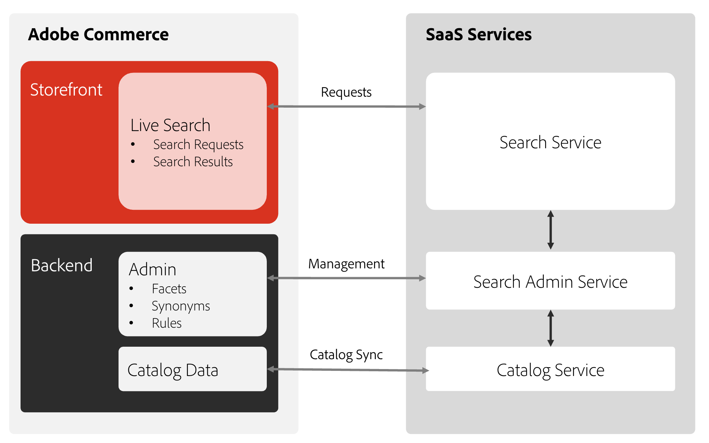
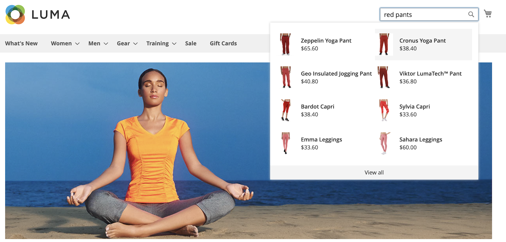
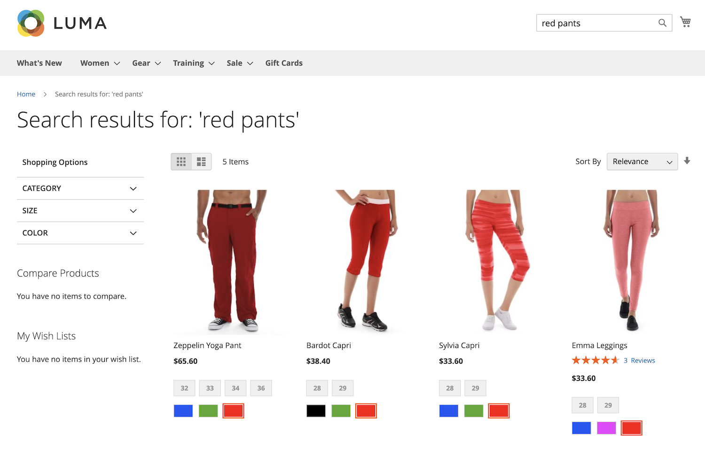

# [!DNL Live Search]とは

[!DNL Live Search]は、Adobe Commerceの標準検索機能に代わる機能です。 [!DNL Live Search]機能を有効にして設定すると、デフォルトの検索テキストフィールドが[!DNL Live Search] テキストフィールドに置き換えられます。 [!DNL Live Search]には、検索結果を閲覧する際に強力なフィルタリング機能を提供する商品リストページ （PLP） ウィジェットも含まれています。

[!DNL Live Search]を使用すると、次のことが可能になります。

- 有意義な検索体験を構築し、買い物客や購入者が求めているものを可能な限り容易に見つけられるようにしましょう。
- AIを活用した動的ファセット処理と、セッション中の買い物客の行動に応じた検索結果のランキング付けを活用できます。
- 軽量なSaaS ベースのサービスを利用して、容易にアップデートでき、ライセンスに含まれているため、総所有コストを削減できます。
- GraphQL API、ヘッドレスの柔軟性、API サンドボックス環境、超高速のSaaSを有効にすることで、技術的な知識を習得できます。

>[!IMPORTANT]
>
>Adobe Commerceのサイト検索機能なら、複数のオプションが用意されています。 実装する前に、[の境界と制限](boundaries-limits.md)情報を確認して、[!DNL Live Search]がビジネスニーズに適していることを確認してください。

## デザイン

アーキテクチャのAdobe Commerce側では、検索&#x200B;*管理者*&#x200B;のホスト、カタログデータの同期、クエリサービスの実行が含まれます。 [!DNL Live Search]をインストールして設定すると、Adobe Commerceは検索データとカタログデータのSaaS サービスとの共有を開始します。 この時点で、管理者ユーザーは、検索[ ファセット ](facets.md)、[類義語](synonyms.md)、[ マーチャンダイジングルール ](category-merch.md)を設定、カスタマイズ、管理できます。

## クイックツアー

[!DNL Live Search]は、スピード、関連性、使いやすさに重点を置いており、買い物客とマーチャントの両方にとって画期的な機能です。 次のビデオを見て、ストアフロントから[!DNL Live Search]の簡単なツアーを見てください。

>[!VIDEO](https://video.tv.adobe.com/v/3418797?learn=on)

ライブサーチの使用と設定に関する詳細なビデオについては、[ [!DNL Live Search]の](https://experienceleague.adobe.com/en/docs/commerce-learn/tutorials/getting-started/capabilities/live-search-full-demonstration)完全デモを参照してください。

### 入力中に検索

買い物客が[!DNL Live Search]検索[ ボックスにクエリを入力すると、](storefront-popover.md)様が[ ポップオーバー](https://experienceleague.adobe.com/en/docs/commerce-admin/catalog/catalog/search/search)で推奨商品とトップ検索結果のサムネイル画像を返します。 [商品の詳細](https://experienceleague.adobe.com/en/docs/commerce-admin/start/storefront/storefront) ページは、買い物客が推奨商品または特集商品をクリックすると表示されます。 ポップオーバーのフッターに&#x200B;_すべて表示_ リンクが表示され、検索結果ページが表示されます。

[!DNL Live Search]は、2文字以上のクエリに対して「入力中に検索」の結果を返します。 部分一致の場合、1語あたりの最大文字数は20文字です。 クエリ内の文字数は設定できません。 ポップオーバーには、`name`、`sku`、および`category_ids` フィールドが含まれています。

### すべての検索結果を見る

「入力中に検索」クエリによって返されたすべての製品を一覧表示するには、ポップオーバーのフッターで「_すべて表示_」をクリックします。

### [!DNL Live Search]でのタイプミスの処理方法

検索が行われた場合、[!DNL Live Search]は、任意のタイプミスを考慮しないファジー以外の検索を実行します。 結果が見つからない場合、[!DNL Live Search]は2回目のファジィ検索を実行します。これは、小さなタイプミスを考慮します。 ファジィ検索は、最大の編集距離が1で実行されます。 この編集距離では、[Levenshtein distance](https://en.wikipedia.org/wiki/Levenshtein_distance)という概念を使用し、次の3種類の操作を実行できます。

| 操作 | 説明 | 例 |
|---|---|---|
| 挿入 | キャラクターを追加する。 | &quot;cat&quot; -> &quot;cart&quot; |
| 削除 | キャラクターの削除。 | &quot;cart&quot; -> &quot;cat&quot; |
| 代用 | ある文字を別の文字に置き換えます。 | &quot;cart&quot; -> &quot;cast&quot; |

ファジィ検索ロジックに加えて、トランスポーションも考慮されます。つまり、1つの単語に隣接する2つの文字が入れ替わります。例えば、「the」ではなく「the」です。 これらの編集制限は、語句全体ではなく、単語ごとに適用されます。

### ファセットを使用したフィルター検索

フィルター検索では、検索条件として、属性値の複数のディメンション、つまり[ ファセット ](facets.md)を使用します。 フィルターの選択はマーチャントが定義し、返される商品に応じて変更します。最も一般的なファセットはリストの上部にピン留めされています。

ファセットをURL パラメーター`http://yourwebsite.com?color=red`として使用し、ライブ検索はこれらの属性値に基づいて結果をフィルタリングします。

### 同義語

[類義語](synonyms.md)買い物客がカタログ内で使用する単語と異なる単語を含めることで、リーチを拡大し、クエリの焦点をシャープにします。 類義語ディクショナリを微調整することで、買い物客の関心を維持し、購入に至るまでの経路を把握できます。

### マーチャンダイジングルール

マーチャンダイジング [ ルール ](rules.md)は、検索にロジックとイベントを追加するif-then ステートメントを使用して、ショッピング体験を形成します。 プロモーションや季節限定などの期間限定で、商品を簡単に強化したり埋めたりすることができます。

## ライブサーチのコンポーネント

- [!DNL Live Search] [ ポップオーバーウィジェット ](storefront-popover.md)は、検索結果を含む検索フィールドの下に表示されるボックスです。
- [製品リストページ ウィジェット ](plp-styling.md) （PLP）は、ファセットと同義語のサポートを備えた検索可能な製品リストページを提供します。 ウィジェットはLive Search 4.0.0以降にインストールされ、有効になり、検索アダプターに置き換わります。
- （**非推奨**）検索アダプターはPLP ウィジェットの前身であり、ライブサーチ &lt; 4.0.0でインストールされました。4.0.0より前のバージョンのライブサーチを使用している場合、Commerceでは、PLP ウィジェット機能と今後の機能強化のメリットを受け取るためにアップグレードすることをお勧めします。 今後、検索アダプタは、セキュリティの問題に対処するためにのみ更新されます。 PLP ウィジェットへの移行について詳しくは、[移行ガイド ](migrate-to-plp.md)を参照してください。

## [!DNL Live Search] ワークスペース

[!DNL Live Search] [ ワークスペース ](workspace.md)は、管理画面の領域で、類義語、ファセット、カテゴリ マーチャンダイジングなどの[!DNL Live Search]機能を設定します。

## イベント

[!DNL Live Search]では、[ イベント ](https://developer.adobe.com/commerce/services/shared-services/storefront-events/#live-search)を使用して、[ インテリジェントマーチャンダイジング ](category-merch.md)および[ パフォーマンス ](performance.md)のダッシュボードを計算します。 イベントにはデフォルトの実装が用意されています。 ヘッドレスストアフロントのイベントは、手動で有効にする必要があります。

## カタログデータ保持ポリシー

テスト環境でカタログデータの検索クエリを90日間連続して送信しない場合、カタログデータは休止モードに設定され、検索クエリに対してデータは返されません。 実稼動環境内のカタログデータは、このポリシーの影響を受けません。

### 非アクティブなテスト環境

テスト環境でカタログデータを再アクティブ化するには、[ サポートリクエスト ](https://experienceleague.adobe.com/en/docs/commerce-knowledge-base/kb/help-center-guide/magento-help-center-user-guide#experience-league-start-page)を「再アクティブ化[!DNL Live Search]」というタイトルで送信し、環境IDを含めます。 テスト環境のカタログデータは、数時間以内に復元する必要があります。

### 空のカタログ

環境に空のカタログが作成されてから45日後に存在する場合、カタログデータは休止モードに設定され、検索クエリに対してデータは返されません。 これには、実稼動環境とテスト環境の両方が含まれます。

環境でカタログデータを再アクティブ化するには、[ サポートリクエスト ](https://experienceleague.adobe.com/en/docs/commerce-knowledge-base/kb/help-center-guide/magento-help-center-user-guide#experience-league-start-page)を「再アクティブ化[!DNL Live Search]」というタイトルで送信し、環境IDを含めます。 環境内のカタログデータは、数時間以内に復元する必要があります。
