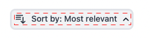
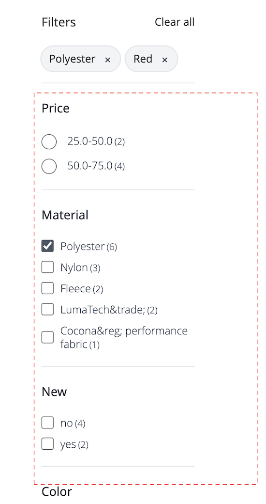

# 製品一覧ページウィジェット

[!DNL Live Search Product Listing Page Widget] （PLP）は、Commerce Services Platform を使用して、パフォーマンスが高く、検索可能で、ファセット可能な商品リストページを提供します。 このトピックでは、PLP ウィジェットを有効にしてスタイルを設定する方法について説明します。

## PLP ウィジェットの有効化

[!DNL Live Search] サービスがインストールされると、デフォルトの検索機能は自動的に [!DNL Live Search] に変換されます。

新規インストールの場合、[!DNL Live Search] PLP ウィジェットはデフォルトで有効になっています。

[!DNL Live Search] をアップグレードしていて、PLP ウィジェットが既にオフになっている場合は、そのままになります。 有効にするには：
1. Adobe Commerce管理者で、Stores → Settings → Configuration に移動します。
1. 左側のナビゲーションで、**[!UICONTROL Live Search]**/**[!UICONTROL Storefront Features]** をクリックします。
1. 「[!UICONTROL Storefront Features]」セクションをクリックします。
1. Set [!UICONTROL Enable Product Listing Widget] = Yes
1. 設定を保存
1. プロンプトが表示されたら、キャッシュをフラッシュします（システム / ツール / キャッシュ管理/ [!UICONTROL Flush Magento Cache] に移動）。

>[!IMPORTANT]
>
>[!DNL Live Search Product Listing Page Widget] が有効になっている場合、商品リストページの並べ替え順の方向を変更できません。

## ウィジェットの機能

PLP ウィジェットには、次の標準機能が用意されています。

- 「買い物かごに追加」ボタン – シンプルな製品でのみ使用できます。
- 製品ごとに複数の画像 – 設定可能な製品に対して別の色を選択すると、画像が変化する場合があります。
- カラースウォッチのサポート – コードを正しく検証するには、color 属性を `color` のように入力する必要があります。

### ウィジェットのカスタマイズ

PLP ウィジェットの標準機能に加え、ウィジェットをさらにカスタマイズして次の機能を含めることができます。

- 属性によるフィルタリング
- 複数言語のサポート
- 価格スライダー

上記の機能を処理するための PLP ウィジェットのカスタマイズ方法については、次の `storefront-product-listing-page` リポジトリ [ の ](https://github.com/adobe/storefront-product-listing-page/) Readme を参照してください。 このリポジトリの Readme には、PLP ウィジェットをカスタマイズし、そのカスタマイズをサイトにデプロイする方法の例が記載されています。

>[!WARNING]
>
>リポジトリ内のコードを使用して PLP ウィジェットをカスタマイズした場合、メンテナンスと必要な更新はユーザーが行う必要があります。 Adobeでリリースされる新しい PLP ウィジェット機能は、カスタマイズされた実装と互換性がない可能性があります。

## スタイル設定の例

[CSS](https://developer.adobe.com/commerce/frontend-core/guide/css/) を使用すると、PLP ウィジェットのルックアンドフィールをサイトに合わせてカスタマイズできます。

>[!NOTE]
>
>Adobe Commerce テーマ内にカスタムクラスを持つ要素は継承されません。 これらの要素は、カスタムクラスに一致する特定のクラスによってターゲットにする必要があります。プライマリアクションクラスは、ウィジェットボタンでは機能しません。 CSS 内の一般的なターゲット要素が継承されます。`button` れはウィジェットボタンに適用されます。

ハイライト表示された div には、ターゲットクラスの `ds-sdk-product-item__product-name` が含まれています。


製品名を大文字にするルールを追加して、製品名をカスタマイズします。

```css
.ds-sdk-product-item__product-name {
 text-transform: uppercase;
}
```


## CSS クラス

### 商品リスト

- `.ds-sdk-product-list`：外側の div
- `.ds-sdk-product-list__grid`：内部 div


#### 製品リストのページネーション

- `.ds-plp-pagination`


- `.ds-plp-pagination_item`


- `.ds-plp-pagination_item--current`


### ウィジェット

- `.ds-widgets`：外側の div
- `.ds-widgets__actions`：左側内側 div
- `.ds-widgets__results`：右側内側 div


### 並べ替えドロップダウン

- `.ds-sdk-sort-dropdown`


- `.ds-sdk-sort-dropdown__button`



- `.ds-sdk-sort-dropdown__items`


- `.ds-sdk-sort-dropdown__items--item`


- `.ds-sdk-sort-dropdown__items--item-selected`


- `.ds-sdk-sort-dropdown__items--item-active`


### ファセット

- `.ds-plp-facets`
- `.ds-plp-facets__header`
- `.ds-plp-facets__header_title`
- `.ds-plp-facets__header__clear-all`

{width="350"}

- `.ds-plp-facets__pills`
- `.ds-sdk-pill`

{width="350"}

- `.ds-sdk-pill__label`
- `.ds-sdk-pill__cta`

{width="350"}

- `.ds-plp-facets__list`

{width="350"}

- `.ds-sdk-input`
- `.ds-sdk-input__label`
- `.ds-sdk-product-item__product-swatch-group`
- `ds-sdk-product-item__product-swatch-item`
- `.ds-sdk-input_fieldset_show-more`


- `.ds-sdk-labelled-input`


- `.ds-sdk-labelled-input__input`
- `.ds-sdk-labelled-input__label`


### 商品品目

- `.ds-sdk-product-item`
- `.ds-sdk-product-item__image`
- `.ds-sdk-product-item__product-name`
- `.ds-sdk-product-item__product-options`
- `.ds-sdk-product-price`
   - `.ds-sdk-product-price--no-discount`
   - `.ds-sdk-product-price--grouped`
   - `.ds-sdk-product-price--bundle`
   - `.ds-sdk-product-price--discount`


### 読み込み

- `.ds-sdk-loading`
- `.ds-sdk-loading__spinner`
- `.ds-sdk-loading__spinner-label`


## PLP ウィジェットの無効化

PLP ウィジェットを無効にするには：

1. **ストア**/設定/**設定**/**[!DNL Live Search]**/**ストアフロント機能** に移動して、**製品リストウィジェットを有効にする** を「いいえ」に設定します。
1. **設定を保存** を選択して、設定を保存します。
