# 製品リストページウィジェット

[!DNL Live Search Product Listing Page Widget] （PLP）は、Commerce サービス プラットフォームを使用して、パフォーマンスが高く、検索可能で、ファセット可能な製品リスト ページを提供します。 このトピックでは、PLP ウィジェットを有効にしてスタイル設定する方法について説明します。

## PLP ウィジェットの有効化

[!DNL Live Search] サービスがインストールされると、デフォルトの検索機能が自動的に[!DNL Live Search]に変換されます。

[!DNL Live Search] PLP ウィジェットは、新規インストールに対してデフォルトで有効になっています。

[!DNL Live Search]をアップグレードする場合、PLP ウィジェットが既にオフになっている場合は、そのまま残ります。

>[!NOTE]
>
>非推奨の検索アダプタから移行する場合は、[移行ガイド ](migrate-to-plp.md)で、シナリオ、前提条件、および手順ごとの手順に関する詳細なガイダンスを参照してください。

PLP ウィジェットをオンにするには：

1. Adobe Commerce管理者で、「Stores → Settings → Configuration」に移動します。
1. 左側のナビゲーションで、**[!UICONTROL Live Search]** > **[!UICONTROL Storefront Features]**&#x200B;をクリックします。
1. 「[!UICONTROL Storefront Features]」セクションをクリックします。
1. Set [!UICONTROL Enable Product Listing Widget] = Yes
1. 設定を保存
1. プロンプトが表示されたら、キャッシュをフラッシュします（システム/ツール/キャッシュ管理/[!UICONTROL Flush Magento Cache]に移動）。

>[!IMPORTANT]
>
>[!DNL Live Search Product Listing Page Widget]が有効になっている場合、製品リストページの並べ替え順序を変更できません。

## ウィジェットの機能

PLP ウィジェットには、次のすぐに使える機能が用意されています。

- 「カートに追加」ボタン – シンプルな商品でのみ利用可能。
- 製品ごとに複数の画像 – 設定可能な製品に異なる色を選択すると、画像が変更される場合があります。
- カラースウォッチのサポート – コードを正しく検証するには、カラー属性に「`color`」のスペルを付ける必要があります。

### ウィジェットのカスタマイズ

PLP ウィジェットのすぐに使える機能に加えて、ウィジェットをさらにカスタマイズして次の機能を含めることができます。

- 属性によるフィルタリング
- 多言語サポート
- 価格スライダー

上記の機能を処理するようにPLP ウィジェットをカスタマイズする方法について詳しくは、次の[ リポジトリ ](https://github.com/adobe/storefront-product-listing-page/)の`storefront-product-listing-page`のreadmeを参照してください。 このリポジトリのreadmeでは、PLP ウィジェットをカスタマイズしてサイトにデプロイする方法の例を示します。

>[!WARNING]
>
>リポジトリで使用可能なコードを使用してPLP ウィジェットをカスタマイズする場合は、メンテナンスと必要な更新の責任を負います。 Adobeがリリースする新しいPLP ウィジェット機能は、カスタマイズした実装と互換性がない可能性があります。

## スタイル設定の例

[CSS](https://developer.adobe.com/commerce/frontend-core/guide/css/)を使用して、PLP ウィジェットの外観をサイトに合わせてカスタマイズできます。

>[!NOTE]
>
>Adobe Commerce テーマ内のカスタムクラスを持つエレメントは継承されません。 これらの要素は、カスタムクラスに一致するように、特定のクラスでターゲットにする必要があります。プライマリアクションクラスは、ウィジェットボタンでは動作しません。 CSS内の汎用ターゲット要素は継承されます。`button`はウィジェットボタンに適用されます。

ハイライト表示されたdivには、ターゲットクラス `ds-sdk-product-item__product-name`が含まれています。

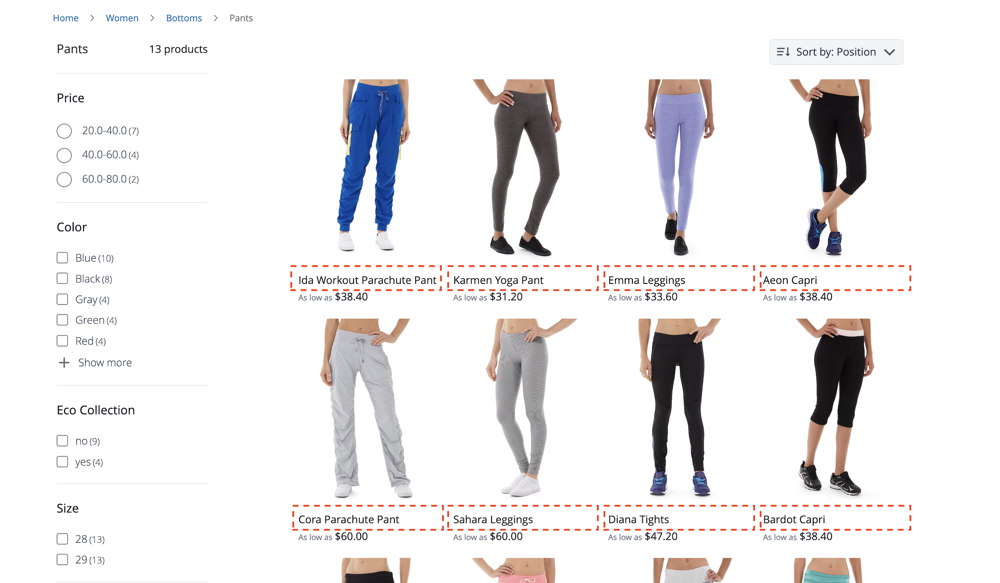

大文字にするルールを追加して、製品名をカスタマイズします。

```css
.ds-sdk-product-item__product-name {
 text-transform: uppercase;
}
```

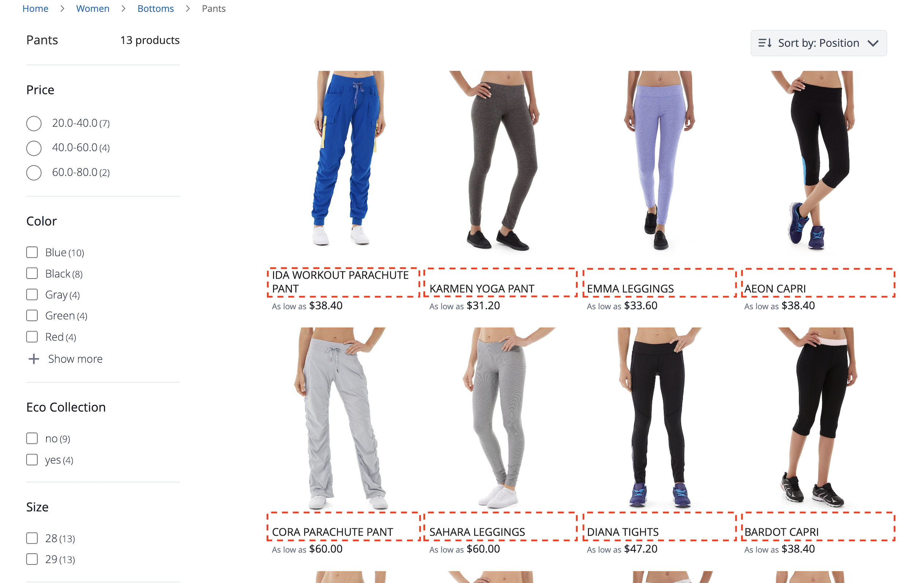

## CSS クラス

### 製品リスト

- `.ds-sdk-product-list`：外部div
- `.ds-sdk-product-list__grid`：内部div

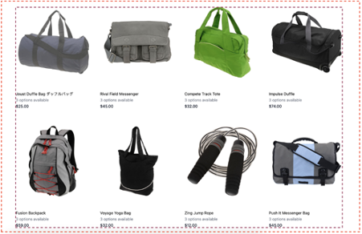

#### 製品リストのページネーション

- `.ds-plp-pagination`


- `.ds-plp-pagination_item`


- `.ds-plp-pagination_item--current`

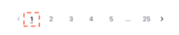

### ウィジェット

- `.ds-widgets`：外部div
- `.ds-widgets__actions`：左側の内側div
- `.ds-widgets__results`：右側の内側div


### 並べ替えドロップダウン

- `.ds-sdk-sort-dropdown`

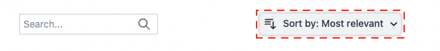

- `.ds-sdk-sort-dropdown__button`

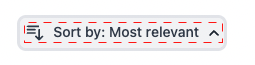

- `.ds-sdk-sort-dropdown__items`

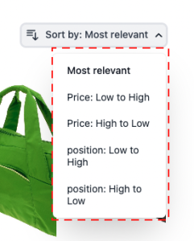

- `.ds-sdk-sort-dropdown__items--item`

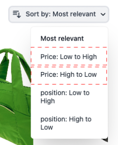

- `.ds-sdk-sort-dropdown__items--item-selected`

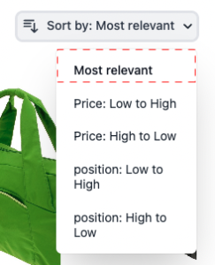

- `.ds-sdk-sort-dropdown__items--item-active`

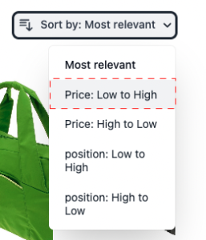

### ファセット

- `.ds-plp-facets`
- `.ds-plp-facets__header`
- `.ds-plp-facets__header_title`
- `.ds-plp-facets__header__clear-all`

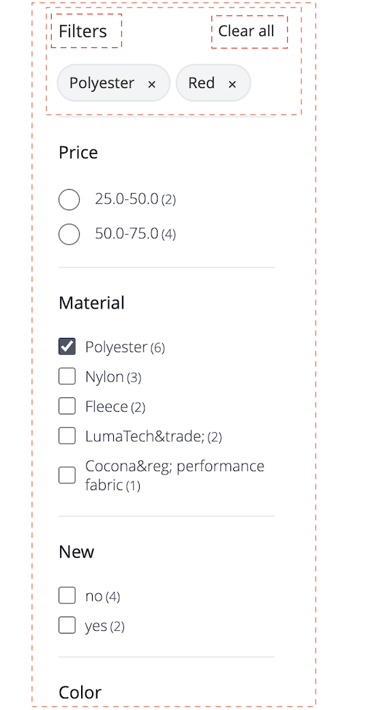{width="350"}

- `.ds-plp-facets__pills`
- `.ds-sdk-pill`

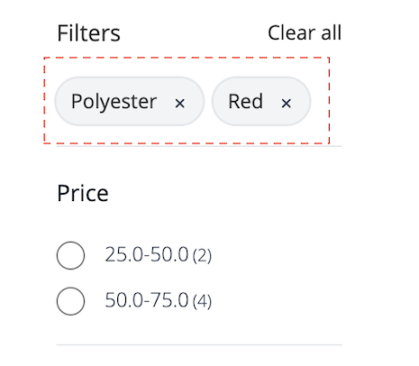{width="350"}

- `.ds-sdk-pill__label`
- `.ds-sdk-pill__cta`

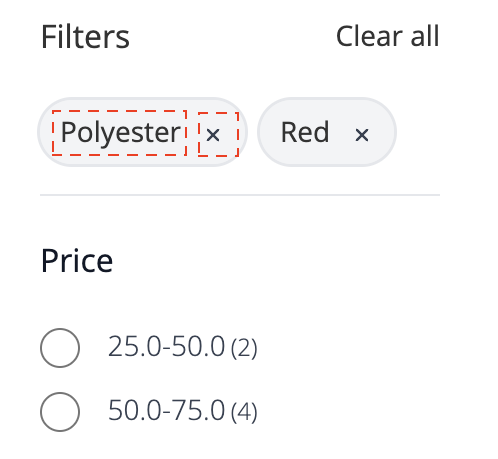{width="350"}

- `.ds-plp-facets__list`

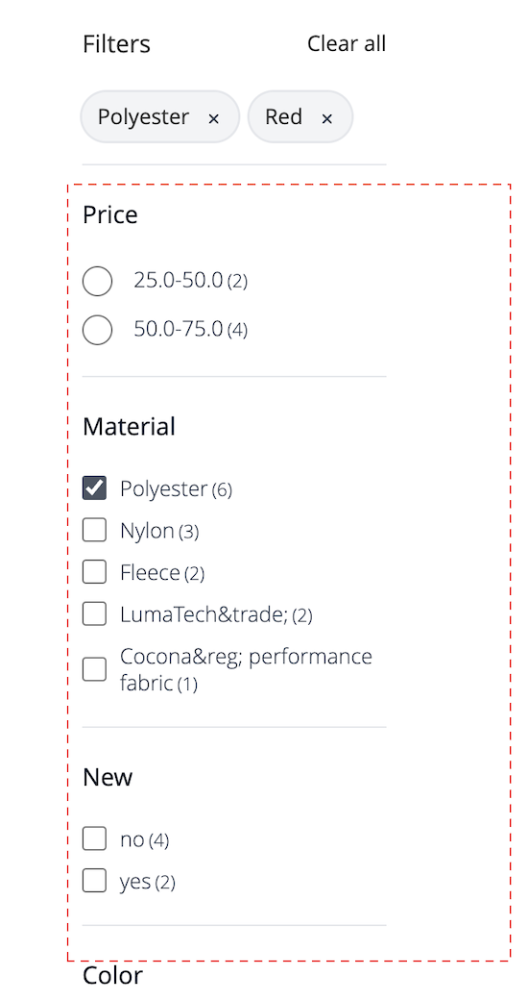{width="350"}

- `.ds-sdk-input`
- `.ds-sdk-input__label`
- `.ds-sdk-product-item__product-swatch-group`
- `ds-sdk-product-item__product-swatch-item`
- `.ds-sdk-input_fieldset_show-more`

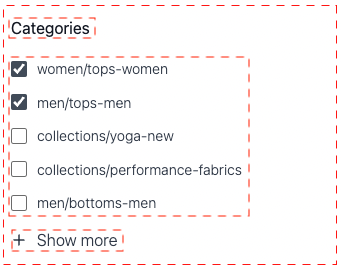

- `.ds-sdk-labelled-input`

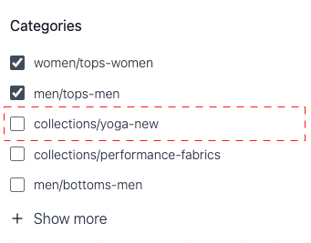

- `.ds-sdk-labelled-input__input`
- `.ds-sdk-labelled-input__label`

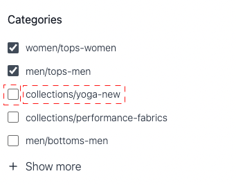

### 製品項目

- `.ds-sdk-product-item`
- `.ds-sdk-product-item__image`
- `.ds-sdk-product-item__product-name`
- `.ds-sdk-product-item__product-options`
- `.ds-sdk-product-price`
   - `.ds-sdk-product-price--no-discount`
   - `.ds-sdk-product-price--grouped`
   - `.ds-sdk-product-price--bundle`
   - `.ds-sdk-product-price--discount`

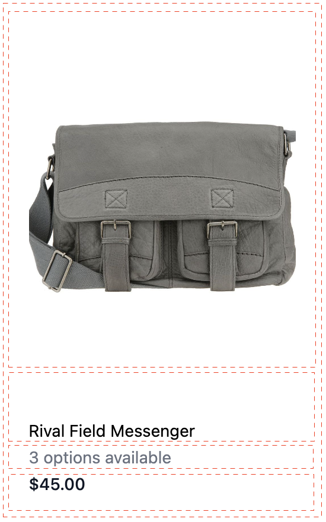

### 読み込み

- `.ds-sdk-loading`
- `.ds-sdk-loading__spinner`
- `.ds-sdk-loading__spinner-label`

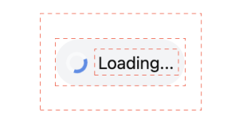

## PLP ウィジェットの無効化

PLP ウィジェットを無効にするには：

1. **Stores** / 設定/**設定** / **[!DNL Live Search]** / **Storefront機能**&#x200B;に移動し、**製品リストウィジェットを有効にする**&#x200B;を「いいえ」に設定します。
1. 設定を保存するには、**設定を保存**&#x200B;を選択します。
