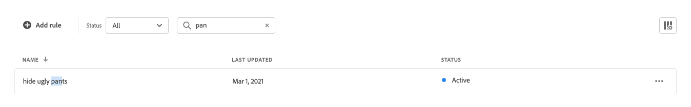
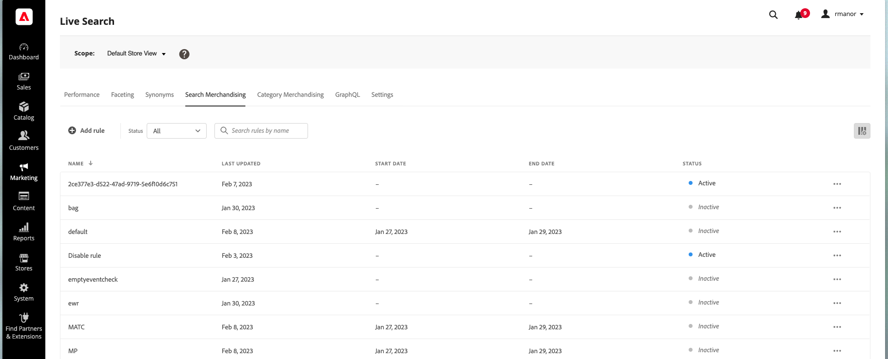

# マーチャンダイジング Workspaceの検索

*マーチャンダイジング検索* ワークスペースには、現在のルールの選択とそのステータスが一覧表示され、ルールの作成と管理に必要なツールへのアクセス権が提供されます。 ワークスペースから次の操作を実行できます。

* ルールの検索
* ルールの詳細の表示
* ルールのアクティベート/アクティベート解除
* ルールの削除
* ルールエディターへのアクセス

## 範囲の設定

Adobe Commerceのインストールに複数のストアビューが含まれる場合は、**Scope**&#x200B;をルールが適用される[ ストアビュー](https://experienceleague.adobe.com/docs/commerce-admin/start/setup/websites-stores-views.html#scope-settings)に設定します。

## 列の表示/非表示

1. 右上隅の&#x200B;**表示/非表示** 列をクリックします。
表示されている列には、オプションメニューの青いチェックマークが付いています。 ルール名は、非表示にできない唯一の列です。

1. メニューで、次のいずれかの操作を行います。

   * 非表示の列を表示するには、チェックマークを付けずに任意の列名をクリックします。
   * 表示されている列を非表示にするには、チェックマークが付いている任意の列名をクリックします。

## ステータス別にルールをフィルタリング

1. ストアに多くのルールがある場合、ステータスでルールをフィルタリングして、リストを短縮できます。 デフォルトでは、ルールリストにはすべてのルールが表示されます。

1. 特定のステータス設定を持つルールのみを一覧表示するには、**ステータス**&#x200B;を次のいずれかに設定します。

   * すべて
   * アクティブ
   * 非アクティブ
   * 予定

## 検索ルールを名前で検索

ルールの名前、またはルール名の任意の単語を入力します。
入力時に一致するルールが検索されます。 一致する文字の文字列は、見つかった各ルールの名前で強調表示されます。

## 詳細を表示

詳細パネルには、ルール名、ステータス、条件とイベント、開始日と終了日、説明、最終編集日が表示されます。 ルールは、詳細パネルで有効、編集、削除できます。

1. *マーチャンダイジングの検索* ワークスペースで、表示するグリッド内のルールを見つけ、**詳細** （。..）をクリックします。
1. 「**詳細を表示**」をクリックします。
詳細を表示パネルから次のいずれかを実行できます。

   * ルールを編集
   * ルールを削除
   * ルールの有効化/無効化

1. *詳細を表示* パネルを閉じるには、右上隅の&#x200B;**閉じる** （X）をクリックします。

   

## 列の説明

| 列 | 説明 |
|--- |--- |
| 名前 | ルールの名前。 |
| 最終更新日 | ルールが最後に更新された日付。 |
| 開始日 | スケジュール済みルールの開始日。 |
| 終了日 | スケジュールされたルールの終了日。 |
| ステータス | 色分けされたステータスは、ルールの現在の状態を示します。 グリッドの上にあるステータスコントロールを使用して、ステータス別にルールをフィルタリングします。 値： すべてのステータス – ステータスに関係なくすべてのルールを表示します。  アクティブ（青） – アクティブなルールのみを表示します。  スケジュール済み（オレンジ） – スケジュール済みルールのみを表示します。 非アクティブ （グレー） – 非アクティブなルールのみを表示します。 |

## コントロール

| 制御 | 説明 |
|--- |--- |
| ルールを追加 | [ ルールエディター](rules-add.md)を開きます。 |
| ステータス | ルールのリストをステータス別にフィルタリングします。 オプション：すべて、アクティブ、非アクティブ、スケジュール |
|  | グリッドに表示される列を指定します。 オプション：最終更新日、開始日、終了日、ステータス |
| 検索 | フルネームまたは部分一致でルールを検索します。 |
|  | 選択したルールに適用できるその他のアクションのメニューを表示します。 オプション：編集、詳細の表示、削除 |

## ルールの詳細

| フィールド | 説明 |
|--- |--- |
| ステータス | ルールの現在のステータス。 |
| 条件 | ルールに関連付けられている条件を記述する検索クエリ。 |
| 開始日 | ルールが有効になる日付（スケジュールされている場合）。 |
| 終了日 | スケジュールされた場合、ルールの有効期限が切れる日付。 |
| 説明 | ルールの簡単な説明。 |
| 最終更新日 | ルールが最後に更新された日時。 |
| 有効 | ルールのステータスを変更するコントロール。 オプション：有効/無効 |
