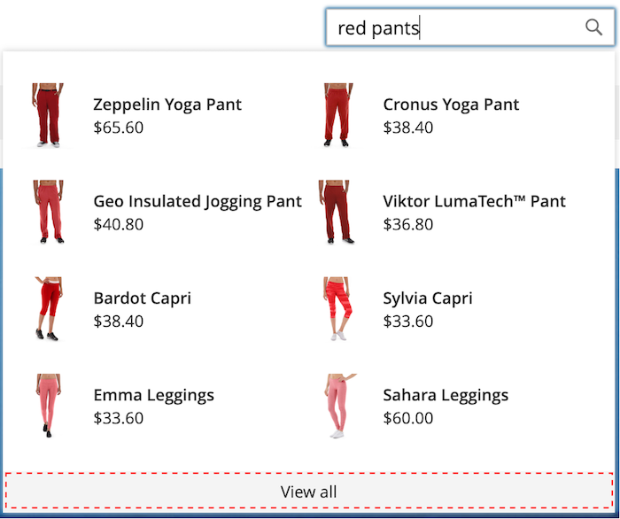
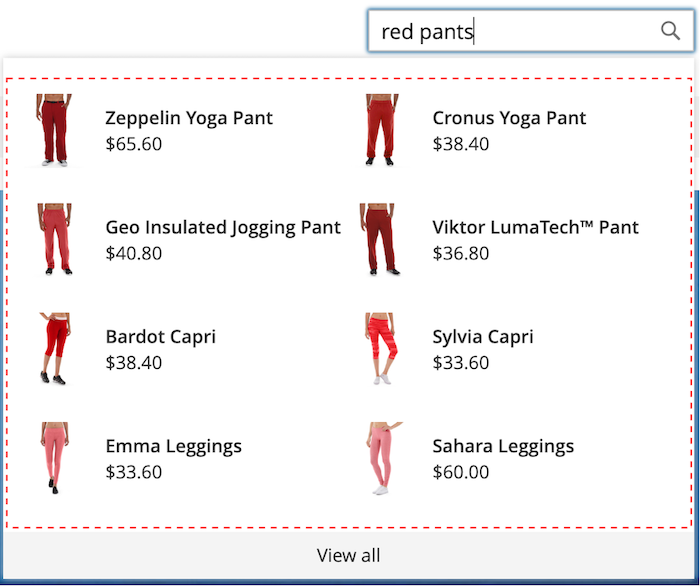
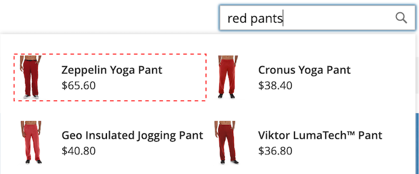
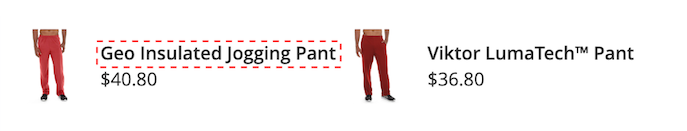

# [!DNL Storefront Popover]

[!DNL Live Search]が[ インストールされている](install.md)場合、買い物客が[検索](https://experienceleague.adobe.com/docs/commerce-admin/catalog/catalog/search/search.html#quick-search) ボックスに入力すると、[!DNL popover]がストアフロントに表示されます。 文字を入力するたびに、[!DNL popover]が更新され、上位の検索結果の推奨商品とサムネイル画像が表示されます。

[!DNL Live Search]は、2文字以上のクエリの結果を返します。 部分一致の場合、1語あたりの最大文字数は20文字です。 「入力中に検索」クエリの文字数は設定できません。

![[!DNL Live Search popover]](assets/storefront-search-as-you-type.png)

>[!TIP]
>
>製品属性を検索可能として設定する方法については、[ ライブサーチの設定](workspace.md)記事を参照してください。

## [!DNL Popover] ページサイズ

[!DNL popover]のページサイズにより、自動完了製品を返すことができる行数が決まります。 ライブ検索のインストール中に、`page_size`の値が[ カタログ検索](https://experienceleague.adobe.com/docs/commerce-admin/config/catalog/catalog.html) - `Autocomplete Limit`設定の現在の値に変更されます。

デフォルトでは、カタログ検索 – 自動完了制限値は8行（または行）に設定されています。 [!DNL popover]のページサイズを変更するには、次の操作を行います。

1. *管理者* サイドバーで、**ストア**/設定/**構成**&#x200B;に移動します。
1. 左側のパネルで、**カタログ**&#x200B;を展開し、設定のリストから&#x200B;**カタログ**&#x200B;を選択します。
1. 「*カタログ検索*」セクションを展開します。
1. **オートコンプリート制限**&#x200B;を[!DNL popover]で許可する行数に設定します。
1. 完了したら、**設定を保存**&#x200B;をクリックします。

## スタイル設定[!DNL Popover]の例

[!DNL Popover] ウィジェットのルック アンド フィールは、会社のスタイルとブランド ガイドラインに合わせてカスタマイズできます。

[!DNL storefront popover]には常に商品`name`と`price`が表示され、フィールドの選択は設定可能ではありません。 ただし、[!DNL popover]要素は[CSS](https://developer.adobe.com/commerce/frontend-core/guide/css/) クラスを使用してスタイル設定できます。 例えば、次の宣言は、[!DNL popover] コンテナとフッターの背景色を変更します。

```css
.livesearch.popover-container {
    background-color: lavender;
}

.livesearch.view-all-footer {
    background-color: magenta;
}
```

## コンテナの可視化

`.livesearch.popover-container`の親コンポーネントは`.search-autocomplete`です。  `.active` クラスは、コンテナの可視性を示します。 [!DNL popover]が開いているときに、`.active` クラスが条件付きで追加されます。

```css
.search-autocomplete.active   /* visible */
.search-autocomplete          /* not visible */
```

ストアフロント要素のスタイル設定について詳しくは、[ フロントエンド開発者ガイド ](https://developer.adobe.com/commerce/frontend-core/guide/)の[ カスケーディングスタイルシート（CSS） ](https://developer.adobe.com/commerce/frontend-core/guide/css/)を参照してください。

## クラスセレクター

次のクラスセレクターを使用して、[!DNL popover]内のコンテナと製品の要素にスタイルを設定できます。

- `.livesearch.popover-container`
- `.livesearch.view-all-footer`
- `.livesearch.products-container`
- `.livesearch.product-result`
- `.livesearch.product-name`
- `.livesearch.product-price`

### コンテナクラスセレクター

#### .livesearch.popover-container

![[!DNL Popover] コンテナ ](assets/livesearch-popover-container.png)

#### .livesearch.view-all-footer



### 製品クラスセレクター

#### .livesearch.products-container



#### .livesearch.product-result



#### .livesearch.product-name



#### .livesearch.product-price


#### .livesearch product-link


## 変更されたテーマの操作 {#working-with-modified-theme}

[!DNL storefront popover]は、*Luma*&#x200B;から必要なファイルを継承するカスタマイズされた[ テーマ ](https://developer.adobe.com/commerce/frontend-core/guide/themes/)で使用できます。 `Magento_Search` モジュールの`header-wrapper`の`top.search` ブロックは変更できません。

```html
<referenceContainer name="header-wrapper">
   <block class="Magento\Framework\View\Element\Template" name="top.search" as="topSearch" template="Magento_Search::form.mini.phtml">
      <arguments>
         <argument name="configProvider" xsi:type="object">Magento\Search\ViewModel\ConfigProvider</argument>
      </arguments>
   </block>
</referenceContainer>
```

## [!DNL popover]を無効にしています

[!DNL popover]を無効にし、標準の[ クイック検索](https://experienceleague.adobe.com/docs/commerce-admin/catalog/catalog/search/search.html#quick-search)機能を復元するには、次のコマンドを入力します。

```bash
bin/magento module:disable Magento_LiveSearchStorefrontPopover
```

## ヘッドレス実装

ヘッドレス実装を使用している場合は、[npm パッケージ ](https://www.npmjs.com/package/@magento/ds-livesearch-storefront-utils)を使用して[!DNL Live Search popover]をインストールできます。
