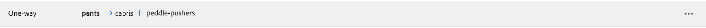

# シノニムの追加

独自にキュレートされた [!DNL Live Search] 同義語のリストを追加して、顧客エンゲージメントを向上させます。 1`Data Space ID` あたり最大 200 個の同義語を管理で [!DNL Live Search] ます。

![[!DNL Live Search] 同義語 ](assets/synonym-workspace.png)

## 手順 1：シノニムの追加

1. 管理者で、**マーケティング**/SEO と検索/**[!DNL Live Search]** に移動します。
1. 複数のストアの場合、**範囲** を [ ストア表示 ](https://experienceleague.adobe.com/docs/commerce-admin/start/setup/websites-stores-views.html#scope-settings) に設定します。ここで、シノニム設定が適用されます。
1. 「**シノニム**」タブをクリックします。
1. 「**シノニムを追加** ボタンをクリックします。

## 手順 2：タイプによるシノニムの定義

作成する [ シノニムのタイプ ](synonyms-type.md) の手順に従います。

### 双方向類義語

1. デフォルトの **双方向** オプションを受け入れます。

   

1. 照合する **キーワード** 用語または語句を入力します。
1. キーワードの同義語として追加する **拡張** 用語を入力します。 複数の用語はコンマで区切ります。
この例では、一致させるキーワードは「pants」で、展開用語のセットは「trousers, slacks」です。

   

1. 完了したら、「**保存**」をクリックします。
同義語のセットがリストに表示され、各用語の間に双方向矢印が表示されます。これは、用語が交換可能であることを意味します。

   

### 一方向のシノニム

1. **一方向** シノニム タイプをクリックします。

   

1. **キーワード** と **拡張** の用語を入力します。 複数の用語はコンマで区切ります。

   

   この例では、キーワードが「pants」で、一方向の拡張用語「capris, peddle-pushers」はそれぞれ「pants」のサブセットですが、特定の意味を持ちます。

1. 完了したら、「**保存**」をクリックします。
同義語のセットがリストに表示され、展開用語からキーワードを指す一方向矢印が表示されます。この矢印は、キーワードのサブセットであることを示します。 各拡張語句はプラス記号で区切られます。

   

## 手順 3：変更を公開する

1. シノニムが完成したら、「**変更を公開**」をクリックします。
1. 更新がストアフロントで利用できるようになるまで、最大 2 時間待ちます。

## フィールドの説明

| フィールド | 説明 |
|--- |--- |
| [ タイプ ](synonyms.md) | シノニムがキーワードと同じ意味を持つか、キーワードのサブセットであるかを判断します。 オプション：  双方向（デフォルト） – キーワードと同じ意味を持ち、同じ検索結果を返す用語   一方向 – キーワードのサブセットである用語。 一方向の同義語は、特定の製品のより狭いリストを返します。 |
| キーワード | カタログ内の商品の選択に一般的に関連付けられている単語。 |
| 展開 | キーワードと同じ、または類似の意味を持つ追加の用語。 |
