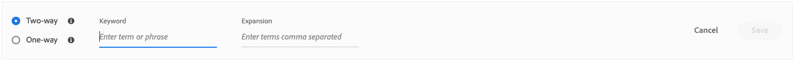
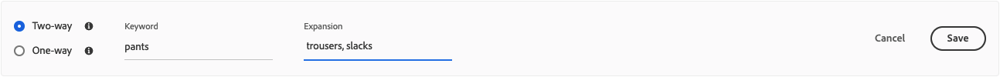
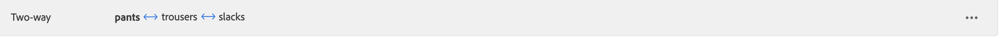
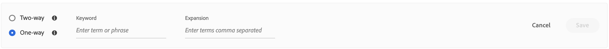
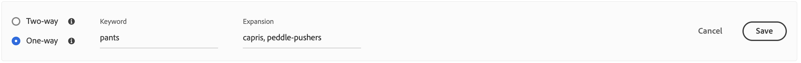
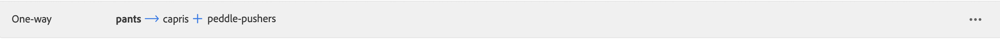

# 同義語を追加

厳選された[!DNL Live Search]個の類義語リストを独自に追加して、顧客エンゲージメントを向上させましょう。 [!DNL Live Search]は、ストアビューごとに最大200個の類義語を管理できます。

![[!DNL Live Search]類義語](assets/synonym-workspace.png)

## 手順1：同義語の追加

1. 管理画面で、**マーケティング**/SEOと検索> **[!DNL Live Search]**&#x200B;に移動します。
1. 複数のストアの場合は、**スコープ**&#x200B;を[ ストアビュー](https://experienceleague.adobe.com/docs/commerce-admin/start/setup/websites-stores-views.html#scope-settings)に設定し、同義語の設定を適用します。
1. 「**類義語**」タブをクリックします。
1. 「**類義語を追加**」ボタンをクリックします。

## 手順2：類義語をタイプ別に定義する

作成する[類義語の種類](synonyms-type.md)の手順に従います。

### 双方向の同義語

1. 既定の&#x200B;**双方向** オプションを受け入れます。

   

1. 一致させる&#x200B;**キーワード**&#x200B;の語句またはフレーズを入力します。
1. キーワードの類義語として追加する&#x200B;**拡張**語句を入力します。 複数の用語はコンマで区切ります。
この例では、一致するキーワードは「パンツ」で、拡張用語のセットは「ズボン、スラックス」です。

   

1. 完了したら、**保存**をクリックします。
類義語のセットは、各用語の間に双方向矢印が表示され、用語が交換可能であることを意味します。

   

### 一方向の類義語

1. **One-way**&#x200B;類義語タイプをクリックします。

   

1. **キーワード**&#x200B;と&#x200B;**拡張**&#x200B;の用語を入力します。 複数の用語はコンマで区切ります。

   

   この例では、キーワードは「パンツ」で、「capris, peddle-pushers」という一方向の拡張語は、それぞれ「パンツ」のサブセットですが、特定の意味を持ちます。

1. 完了したら、**保存**をクリックします。
類義語のセットがリストに表示され、拡張語からキーワードを指す一方向の矢印が表示され、その用語がキーワードのサブセットであることを示します。 プラス記号は、各拡張語句を区切ります。

   

## 手順3：変更を公開する

1. 類義語が完成したら、**変更を公開**&#x200B;をクリックします。
1. 更新がストアフロントで利用可能になるまで、最大2時間待ちます。

## フィールドの説明

| フィールド | 説明 |
|--- |--- |
| [種類](synonyms.md) | 類義語がキーワードと同じ意味を持つか、キーワードのサブセットであるかを指定します。 オプション： 双方向（デフォルト） – キーワードと同じ意味を持ち、同じ検索結果を返す用語 一方向 – キーワードのサブセットである用語。 一方向の類義語は、特定の製品のより狭いリストを返します。 |
| キーワード | カタログ内の商品の選択に一般的に関連付けられている単語。 |
| 拡張 | キーワードと同じまたは類似する意味を持つ追加用語。 |
