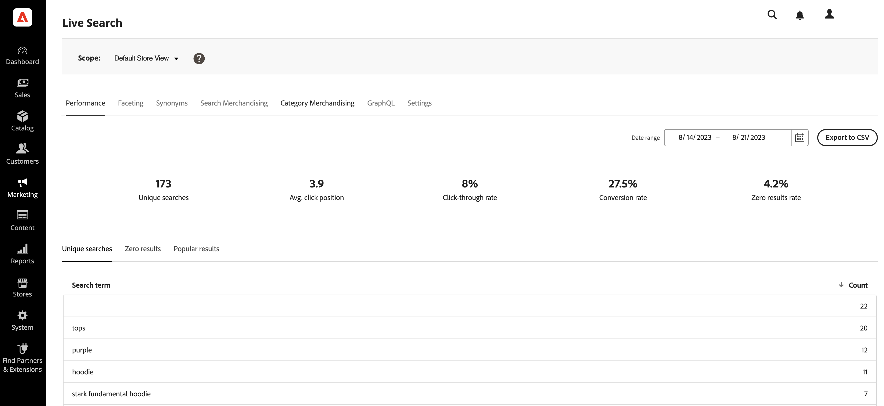

# ライブサーチの設定

ワークスペースは、[!DNL Live Search]のパフォーマンスを設定、管理、監視する場所です。 上部のメニューから、各機能領域のツールにアクセスできます。 使用可能な機能には、現在のメニュー選択が反映されます。

## データ収集

ワークスペースの各機能領域に正しいデータが含まれていることを確認するには、選択したストアフロント実装に基づいてデータ収集を設定する必要があります。

1. Luma - データ収集は標準で利用可能です。
1. ヘッドレス – データ収集は、ストアフロントの実装に応じて手動で設定する必要があります。

ヘッドレスストアフロントを使用している場合は、追加する必要がある必須イベントについて詳しくは、次のドキュメントを参照してください。

- ライブ検索ダッシュボードの[必要なイベント ](https://developer.adobe.com/commerce/services/shared-services/storefront-events/#live-search)。
- 前提条件として追加する必要がある[ ストアフロントイベントコレクター](https://developer.adobe.com/commerce/services/shared-services/storefront-events/collector/)です。
- イベント構造の[例](https://github.com/adobe/commerce-events/tree/main/examples)。

### 医療業界のユーザー事例

ヘルスケアのお客様で、[Data Connection](../data-connection/hipaa-readiness.md#installation)拡張機能の一部である[Data Services HIPAA拡張機能](../data-connection/overview.md)をインストールした場合、[!DNL Live Search]によって使用されるストアフロントイベントデータはキャプチャされなくなります。 これは、ストアフロントのイベントデータがクライアントサイドで生成されるためです。 ストアフロントイベントデータの取得と送信を続行するには、[!DNL Live Search]のイベント収集を再度有効にします。 詳しくは、[一般設定](https://experienceleague.adobe.com/en/docs/commerce-admin/config/general/general#data-services)を参照してください。

## 範囲の設定

最初に、すべての[設定の](https://experienceleague.adobe.com/docs/commerce-admin/start/setup/websites-stores-views.html#scope-settings) スコープ [!DNL Live Search]が`Default Store View`に設定されます。 [!DNL Commerce]のインストールに複数のストアビューが含まれる場合は、**スコープ**&#x200B;をファセット設定が適用される[ ストアビュー](https://experienceleague.adobe.com/docs/commerce-admin/start/setup/websites-stores-views.html)に設定します。

## メニューオプション

| オプション | 説明 |
|--- |--- |
| [ パフォーマンス ](performance.md) | ダッシュボードでは、insightで商品検索のパフォーマンスを確認できます。 |
| [ ファセット ](facets.md) | 属性値の複数のディメンションを使用して検索条件を絞り込む、パフォーマンスの高いフィルタリング。 |
| [同義語](synonyms.md) | 検索のリーチを拡大し、買い物客がカタログとは異なる商品を見つけるために使用する可能性のある単語を含めます。 |
| [ マーチャンダイジングの検索](rules.md) | スケジュールされたアクションをトリガーする論理ルールを使用して、検索エクスペリエンスを形作りましょう。 商品の販売促進、埋め込み、ピン留め、非表示などの操作を行って、検索結果のキャリブレーションを行い、ビジネス目標を達成。 |
| [ カテゴリ マーチャンダイジング ](category-merch.md) | カテゴリーレベルでルールとインテリジェントなマーチャンダイジングを適用します。 |
| [GraphQL](graphql.md) | ストアの管理者にログインした開発者は、実際のカタログデータを使用してクエリを作成し、テストできます。 詳しくは、[開発者向けドキュメントの](https://developer.adobe.com/commerce/webapi/graphql/schema/live-search/)GraphQLの概要[!DNL Live Search]にアクセスしてください。 |
| [設定](settings.md) | ストアフロントで価格ファセット値を価格範囲ごとにグループ化する方法を決定し、インデックス言語を設定します。 |

## 属性を検索可能に設定する

高度にターゲットを絞った結果を生成するには、[検索可能](https://experienceleague.adobe.com/docs/commerce-admin/catalog/product-attributes/product-attributes.html) （`searchable=true`）製品属性のセットを確認します。 関連性を確保するために、属性に明確で簡潔な意味を持つコンテンツが含まれている場合にのみ、属性を検索できるようにします。 デフォルトでは検索機能が有効になっていますが、検索結果の精度を低下させる可能性がある`description`のように、精度の低い長いテキストを含む属性を使用しないでください。 例えば、「ショートパンツ」と検索した際に、「半袖」という言葉が入った説明のシャツがある場合、そのシャツは検索結果に表示されます。

属性を検索可能にするには、次の手順を実行します。

1. 管理画面で、**ストア** > *属性* > **製品**&#x200B;に移動します。
1. 検索可能にする属性（`color`など）を選択します。
1. **ストアフロントのプロパティ**&#x200B;を選択し、**検索での使用**&#x200B;を`yes`に設定します。

[!DNL Live Search]は、Adobe Commerce内で設定されたproduct属性の[weight](https://experienceleague.adobe.com/docs/commerce-admin/catalog/catalog/search/search-results.html#weighted-search)も尊重します。 重みが大きい属性は、検索結果で高く表示されます。

次の属性は常に検索可能です。

- `sku`
- `name`
- `categories`

>[!TIP]
>
>検索可能な属性を選択することは、検索品質に大きな影響を与えます。 検索可能な属性の選択と一般的な設定の問題の回避に関する詳細なガイダンスについては、ベストプラクティスガイドの「[製品メタデータを活用する](best-practice.md#leverage-product-metadata)」を参照してください。

### 複雑な製品における属性行動

複雑な製品タイプ （設定可能、バンドル、グループ化された製品）の場合、[!DNL Live Search]は親製品と子製品の両方から属性値をインデックス作成し、親製品が同じ属性に対して複数の値に関連付けられるようにします。 これにより、バリエーションに基づくフィルタリングが可能になります。例えば、親の製品にカラーセットがない場合でも、バリエーションが青の場合に「青」でフィルタリングすると、設定可能なシャツが表示されます。

これは、色やサイズなどの属性には適していますが、`new_arrival`、`product_ranking`、`promotion_label`、カスタム価格属性などの属性では、予期しない結果が発生する可能性があります。 例えば、設定可能な製品（SKU-001）に`new_arrival = true`がありますが、その子バリアント（SKU-001-01）に`new_arrival = false`がある場合、親の製品SKU-001は両方の値（`true`と`false`）でインデックスが作成され、どちらの条件でも検索結果に表示されます。

### 階層検索と検索タイプの拡張

階層検索（検索内の検索）は、従来の検索機能を拡張して追加の検索パラメータを含める、強力な属性ベースのフィルタリングシステムです。 こうした検索パラメーターの追加により、より正確で柔軟な商品検索が可能になります。

>[!NOTE]
>
>レイヤー検索は、ライブサーチ 4.6.0で使用できます。

階層検索を使用すると、次のことができます。

- 買い物客が検索結果から検索できるようにします。
- レイヤー検索の2番目のレイヤーで`startsWith`と`contains`の検索インデックスを使用して、結果をさらに絞り込みます。

高度な検索機能は、特定の演算子を使用して、`filter` クエリ [`productSearch`の](https://developer.adobe.com/commerce/webapi/graphql/schema/live-search/queries/product-search/) パラメーターを通じて実装されます。

- **階層検索** – 別の検索コンテキスト内の検索 – この機能を使用すると、検索クエリに対して最大2つの検索レイヤーを実行できます。 例：

   - **レイヤー1検索** - `product_attribute_1`で「motor」を検索します。
   - **レイヤー2検索** - `product_attribute_2`で「パーツ番号123」を検索します。 次の使用例は、&quot;motor&quot;の検索結果から&quot;part number 123&quot;を検索します。

  階層検索は、次の説明に従って、階層検索の2番目のレイヤーの`startsWith`検索インデックスと`contains`検索インデックスの両方で使用できます。

- **startsWith検索インデックス** - `startsWith`個のインデックスを使用して検索します。 この新しい機能により、次のことが可能になります。

   - 属性値が指定された文字列で始まる製品を検索します。
   - 「で終わる」検索を設定して、買い物客が属性値が特定の文字列で終わる商品を検索できるようにします。 「end with」検索を有効にするには、product属性を逆に取り込む必要があり、API呼び出しも逆の文字列にする必要があります。 例えば、「パンツ」で終わる商品名を検索する場合は、これを「スタンプ」として送信する必要があります。

- **には検索インデックスが含まれています** - 「含まれている」インデックスを使用して属性を検索します。 この新しい機能により、次のことが可能になります。

   - 大きな文字列内のクエリを検索しています。 例えば、買い物客が「HAPE-123」という文字列で「PE-123」という商品番号を検索した場合です。

      - 注意：この検索タイプは、オートコンプリート検索を実行する既存の[語句検索](https://developer.adobe.com/commerce/webapi/graphql/schema/live-search/queries/product-search/#phrase)とは異なります。 たとえば、product属性値が「outdoor pants」の場合、語句検索は「out pan」の応答を返しますが、「or ants」の応答は返しません。 Aは検索を含んでいますが、「or ants」に対する応答を返しません。

これらの新しい条件は、検索クエリフィルタリングメカニズムを強化して、検索結果を絞り込みます。 これらの新しい条件は、メインの検索クエリには影響しません。

#### 導入

1. 管理画面で、[製品属性](https://experienceleague.adobe.com/en/docs/commerce-admin/catalog/product-attributes/product-attributes-add#step-5-describe-the-storefront-properties)を検索可能に設定します。

   検索可能な[属性](https://experienceleague.adobe.com/en/docs/commerce-admin/catalog/product-attributes/attributes-input-types)の一覧を参照してください。

1. その属性の検索機能を指定します（**Contains** （デフォルト）または&#x200B;**Starts with**&#x200B;など）。 **Contains**&#x200B;に対して有効にする属性を最大6つ、および&#x200B;**に対して有効にする属性を最大6つ指定できます。最初は**&#x200B;です。 さらに、**Contains**&#x200B;の索引の場合、文字列の長さは50文字以下に制限されます。

   

1. 新しい[および](https://developer.adobe.com/commerce/webapi/graphql/schema/live-search/queries/product-search/#filtering-using-search-capability)検索機能を使用して[!DNL Live Search] API呼び出しを更新する方法の例については、`contains`開発者ドキュメント `startsWith`を参照してください。

   これらの新しい条件を検索結果ページに実装できます。 例えば、ページに新しいセクションを追加し、検索結果をさらに絞り込むことができます。 買い物客が「製造元」、「部品番号」、「説明」など、特定の製品属性を選択できるようにします。 そこから、`contains`または`startsWith`条件を使用して、これらの属性内を検索します。

### ファセットではなくレイヤー検索を使用する場合

階層検索とファセットは、商品の検索において異なる目的を果たします。目的は、特定のユースケースによって異なります。

**次の場合にレイヤー検索を使用：**

- 複数の条件を使用して検索結果を検索する必要があります。
- ユーザーが部分的な情報を知っている部品番号、SKU、または技術仕様を操作する。
- 買い物客は、ネストされた基準を使用して、検索結果を段階的に絞り込む必要があります。
- 1つのクエリで複数の検索条件を組み合わせることで、API呼び出しの数を減らすことができます。
- 標準的なファセットナビゲーションを超えた、ビジネスに特化した検索パターンを実装する必要があります。

**次の場合にファセットを使用：**

- 一般的なカテゴリ、価格、ブランド、属性フィルタリングの提供
- ユーザーが理解しやすく、選択しやすい直感的なフィルターオプションを提供
- 現在の検索結果に基づいて利用可能なオプションを表示
- フィルター数と範囲を表示して、使用可能なオプションをユーザーが理解できるようにします
- 色、サイズ、素材など、一般的な製品特性を使用する。

**ベストプラクティス：** ユーザーが特定の条件を持つ複雑な技術的検索には階層検索を使用し、ユーザーがオプションを視覚的に検索して絞り込みたい標準e コマース フィルタリングにはファセットを使用します。

## ファセットと類義語

ファセットと類義語は、買い物客の検索体験を向上させるもうひとつの方法です。

[ ファセット ](facets.md)は、[!DNL Live Search]で定義され、フィルタリング可能な製品属性です。 フィルター可能な任意の属性を[!DNL Live Search]のファセットとして設定できますが、一度に検索できるファセットの数には[制限](boundaries-limits.md)があります。

>[!NOTE]
>
>製品属性は、製品属性の設定に必要なプロパティが含まれている場合にのみフィルタリング可能です。*検索で使用= Yes*、*検索結果で使用= Yes*、*レイヤーナビゲーションで使用= フィルター可能（結果を含む）*。 これらのプロパティが見つからないか、正しく設定されていない場合、属性はファセット設定に表示されません。 設定手順については、[ ファセットの追加](facets-add.md#add-a-facet)を参照してください。

[類義語](synonyms.md)は、ユーザーを正しい製品に誘導するために定義できる用語です。 ズボンを探しているユーザーは、「ズボン」または「スラックス」と入力します。 これらの検索語がユーザーを「ズボン」の結果に誘導するように、類義語を設定できます。

## Commerceの設定

次の節では、[!DNL Live Search]でサポートされているCommerce設定とサポートされていない設定について説明します。

### サポートされる設定値

>[!IMPORTANT]
>
>Live Search 4.0.0でデフォルトで有効になっている製品リストウィジェットを使用することを強くお勧めします。ウィジェットは、今後のリリースでアダプタ実装を完全に置き換えることを目的としています。 詳しくは、[製品リストウィジェットを有効にする](install.md#enable-product-listing-widgets)を参照してください。

| Commerceの設定 | 説明 | Popoverによるサポート | アダプタでサポート |
|---|---|---|---|
| ストア/設定/カタログ/カタログ/カタログ検索/ページごとのすべての製品を許可 | `Yes`に設定すると、「ページごとに表示」コントロールに`ALL` オプションが含まれます。 | はい。 最大100製品 | はい。 最大100製品 |
| ストア/設定/カタログ/カタログ/カタログ検索/最小限のクエリ長 | カタログ検索で許可される最小文字数。 | はい | はい |
| ストア/設定/カタログ/カタログ/カタログ検索/グリッドで許可された値のページごとの製品 | グリッドビューに表示される製品数を指定します。 | はい | はい |
| ストア/設定/カタログ/カタログ/カタログ検索/グリッドのページごとの製品のデフォルト値 | グリッドビューで、ページごとに表示される製品数をデフォルトで指定します。 | はい。 最大100製品 | はい。 最大100製品 |
| ストア/設定/カタログ/在庫/在庫切れ製品の表示 | 在庫切れの商品を表示します。 | はい | はい |
| ストア/設定/通貨/デフォルトの表示通貨 | 価格の表示に使用される主要通貨。 | はい | はい |
| ストア/設定/一般/通貨設定/通貨オプション/基本通貨 | すべてのオンライン決済トランザクションに使用される主要通貨。 | はい | はい |

ウィジェット製品リストページとポップオーバーの価格は、設定された通貨レートを使用してデフォルトの表示通貨に変換されます。

### サポートされていない設定値

| Commerceの設定 | 説明 | メモ |
|---|---|---|
| ストア/設定/カタログ/ストアフロント/リストモード | 検索結果リストの形式を指定します。 | 正しくレンダリングされますが、一部のページインタラクションではイベントが送信されません |
| ストア/設定/カタログ/カタログ/カタログ検索/クエリの最大長 | カタログ検索で許可される最大文字数。 | 実装されていません。Search Servicesは最大255文字を受け付けます |
| 設定/売上/税金/価格表示設定/カタログでの製品価格の表示 | カタログに掲載されている製品価格に税金が含まれているか除外されているか、または価格の2つのバージョンを表示しているかを指定します。1つは税抜き、もう1つは税抜き |  |
| ストア/設定/カタログ/ストアフロント/製品リスト並べ替え基準 | 検索結果リストの並べ替え順序を指定します。 | [!DNL Live Search] [製品リストページ ウィジェット ](plp-styling.md)には適用されません |

## デフォルトの属性値

次の製品属性には、[によって使用され、デフォルトで有効になっている](https://experienceleague.adobe.com/docs/commerce-admin/catalog/product-attributes/product-attributes.html) ストアフロントプロパティ [!DNL Live Search]があります。

| プロパティ | Storefront プロパティ | 属性 |
|---|---|---|
| 並べ替え | 製品リストでの並べ替えに使用されます | `price` |
| 検索可能 | 検索で使用 | `price`  `sku` `name` |
| FilterableInSearch | レイヤーナビゲーションでの使用 – フィルター可能（結果あり） | `price` `visibility` `category_name` |

## デフォルトのシステム以外の属性プロパティ

次の表は、Luma サンプルデータに固有のものを含め、システム以外の属性のデフォルトの検索およびフィルター可能なプロパティを示しています。 *検索で使用*&#x200B;属性プロパティを`Yes`に設定すると、属性は[!DNL Live Search]とネイティブ Adobe Commerceの両方で検索可能になります。

| 属性コード | 検索可能 | レイヤーナビゲーションでの使用 |
|--- |--- |--- |
| アクティビティ | はい | フィルタリング可能（結果付き） |
| attributes_brand | はい | いいえ |
| ブランド | はい | いいえ |
| 気候 | はい | フィルタリング可能（結果付き） |
| カラー | はい | フィルタリング可能（結果付き） |
| カラー | はい | フィルタリング可能（結果付き） |
| コスト | はい | いいえ |
| eco_collection | はい | フィルタリング可能（結果付き） |
| 性別 | はい | フィルタリング可能（結果付き） |
| メーカー | はい | フィルタリング可能（結果付き） |
| 素材 | はい | フィルタリング可能（結果付き） |
| 目的 | はい | フィルタリング可能（結果付き） |
| strap_bags | はい | フィルタリング可能（結果付き） |
| style_general | はい | フィルタリング可能（結果付き） |

## デフォルトのシステム属性プロパティ

次の表に、システム属性のデフォルトの検索およびフィルター可能なプロパティを示します。

| 属性コード | 検索可能 | レイヤーナビゲーションでの使用 |
|--- |--- |--- |
| allow_open_amount | はい | フィルタリング可能（結果付き） |
| description | はい | いいえ |
| name | はい | いいえ |
| 価格 | はい | フィルタリング可能（結果付き） |
| short_description | はい | いいえ |
| sku | はい | いいえ |
| ステータス | はい | いいえ |
| tax_class_id | はい | いいえ |
| url_key | はい | いいえ |
| 線幅 | はい | いいえ |
